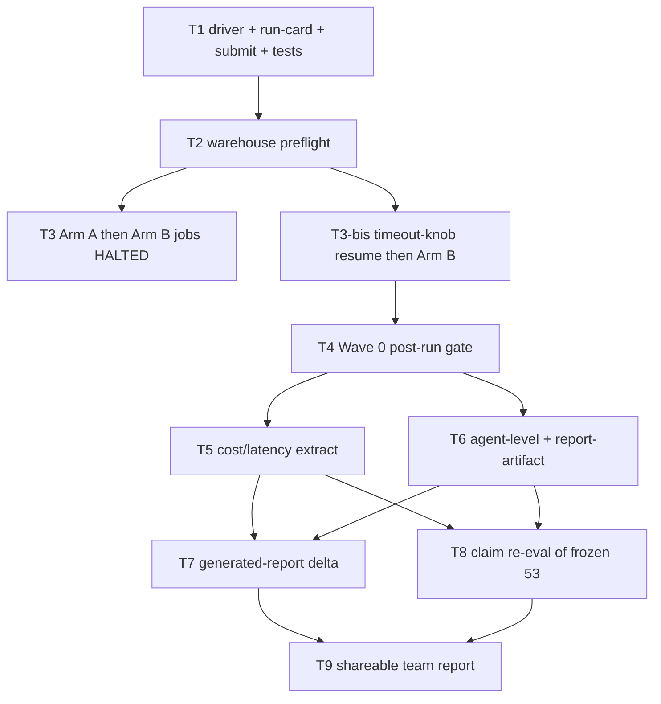

# CIM vs full-VDR fair experiment

**Plan version:** 1.9 · **Date:** 2026-08-25 · **Owner:** Ale
**run_status:** `amended`
**audit_status:** `remediation_landed`
**Orchestrator skill version:** 0.9 (2026-08-20)
**Mode:** STANDARD (not charter). No milestone invocation stub. Charter-only §1 fields omitted.
**Subtask count:** 10 executable · 0 gates
**Budget:** 10 authorized (declared range 4–10).
**Budget-amendment (v1.1):** prior authorized count **9**, new count **10**, added node **T3-bis** closes T3 HALT (Databricks FAILED + BMA timeout + spurious retry clobber).
**Budget-amendment (v1.2):** prior authorized count **10**, new count **10**, **no added node**. Operator forbade **T3-ter**. Skill §7 “continued HALT → distinct DAG node” is satisfied by retaining `packets/T3-bis.halt-v1.md` unmodified and re-emitting `packets/T3-bis.md` with the **same** `subtask_id`. T3-bis packet kill/retry rows change (halt-v1 max-2 already fired; one post-timeout-commit Arm A). Ceiling is 10 — do not add extra nodes.
**Budget-amendment (v1.3):** prior authorized count **10**, new count **10**, **no added node**. T3-bis timeout resume HALTed (C22: post-knob Arm A `278936287365289` BMA `Timed out after 0:10:00` despite the C33 1800s client pin; warehouse BMA `created_at` still 2026-08-19). Operator 2026-08-24: next mitigation is an orchestrator call — **no second blind Arm A, no T3-ter, no `_call_llm` split**. Same-node continuation again: `packets/T3-bis.halt-v2.md` retains the v1.2 packet bytes unmodified; live `packets/T3-bis.md` re-emitted with the **same** `subtask_id`. New mitigation is **C34** (BMA extraction `max_tokens` 16,000 → 12,000 — the “cap … without splitting the extraction call” alternative named in `databricks/CLAUDE.md` / `.dev/merge-decisions.md`), then **one** post-C34 skip-ingest Arm A as the verification run of the producer fix, then Arm B iff (a)(b)(c).
**Budget-amendment (v1.4):** prior authorized count **10**, new count **10**, **no added node**. T3-bis C34 resume HALTed (C22 (a)(b)(c) false): C34 landed correctly at `1593e2c` (4 pin tests passed, mutation-checked, workspace export verified `12_000`) but the one post-C34 Arm A `63027615580017` died in ~3 min on `NameError: __file__` at driver line 44 — **before any agent started**. C34 was never exercised. Root cause (verified against workspace job configs): all four prior Arm A submissions ran through `__file__`-injecting wrapper scripts; the C34 attempt submitted the driver **bare** as `spark_python_task` `python_file` with CLI `parameters`, and serverless Spark Python's exec path does not set `__file__`. Operator 2026-08-24: **amend — wrapper-submit one more Arm A** (no driver `__file__` hardening). Same-node continuation: `packets/T3-bis.halt-v3.md` retains the v1.3 packet bytes unmodified; live `packets/T3-bis.md` re-emitted with the **same** `subtask_id`. New contract **C35** pins the wrapper submission mechanism. **No new code commit this round** — the git_sha pin stays `1593e2c3fd6f6dee88245c3505170f456b20511a`. One wrapper-submitted post-C34 Arm A, then Arm B iff (a)(b)(c).
**Budget-amendment (v1.5):** prior authorized count **10**, new count **10**, **no added node**. T3-bis C35 wrapper resume HALTed (C22 (a)(b)(c) false): C35 **worked** — job `110117346113039` ran the wrapper as `python_file` (empty `parameters`), agents started, `Path(__file__)` resolved, and C34 genuinely executed — but BMA still died **twice** at `TimeoutError: Timed out after 0:10:00` with serving `read timeout=120.0` per request. **12K does not clear the serving floor**; C33 and C34 are both empirically insufficient. Warehouse BMA `created_at` still `2026-08-19T19:22:18.309Z`; `(a)=false (b)=false (c)=true` (in-window degraded memo); Arm B not started. Operator 2026-08-24: **amend — schema reorder (front-load `executive_summary`) + 8K pin**. Same-node continuation: `packets/T3-bis.halt-v4.md` retains the v1.4 packet bytes unmodified; live `packets/T3-bis.md` re-emitted with the **same** `subtask_id`. New contract **C36**: move `executive_summary` to first top-level key in the BMA extraction JSON skeleton + `max_tokens=8_000` at the extraction call site — still a single call over the full unbounded input context (merge-decision letter preserved). New git_sha pin = the **C36 commit** (descends from `1593e2c`). One wrapper-submitted post-C36 Arm A, then Arm B iff (a)(b)(c).
**Budget-amendment (v1.6):** prior authorized count **10**, new count **10**, **no added node**. T3-bis C36 resume HALTed (C22 fired): wrapper-submitted post-C36 Arm A job `833694093064269` cleared the serving floor (BMA 202.7s, no `TimeoutError`) but the fresh in-window BMA row's `executive_summary` survived while `data_room_gaps` carries a token-limit truncation mark (`Unterminated string starting at: line 647 column 23`); orchestrator warehouse diagnostic (outside the T3-bis dispatch) confirms 8 of 14 top-level BMA sections empty (`customer_profile`, `sales_motion`, `revenue_visibility`, `key_dependencies`, `recent_model_changes`, `overlay_conflict_evidence`, `citations`, `extraction_notes`). `(a)=true (b)=true (c)=true`; Arm B not started. Root cause (orchestrator diagnosis, confirmed against the warehouse): BMA's per-query `top_k` retrieval (`top_k∈{3,12,15,18}` across its 8 tools) is fixed regardless of corpus size, but Arm A's ~450-file/55,819-chunk corpus fills those slots with denser, more distinct extractable content than any prior single-call BMA run has ever produced (production `uc13` totals 39,721 chunks **across all companies combined** — less than Arm A's single-company corpus) — so the schema's required completion length exceeds the safe single-call output budget specifically on this arm, and no single `max_tokens` value both clears the serving hazard (empirically safe at ≤~8K) and completes the schema (empirically needs >12K of output). Operator 2026-08-25, this conversation: **reopen and scope** the 2026-08-18 two-pass rejection (`.dev/merge-decisions.md`) — supersede it with a **context-size-gated fallback**, not a blanket reversal: single call stays the default and is unchanged for production / normal-size rooms (exactly the case the 2026-08-18 test validated); BMA switches to two bounded calls (`max_tokens=8_000` each, split by field group, same full unbounded `combined_chunk_text` on both, merged into one dict) only when `len(combined_chunk_text)` exceeds a new module threshold constant. New contract **C37**. `.dev/merge-decisions.md` and `databricks/CLAUDE.md` must both be updated in the same commit to record the scoped exception (superseding, not deleting, the 2026-08-18 entry). Same-node continuation: `packets/T3-bis.halt-v5.md` retains the v1.5 packet bytes unmodified; live `packets/T3-bis.md` re-emitted with the **same** `subtask_id`. New git_sha pin = the **C37 commit** (descends from `cbf9a851e65560944710268f628d5ff41b29080d`). One wrapper-submitted post-C37 Arm A, then Arm B iff (a)(b)(c). Architectural tier — decision log required at `.dev/plans/cim-vs-full-vdr-fair-experiment/decisions/T3-bis-c37.md`.
**Budget-amendment (v1.7):** prior authorized count **10**, new count **10**, **no added node**. T3-bis C37 resume HALTed (C22 fired): wrapper-submitted post-C37 Arm A job `917857674928` measured `bma_context_chars=121977` (two-pass triggered, well above the `40_000` threshold) and **both** 8K calls cleared the serving floor (BMA 383.5s/276.1s, no `TimeoutError`) — the C37 mechanism itself works — but the **commercial** field-group call (`executive_summary`, `revenue_model`, `products_services`, `revenue_by_location`, `people_and_org`, `workforce_capacity`, `customer_operational_metrics`) is still length-truncated (`Unterminated string starting at: line 619 column 7`), leaving `customer_operational_metrics` empty (`"{}"`). The **organizational** call (8 fields) completed fully within its 8K budget with measured headroom (`customer_profile`=1804, `sales_motion`=1842, `revenue_visibility`=1107, `key_dependencies`=3459, `recent_model_changes`=4792, `citations`=5055 chars — well under an ~8K-token ceiling). `(a)=true (b)=true (c)=true (d)=false`; Arm B not started. Root cause: the C37 field-group split (mirroring the 8 retrieval-tool boundaries) is **unbalanced**, not undersized in aggregate — commercial carries the corpus's densest fields (`people_and_org`, `workforce_capacity`, `revenue_by_location`) plus the largest field count (7 vs 8, but heavier per-field), so it alone exceeds 8K tokens while organizational finishes with room to spare. Operator 2026-08-25, this conversation: **rebalance the field-group split**, not a new call-count ceiling or threshold change — move `customer_operational_metrics` (the field that was cutoff, and the smallest of the seven) from commercial into organizational. New contract **C38** (amends C37's split only; C37's routing/threshold/call-count/merge mechanism is unchanged). Same-node continuation: `packets/T3-bis.halt-v6.md` retains the v1.6 packet bytes unmodified; live `packets/T3-bis.md` re-emitted with the **same** `subtask_id`. New git_sha pin = the **C38 commit** (descends from `8f3a9d1268f52ed37677057961be069db2a6a061`). One wrapper-submitted post-C38 Arm A, then Arm B iff (a)(b)(c). Architectural tier — decision log required at `.dev/plans/cim-vs-full-vdr-fair-experiment/decisions/T3-bis-c38.md`.
**Budget-amendment (v1.8):** prior authorized count **10**, new count **10**, **no added node**. T3-bis C38 resume HALTed (C22 fired): wrapper-submitted post-C38 Arm A job `595667448217011` measured `bma_context_chars=121977` (two-pass triggered) and cleared the serving floor on both calls (BMA SUCCESS 401.8s, no `TimeoutError`) — but commercial is still truncation-marked. Critically, the truncation point **moved**: `products_services` grew from `3128`→`7900` chars run-to-run (a 2.5× swing) and consumed the budget that `workforce_capacity` needed, leaving it empty (`"{}"`) instead of `customer_operational_metrics` (the field C38 moved out). `(a)=true (b)=true (c)=true (d)=false`; Arm B not started. Root cause (orchestrator diagnosis, this chat, from two consecutive field-rebalance failures with the *same* signature): the LLM's per-field output length is **not fixed** — it varies materially between runs on this dense corpus — so shuffling which field sits last in the commercial group only relocates the truncation point; it does not bound the group's total output length. Two rebalances (C37's original split, C38's one-field move) have now failed the identical way. Operator 2026-08-25, this conversation: attack the actual cause — **add explicit brevity/length guidance to the two-pass commercial prompt** for its three densest fields (`products_services`, `people_and_org`, `workforce_capacity`), scoped to `_use_two_pass=True` only (the single-call `_use_two_pass=False` prompt is untouched — production/normal-size rooms unaffected). New contract **C39**. Same-node continuation: `packets/T3-bis.halt-v7.md` retains the v1.7 packet bytes unmodified; live `packets/T3-bis.md` re-emitted with the **same** `subtask_id`. New git_sha pin = the **C39 commit** (descends from `69e7dd8967a9a713f8837229ea032a4c97eb17a5`). One wrapper-submitted post-C39 Arm A, then Arm B iff (a)(b)(c). Architectural tier — decision log required at `.dev/plans/cim-vs-full-vdr-fair-experiment/decisions/T3-bis-c39.md`.
**Budget-amendment (v1.9):** prior authorized count **10**, new count **10**, **no added node**. T3-bis C39 resume PARTIALLY succeeded then HALTed (C22 fired on Arm B only): wrapper-submitted post-C39 Arm A job `517156035655991` **succeeded cleanly** — two-pass triggered (`bma_context_chars=121977`), both calls untruncated, `(a)=true (b)=true (c)=true (d)=true`; commercial's C39 brevity guidance held (`products_services` 7900→1881 chars, `workforce_capacity` recovered from empty to 2570 chars). Arm B (own wrapper, `uc13_preview`) was then started per the standing (a)(b)(c)(d) gate and also triggered two-pass (`bma_context_chars=80145`, above `40_000`) — but its **organizational** call truncated (`Unterminated string starting at: line 524 column 23`), driven by `recent_model_changes=7632` chars alone. Commercial's C39 bound held on Arm B too (`products_services=2697`, `people_and_org=4270`, `workforce_capacity=3103`, all reasonable). `(a)=true (b)=true (c)=true (d)=false` on Arm B. T4–T9 not started. Root cause (orchestrator diagnosis, this chat): the same length-variance dynamic that overflowed commercial (fixed by C39) now shows up on organizational, on a different arm's corpus — `recent_model_changes` is the outlier field this time. Operator 2026-08-25, this conversation: extend C39's proven prompt-brevity approach symmetrically to organizational's densest fields, rather than a structural change (3-way split) or accepting the gap. New contract **C40**. Same-node continuation: `packets/T3-bis.halt-v8.md` retains the v1.8 packet bytes unmodified; live `packets/T3-bis.md` re-emitted with the **same** `subtask_id`. New git_sha pin = the **C40 commit** (descends from `0aab321686f0ef8ceee2326caee8454dbff99cc1`). **Both arms must be re-submitted from the C40 commit** — T4's `git_sha_match` requires identical `git_sha` on both cards, and C40 changes tracked code even though it only behaviorally affects the organizational path; Arm A's `517156035655991` SUCCESS card is evidentiary (proves the commercial bound holds) but is **not** a valid Wave-0 identity once C40 lands, since it predates the commit. One wrapper-submitted post-C40 Arm A, then Arm B iff Arm A (a)(b)(c)(d); both must pass before T4. Architectural tier — decision log required at `.dev/plans/cim-vs-full-vdr-fair-experiment/decisions/T3-bis-c40.md`.
**Context-map SHA (planning baseline):** `1deebc1b3e338b48d75e8e2528636e092f5eb178`
**HEAD at planning:** `c3b45272a06e0f85b74e0eec96b828a41a0e6edd` on `dev3-incoming` (map SHA is an ancestor; named pipeline/exec_summary/token/submit/calibration/rubric files are byte-identical map→HEAD).

---

## 0. Context map intake

**Path consumed:** `.dev/plans/cim-vs-full-vdr-fair-experiment/context-map.md`

**Readiness verdict:** **CONDITIONAL**

**Skill version + commit SHA from the map header:** pre-plan-exploration v0.4 / `1deebc1b3e338b48d75e8e2528636e092f5eb178`

**Branch:** `dev3-incoming`

**Binding-artifact resolvability:**
- Context map sits under gitignored `.dev/plans/` (repo convention FU-M4-TRACK; operator gate 9). **Not a §0 halt.** Status: consumed, gitignored.
- `CIM_VS_FULL_VDR_ANALYSIS.md`: **informational**, untracked. Not binding/normative/authoritative. No claim in this plan rests on its bindingness. §6.4 outline is copied into §1 / T9 so executors do not need the untracked file.
- No charter.

**CONDITIONAL rule applied:** every map flag is **resolved in this §0** by the SUPERVISOR (below). Each matching §4 spec still carries the kill-criterion text `halt if context-map flag <N> is unresolved at execution start` so an executor that *contradicts* the resolution must HALT.

### 0.1 Operator gates (verbatim from map §Orchestrator handoff notes)

1. Writes to `uc13_ale.analysis.*` and `uc13_preview.analysis.*` plus Phase-5 volume reports: APPROVED.
2. `CIM_VS_FULL_VDR_ANALYSIS.md` is INFORMATIONAL seed, not binding. Do not require it to be git-tracked for planning to proceed.
3. Serialize Arm A then Arm B (fair latency; same serving endpoints). Parallel arms forbidden.
4. Reuse catalog `uc13_preview` for CIM-only (full DAG, not Rainmaker).
5. Experiment-only driver (not a new production job YAML; do not edit `run_vdr_rainmaker.py` or production `get_param` defaults). Submit via existing serverless jobs.submit helper.
6. Skip ingest unless preflight shows stale chunks/`doc_status`.
7. Company: Elder Care. Endpoints: same `llm_endpoint` / `extraction_endpoint` / `vision_endpoint` both arms.
8. Do not quote prior 72%/42%/19-claim swing as the shareable result; those depended on Phase 5 absent + truncated BMA + split timestamps.
9. Repo convention: plans live under gitignored `.dev/plans/`. FU-M4-TRACK declined un-ignoring `.dev/`. Context map path: `.dev/plans/cim-vs-full-vdr-fair-experiment/context-map.md`.
10. Human spot-check is narrow: claims 027/032/034, cross-analysis count inversion, any new CIM-better or Phase-5-only flips. `exec_summary` stays `human` rung.

**Gate dispositions:** all ten are `resolved` (operator-locked). Restated in §1. Owning kill-criteria live on T2 (6, 7, 9 dirty-tree), T3 (1, 3, 4, 5, 6, 7), T4 (8 preflight identity), T8 (10), T9 (8, 10).

**Scoped ingest authorization (derived from gates 1 + 6, not a new operator question):** if T2 marks a corpus stale, T3 may run *scoped* ingest (`file_whitelist` / `detect_cim()` on Arm B; never `force="company"` on Arm A’s ~450-file corpus). Full parser rebuild remains a non-goal. Ingest-if-stale uses the vision pin in §2 C7.

### 0.2 Ambiguity flags — numbered dispositions

| Flag | Map scope-area | Disposition | Binding (do not re-open) |
|------|----------------|-------------|--------------------------|
| 1 | experiment driver, submit | **resolved** | Experiment-only driver lives at `.dev/analysis/cim-vs-vdr/run_fair_experiment_arm.py` (create). Run cards at `.dev/analysis/cim-vs-vdr/runs/<arm>/run_card.json`. Submit uses the **t2 `jobs.submit` serverless pattern**. Do **not** edit `.dev/t2_databricks_submit.py` if its `dependencies=["pyyaml"]` is insufficient — T1 may add a sibling submit helper **in the experiment script** (or a new file under `.dev/analysis/cim-vs-vdr/`) that copies `submit_python` but sets Environment deps to at least what `eval/program/onboarding_cluster_submit.py` uses (`pyyaml`, `pydantic>=2.0`, `mlflow`) plus whatever is required to import `agents.orchestration.pipeline` and `agents.exec_summary.pipeline_entry` on serverless. Do **not** use onboarding gold/harness sync as the experiment path. Do **not** add production job YAML. Do **not** edit `run_vdr_rainmaker.py`. Surface 11 is **bound** this way (not deferred). |
| 2 | experiment driver tests | **resolved** | T1 owns hermetic tests for (a) run-card JSON schema keys and (b) driver composition (mocks `run_pipeline` / `build_exec_summary` / token helpers; asserts `run_orchestrator=True`, catalog mirrored to env, reset before DAG). Do **not** add behavioral tests for production `run_pipeline` / `AgentRun`. New test file allowed only if it follows repo convention (`tests/test_run_fair_experiment_arm.py` or under `eval/` mirroring). Log the addition in changelog per executor skill. |
| 3 | Wave 2, deliverables, vocabulary | **resolved** | Vocabulary is frozen as three distinct terms in §2 Naming: **Phase-5 memo** = `diligence_report` + `final_diligence_memo_*.md/.docx`; **Rev3 one-pager** = `build_exec_summary()` outputs (`tldr_*`, `full_report_*` from exec_summary package); **eval surface exec_summary** = 53 claims in `eval/content/exec_summary_rubric_claims.json`, rung `human`. Packets must not call Rainmaker PDF “exec_summary”. |
| 4 | Wave 1 warehouse diff | **resolved** | Wave 1 warehouse SQL canonical legal register is `{catalog}.analysis.legal`. Do not treat `legal_contracts` VIEW as the register. `AGENT_REGISTRY` key `legal_contracts` maps to that write target. |
| 5 | Wave 2 claim re-eval | **resolved** | Wave 2 claim re-eval is a **new experiment-only script** under `.dev/analysis/cim-vs-vdr/` that **calls** `eval.content.calibration.judge_claim` and `build_exec_dual_source_evidence` without modifying `calibration.py` or dirty `eval/content/spot_check.py`. Forbidden: `python -m eval.content.calibration` unmodified (that is a calibration gate). |
| 6 | experiment driver, submit | **resolved** | Ignore `t2_databricks_submit.cluster_spec` (dead). Do **not** edit `run_diligence_pipeline.py`. Driver calls `run_pipeline` + `build_exec_summary` directly. |
| 7 | Wave 2 vs generated-report delta | **resolved** | T7 (generated-report delta) = section delta of the two Phase-5 memos and two Rev3 one-pagers. T8 (claim re-eval) = re-judge the **frozen 53** claim texts against each arm’s **own** analysis-table + VS chunks (prior METHOD in claim-level-eval.md). Do not extract new claims from each memo. Keep the old “can CIM evidence support the full-VDR memo?” method only as a labeled appendix if T8 has budget; otherwise defer appendix with explicit follow-up ID. Do not conflate T7 and T8. **This plan defers the appendix:** follow-up **FU-CIMVDR-APPENDIX-SUBSTANTIATION** (T8 kill: do not spend budget on the old method; record the ID in the T8 decision log). |

### 0.3 Coupling surfaces — numbered dispositions

All 13 map surfaces are **bound** (a §2 row + owning-subtask kill criterion). None deferred, none ruled out.

| Surface | Disposition | Bind site |
|---------|-------------|-----------|
| 1 catalog / VS index prefix | **bound** | §2 C23; T1/T2/T3/T4/T8. Never point CIM retrieval at `uc13_ale` index. |
| 2 `run_orchestrator` + `diligence_report` | **bound** | §2 C21; T1/T3/T4. Arm B `run_orchestrator=True`. |
| 3 legal table name split | **bound** | §2 C8; T6. Canonical `{catalog}.analysis.legal`. |
| 4 latest-row `created_at` | **bound** | §2 C24; T4/T6/T8. |
| 5 token counter vs run-card | **bound** | §2 C5; T1/T5. Reset; persist totals **and** breakdown. |
| 6 volume path templates | **bound** | §2 C25; T3/T4/T6/T7. Timestamped Phase-5 memo vs unversioned Rev3 overwrite; catalogs isolate arms. |
| 7 `get_param` / env catalog default | **bound** | §2 C4; T1/T3. Mirror `catalog` into `os.environ` before `run_pipeline`. |
| 8 RE2 `{catalog}.ops.*` | **bound** | §2 C26; T2. T2 HALTs if `uc13_preview.ops` missing. |
| 9 `exec_claim_source` catalog-agnostic | **bound** | §2 C27; T8. Filenames are labels, not proof of CIM retrieval. |
| 10 frozen 53 vs new extraction | **bound** | §2 C10; T8. Re-judge frozen texts; do not extract new claims. |
| 11 serverless deps | **bound** | §2 C12; T1/T3. Sibling submit helper; do not edit t2 helper. |
| 12 SUCCESS triad / truncated BMA | **bound** | §2 C22; T3/T4. Truncated/null BMA `executive_summary` = arm failure, retry, not a finding; Databricks job SUCCESS is not sufficient. |
| 13 same endpoints both arms | **bound** | §2 C6/C7; T1/T2/T3. Same `llm_endpoint` / `extraction_endpoint` / `vision_endpoint`. `run_pipeline` has no `vision_endpoint` — if ingest-if-stale runs, both arms must use the same vision default. **Pin `vision_endpoint=""` (skip vision) on both ingest-if-stale paths unless T2 proves both corpora were ingested with the same vision setting already — then skip ingest and do not change vision.** |

### 0.4 Implicit contracts and free-text handoff notes — numbered dispositions

| ID | Item | Disposition |
|----|------|-------------|
| H1 | Catalog and endpoints mirrored into `os.environ` before agent `main()` (`PipelineOrchestrator._sync_env`). | **bound** → C4/C6 |
| H2 | `doc_id` hashes catalog name; catalogs are isolated corpora. | **bound** → C23 |
| H3 | BMA extraction remains a single LLM call (`.dev/merge-decisions.md`). Truncated CIM BMA is run failure / retry, not two-pass. | **bound** → C22/C31 |
| H4 | `run_pipeline` default `catalog="uc13"` is production; experiment passes `uc13_ale` / `uc13_preview` explicitly. | **bound** → C4/C23 |
| H5 | Fair composition is `run_pipeline(..., run_orchestrator=True)` **then** `build_exec_summary(...)`. | **bound** → C3/C21 |
| H6 | Wave 0 checks (informational CIM_VS §6.3): same git SHA; one `created_at` cluster per arm; CIM files = 1; full-VDR ~450; both `diligence_report` rows; both memo + one-pager paths; run cards have tokens + latency. | **bound** → C11; T4 |
| H7 | Shareable report sections are CIM_VS §6.4 informational outline (copied into §1 / T9). | **checklist row** → T9 DoD |
| H8 | `.dev/` is gitignored; run cards / analysis outputs absent from `git status`. | **bound** → C18/C32 |
| H9 | Repo-root `conftest.py` stubs pyspark; new driver tests must not assume live Spark. | **bound** → C16 |
| H10 | Rainmaker exclusion: reuse `uc13_preview` catalog; do not reuse `run_vdr_rainmaker.py` as Arm B. | **bound** → C21/C29 |
| H11 | Wave 0 table surfaces (`ingestion.chunks`, `ingestion.doc_status`) are read-only warehouse probes, not Files to touch unless ingest is triggered. | **checklist row** → T2 Files to touch / T3 ingest branch |
| H12 | Map dirty tree included `eval/content/spot_check.py` (adjacent, concurrent M4). Do not put it in Files to touch. | **bound** → C29 |
| H13 | `databricks/jobs/notebooks/test_pipeline.ipynb` dirty and excluded. Do not put it in Files to touch. | **bound** → C29 |
| H14 | Planning-time extra dirty files not in the map snapshot: `databricks/agents/workstreams/legal_contracts_agent.py`, `tests/test_legal_contracts_agent_logic.py`. These are **run-scope** (AGENT_REGISTRY) but **not edit-scope**. | **checklist row** → T2/T3 historical: workspace upload from T2 pin `2eb9d58fe05cb45b94468f4c6cc80504c7b75f2e`. **Landed (T3-bis timeout resume):** T3-bis job uploads of `databricks/agents` + `databricks/jobs/scripts` MUST come from the **timeout-commit** SHA that lands C33 (`_get_llm_client` `"1800"`), **not** `2eb9d58` (that SHA does not contain the knob), and **not** the dirty working copy. Experiment driver under `.dev/analysis/cim-vs-vdr/` may upload from the working tree after T1. **Landed (T3-bis C34 resume):** uploads MUST come from the **C34-commit** SHA (descends from `13c37b1`; carries the 12_000 pin), **not** `13c37b1` itself, **not** `2eb9d58`, and **not** the dirty working copy. |
| H15 | Prior `.dev/analysis/cim-vs-vdr/*.md/*.json` are METHOD dumps from an unfair comparison — replay method, do not quote 72%/42%/19 as final. | **bound** → C30; T6/T8/T9 |
| H16 | Standing merge-decision: do not reintroduce BMA two-pass. | **bound** → C31 |

### 0.5 Operator decisions this plan needs (halt owners)

No open operator questions remain for dispatch. Locked decisions:

| Question | Resolution artifact | Halt owner if contradicted |
|----------|---------------------|----------------------------|
| Analysis + Phase-5 volume writes | Gate 1 APPROVED | T3 |
| Parallel arms? | Gate 3: serialized A then B | T3 |
| CIM catalog | Gate 4: `uc13_preview` | T1/T3 |
| Driver / submit | Flag 1 resolution | T1 |
| Vision on ingest-if-stale | C7 pin `""` unless T2 proves same-setting already | T2/T3 |
| Substantiation appendix | Deferred FU-CIMVDR-APPENDIX-SUBSTANTIATION | T8 |
| `uc13_preview.ops` missing | Not pre-resolved; T2 HALTs for operator DDL (`eval/retrieval/scripts/apply_ops_ddl.sql`) | T2 |

---

## 1. Task statement

Run a **fair** CIM-only vs full-VDR experiment for Elder Care: same pipeline (Phase 3–5 `run_pipeline(..., run_orchestrator=True)` then `build_exec_summary()`), same git SHA, same endpoints; the independent variable is corpus only. Arm A writes eval catalog `uc13_ale` (~450-file full data room). Arm B writes isolated catalog `uc13_preview` (1 CIM PDF). Persist run cards (tokens, latency, identity). After both arms are valid, Wave 0 gates the runs, then cost/latency extract, agent-level warehouse + report-artifact diff, generated-report (Phase-5 memo + Rev3 one-pager) section delta, claim re-eval of the frozen 53 eval-surface `exec_summary` claims against each arm’s **own** analysis-table + VS chunks, and a shareable team report. Do not use Rainmaker as the CIM arm. Skip re-ingest unless T2 shows stale chunks/`doc_status`. Analysis-table and Phase-5 volume writes are operator-approved (gate 1).

**Shareable report outline (informational seed CIM_VS §6.4, copied here so executors need no untracked file).** Working title: **CIM-only vs. full data room — what the rest of the VDR costs, and what it buys (Elder Care).** Required sections: (1) Setup — same pipeline, same SHA, same endpoints; only corpus differs; catalogs `uc13_ale` vs isolated CIM; both produced Phase-5 memo + Rev3 one-pager. (2) Cost and latency — tokens (prompt / completion / total), estimated $, wall-clock, per-agent duration; full-VDR vs CIM-only vs delta. (3) Delta table — one row per diligence object; columns object · full-VDR · CIM-only · lost/different/same · why; plus a short top-non-CIM-documents appendix from T6. (4) Comparison of the two approaches as two products, not two scores. (5) Caveats — automatic judge directional; human rung unchanged; one company; isolated CIM catalog; do not mix preview scores with full-diligence trust. Do **not** quote 72%/42%/19-claim as the shareable result.

**Non-goals:**
- Production `uc13` writes.
- Rainmaker (`run_vdr_rainmaker.py` / `run_orchestrator=False`) as the CIM arm.
- Re-ingest 450 files / `force="company"` on Arm A / full parser rebuild.
- M4 packets or files under `.dev/plans/eval-signal-foldback-m4-product-fixes/`.
- `databricks/jobs/notebooks/test_pipeline.ipynb`.
- Edits to `eval/content/spot_check.py` or `eval/content/calibration.py`.
- Changing eval surface `exec_summary` rung off `human` (`eval/eval_runbook.md` §4.9).
- BMA two-pass split (`.dev/merge-decisions.md`).
- New production job YAML / edits to `databricks/workflows/*.yml` catalog defaults / production `get_param(..., default="uc13")`.
- Editing `.dev/t2_databricks_submit.py`, `run_diligence_pipeline.py`, or `run_vdr_rainmaker.py`.
- Onboarding gold/harness sync as the experiment submit path.
- Recalibrating the judge; quoting prior unfair-comparison percentages as final.
- Extracting new claims from each arm’s memo (T8 re-judges the frozen 53).
- Behavioral tests of production `run_pipeline` / `AgentRun`.

**Operator gates restated:** §0.1 items 1–10 are binding on every subtask.

---

## 2. Shared contracts

Every row names **enforcement mode** (exactly one token) and **verification owner**. Mixed-mode concerns are split.

### Types / interfaces

**C1 · Run-card JSON schema** · `pytest-enforced` · owner **T1** (cluster identity re-checked by **T3**).
- Binding site: `dataclass-field` on `RunCard` in `.dev/analysis/cim-vs-vdr/run_fair_experiment_arm.py`, plus module-function `write_run_card` / `load_run_card` that round-trip JSON.
- Required keys (all present, typed, round-tripped by test):
  - `schema_version` (int, pin `1`)
  - `arm` (`"A"` \| `"B"`)
  - `git_sha` (str)
  - `catalog` (str; Arm A `uc13_ale`, Arm B `uc13_preview`)
  - `company` (str; `Elder Care`)
  - `llm_endpoint` (str)
  - `extraction_endpoint` (str)
  - `vision_endpoint` (str; ingest pin, may be `""`)
  - `run_orchestrator` (bool; must be `true`)
  - `ingest_ran` (bool)
  - `job_run_id` (str \| int \| null on local dry path)
  - `job_result_state` (str)
  - `pipeline_manifest` (dict; includes per-agent `status` / `duration_s` and `summary` counts)
  - `token_totals` (dict with `prompt_tokens`, `completion_tokens`, `total_tokens`)
  - `token_breakdown` (dict `{endpoint: {prompt_tokens, completion_tokens, total_tokens}}`)
  - `estimated_cost_usd` (number; from `agent_base._ENDPOINT_PRICING` / `_DEFAULT_PRICING`)
  - `wall_clock_s` (number; wall clock around `run_pipeline` + `build_exec_summary` only)
  - `duration_s_by_agent` (dict)
  - `analysis_row_created_at` (dict table-suffix → ISO timestamp)
  - `report_paths` (dict with `phase5_memo_md`, `phase5_memo_docx`, `tldr_md`, `tldr_docx`, `full_report_md`, `full_report_docx`)
  - `diligence_report_present` (bool)
  - `bma_executive_summary_ok` (bool)
  - `status` (`"SUCCESS"` \| `"FAILED"`)
- Falsifiers (1:1): `test_run_card_roundtrip_required_keys`; `test_run_card_includes_token_breakdown`; `test_run_card_schema_version_is_1`.
- Gitignored reproducibility: tests write to `tmp_path`, not the live `runs/` tree.

**C2 · Arm config** · `pytest-enforced` · owner **T1**.
- Binding site: `dataclass-field` on `FairExperimentArmConfig` + `parser-key` via argparse mapped onto that dataclass (no `getattr`-papered defaults for the keys below).
- Fields: `arm`, `catalog`, `company`, `llm_endpoint`, `extraction_endpoint`, `vision_endpoint`, `skip_ingest` (bool), `git_sha`, `run_card_out` (path).
- Fail-closed: constructing config with `catalog=="uc13"` raises; constructing with `run_orchestrator` anything other than `True` is not representable (field frozen `True` or constructor rejects `False`).
- Falsifiers: `test_config_rejects_catalog_uc13`; `test_config_arm_catalog_pairing` (A↔`uc13_ale`, B↔`uc13_preview`); `test_config_run_orchestrator_frozen_true`.

**C3 · Fair pipeline composition** · `pytest-enforced` · owner **T1** (wet re-check **T3**).
- Binding site: `module-function` `run_arm` (name may be `run_fair_experiment_arm` if singular).
- Order: optional scoped ingest (only if `skip_ingest` is false) → `reset_token_counter()` → mirror env (C4) → `run_pipeline(company_name=..., catalog=..., llm_endpoint=..., extraction_endpoint=..., run_orchestrator=True)` → `build_exec_summary(company_name, catalog, spark, llm_endpoint)` → persist `RunCard`.
- Must not call `run_vdr_rainmaker`, `run_diligence_pipeline`, or `run_full_pipeline`.
- Falsifiers: `test_run_arm_calls_run_pipeline_with_run_orchestrator_true`; `test_run_arm_calls_build_exec_summary_after_run_pipeline`; `test_run_arm_does_not_call_rainmaker_or_diligence_runner`.

**C4 · Catalog env mirror** · `pytest-enforced` · owner **T1**.
- Binding site: `module-function` inside `run_arm` that writes `os.environ["catalog"]`, `os.environ["sp_company_name"]`, `os.environ["llm_endpoint"]`, `os.environ["extraction_endpoint"]`, `os.environ["RE2_CATALOG"]` (=catalog), `os.environ["RE2_STORE_BACKEND"]` (`"delta"`) **before** calling `run_pipeline`. If ingest-if-stale runs, also `os.environ["vision_endpoint"]` = C7 pin.
- Falsifier: `test_run_arm_mirrors_catalog_to_environ_before_run_pipeline` (spy call order).

**C5 · Token reset + totals + breakdown** · `pytest-enforced` · owner **T1** (extract **T5**).
- Binding site: `module-function` `run_arm` calling `agents.shared.agent_base.reset_token_counter` before the DAG, then `get_token_totals` **and** `get_token_breakdown` after `build_exec_summary`.
- Failure mode if only totals persist (Rainmaker pattern): T5 cannot produce per-endpoint cost.
- Falsifiers: `test_run_arm_resets_tokens_before_dag`; `test_run_card_includes_token_breakdown`.

**C6 · Endpoint identity** · `pytest-enforced` (construction) · owner **T1**; `operator-verified` wet equality · owner **T2**/**T4**.
- Pin both arms: `llm_endpoint="databricks-claude-sonnet-4-6"`, `extraction_endpoint="databricks-claude-sonnet-4-6"`.
- Binding site: `dataclass-field` on `FairExperimentArmConfig` + run-card keys.
- Falsifiers: `test_config_default_endpoints_match`; T4 compares Arm A vs Arm B run-card endpoint strings.
- Artifact: run cards at `.dev/analysis/cim-vs-vdr/runs/A/run_card.json` and `runs/B/run_card.json`.

**C7 · Vision pin (ingest-if-stale only)** · `operator-verified` · owner **T2** (applied by **T3**).
- `run_pipeline` has no `vision_endpoint`. Ingest is the only vision path.
- If T2 proves both corpora already ingested with the **same** vision setting (both have `source_type='vision'` chunks, or both have zero): **skip ingest** and do not change vision.
- If T2 requires ingest-if-stale: pin `vision_endpoint=""` (skip vision) on **both** arms’ ingest paths.
- If vision history **differs** across catalogs (one has vision chunks, the other does not) **and** either corpus is stale: **HALT** — ingesting one arm with `""` would make corpora unfair.
- Artifact: `.dev/analysis/cim-vs-vdr/runs/preflight.json` keys `vision_setting_arm_a`, `vision_setting_arm_b`, `vision_settings_match`, `ingest_required_arm_a`, `ingest_required_arm_b`.
- Semantic check the structural JSON cannot see: T3 must actually pass the pin into ingest env; T1 composition test covers the skip-ingest call-order; wet ingest args are cluster-runtime T3.
- Architectural-adjacent pytest: T1 `test_run_arm_sets_vision_endpoint_env_when_ingest_runs`.

**C8 · Canonical legal register** · `operator-verified` · owner **T6**.
- Warehouse SQL write-target / read-target for the legal register is `{catalog}.analysis.legal`.
- Do not `SELECT` from `{catalog}.analysis.legal_contracts` as the register (compat VIEW).
- `AGENT_REGISTRY` key remains `legal_contracts`; that key maps to the legal **write** target `analysis.legal`. T6 must not use `to_result_card(..., "legal_contracts")` as the register dump (it would hit `spec.table == "legal_contracts"` / the VIEW).
- Artifact: `.dev/analysis/cim-vs-vdr/runs/agent-level-diff.md` must quote SQL/table `analysis.legal`.
- Semantic falsifier: grep the T6 script/output for `analysis.legal_contracts` as a FROM target — must be zero; `analysis.legal` must appear.

**C10 · Frozen 53 eval-surface claims** · `operator-verified` · owner **T8** (count also `pytest-enforced` via T1 only if T1 reads the JSON — T8 owns the re-eval).
- Consume `eval/content/exec_summary_rubric_claims.json` as frozen claim texts (`claim_count: 53`, ids `exec.claim.001`–`053`). Do not rewrite claim texts. Do not extract new claims from memos.
- T8 script: `.dev/analysis/cim-vs-vdr/run_claim_reeval.py` (create). Calls `judge_claim` and `build_exec_dual_source_evidence`. Must not invoke `python -m eval.content.calibration`.
- Artifact: `.dev/analysis/cim-vs-vdr/runs/claim-reeval.json` with exactly 53 rows per arm.
- Magnitude: row count ≠ 53 is a T8 HALT (not a disclosure).

**C11 · Wave 0 gate record** · `operator-verified` · owner **T4**.
- Binding site: JSON object written to `.dev/analysis/cim-vs-vdr/runs/wave0_gate.json`.
- Required keys: `git_sha_match`, `created_at_cluster_ok_a`, `created_at_cluster_ok_b`, `cim_file_count`, `full_vdr_file_count`, `diligence_report_present_a`, `diligence_report_present_b`, `report_paths_ok_a`, `report_paths_ok_b`, `tokens_present_a`, `tokens_present_b`, `bma_ok_a`, `bma_ok_b`, `job_success_a`, `job_success_b`, `gate_pass` (bool).
- `gate_pass` true only if every check is true. Databricks SUCCESS is necessary and **not** sufficient (C22).
- Artifact path named at planning time (this row).
- **Landed (T3-bis):** Databricks `result_state=SUCCESS` remains the normal necessary condition for `job_success_*`. IPython `SystemExit: 0` that Databricks marks `FAILED` is **not** a retry trigger and does **not** fail the arm or Wave 0 if (a) agent manifest shows BMA SUCCESS, (b) warehouse BMA `created_at` falls in that job’s window, and (c) `diligence_report` is present. Inspect agent manifest + BMA `created_at`. T4 consumes T3-bis run cards, not a complete T3.
- **Landed (T3-bis timeout resume):** C22 still requires in-window BMA `created_at`. Halt-v1 jobs `647147196787885` / `776074469875067` are **not** Wave 0 identities. T4 `git_sha_match` compares Arm A vs Arm B run-card `git_sha` (both must be the **timeout-commit** SHA, not T2 pin `2eb9d58`).
- **Landed (T3-bis C34 resume):** post-knob job `278936287365289` is **not** a Wave 0 identity (BMA timed out; card `status=FAILED`). T4 `git_sha_match` compares Arm A vs Arm B run-card `git_sha` — both must be the **C34 commit** SHA (which descends from the C33 timeout commit `13c37b18a2eeded5522f09b444c03811c70f7beb`), not `2eb9d58` and not `13c37b1` itself.

**C12 · Serverless submit helper** · `cluster-runtime` · owner **T3**; helper authored by **T1**.
- Binding site: `module-function` `submit_python` (or equivalent) in `.dev/analysis/cim-vs-vdr/submit_fair_experiment.py` **or** inlined in the driver file. Copies t2 `jobs.submit` serverless pattern. `Environment` deps **at least** `["pyyaml", "pydantic>=2.0", "mlflow"]` plus packages required to import `agents.orchestration.pipeline` and `agents.exec_summary.pipeline_entry` (expect `jsonschema`, `python-docx`; do not add Rainmaker `weasyprint` unless the import graph of `build_exec_summary` requires it — it should not).
- Do not edit `.dev/t2_databricks_submit.py`. Ignore `cluster_spec` (dead).
- Do not call `eval/program/onboarding_cluster_submit.py` gold/harness/bootstrap paths. A **code sync** of `databricks/agents` + `databricks/jobs/scripts` **from the T2-pinned commit tree** is allowed; do not sync `eval/retrieval` gold.
- Artifact: T3 run cards’ `job_run_id` + Databricks `result_state`.
- T1 hermetic: `test_submit_env_deps_include_onboarding_minimum` (AST or constant assertion on the deps list). Wet ImportError is T3 HALT.
- **Landed (T3-bis):** wet owner of the submit is **T3-bis**. T1 helper is one-shot (no Databricks `FAILED` retry loop). T3-bis must **not** wrap it in a whole-job retry on `result_state=FAILED`. Do not change T1 hermetic tests’ public schema. Prefer executor-operated single submit per arm.
- **Landed (T3-bis timeout resume):** workspace sync of `databricks/agents` + `databricks/jobs/scripts` for this resume is from the **timeout-commit** SHA (C33), **not** T2 pin `2eb9d58`. Still one-shot per arm; still no whole-job FAILED retry. Halt-v1 max-2 BMA retries are superseded (already fired).
- **Landed (T3-bis C34 resume):** workspace sync of `databricks/agents` + `databricks/jobs/scripts` for this resume is from the **C34 commit** SHA (contains C33 + the `max_tokens=12_000` pin), **not** `13c37b1` and **not** `2eb9d58`. Still one-shot per arm; still no whole-job FAILED retry.
- **Landed (T3-bis wrapper resume):** the C34-commit workspace sync from `1593e2c` **already happened** in the C34 round (77 files; workspace BMA export verified `12_000`, no `16_000`) — re-verify that export mechanically before submit rather than re-syncing (immutability expires). The helper's **relative-`--workspace-script` mode uploads the driver bare** and is forbidden for this plan's submissions (C35); use the absolute-`/Users/...` mode against a pre-uploaded wrapper, or an equivalent one-shot submit. Still one-shot per arm; still no whole-job FAILED retry.
- **Landed (T3-bis C36 resume):** workspace sync of `databricks/agents` + `databricks/jobs/scripts` for this resume is from the **C36 commit** SHA (contains C33 + C36's reorder + 8K pin), **not** `1593e2c`, `13c37b1`, or `2eb9d58`. Submission stays C35 wrapper-only (absolute-path helper mode or equivalent one-shot submit). Still one-shot per arm; still no whole-job FAILED retry.

**C21 · Arm B `run_orchestrator=True`** · `pytest-enforced` · owner **T1**; `cluster-runtime` · owner **T3**.
- Run-card `run_orchestrator` is JSON `true` for **both** arms. Arm B must produce `{uc13_preview}.analysis.diligence_report` row.
- Falsifiers: C3 tests; T4 `diligence_report_present_b`.
- **Landed (T3-bis):** cluster-runtime owner is **T3-bis**. Do not start Arm B until Arm A satisfies (a)(b)(c) in this T3-bis window.
- **Landed (T3-bis timeout resume):** (a)(b)(c) are evaluated on the **post-knob** Arm A job only, not on halt-v1 jobs `647147196787885` / `776074469875067`.
- **Landed (T3-bis C34 resume):** (a)(b)(c) are evaluated on the **post-C34** Arm A job only — not on halt-v1 jobs and not on post-knob job `278936287365289` (BMA timed out under C33; that job consumed the v1.2 allowance).
- **Landed (T3-bis wrapper resume):** (a)(b)(c) are evaluated on the **wrapper-submitted post-C34** Arm A job only — not on `63027615580017` (bare-driver submission; died before agents; consumed the v1.3 allowance).
- **Landed (T3-bis C36 resume):** (a)(b)(c) are evaluated on the **wrapper-submitted post-C36** Arm A job only — not on `110117346113039` (BMA timed out at 12K; consumed the v1.4 allowance).

**C22 · Truncated/null BMA = arm failure** · `cluster-runtime` · owner **T3**; Wave 0 re-check **T4**.
- Binding site: `bma_executive_summary_ok` on `RunCard` (behavior-only status is **not** allowed — this bool is the typed field).
- Null, empty, or truncation-marked `business_model.executive_summary` (including `data_room_gaps` containing LLM truncation / `Unterminated string`) ⇒ `status=FAILED`, retry that arm in the same T3 (max 2 retries). Not a finding. Do not introduce BMA two-pass.
- **Superseded in part by C37 (2026-08-25):** "do not introduce BMA two-pass" is now scoped, not blanket. Two-pass is permitted **only** as the context-size-gated fallback defined in C37; it remains forbidden as a default, as an ad-hoc per-run choice, and as a substitute for fixing a genuine extraction bug. A truncation-marked row on a run where the two-pass path should have triggered (per C37's threshold) but did not is still a C22 arm failure, not a finding.
- Databricks job `result_state=SUCCESS` with `bma_executive_summary_ok=false` or missing `diligence_report` is T3 HALT after retries.
- Artifact: run cards.
- **Landed (T3-bis):** owner **T3-bis** (T3 HALTed). BMA timeout **or** BMA `created_at` not in this submitting job’s window = **C22 arm failure**, even if the run card copied `bma_executive_summary_ok` from a stale latest row. A fresh BMA row is required. **Never** retry a whole-job Databricks `FAILED` because of `SystemExit: 0`. Do **not** restore 2026-08-19 snapshots; latest-row-wins.
- **Landed (T3-bis timeout resume):** halt-v1 retry row “max **2** BMA attempts in T3-bis” is **superseded** — those two Arm A jobs (`647147196787885`, `776074469875067`) already fired (both Databricks SUCCESS; both BMA `TimeoutError: Timed out after 0:10:00`; warehouse BMA `created_at` still `2026-08-19T19:22:18.309Z`; Arm B not started). This resume: at most **one** additional skip-ingest Arm A **after** the C33 timeout commit exists at HEAD or is the upload SHA. Then Arm B only if (a)(b)(c) hold. If that one post-knob Arm A still times out BMA (or `created_at` still outside the job window), **HALT** — do not infinite retry, do not add a node, do not split `_call_llm` / two-pass. C22 still requires in-window BMA `created_at`. The 1800s client pin (C33) does **not** claim to defeat a Databricks serving ~120s floor.
- **Landed (T3-bis C34 resume):** the v1.2 “one post-knob Arm A” allowance **fired** — job `278936287365289` (Databricks SUCCESS; BMA `TimeoutError: Timed out after 0:10:00`, 2 attempts; BMA `created_at` still `2026-08-19T19:22:18.309Z`, outside job window 19:34:50Z–20:12:45Z; `(a)=false (b)=false (c)=true`). The C33 1800s client pin is **empirically insufficient** — the binding constraint is the serving-side per-request floor killing the 16K-token generation (three consecutive exact `0:10:00` deaths). This resume: land **C34** (`max_tokens=12_000` at the BMA extraction call site), then at most **one** skip-ingest Arm A from the C34-commit SHA. Then Arm B only if (a)(b)(c) hold on that post-C34 job. **HALT** if the post-C34 Arm A still times out BMA, **or** if the fresh BMA row’s `executive_summary` is null/empty/truncation-marked after `_recover_truncated_json` (12K truncation of the late top-level field is an honest arm failure, not a finding) — do not infinite retry, do not add a node, do not split `_call_llm` / two-pass, do not reorder the BMA schema (operator escalation at that point).
- **Landed (T3-bis wrapper resume):** the v1.3 “one post-C34 Arm A” allowance **fired** — job `63027615580017` (`INTERNAL_ERROR`/`FAILED` in ~3 min; `NameError: __file__` at driver line 44; agents never started; `(a)=false (b)=false (c)=false`). C34 was landed and uploaded but **never executed** — the bare-driver submission bypassed the `__file__`-injecting wrapper pattern all four prior Arm A jobs used. This resume: **C35** wrapper submission, then at most **one** wrapper-submitted skip-ingest Arm A on the same C34 pin `1593e2c` (no new code commit). Then Arm B (own wrapper) only if (a)(b)(c) hold on that job. The C34-round HALT conditions carry forward unchanged: **HALT** if the wrapper-submitted Arm A still times out BMA, **or** `created_at` is outside the job window, **or** the fresh BMA row’s `executive_summary` is null/empty/truncation-marked — do not infinite retry, do not add a node, do not split `_call_llm`, do not reorder the BMA schema (operator escalation at that point).
- **Landed (T3-bis C36 resume):** the v1.4 wrapper-submitted allowance **fired** — job `110117346113039` (Databricks SUCCESS; agents started; C34 genuinely executed; BMA `TimeoutError: Timed out after 0:10:00` ×2 with serving `read timeout=120.0`; BMA `created_at` still `2026-08-19T19:22:18.309Z`, outside job window 22:49:17Z–23:27:31Z; `(a)=false (b)=false (c)=true`). **12K does not clear the serving floor** — C34 is empirically insufficient. This resume: land **C36** (front-load `executive_summary` + `max_tokens=8_000`), then at most **one** wrapper-submitted skip-ingest Arm A from the C36-commit SHA. Then Arm B only if (a)(b)(c) hold on that post-C36 job. **HALT** if the post-C36 Arm A still times out BMA, **or** `created_at` is outside the job window, **or** the fresh BMA row’s `executive_summary` is null/empty/truncation-marked after `_recover_truncated_json` — do not infinite retry, do not add a node, do not split `_call_llm`, do not bound the input context (operator escalation at that point; context bounding is the only remaining lever and it breaks the unbounded-context protection).
- **Landed (T3-bis C37 resume):** the v1.5 wrapper-submitted allowance **fired** — job `833694093064269` (Databricks SUCCESS; wrapper held; BMA cleared the serving floor at 202.7s, no `TimeoutError`; fresh in-window row `created_at=2026-08-25T13:28:16.511Z`; `(a)=true (b)=true (c)=true`) yet the row is **truncation-marked** (`data_room_gaps` contains `Unterminated string starting at: line 647 column 23`) and warehouse verification shows `customer_profile`, `sales_motion`, `revenue_visibility`, `key_dependencies`, `recent_model_changes`, `overlay_conflict_evidence`, `citations`, `extraction_notes` are all empty (`"{}"`/`"[]"`, length 2). **8K clears the floor but cannot complete the schema on this arm's context; 12K/16K complete more of the schema but do not clear the floor.** No single `max_tokens` value satisfies both constraints on Arm A. This resume: land **C37** (context-size-gated two-pass fallback — single call stays default for `_use_two_pass=False`; Arm A's context is expected to route through the fallback), then at most **one** wrapper-submitted skip-ingest Arm A from the C37-commit SHA. Then Arm B only if (a)(b)(c) hold **and** its own `executive_summary` is non-truncation-marked on that post-C37 job. **HALT** if the post-C37 Arm A still times out BMA on either two-pass call, **or** either call's output is truncation-marked, **or** `created_at` is outside the job window — escalate to the operator (recalibrate the C37 threshold or the field-group split is the next lever, not a blind retry).
- **Landed (T3-bis C38 resume):** the C37 allowance **fired** — job `917857674928` (Databricks `SystemExit: 1` from `FairExperimentArmFailure`; wrapper held; two-pass triggered at `bma_context_chars=121977`; both calls cleared the serving floor at 383.5s/276.1s, no `TimeoutError`; fresh in-window row `created_at=2026-08-25T15:23:19.894Z`; `(a)=true (b)=true (c)=true`) yet the **commercial** call is truncation-marked (`Unterminated string starting at: line 619 column 7`; `customer_operational_metrics` empty) while **organizational** completed fully with measured headroom. `(d)=false`. This resume: land **C38** (rebalance the field-group split only — move `customer_operational_metrics` into organizational; C37's routing/threshold/call-count/merge stays), then at most **one** wrapper-submitted skip-ingest Arm A from the C38-commit SHA. Then Arm B only if (a)(b)(c) hold **and** its own `executive_summary` is non-truncation-marked on that post-C38 job. **HALT** if the post-C38 Arm A still truncates either call, or if `created_at` is outside the job window — escalate to the operator (a further rebalance or accepting the gap is the next lever, not a blind retry, not a 3rd field-group move without a fresh decision log).
- **Landed (T3-bis C39 resume):** the C38 allowance **fired** — job `595667448217011` (`SystemExit: 1`; two-pass triggered at `bma_context_chars=121977`; both calls cleared the serving floor at BMA 401.8s, no `TimeoutError`; fresh in-window row `created_at=2026-08-25T16:29:42.282Z`; `(a)=true (b)=true (c)=true`) yet commercial is **still** truncation-marked — and the truncation point **moved** (`workforce_capacity` empty this time, not `customer_operational_metrics`; `products_services` grew `3128`→`7900` chars between the two wet runs). `(d)=false`. Two consecutive field-rebalances failed identically — the overflow is a **length-variance** problem, not a boundary-placement problem. This resume: land **C39** (bound the commercial prompt's output length for its three densest fields — `products_services`, `people_and_org`, `workforce_capacity` — scoped to `_use_two_pass=True` only; field-group membership stays exactly as C38 left it), then at most **one** wrapper-submitted skip-ingest Arm A from the C39-commit SHA. Then Arm B only if (a)(b)(c) hold **and** its own `executive_summary` is non-truncation-marked on both calls. **HALT** if the post-C39 Arm A still truncates either call, or `created_at` is outside the job window — escalate to the operator (a further prompt-guidance tightening with a fresh decision log, a 3-way split, or accepting the gap are the next levers — not a blind retry, not a third field move).
- **Landed (T3-bis C40 resume):** the C39 allowance **fired and largely succeeded** — Arm A job `517156035655991` (two-pass triggered at `bma_context_chars=121977`; both calls untruncated; `(a)=true (b)=true (c)=true (d)=true`; commercial brevity held: `products_services` 7900→1881, `workforce_capacity` empty→2570). Arm B job `884181519217064` (`bma_context_chars=80145`, two-pass triggered) then **truncated on organizational** (`recent_model_changes=7632`); `(d)=false`. T4–T9 not started. This resume: land **C40** (organizational brevity guidance, symmetric to C39, targeting `recent_model_changes` at minimum), then re-submit **both** Arm A and Arm B from the C40-commit SHA (required for `git_sha_match` parity — C39's Arm A predates C40). **HALT** if either post-C40 arm still truncates, or `created_at` is outside its job window — escalate to the operator (further guidance tightening with a fresh decision log, a 3-way split, or accepting the gap are the next levers — not a blind retry).

**C23 · Catalog isolation** · `pytest-enforced` · owner **T1**; `operator-verified` · owner **T2**/**T4**/**T8**.
- Arm A catalog `uc13_ale`; Arm B `uc13_preview`. VS index is `{catalog}.ingestion.embeddings_index`. CIM retrieval must never use the `uc13_ale` index.
- Production catalog `uc13` is never a write target (SQL, job param, or env).
- Falsifiers: `test_config_rejects_catalog_uc13`; T2 preflight records distinct chunk counts / file counts; T8 `retrieve_evidence` called with each arm’s own catalog.
- `doc_id` hashes catalog (derive path): both arms are isolated corpora by construction — T2 confirms file counts rather than assuming map numbers 450 / 1 / 539 / 55819 are still exact.

**C24 · Latest-row `created_at` cluster** · `operator-verified` · owner **T4** (T6/T8 consume).
- Each arm’s latest Elder Care row on `business_model`, `financial_trends`, `customer_quality`, `kpi`, `legal`, `quality_of_earnings`, `forecast`, `cross_analysis`, `diligence_report` must fall inside that arm’s job window (after job start, before job end + 15 minutes slack). Split-day timestamps (prior unfair caveat) are a T4 HALT.
- Artifact: `wave0_gate.json` plus the `analysis_row_created_at` maps on both run cards.

**C25 · Volume report paths** · `operator-verified` · owner **T3**/**T4**/**T6**/**T7**.
- Phase-5 memo: `/Volumes/{catalog}/analysis/reports/{company_safe}/final_diligence_memo_{safe}_{YYYYMMDD_HHMM}.{md,docx}` (timestamped).
- Rev3 one-pager: `{vol_dir}/tldr_one_pager.md` + `full_report.md` (unversioned overwrite) and corresponding `.docx` from `build_exec_summary` (`tldr_md`, `full_report_md`, `tldr_docx`, `full_report_docx`).
- Distinct catalogs isolate Arm A vs B overwrites. Sequential re-runs on the same catalog clobber Rev3 files — T3 is one run per arm.
- Artifact: `report_paths` on each run card; T6 extracted copies under `.dev/analysis/cim-vs-vdr/runs/report-artifacts/{arm}/`.
- **Landed (T3-bis timeout resume):** halt-v1 Arm A already overwrote unversioned Rev3 (latest-row-wins). The one post-knob Arm A will overwrite Rev3 again; accepted. Halt-v1 “max 2” does not authorize a second post-knob Arm A. A second whole-job submit **because** Databricks `result_state=FAILED` remains forbidden.
- **Landed (T3-bis C34 resume):** post-knob Arm A `278936287365289` overwrote unversioned Rev3 again (latest-row-wins; its memo/Rev3 reflect a BMA-failed degraded run). The one post-C34 Arm A will overwrite Rev3 once more; accepted. Prior allowances do not authorize any additional Arm A beyond the single post-C34 verification run.
- **Landed (T3-bis wrapper resume):** bare-driver Arm A `63027615580017` died before agents — no Rev3/memo overwrite occurred from that job. The one wrapper-submitted post-C34 Arm A will overwrite unversioned Rev3 (latest-row-wins); accepted. Prior allowances do not authorize any additional Arm A beyond this single wrapper-submitted verification run.
- **Landed (T3-bis C36 resume):** wrapper-submitted Arm A `110117346113039` overwrote unversioned Rev3 with a BMA-failed degraded run (latest-row-wins). The one wrapper-submitted post-C36 Arm A will overwrite Rev3 once more; accepted. Prior allowances do not authorize any additional Arm A beyond this single post-C36 verification run.

**C27 · `exec_claim_source` is not CIM retrieval proof** · `operator-verified` · owner **T8**.
- Elder Care static source_doc map is catalog-agnostic. T8 may use it only to **label** `source_doc` for optional ranking. Do not treat those filenames as proof that `uc13_preview` retrieved non-CIM files.
- Decision-log assumption if violated: Wave 2 doc-impact ranking is invalid; verdicts on frozen claims may still stand if VS `file_name` on retrieved chunks is used instead.

**C37 · Context-size-gated BMA two-pass fallback (supersedes 2026-08-18 rejection, scoped)** · `pytest-enforced` (routing + merge) + `cluster-runtime` (wet verification) · owner **T3-bis**.
- Binding site: `module-function` in `business_model_agent.py` — a routing check ahead of the existing extraction call: `_use_two_pass = len(combined_chunk_text) > _TWO_PASS_CONTEXT_CHARS`, where `_TWO_PASS_CONTEXT_CHARS` is a module-level constant. Initial value **`40_000`**, documented in-source as a first-cut pending calibration (no prior run has ever logged this figure). Every run — single-call or two-pass — must log the measured `len(combined_chunk_text)` into a new `RunCard` field `bma_context_chars` so the constant can be recalibrated from real data rather than another blind guess.
- When `_use_two_pass` is `False`: unchanged single call, `max_tokens=8_000`, C36's `executive_summary`-first skeleton stands (cheap and harmless on the single-call path too). Production and normal-size rooms are unaffected — this is the scoped exception, not a blanket reversal of the 2026-08-18 decision.
- When `_use_two_pass` is `True`: two calls, `max_tokens=8_000` each, over the **same, full, unbounded** `combined_chunk_text` and `company_profile_json` on both calls (input context is **not** reduced, capped, or filtered — this is an output-shaping split, not the forbidden input-context bounding), split by field group along the existing retrieval-tool boundaries:
  - Call 1 ("commercial"): `executive_summary`, `revenue_model`, `products_services`, `revenue_by_location`, `people_and_org`, `workforce_capacity`, `customer_operational_metrics`.
  - Call 2 ("organizational"): `customer_profile` (incl. `overlay_specific`), `sales_motion`, `revenue_visibility`, `key_dependencies`, `recent_model_changes`, `overlay_conflict_evidence`, `citations`, `extraction_notes`.
  - Results merged into one dict before existing post-processing: `extracted = {**commercial_result, **organizational_result}`. No other change to downstream code (validation, DB write, assessment generator).
- Explicitly **not** authorized by this contract: raising `max_tokens` past `8_000` on either call; more than 2 calls; any chaining/continuation loop; touching `agent_base.py`; changing `_use_two_pass=False` behavior (single-call path is byte-for-byte C36 behavior).
- Falsifiers (1:1):
  - `test_bma_two_pass_routing_below_threshold_uses_single_call` — `len(combined_chunk_text) <= _TWO_PASS_CONTEXT_CHARS` calls `_call_llm` exactly once (mock).
  - `test_bma_two_pass_routing_above_threshold_uses_two_calls` — `len(combined_chunk_text) > _TWO_PASS_CONTEXT_CHARS` calls `_call_llm` exactly twice, each `max_tokens=8_000` (mock).
  - `test_bma_two_pass_merges_disjoint_field_groups` — merged dict contains all 14 top-level keys from both mocked call responses, commercial-group keys from call 1 and organizational-group keys from call 2.
  - `test_bma_two_pass_does_not_reduce_input_context` — both mocked calls receive `user_prompt` built from the **identical, full** `combined_chunk_text` (asserted by spy — no truncation, capping, or per-call filtering introduced).
- Narrative back-annotation (required, same commit as the code):
  - `.dev/merge-decisions.md` — new entry dated 2026-08-25 recording the scoped reopening; must cite and not delete the 2026-08-18 entry; must state why that test didn't cover this case (corpus/context scale — Arm A's context is materially larger than anything tested on 2026-08-18).
  - `databricks/CLAUDE.md` — "`_call_llm()` — max_tokens override" / serving-read-timeout section updated with the fallback condition, the threshold constant, and a pointer to C37.
- Decision log: **required** (architectural tier) at `.dev/plans/cim-vs-full-vdr-fair-experiment/decisions/T3-bis-c37.md` — must record: (a) why the 2026-08-18 test didn't cover this case; (b) the threshold's provenance (first-cut `40_000`, not yet measured against Arm A's actual `len(combined_chunk_text)`); (c) the field-group split rationale (mirrors the 8 existing retrieval tool boundaries); (d) the accepted quality tradeoff from the 2026-08-18 test (loss of `overlay_conflict_evidence`; tax-preparer-as-`key_executives` misclassification risk), scoped to large-context/two-pass runs only; (e) the measured `bma_context_chars` from the post-C37 Arm A job once it runs, for future threshold calibration.
- **Superseded in part by C38 (2026-08-25):** the two-call split named above (commercial 7 fields / organizational 8 fields) is **replaced** by C38's rebalanced split. C37's routing check, `40_000` threshold, 2-call ceiling, `max_tokens=8_000` per call, and merge mechanism (`{**a, **b}`) are unchanged and still governed by this contract; only the field-to-group assignment moves, per C38.

**C38 · Rebalance C37's field-group split (moves `customer_operational_metrics` to organizational)** · `pytest-enforced` (routing + merge) + `cluster-runtime` (wet verification) · owner **T3-bis**.
- Binding site: the same two literal field-group lists in `business_model_agent.py` that C37 introduced. No other part of C37 (routing predicate, threshold, call count, `max_tokens`, merge expression, `bma_context_chars` logging) changes.
- New split:
  - Call 1 ("commercial", 6 fields): `executive_summary`, `revenue_model`, `products_services`, `revenue_by_location`, `people_and_org`, `workforce_capacity`.
  - Call 2 ("organizational", 9 fields): `customer_profile` (incl. `overlay_specific`), `sales_motion`, `revenue_visibility`, `key_dependencies`, `recent_model_changes`, `overlay_conflict_evidence`, `citations`, `extraction_notes`, `customer_operational_metrics`.
- Rationale: post-C37 Arm A (`917857674928`) measured organizational's 8 fields completing in well under its 8K-token budget (`customer_profile`=1804, `sales_motion`=1842, `revenue_visibility`=1107, `key_dependencies`=3459, `recent_model_changes`=4792, `citations`=5055 chars) while commercial's 7 fields overflowed it (`products_services`=3128, `revenue_by_location`=3620, `people_and_org`=4699, `workforce_capacity`=5799 chars already written before truncation hit `customer_operational_metrics`). Moving the truncated field — also the smallest of the seven — into the group with measured headroom is the minimal rebalance; it does not reopen the call-count or threshold questions C37 already settled.
- Explicitly **not** authorized by this contract: any C37 prohibition (call count, `max_tokens`, chaining, `agent_base.py`, `_use_two_pass=False` behavior) plus: moving more than the one named field without a subsequent HALT/amendment; a 3-way split; changing which fields constitute "commercial" vs "organizational" beyond this one move.
- Falsifiers: the 4 existing C37 falsifiers in `tests/test_bma_two_pass_routing.py` must still pass with the new split (update the merge-groups test's expected key membership only); no new falsifier file required.
- Decision log: **required** (architectural tier) at `.dev/plans/cim-vs-full-vdr-fair-experiment/decisions/T3-bis-c38.md` — must record: (a) the measured per-field char counts from job `917857674928` motivating the move; (b) why `customer_operational_metrics` (not a different field) was chosen; (c) confirmation that no other C37 term changed; (d) the measured `bma_context_chars` from the post-C38 Arm A job.
- **Superseded in part by C39 (2026-08-25):** field-group *membership* stays exactly as C38 left it (commercial 6 / organizational 9). C39 does not move another field; it bounds the commercial call's output length at the prompt level instead.

**C39 · Brevity/length guidance for the two-pass commercial prompt (scoped to `_use_two_pass=True`)** · `pytest-enforced` (prompt content) + `cluster-runtime` (wet verification) · owner **T3-bis**.
- **Extended in part by C40 (2026-08-25):** C39's brevity approach is proven (Arm A fully clean). C40 applies the identical pattern to the **organizational** call's prompt, which C39 explicitly did not touch. C39's own guidance text and scope (commercial call, three named fields) are unchanged by C40.
- Binding site: the commercial call's prompt construction in `business_model_agent.py`, on the `_use_two_pass=True` branch only. The `_use_two_pass=False` single-call prompt (C36) is **byte-identical**, unchanged.
- Add explicit brevity/length guidance for the three fields responsible for the two truncation failures' overflow: `products_services`, `people_and_org`, `workforce_capacity` — e.g. a bounded item count and/or a per-field word/character guidance appended to the commercial call's instructions, sufficient to keep the group's total output reliably inside 8K tokens regardless of source-corpus richness.
- Rationale: two field-rebalances (C37's original split, C38's one-field move) failed identically — the truncation point *relocated* rather than resolving, because the commercial group's per-field output length varies materially run-to-run (`products_services` measured `3128` then `7900` chars across the two wet runs) and is not bounded by which field is last in the list. Bounding length at the prompt level addresses the variance directly; reshuffling field order does not.
- Explicitly **not** authorized by this contract: any C37/C38 prohibition (call count, `max_tokens`, chaining, `agent_base.py`, `_use_two_pass=False` behavior, field-group membership); reducing/filtering/capping the **input** context (`combined_chunk_text`) — this is an output-instruction change only; changing the organizational call's prompt.
- Accepted quality tradeoff (scoped, same posture as C37/C38's existing tradeoff note): bounding `products_services`/`people_and_org`/`workforce_capacity` verbosity may drop some long-tail detail on large-corpus two-pass runs specifically; `_use_two_pass=False` runs (production/normal-size) are unaffected and keep the full C36 prompt.
- Falsifiers: a new or updated test in `tests/test_bma_two_pass_routing.py` asserting the commercial call's prompt (on the `_use_two_pass=True` path) contains the brevity guidance for the three named fields, while the organizational call's prompt and the `_use_two_pass=False` single-call prompt do not gain it; the 4 existing C37/C38 falsifiers stay green.
- Decision log: **required** (architectural tier) at `.dev/plans/cim-vs-full-vdr-fair-experiment/decisions/T3-bis-c39.md` — must record: (a) the two prior rebalance failures' measured evidence that motivated a prompt-level fix over a third field move; (b) the exact brevity guidance text added and which three fields it targets; (c) confirmation the single-call (`_use_two_pass=False`) prompt is untouched; (d) the measured `bma_context_chars` and per-field char counts from the post-C39 Arm A job, once run.

**C40 · Brevity/length guidance for the two-pass organizational prompt (scoped to `_use_two_pass=True`)** · `pytest-enforced` (prompt content) + `cluster-runtime` (wet verification) · owner **T3-bis**.
- Binding site: the organizational call's prompt construction in `business_model_agent.py`, on the `_use_two_pass=True` branch only. C39's commercial guidance, the `_use_two_pass=False` single-call prompt, routing, threshold, call count, `max_tokens`, merge, and field-group membership are all **unchanged**.
- Add explicit brevity/length guidance for the organizational field(s) responsible for the Arm B overflow, at minimum `recent_model_changes` (measured `7632` chars on the failing job) — a bounded item count and/or per-field word/character guidance, sufficient to keep the organizational group's total output reliably inside 8K tokens. The executor may extend the guidance to other organizational fields with similar verbosity risk (e.g. `key_dependencies`, `citations`) if evidence from this or the C39 Arm A/B runs supports it, but must document the choice in the decision log.
- Rationale: C39 proved that prompt-level brevity bounding is an effective, low-risk fix for the identical length-variance dynamic — it resolved commercial's overflow on Arm A without a structural change. Arm B (`uc13_preview`, `bma_context_chars=80145`) then triggered two-pass and overflowed **organizational** instead, on a field C39 never touched. Symmetric treatment is the direct extension of the proven fix.
- **Because C40 changes tracked code in `business_model_agent.py`, both Arm A and Arm B must be re-submitted from the C40 commit** — the pre-C40 Arm A `517156035655991` SUCCESS card is evidentiary (proves the C39 commercial bound holds independent of C40) but is not a valid Wave-0 identity once C40 lands (different `git_sha`).
- Explicitly **not** authorized by this contract: any C37/C38/C39 prohibition (call count, `max_tokens`, chaining, `agent_base.py`, `_use_two_pass=False` behavior, field-group membership, commercial-prompt wording); reducing/filtering/capping the **input** context; changing the commercial call's prompt beyond what C39 already landed.
- Accepted quality tradeoff (scoped, same posture as C39): bounding the targeted organizational field(s)' verbosity may drop some long-tail detail on large-corpus two-pass runs specifically; `_use_two_pass=False` runs are unaffected.
- Falsifiers: a new or updated test in `tests/test_bma_two_pass_routing.py` asserting the organizational call's prompt (on the `_use_two_pass=True` path) contains the brevity guidance for the targeted field(s), while the commercial call's prompt and the `_use_two_pass=False` single-call prompt do not gain it; all existing C37/C38/C39 falsifiers stay green.
- Decision log: **required** (architectural tier) at `.dev/plans/cim-vs-full-vdr-fair-experiment/decisions/T3-bis-c40.md` — must record: (a) the Arm B measured evidence (`recent_model_changes=7632`, `bma_context_chars=80145`) motivating the organizational guidance; (b) the exact guidance text added and which field(s) it targets; (c) confirmation the commercial prompt (C39) and single-call prompt are untouched; (d) the measured `bma_context_chars` and per-field char counts from the post-C40 Arm A **and** Arm B jobs, once run.

### Error envelope

**C14 · Driver / arm failures** · `pytest-enforced` (config) · owner **T1**; `cluster-runtime` (arm) · owner **T3**.
- Binding values (not illustrative):
  - `FairExperimentConfigError` — invalid catalog (`uc13` or arm/catalog mismatch), missing required CLI, `run_orchestrator` not true.
  - `FairExperimentArmFailure` — missing `diligence_report`, `bma_executive_summary_ok` false, `run_pipeline` summary `SUCCESS==0`, ingest parser status other than `SUCCESS` when ingest ran.
- Submit helper return: `0` iff Databricks `result_state=="SUCCESS"` **and** the run card `status=="SUCCESS"` (stricter than t2, which only checks job state). If the helper cannot read the run card, treat as failure.
- T2 missing `{uc13_preview}.ops`: HALT report, do not submit T3. Operator applies `eval/retrieval/scripts/apply_ops_ddl.sql` (out of this plan’s Files to touch).
- Falsifiers: `test_config_rejects_catalog_uc13` (positive raise) + `test_config_accepts_uc13_ale_arm_a` (negative path / accepted config). Arm-failure envelope is cluster-runtime T3 (runtime-armed; hermetic tests mock `FairExperimentArmFailure` raise on null BMA if T1 implements the check locally against a fake spark row).
- **Landed (T3-bis):** arm-failure owner is **T3-bis**. Helper exit `1` on Databricks `FAILED` + `SystemExit: 0` is **not** a retry trigger and is **not** by itself a HALT. Arm SUCCESS is (a) BMA SUCCESS on the agent manifest, (b) BMA `created_at` in this job window, (c) `diligence_report` present.
- **Landed (T3-bis timeout resume):** halt-v1 Arm A cards with `status=FAILED` are not Arm SUCCESS. Write `status=SUCCESS` only for the post-knob job that satisfies (a)(b)(c).
- **Landed (T3-bis C34 resume):** the `278936287365289` Arm A card (`status=FAILED`) is not Arm SUCCESS. Write `status=SUCCESS` only for the post-C34 job that satisfies (a)(b)(c).
- **Landed (T3-bis wrapper resume):** the `63027615580017` Arm A card (`status=FAILED`; `NameError: __file__` before agents) is not Arm SUCCESS. Write `status=SUCCESS` only for the **wrapper-submitted** post-C34 job that satisfies (a)(b)(c).
- **Landed (T3-bis C36 resume):** the `110117346113039` Arm A card (`status=FAILED`; BMA timeout at 12K under the serving floor) is not Arm SUCCESS. Write `status=SUCCESS` only for the wrapper-submitted **post-C36** job that satisfies (a)(b)(c).

### Naming

**C9 · Three frozen terms** · `docs-structural` · owners **T7**, **T8**, **T9**.
- **Phase-5 memo** = `diligence_report` row + `final_diligence_memo_*.md/.docx`.
- **Rev3 one-pager** = `build_exec_summary()` outputs (`tldr_*`, `full_report_*` from `agents.exec_summary`).
- **eval surface exec_summary** = 53 claims in `eval/content/exec_summary_rubric_claims.json`, rung `human`.
- Packets, run cards, T7/T8/T9 prose, and the shareable report must not call the Rainmaker PDF “exec_summary”.
- Semantic check structural heading tests cannot see: T9 comparison section describes two **products** (CIM-only DAG+memo vs full-VDR DAG+memo), not Rainmaker vs diligence. Manual checkpoint: T9 decision log records a grep of the shareable report for `Rainmaker` used as the CIM arm — must be zero, or only in a caveats sentence that names it as the **prior unfair** method.
- File/module names: `run_fair_experiment_arm.py`, `submit_fair_experiment.py` (if sibling), `run_claim_reeval.py`, `tests/test_run_fair_experiment_arm.py`.
- Arms: **Arm A** = full-VDR `uc13_ale`; **Arm B** = CIM-only `uc13_preview`.
- Changelog section: `## cim-vs-full-vdr-fair-experiment — 2026-08-24`.

**C19 · Decision-log paths** · `docs-structural` · owners **T7**/**T8**/**T9**.
- `.dev/decision-logs/cim-vs-full-vdr-fair-experiment/T7.md`
- `.dev/decision-logs/cim-vs-full-vdr-fair-experiment/T8.md`
- `.dev/decision-logs/cim-vs-full-vdr-fair-experiment/T9.md`
- Architectural subtasks HALT if they write a different path.

### Logging

**C15 · Logging** · `docs-structural` · owner each producing Tn.
- Job stdout: existing pipeline prints + token summary.
- Durable experiment record: run cards and `runs/*.json` (gitignored).
- Tracked audit surface: `CHANGELOG.MD` under C20.
- Do not print Databricks tokens. Load `.env` via `load_dotenv()` from repo root (existing t2/onboarding pattern).

### Tests

**C16 · Test policy** · `pytest-enforced` · owner **T1**; `cluster-runtime` · owner **T3**; `operator-verified` · owners **T2**, **T4**; **T3-bis timeout pin** · owner **T3-bis** via **C33**; **T3-bis max-tokens pin** · owner **T3-bis** via **C34** (superseded by C36's 8K pin); **T3-bis wrapper submission** · owner **T3-bis** via **C35** (cluster-runtime mechanical checks; no new pytest this round — the wrapper is a gitignored artifact and the falsifier is the submitted job's `python_file`); **T3-bis reorder + 8K pin** · owner **T3-bis** via **C36**.
- Framework: pytest. Location: `tests/test_run_fair_experiment_arm.py` (T1; repo convention; log `+ added` in changelog).
- **T3-bis timeout resume:** additional tracked file `tests/test_agent_base_llm_timeout.py` (C33). This file is **not** under the T1 gitignored-driver skip guard; it must collect and pass on a clean clone. Declared/operative command: `pytest tests/test_agent_base_llm_timeout.py -q`.
- **T3-bis C34 resume:** additional tracked file `tests/test_bma_max_tokens_pin.py` (C34). AST/source scan only — does not import the agent module; not under the T1 skip guard; must collect and pass on a clean clone. Declared/operative command: `pytest tests/test_bma_max_tokens_pin.py -q`.
- **T3-bis C36 resume:** `tests/test_bma_max_tokens_pin.py` is **updated in place** (8K point-literal + widened negative) and `tests/test_bma_executive_summary_first.py` is created (C36). Same hermetic AST/source-scan rules. Declared/operative command: `pytest tests/test_bma_max_tokens_pin.py tests/test_bma_executive_summary_first.py -q`.
- **Prohibition:** no behavioral tests of production `run_pipeline` / `AgentRun` / DAG scheduling. Mock those symbols. Mock `mlflow.deployments.get_deploy_client` in C33 tests.
- **Prohibition:** do not add tests that require live Spark/warehouse (conftest stubs pyspark).
- **Reproducibility scope:** T1 tests import a **gitignored** driver. On a clone without `.dev/analysis/cim-vs-vdr/run_fair_experiment_arm.py`, tests **skip** (path-exists / import skip), they do not fail. In-place (operator machine with `.dev/` present) they run. Declare this skip in the test module docstring. C33 tests do **not** import the gitignored driver.
- Declared full command (T1): `pytest tests/test_run_fair_experiment_arm.py -q`
- Operative command (T1, same string). Collection must be >0 in-place after T1. Pre-execution §8.1 does **not** record a pass count.
- T3 evidence: run cards + `job_run_id` (cluster-runtime).
- T2/T4 evidence: `preflight.json` / `wave0_gate.json` (operator-verified).
- T7/T8/T9: no hermetic pytest required for live warehouse/LLM analysis. **Tier-downgrade waiver:** architectural rows C9/C10/C30 are proven by named artifacts + decision logs, not pytest. Highest-risk row is T3-bis (C12/C21/C22/C33/C34). C33 and C34 have pytest point-literals; C12/C21/C22 remain cluster-runtime. Waiver does not apply to those frozen fields.

### CLI surface

**C13 · Frozen CLI** · `pytest-enforced` · owner **T1** (consumed by **T3**).
- Driver: `python .dev/analysis/cim-vs-vdr/run_fair_experiment_arm.py`
- Flags (strings frozen before T3 packet — this row **is** that freeze):
  - `--arm` `A`|`B`
  - `--catalog` (must pair with arm)
  - `--company` (default `Elder Care`)
  - `--llm-endpoint`
  - `--extraction-endpoint`
  - `--vision-endpoint` (default empty string)
  - `--skip-ingest` (store_true)
  - `--ingest-if-stale` (store_true; mutually exclusive with `--skip-ingest`)
  - `--run-card-out`
  - `--git-sha`
- Submit helper CLI (if `__main__`): `--arm`, `--workspace-script`, `--run-name`, `--timeout-seconds` (Arm A ≥ 14400, Arm B ≥ 10800).
- Falsifier: `test_cli_flag_strings` (parser option strings match this list exactly).
- T3 must invoke these strings; drift is a contract violation.
- **Landed (T3-bis wrapper resume):** the frozen flags are delivered via wrapper `sys.argv`, **never** via `spark_python_task` `parameters` — the failed `63027615580017` submission passed `parameters` to a bare driver; both deviations are forbidden by C35.

### Frozen adjacent files

**C29 · Frozen adjacent** · `operator-verified` · owner each cluster/analysis Tn; closure check **T9**.
- Byte-unchanged from planning baseline SHA `1deebc1b3e338b48d75e8e2528636e092f5eb178` (these files are identical at planning HEAD `c3b45272`) through the executing subtask’s pin, except none of them are in Files to touch:
  - `databricks/jobs/scripts/run_vdr_rainmaker.py`
  - `databricks/jobs/scripts/run_diligence_pipeline.py`
  - `eval/content/spot_check.py`
  - `eval/content/calibration.py`
  - `databricks/workflows/uc13_diligence_pipeline.yml`
  - `databricks/workflows/vdr_rainmaker_poc.yml`
  - `databricks/jobs/notebooks/test_pipeline.ipynb`
- Also frozen as a **write target**: production catalog `uc13`.
- Each of T2/T3/T8 re-runs `git diff <pin-sha> -- <paths>` immediately before their run and pastes the result (immutability expires).
- Assertion at T9: `git diff 1deebc1b3e338b48d75e8e2528636e092f5eb178 -- <frozen paths>` empty in the **committed** tree (working-tree M4 dirt on `legal_contracts_agent.py` is not in this frozen list; it is fenced by H14).
- **Landed (T3-bis):** operator waiver **FU-CIMVDR-C29-SPOTCHECK** — `eval/content/spot_check.py` is **not** a C29 HALT. Other C29 frozen paths still HALT on committed drift. Do not sync dirty `test_pipeline.ipynb`.
- **Landed (T3-bis timeout resume):** carry **FU-CIMVDR-C29-SPOTCHECK**. `agent_base.py` is **not** on the C29 frozen list (T3-bis may edit timeout only). Re-run `git diff` vs the timeout-commit pin before submit (minus waived `spot_check.py`).
- **Landed (T3-bis C34 resume):** carry **FU-CIMVDR-C29-SPOTCHECK**. `agent_base.py` and `business_model_agent.py` are **not** on the C29 frozen list; the C34 edit is exactly one literal (`max_tokens=16_000` → `max_tokens=12_000` at the extraction call site) — any other delta in `business_model_agent.py` vs `13c37b1` is a C31/C34 HALT. Re-run `git diff` vs the C34-commit pin before submit (minus waived `spot_check.py`).
- **Landed (T3-bis wrapper resume):** carry **FU-CIMVDR-C29-SPOTCHECK**. The wrapper round adds **no code commit** — the git_sha pin stays `1593e2c`. Wrapper scripts are gitignored `.dev/` artifacts (SHA256-pinned), not tracked code. Re-run `git diff` vs `1593e2c` before submit (minus waived `spot_check.py`); the only expected tracked delta vs `1deebc1b` remains C33+C34.
- **Landed (T3-bis C36 resume):** carry **FU-CIMVDR-C29-SPOTCHECK**. `business_model_agent.py` is **not** on the C29 frozen list; the C36 edit is exactly the two C36 binding-site changes (move `executive_summary` to first top-level skeleton key; `max_tokens=12_000` → `8_000`) — any other delta in that file vs `1593e2c` is a C31/C36 HALT. Re-run `git diff` vs the C36-commit pin before submit (minus waived `spot_check.py`).

**C31 · BMA single-call** · `docs-structural` · owner **T3** (must not “fix” truncation by splitting `_call_llm`).
- `.dev/merge-decisions.md` remains in force. Files to touch must not include `databricks/agents/workstreams/business_model_agent.py`.
- **Landed (T3-bis):** owner **T3-bis**. Do not split `_call_llm` / two-pass BMA. Do not edit `business_model_agent.py`.
- **Landed (T3-bis timeout resume):** C31 still forbids two-pass. The **timeout knob** (C33) is the authorized mitigation (operator 2026-08-24T19:07Z option 3; `databricks/CLAUDE.md` / `.dev/merge-decisions.md`). Halt-v1 “if BMA times out twice, HALT” already fired; this resume uses one post-knob Arm A then HALT if BMA still times out.
- **Landed (T3-bis C34 resume):** C33 fired and was **empirically insufficient** (post-knob Arm A `278936287365289` died at exactly `0:10:00` with the 1800s pin live — the third consecutive exact-600s death). The standing merge-decision names the remaining authorized alternative: “cap/prioritize context without splitting the extraction call” (`databricks/CLAUDE.md` §`_call_llm()` / `.dev/merge-decisions.md`). The file fence on `databricks/agents/workstreams/business_model_agent.py` is relaxed for **exactly one literal**: the extraction call-site `max_tokens=16_000` → `max_tokens=12_000` (**C34**). BMA remains a **single LLM call over the full unbounded context** — no split, no two-pass, no context bounding, no schema reorder, no other edit to that file. Operator 2026-08-24: next mitigation is an orchestrator call — no second blind Arm A, no T3-ter, no `_call_llm` split.
- **Landed (T3-bis C36 resume):** C34 also fired and was **empirically insufficient** (wrapper-submitted Arm A `110117346113039` died twice at `0:10:00` with the 12K pin live — serving `read timeout=120.0`). The C31 file fence is relaxed for **exactly the two C36 binding-site edits**: move `executive_summary` to first top-level skeleton key + re-pin `max_tokens=8_000`. BMA remains a **single LLM call over the full unbounded input context** — no split, no two-pass, no input-context bounding, no other key reorder, no other edit to that file. Operator 2026-08-24 authorized the reserve lever (§5.1 item 16): schema reorder + lower budget.
- **Landed (T3-bis C37 resume — supersedes the header rule for this contract):** C36 also fired and was **insufficient in a new way** — post-C36 Arm A `833694093064269` cleared the serving floor (8K, no timeout) but the response is genuinely length-truncated (8 of 14 schema sections empty); the schema for Arm A's context requires more than 8K completion tokens, and 12K/16K (proven at C34/pre-C34) exceed the floor. **The "do not introduce BMA two-pass" instruction above is superseded, scoped, by C37**: two-pass is now authorized, but only as C37's context-size-gated fallback (`_use_two_pass` routing on `len(combined_chunk_text)`), never as an unconditional default and never for `_use_two_pass=False` runs. The C31 file fence is relaxed for the C37 routing function + the two-pass call path + the merge logic, in addition to the standing C36 edits (which stay, unconditionally, on the single-call path). `.dev/merge-decisions.md` and `databricks/CLAUDE.md` must be updated in the same commit (C37 requirement) — this is the one case in this plan where a merge-decision document itself is a Files-to-touch item. Operator 2026-08-25 (this chat) authorized reopening the 2026-08-18 rejection on these terms.
- **Landed (T3-bis C38 resume):** C37 fired and cleared the serving floor on both calls, but the commercial call's 7-field group was still length-truncated (job `917857674928`). The C31 file fence is relaxed for exactly the two literal field-group lists C37 introduced, to move `customer_operational_metrics` from commercial to organizational (**C38**) — no other change to the routing predicate, threshold, call count, `max_tokens`, or merge expression. Operator 2026-08-25 (this chat) authorized this rebalance.
- **Landed (T3-bis C39 resume):** C38 fired and the field move landed correctly, but the post-C38 Arm A (job `595667448217011`) still truncated commercial — the overflow relocated to a different field (`workforce_capacity`) rather than resolving, proving the split-boundary lever is exhausted for this arm. The C31 file fence is relaxed for the commercial call's prompt-construction code on the `_use_two_pass=True` branch only, to add brevity/length guidance for `products_services`, `people_and_org`, `workforce_capacity` (**C39**) — no change to routing, threshold, call count, `max_tokens`, merge expression, field-group membership, or the `_use_two_pass=False` prompt. Operator 2026-08-25 (this chat) authorized this prompt-level bound.
- **Landed (T3-bis C40 resume):** C39 fired and Arm A succeeded cleanly, but Arm B (a different, smaller-context arm) then overflowed the **organizational** call (`recent_model_changes=7632`). The C31 file fence is relaxed for the organizational call's prompt-construction code on the `_use_two_pass=True` branch only, to add symmetric brevity/length guidance (**C40**) — no change to C39's commercial guidance, routing, threshold, call count, `max_tokens`, merge expression, field-group membership, or the `_use_two_pass=False` prompt. Operator 2026-08-25 (this chat) authorized this symmetric extension.

**C33 · LLM HTTP timeout pin** · `pytest-enforced` · owner **T3-bis** (wet: one post-knob Arm A; HALT if BMA still times out).
- Binding site: `instance-method` `WorkstreamAgent._get_llm_client` in `databricks/agents/shared/agent_base.py`.
- Pin (point-literal seconds): both `MLFLOW_HTTP_REQUEST_TIMEOUT` and `DATABRICKS_HTTP_TIMEOUT` are **`"1800"`** (30 minutes) before `mlflow.deployments.get_deploy_client` is constructed. Rationale: `setdefault("600")` already is the 10-minute budget that fired twice; 1800 is 3× that client budget so a pre-set 600 cannot win.
- Mechanism: assignment to `"1800"` **or** `str(max(int(existing or 0), 1800))`. **Forbidden:** `os.environ.setdefault(..., "600")` — a cluster env already set to 600 would win.
- This pin raises the **client** HTTP timeout. It does **not** claim to defeat a Databricks **serving** ~120s floor if that floor still exists.
- Falsifiers (1:1):
  - `test_get_llm_client_sets_http_timeouts_to_1800` — after `_get_llm_client()`, both env values equal `"1800"` (point-literal; mock `get_deploy_client`).
  - `test_get_llm_client_overrides_preset_600` — env pre-set to `"600"`; after `_get_llm_client()`, both values are `"1800"` (setdefault regression / mutation-check: putting 600 back as the effective value fails this test).
- Test file: `tests/test_agent_base_llm_timeout.py` (create; conventional). Hermetic; no live Spark/warehouse.
- Declared/operative command: `pytest tests/test_agent_base_llm_timeout.py -q`
- Do not edit `business_model_agent.py`. Do not split `_call_llm`. Do not edit other agents’ `setdefault("DATABRICKS_HTTP_TIMEOUT", "600")` in this resume.
- **Landed (T3-bis C34 resume):** C33 **fired and held** (pin landed at `13c37b1`, tests 2 passed, uploaded from the correct SHA) but was **insufficient** — post-knob Arm A `278936287365289` still died at exactly `0:10:00`. Conclusion: the 10-minute death is the serving-side per-request floor killing the 16K-token generation (client retries until the 600s budget), not the client HTTP timeout. The pin **stays** (harmless; keeps the client budget above per-attempt latency) but C33 is no longer the binding mitigation — **C34** is. The “do not edit `business_model_agent.py`” line above is superseded by C34’s single-literal allowance.

**C34 · BMA extraction `max_tokens` pin 12,000** · `pytest-enforced` (AST source scan) · owner **T3-bis** (wet: one post-C34 Arm A; HALT if BMA still times out or `executive_summary` is lost to truncation).
- Binding site: call-site keyword literal on the **single** BMA extraction call — `self._call_llm(_SYSTEM_PROMPT, user_prompt, _extract_ep, max_tokens=16_000)` in `databricks/agents/workstreams/business_model_agent.py` (extraction section, currently line ~1391). Pin: `max_tokens=12_000`. No other edit to that file.
- Rationale: the Databricks serving read floor (~120s/request, not raisable by env vars — `databricks/CLAUDE.md`) kills a ~16K-token Sonnet generation; the client retries until the 600s budget and raises `TimeoutError: Timed out after 0:10:00`. Empirical: three consecutive Arm A jobs (`647147196787885`, `776074469875067`, `278936287365289`) died at exactly `0:10:00`, the last **with** the C33 1800s client pin live. `~12K` generations complete under the floor (CLAUDE.md institutional record; FTA’s 12K extraction succeeded in the same job windows where BMA died — job `278936287365289` wrote `diligence_report` in-window with only BMA FAILED).
- This is the “cap … without splitting the extraction call” alternative pre-authorized by `.dev/merge-decisions.md` / `databricks/CLAUDE.md`. Single call, full unbounded input context, same schema, same field order — only the output token budget changes. Both arms run the same SHA (fairness gate unchanged).
- Falsifiers (1:1):
  - `test_bma_extraction_call_max_tokens_is_12000` — AST scan of `business_model_agent.py`: the `_call_llm` invocation whose first arg is `_SYSTEM_PROMPT` passes keyword `max_tokens` with literal value `12000` (point-literal; `12_000` source form).
  - `test_bma_no_16000_max_tokens_remains` — negative path: no `max_tokens` literal `16000` / `16_000` remains anywhere in `business_model_agent.py` (mutation-check: restoring `16_000` fails this test).
- Test file: `tests/test_bma_max_tokens_pin.py` (create; conventional). Hermetic AST/source scan — does **not** import the agent module (no live Spark/warehouse; conftest pyspark stub untouched). Both target and test are tracked files, so it must collect and pass on a clean clone.
- Declared/operative command: `pytest tests/test_bma_max_tokens_pin.py -q`
- Semantic check the structural test cannot see: the wet post-C34 Arm A must produce an in-window BMA row whose `executive_summary` is non-null and not truncation-marked (C22). `executive_summary` is a **late** top-level field in the BMA schema (second-to-last in `_USER_PROMPT_TEMPLATE`); if 12K truncates the generation, `_recover_truncated_json` salvages earlier fields and C22 fires honestly → HALT and escalate to the operator (remaining levers — schema reorder, split — are outside this plan’s authority).
- Do not split `_call_llm`. Do not bound/reorder the BMA input context or schema. Do not clamp `max_tokens` inside `_call_llm` globally (hidden behavior change for all agents). Do not edit other agents.
- **Landed (T3-bis C36 resume):** C34 **fired and was empirically insufficient** — wrapper-submitted Arm A `110117346113039` ran the 12K pin for real and BMA still died twice at `0:10:00` (serving `read timeout=120.0`). The 12K pin is **superseded by C36's 8K pin**; the schema-reorder reserve lever named above is now operator-authorized as C36. `tests/test_bma_max_tokens_pin.py` is updated in place by C36 (8K literal + widened negative). The “do not reorder the BMA schema” line above is superseded by C36's single-key move; “do not split / do not bound input / no global clamp / do not edit other agents” all remain in force.

**C35 · Wrapper submission mechanism** · `cluster-runtime` · owner **T3-bis** (wet: one wrapper-submitted post-C34 Arm A; HALT if the job's `python_file` is the driver).
- Binding: Arm A/B serverless jobs must be submitted with a **`__file__`-injecting wrapper script** as the `spark_python_task` `python_file`. Submitting the driver `run_fair_experiment_arm.py` directly as `python_file` is **forbidden**: serverless Spark Python execs the file via `exec(compile(...))` with no `__file__` in the namespace → `NameError` at driver line 44 before any agent starts (job `63027615580017`, ~3 min, `INTERNAL_ERROR`).
- Proven pattern (all four prior Arm A jobs): T3 `databricks/fair_experiment_arm_A.py`, halt-v1 `databricks/fair_experiment_t3bis_arm_A.py` (×2), halt-v2 `databricks/fair_experiment_t3bis_resume_arm_A.py`. The wrapper does `os.chdir` + `sys.path`/`PYTHONPATH` setup, builds `sys.argv` from the frozen C13 flags, then `exec(compile(driver.read_text(encoding="utf-8"), str(driver), "exec"), {"__name__": "__main__", "__file__": str(driver)})`, and propagates the driver's exit code.
- Wrapper artifacts this round: `.dev/analysis/cim-vs-vdr/fair_experiment_t3bis_c34_arm_A.py` and (only after Arm A (a)(b)(c)) `fair_experiment_t3bis_c34_arm_B.py` — gitignored; SHA256-pinned in `runs/SHA256SUMS.txt`; uploaded to `/Workspace/Users/alejandro.garay@nimblegravity.com/uc-13-ale/databricks/`. `sys.argv` must carry `--git-sha 1593e2c3fd6f6dee88245c3505170f456b20511a` (the C34 commit; **no new code commit this round**) and `--run-card-out /Volumes/{catalog}/analysis/reports/_cim_vs_vdr/{arm}/run_card.json` (`uc13_ale`/`A`, `uc13_preview`/`B`), plus the wrapper's existing guard asserts (`--skip-ingest` present; `force` / `--ingest-if-stale` absent; catalog ≠ `uc13`).
- Driver workspace path pinned: `/Workspace/Users/alejandro.garay@nimblegravity.com/uc-13-ale/.dev/analysis/cim-vs-vdr/run_fair_experiment_arm.py` (the path the C34 attempt used; the file is gitignored so it is uploaded separately, not via `git archive`).
- Submit path: T1 helper **mode-1** (`--workspace-script` as an absolute `/Users/...` path → the helper does **not** upload the driver) or an equivalent one-shot `jobs.submit` whose `spark_python_task.python_file` is the wrapper. Helper **mode-2** (relative `--workspace-script` → uploads the driver bare) is a latent trap and is forbidden for this plan's submissions. CLI flags travel in wrapper `sys.argv`, never in `spark_python_task` `parameters`.
- Mechanical checks (paste outputs in the brief): (a) pre-submit — wrapper source contains the `__file__` injection; `w.workspace.get_status` succeeds for both the wrapper and the pinned driver path; driver workspace bytes contain the marker `FairExperimentArmConfig`; (b) post-submit — `w.jobs.get_run(run_id)` shows `spark_python_task.python_file` == the wrapper path, not the driver.
- Semantic check the structural scans cannot see: the job must actually reach the agent manifest (agents started) — observed by the C22 (a)(b)(c) evaluation on the same run.
- **Landed (T3-bis C36 resume):** C35 **held** — job `110117346113039` ran the wrapper as `python_file` (empty `parameters`), agents started, `Path(__file__)` resolved. The wrapper mechanism is the standing submission path; the C36 round re-uses it with new wrapper artifacts carrying the C36-commit `--git-sha`.

**C36 · BMA schema front-load + 8K pin** · `pytest-enforced` (AST/source scan) · owner **T3-bis** (wet: one wrapper-submitted post-C36 Arm A; HALT if BMA still times out or `executive_summary` is lost).
- Binding sites (exactly two edits, both in `databricks/agents/workstreams/business_model_agent.py`):
  1. **Reorder:** in `_USER_PROMPT_TEMPLATE`'s JSON skeleton (opens at ~L497 with `{{`), move the `"executive_summary"` key from its current second-to-last position (~L705, between `"citations"` and `"extraction_notes"`) to **first top-level key** — immediately after the skeleton's opening `{{`, before `"revenue_model"`. The key's instruction text moves with it unchanged. `"extraction_notes"` stays last. No other key moves.
  2. **Re-pin:** the extraction call-site literal `max_tokens=12_000` → `max_tokens=8_000` (~L1391).
- Rationale: halt-v4 proved 12K still dies at the serving ~120s per-request floor (job `110117346113039`: 2× exact `0:10:00`, `read timeout=120.0`). 8K is the remaining sub-floor output budget. Front-loading `executive_summary` means a **length-truncated** response (`finish_reason=length`) still contains the summary, and `_recover_truncated_json` (`agent_base.py` L205) salvages the survived prefix — the summary is the field C22 guards. BMA remains a **single LLM call over the full unbounded input context** — only output field order and output budget change (the merge-decision letter is preserved; this is the reserve lever named in §5.1 item 16, now operator-authorized).
- Falsifiers (1:1):
  - `test_bma_extraction_call_max_tokens_is_8000` — AST scan: the `_call_llm` invocation whose first arg is `_SYSTEM_PROMPT` passes keyword `max_tokens` with literal value `8000` (`8_000` source form). Supersedes the `12_000` point-literal test **in the same file** (`tests/test_bma_max_tokens_pin.py` updated in place).
  - `test_bma_no_12000_or_16000_max_tokens_remains` — negative path: no `max_tokens` literal `12000`/`12_000`/`16000`/`16_000` remains anywhere in `business_model_agent.py` (mutation-check: restoring `12_000` fails this test). The unrelated `"max_tokens": 3000` dict literal (~L2199) is not a `_call_llm` kwarg and is out of scope.
  - `test_bma_executive_summary_is_first_top_level_key` — source scan of `_USER_PROMPT_TEMPLATE`: the skeleton's opening `{{` is immediately followed by `"executive_summary"` at top-level (two-space) indent, and `"executive_summary"` appears exactly **once** as a top-level skeleton key (it no longer sits between `"citations"` and `"extraction_notes"`).
- Test files: `tests/test_bma_max_tokens_pin.py` (update in place — new pin literal + widened negative) and `tests/test_bma_executive_summary_first.py` (create) — or fold the reorder test into the pin file; either way both target and tests are tracked and must collect and pass on a clean clone. Hermetic AST/source scans only; do not import the agent module.
- Declared/operative command: `pytest tests/test_bma_max_tokens_pin.py tests/test_bma_executive_summary_first.py -q` (plus `tests/test_agent_base_llm_timeout.py` regression).
- Semantic check the structural tests cannot see: the wet post-C36 Arm A must produce an in-window BMA row whose `executive_summary` is non-null and not truncation-marked (C22). If 8K still times out, **or** the summary is still lost, the levers exhausted within the merge-decision letter — HALT and escalate (the only remaining lever is input-context bounding, which breaks the unbounded-context protection).
- Do not split `_call_llm`. Do not bound/reorder the BMA **input** context. Do not reorder any output key other than moving `executive_summary` first. Do not clamp `max_tokens` inside `_call_llm` globally. Do not edit `agent_base.py` or other agents.

### Gitignored deliverables

**C18 · Content-SHA pins** · `operator-verified` · owners **T3**, **T5**, **T6**, **T9**.
- Plan-runner/auditor will not see these on a clean clone. Each producing subtask writes `sha256` of the file into its changelog line and into `.dev/analysis/cim-vs-vdr/runs/SHA256SUMS.txt` (append).
- Named outputs:
  - T3 / T3-bis: `runs/A/run_card.json`, `runs/B/run_card.json`
  - **Landed (T3-bis timeout resume):** overwrite `runs/A/run_card.json` from the post-knob Arm A; create `runs/B/run_card.json` only after (a)(b)(c); append `SHA256SUMS.txt`.
  - **Landed (T3-bis C34 resume):** overwrite `runs/A/run_card.json` from the post-C34 Arm A (the `278936287365289` FAILED card is superseded, not a Wave 0 identity); create `runs/B/run_card.json` only after (a)(b)(c); append `SHA256SUMS.txt`.
  - T5: `runs/cost_latency.json`
  - T6: `runs/agent-level-diff.json`, `runs/agent-level-diff.md`
  - T9: `runs/shareable-report.md`
- T4/T7/T8 artifacts are also gitignored; pin them in the same SUMS file (T4 `wave0_gate.json`; T7 `generated-report-delta.md`; T8 `claim-reeval.json`).
- §8.2 at **execution** closeout back-fills the hashes. This planning §8 does not invent them.

**C32 · Gitignored plan/packet waiver** · `docs-structural` · all Tn.
- `.dev/` is gitignored (gate 9 / FU-M4-TRACK). Executors **must not HALT** solely because `git ls-files --error-unmatch` fails for the packet, plan, context map, or decision log. The dispatched packet file is the binding artifact. Tracked surfaces that **do** require a commit: `CHANGELOG.MD`, `tests/test_run_fair_experiment_arm.py` (T1), and `tests/test_agent_base_llm_timeout.py` plus `databricks/agents/shared/agent_base.py` (T3-bis timeout resume / C33). Gitignored `.dev/analysis/` outputs are proven by C18 pins, not HEAD bytes.

**C20 · Changelog** · `docs-structural` · all Tn.
- Target: repo root `CHANGELOG.MD`, section `## cim-vs-full-vdr-fair-experiment — 2026-08-24` (create if missing; do not open a new section per subtask).
- Parallel groups share this heading: commit-order guard on `{T5,T6}` and `{T7,T8}` — lower ID commits first; later commit reconciles the heading rather than duplicating it.

**C30 · Shareable report must not quote prior unfair percentages as final** · `docs-structural` · owner **T9**.
- Forbidden as *the* result: `72%`, `42%`, `19-claim` / `19 claim` swing presented as this experiment’s outcome.
- Allowed: a caveats sentence that those figures belonged to the **prior unfair** Rainmaker comparison and are retired.
- Semantic checkpoint: T9 decision log records the grep.

**C26 · `{catalog}.ops` prerequisite** · `operator-verified` · owner **T2**.
- Artifact: `preflight.json` key `ops_schema_ok_preview` / `ops_schema_ok_ale`.
- T2 HALTs if `uc13_preview.ops` (or required tables such as `retrieval_harness_runs`) missing. Same check for `uc13_ale.ops` (expected present; still HALT if missing).

### Wire / error alignment

No HTTP status/auth wire contract. Databricks `result_state` binding values: `SUCCESS` is necessary; T3/T4 additionally require C22/C11. Illustrative prior job ids in CIM_VS are **not** binding.
**Landed (T3-bis):** `SUCCESS` is the normal necessary job state. `FAILED` caused solely by IPython `SystemExit: 0` is **not** a retry trigger. Arm validity is agent-manifest BMA SUCCESS + in-window BMA `created_at` + `diligence_report` present. T3 jobs `297624080625931` (FAILED) and `541793428666872` (CANCELED) are not binding identities for T3-bis.
**Landed (T3-bis timeout resume):** halt-v1 jobs `647147196787885` and `776074469875067` (both SUCCESS, both BMA timeout) are **not** binding identities for this resume. C33 env keys `MLFLOW_HTTP_REQUEST_TIMEOUT` / `DATABRICKS_HTTP_TIMEOUT` are binding client-timeout strings (`"1800"`); they are not a serving-floor contract.
**Landed (T3-bis C34 resume):** post-knob job `278936287365289` (SUCCESS, BMA timeout under C33) is **not** a binding identity for this resume. C34 binding literal: `max_tokens=12_000` at the BMA extraction call site. The serving ~120s/read floor is now **confirmed** (three exact `0:10:00` deaths), not suspected.

### Typed-surface binding summary

Every C1–C2–C7–C11–C13 user-visible key has owning subtask + dataclass/parser + test, except C7/C11 wet fields which are operator-verified JSON artifacts named above. C33 env keys have owning subtask T3-bis + instance-method `_get_llm_client` + point-literal pytest. C34 has owning subtask T3-bis + call-site keyword literal in `business_model_agent.py` + point-literal AST pytest (`tests/test_bma_max_tokens_pin.py`). No prose-only keys.

---

## 3. Dependency DAG

Hard edges only. Soft edges are **not** mermaid edges.

**Parallel groups** (single rank each, derived from hard_edges):
- `{T5, T6}` after T4. **Commit-order guard:** T5 commits first; T6 reconciles `CHANGELOG.MD` heading `## cim-vs-full-vdr-fair-experiment — 2026-08-24`.
- `{T7, T8}` after both T5 and T6. **Commit-order guard:** T7 commits first; T8 reconciles the same CHANGELOG heading. Decision-log files are disjoint.

**Soft dependencies** (coordination only, not order):
- T5↔T6: shared CHANGELOG section (covered by the commit-order guard).
- T7↔T8: C9 vocabulary; must not steal each other’s question (Flag 7). T7 does not re-judge claims; T8 does not section-diff memos.

**Gates:** none. Operator write-approval is already APPROVED (gate 1); folded into T3 kill criteria (“do not submit if T2 HALTed”).

**Serialize:** Arm A then Arm B **inside T3-bis** (T3 halted, not a predecessor of T4). Parallel arms forbidden. Do not re-dispatch T3. Do not add T3-ter.

**Hard edges (live):** T1→T2, T2→T3 (historical; T3 halted), T2→T3-bis, T3-bis→T4, T4→{T5,T6}→{T7,T8}→T9. **No live T3→T4.** Node set remains **10**.

**Soft edges:** T3-bis owns Arm A+B continuation; `packets/T3.md` retained unmodified (T3 HALT trail); `packets/T3-bis.halt-v1.md` retains the pre-timeout T3-bis packet bytes; `packets/T3-bis.halt-v2.md` retains the v1.2 timeout-resume packet bytes (C33 landed; post-knob Arm A `278936287365289` BMA timeout); `packets/T3-bis.halt-v3.md` retains the v1.3 C34 packet bytes (C34 landed at `1593e2c`; bare-driver Arm A `63027615580017` `NameError: __file__` before agents); `packets/T3-bis.halt-v4.md` retains the v1.4 C35 packet bytes (wrapper worked; Arm A `110117346113039` BMA timeout at 12K — C34 empirically insufficient); live packet is `packets/T3-bis.md` (same `subtask_id`, C36 reorder+8K round). Not an ordering constraint.

Machine surface: `.dev/plans/cim-vs-full-vdr-fair-experiment/dag.json`.

---

## 4. Subtask specs

### T1 — Experiment driver, run-card schema, submit sibling, hermetic tests

- **ID:** T1
- **Scope:** Create the experiment-only driver and run-card schema; add a sibling serverless submit helper if t2 `dependencies=["pyyaml"]` is insufficient; land hermetic tests for schema keys and driver composition.
- **Files to touch:**
  - `.dev/analysis/cim-vs-vdr/run_fair_experiment_arm.py` (create)
  - `.dev/analysis/cim-vs-vdr/submit_fair_experiment.py` (create, unless submit is inlined in the driver — if inlined, do not create the sibling; changelog must say which)
  - `tests/test_run_fair_experiment_arm.py` (create)
  - `CHANGELOG.MD`
- **Contract bindings:** All §2 rows that T1 owns (C1–C6, C12 constant, C13, C14 config, C16, C20, C21 pytest, C23 pytest, C32). Must not contradict C9/C29/C31.
- **Inputs:** none (first executable). §0 flag resolutions 1, 2, 6.
- **Outputs:** driver + optional sibling submit helper; run-card dataclass + JSON round-trip; pytest file; changelog entry under `## cim-vs-full-vdr-fair-experiment — 2026-08-24`.
- **Kill criteria:**
  - halt if context-map flag 1 is unresolved at execution start.
  - halt if context-map flag 2 is unresolved at execution start.
  - halt if context-map flag 6 is unresolved at execution start.
  - HALT if implementation edits `.dev/t2_databricks_submit.py`, `run_vdr_rainmaker.py`, `run_diligence_pipeline.py`, production workflows, or uses onboarding gold/harness sync.
  - HALT if Arm B composition uses `run_orchestrator=False` or calls `run_vdr_rainmaker`.
  - HALT if write catalog can be `uc13`.
  - HALT if tests call real `run_pipeline` / `AgentRun` behaviorally.
  - HALT if `reset_token_counter` is not before the DAG, or run card omits `token_breakdown`.
  - HALT if Files to touch exceeded, or new PyPI repo dependencies added.
- **Log tier:** `standard` (contract-anchor: run-card keys, catalog env, `run_orchestrator=True`).
- **Model class:** `mechanical` — schema + mocked composition against frozen call order; no design fork beyond Flag 1’s already-chosen sibling-helper path.
- **Risks & mitigations:** Serverless import graph may need extra deps — put them on the Environment list (C12), do not edit t2. Gitignored driver vs tracked tests — C16 skip guard. Dirty `legal_contracts_agent.py` is not T1’s problem (H14 / T3 sync-from-SHA).

### T2 — Read-only warehouse preflight

- **ID:** T2
- **Scope:** Read-only warehouse probes: file/chunk counts, staleness (`chunks` / `doc_status`), ops schema, vision-setting equality, SHA pin. No jobs.
- **Files to touch:**
  - `.dev/analysis/cim-vs-vdr/runs/preflight.json` (create)
  - `CHANGELOG.MD`
- **Contract bindings:** C6, C7, C16 operator-verified, C18 (preflight hash), C23, C26, C29, C32, H11, H14.
- **Inputs:** T1 (CLI/schema exist; T2 does not submit the driver).
- **Outputs:** `preflight.json` with at least: pin `git_sha` (HEAD of tracked pipeline after dirty fence), file counts and chunk counts per catalog for Elder Care, `ingest_required_arm_a` / `ingest_required_arm_b`, vision keys (C7), `ops_schema_ok_ale` / `ops_schema_ok_preview`, `cim_file_names`, dirty-tree note for `databricks/agents` vs pin. Changelog line.
- **Kill criteria:**
  - halt if context-map flag 1 is unresolved at execution start (needs to know driver/submit path for the SHA pin narrative, not to edit it).
  - HALT if `uc13_preview.ops` missing (Surface 8 / C26). HALT if `uc13_ale.ops` missing.
  - HALT if CIM file count in `uc13_preview` for Elder Care ≠ 1 **and** ingest is not marked required (if zero files, mark ingest required rather than inventing a CIM list — unless `detect_cim` cannot run read-only; then HALT for operator).
  - HALT if full-VDR file count is 1 or catalogs appear swapped.
  - HALT if vision settings differ **and** either corpus is stale (C7).
  - HALT if about to recommend `force="company"` on Arm A.
  - Do not submit jobs. Do not write analysis tables.
  - Re-run `git diff <pin> --` frozen paths (C29) and paste; HALT if committed frozen files drifted.
- **Log tier:** `standard`
- **Model class:** `standard` — live warehouse judgment (staleness/vision) against named SQL surfaces; not a mechanical JSON transform.
- **Risks & mitigations:** Map counts 450/539/55819 are informational priors, not pins — record live numbers. Staleness without SharePoint mtime: treat `doc_status=COMPLETE` + nonempty chunks as fresh; PENDING/FAILED/zero chunks as stale. Evidence artifact: `preflight.json`.

### T3 — Arm A then Arm B sequential cluster jobs

- **ID:** T3
- **Scope:** Submit Arm A then Arm B sequentially via the T1 helper. Skip ingest unless T2 said stale. Persist run cards. HALT on non-SUCCESS, missing `diligence_report`, truncated BMA.
- **Files to touch:**
  - `.dev/analysis/cim-vs-vdr/runs/A/run_card.json` (create)
  - `.dev/analysis/cim-vs-vdr/runs/B/run_card.json` (create)
  - `.dev/analysis/cim-vs-vdr/runs/SHA256SUMS.txt` (create/append)
  - `CHANGELOG.MD`
  - May invoke T1 scripts (do not rewrite T1 contracts). Do not edit production runners.
- **Contract bindings:** C1, C3, C4, C6, C7, C12, C13, C14 arm-failure, C18, C21, C22, C23, C25, C29, C31, H14.
- **Inputs:** T2 `preflight.json` (must exist and not be a HALT). T1 driver + submit helper.
- **Outputs:** two run cards with `job_run_id`; content-SHA pins; changelog.
- **Kill criteria:**
  - halt if context-map flag 1 is unresolved at execution start.
  - halt if context-map flag 6 is unresolved at execution start.
  - Do not submit if T2 HALTed or `preflight.json` absent / `ops_schema_ok_preview` is false.
  - HALT if arms are launched in parallel or Arm B before Arm A completes with `status=SUCCESS`.
  - HALT if either arm uses production catalog `uc13` or Arm B uses `uc13_ale` for retrieval/writes.
  - HALT if `run_orchestrator` is not true on the submitted command / run card.
  - HALT if Databricks `result_state` is not `SUCCESS`, **or** run card `status` is not `SUCCESS`, **or** `diligence_report_present` is false, **or** `bma_executive_summary_ok` is false after at most 2 retries of that arm.
  - HALT if ingest runs when T2 said skip, or skip when T2 said stale.
  - HALT if workspace sync of `databricks/agents` or `databricks/jobs/scripts` uses the dirty working tree instead of the T2-pinned commit (H14).
  - HALT if `force="company"` is passed for Arm A, or ingest whitelist for Arm B is empty when ingest runs.
  - HALT if Files to touch include frozen adjacent paths.
- **Log tier:** `standard`
- **Model class:** `standard` — live cluster jobs, retries, ingest branch; not a mechanical transform.
- **Risks & mitigations:** Serverless ImportError → T3 HALT (C12), do not silently switch to onboarding harness. BMA truncation → retry, not two-pass. Evidence artifacts: `.dev/analysis/cim-vs-vdr/runs/A/run_card.json`, `.dev/analysis/cim-vs-vdr/runs/B/run_card.json` (include `job_run_id`).

### T3-bis — Bound the two-pass organizational prompt's output length (C40), re-submit both arms from the C40 commit (resume after T3-bis halt-v8)

- **ID:** T3-bis
- **Round:** `t3-bis`
- **Scope:** Resume the **same** node after halt-v8 (C39's Arm A succeeded cleanly — job `517156035655991`, two-pass triggered, both calls untruncated, `(a)(b)(c)(d)=true` — but Arm B, job `884181519217064`, then triggered two-pass at `bma_context_chars=80145` and truncated on the **organizational** call, driven by `recent_model_changes=7632` chars). C39's commercial brevity guidance is proven; the identical dynamic now needs the symmetric fix on organizational. Land **C40**: add brevity/length guidance to the organizational call's prompt (scoped strictly to `_use_two_pass=True`), targeting at minimum `recent_model_changes`. No change to C39's commercial guidance, field-group membership (C38), routing/threshold/call-count/`max_tokens`/merge (C37), or the `_use_two_pass=False` prompt. Write a decision log at `.dev/plans/cim-vs-full-vdr-fair-experiment/decisions/T3-bis-c40.md` (architectural tier — required). Commit (the **C40 commit**, descending from `0aab321`); sync that SHA; author C40 wrappers; then **both** Arm A and Arm B must be re-submitted from the C40 commit (required for `git_sha_match` parity — the pre-C40 Arm A predates this commit). All prior retry allowances are **consumed** (halt-v1 through halt-v8). Do not add T3-ter. Skip-ingest both arms. No FAILED / SystemExit-0 whole-job retry. No 3-way split; no call-count/threshold change; no field-group move; no input-context reduction; no change to C39's commercial guidance. Original `packets/T3.md` stays unmodified. Halt packets retained at `packets/T3-bis.halt-v1.md` through `halt-v8.md`.
- **Files to touch:**
  - `databricks/agents/workstreams/business_model_agent.py` (add brevity/length guidance to the organizational prompt on the `_use_two_pass=True` branch only, targeting at minimum `recent_model_changes`; no change to C39's commercial guidance or any other C37/C38/C39 term)
  - `tests/test_bma_two_pass_routing.py` (create or update a falsifier asserting the organizational prompt on `_use_two_pass=True` contains the new guidance, and that the commercial prompt and single-call prompt do not gain it)
  - `.dev/plans/cim-vs-full-vdr-fair-experiment/decisions/T3-bis-c40.md` (create — decision log, required)
  - `CHANGELOG.MD` (append C40 line after the existing C34→...→C39 trail; commit with the C40 commit)
  - `.dev/analysis/cim-vs-vdr/fair_experiment_t3bis_c40_arm_A.py` (create — C35-pattern wrapper carrying the C40-commit `--git-sha`; gitignored)
  - `.dev/analysis/cim-vs-vdr/fair_experiment_t3bis_c40_arm_B.py` (create — gitignored)
  - `.dev/analysis/cim-vs-vdr/runs/A/run_card.json` (overwrite)
  - `.dev/analysis/cim-vs-vdr/runs/B/run_card.json` (overwrite)
  - `.dev/analysis/cim-vs-vdr/runs/SHA256SUMS.txt` (append)
  - Do **not** edit `databricks/agents/shared/agent_base.py`, `.dev/merge-decisions.md`, or `databricks/CLAUDE.md`. No production YAML, no `run_vdr_rainmaker.py`, no driver edit, no `submit_fair_experiment.py` edit.
- **Contract bindings:** C1, C3, C4, C6, C7, C11 Landed, C12 Landed, C13 Landed, C14 Landed, C16, C18, C21 Landed, C22 Landed (superseded-in-part note), C23, C25 Landed, C29 (FU-CIMVDR-C29-SPOTCHECK), C31 Landed (C40 relaxation), C32, C33 (stays), C35 (standing submission path), C36 (stays — single-call path), C37 (stays), C38 (stays — field-group membership), C39 (stays — commercial guidance), **C40**, H14 Landed.
- **Inputs:** T2 complete (skip-ingest both). T1 one-shot submit helper (mode-1 only per C35). Halt briefs `runs/T3-bis-brief.md` (v1) through `runs/T3-bis-c39-brief.md` (v8). C39 commit `0aab321686f0ef8ceee2326caee8454dbff99cc1` at HEAD. Arm A evidence (job `517156035655991`, `bma_context_chars=121977`, SUCCESS): `products_services=1881`, `people_and_org=4330`, `workforce_capacity=2570`, `customer_operational_metrics=2464`, `revenue_by_location=3060`, `customer_profile=1719`, `sales_motion=2097`, `revenue_visibility=1211`, `key_dependencies=3267`, `recent_model_changes=5135`, `citations=4955`. Arm B evidence (job `884181519217064`, `bma_context_chars=80145`, FAILED — organizational truncated): `products_services=2697`, `people_and_org=4270`, `workforce_capacity=3103` (commercial fine); `customer_profile=3776`, `sales_motion=1811`, `revenue_visibility=1128`, `key_dependencies=2968`, `recent_model_changes=7632`, `citations=4335`, `customer_operational_metrics=2561` (organizational overflowed at `recent_model_changes`). The C40 commit must exist before either arm's submit.
- **Outputs:** C40 organizational prompt guidance + falsifier; decision log at `decisions/T3-bis-c40.md`; C40-commit SHA; C40 wrapper(s) + SHA256 pins; overwritten A and B cards; pre-submit mechanical-check pastes; post-submit `get_run` `python_file` pastes for both arms; measured `bma_context_chars` and per-field char counts for both post-C40 arms; BMA `created_at` pastes vs job windows; BMA `executive_summary` non-null/non-truncation-marked pastes on **both** calls of **both** arms; changelog.
- **Kill criteria:**
  - halt if context-map flag 1 or 6 is unresolved at execution start.
  - Do not submit if T2 not complete or preflight missing / `ops_schema_ok_preview` false.
  - HALT if the prompt change touches the commercial prompt, the `_use_two_pass=False` single-call prompt, or any C37/C38/C39 term, **before** workspace upload.
  - HALT if the decision log at `decisions/T3-bis-c40.md` is missing or does not cover the 4 required points (§2 C40 row).
  - HALT if either two-pass call on either arm uses `max_tokens` other than `8_000`, if more than 2 calls are made, if any call receives a reduced/filtered/capped `combined_chunk_text`, or if a chaining/continuation loop is introduced.
  - HALT if either arm is submitted while the upload SHA lacks the C40 organizational guidance, or is any prior-round SHA (including `0aab321` itself).
  - HALT if either submitted job's `spark_python_task.python_file` is the driver rather than the wrapper, or CLI flags travel via `parameters`.
  - HALT if either wrapper's `sys.argv` carries any git-sha other than the C40 commit.
  - Skip ingest both arms. No `force="company"` on Arm A. No catalog `uc13`.
  - At most **one** wrapper-submitted skip-ingest Arm A **and** one Arm B after the C40 commit exists at HEAD or is the upload SHA. HALT if a second post-C40 submission of either arm is launched.
  - HALT unless (a)(b)(c)(d) on **both** the post-C40 Arm A and Arm B. SystemExit-0 alone does not fail an arm if those hold; SystemExit-0 with BMA FAILED/stale/truncated does fail it.
  - HALT if a whole-job submit is launched because Databricks `result_state=FAILED` for either arm. Never retry whole-job Databricks FAILED for SystemExit 0.
  - HALT if either post-C40 arm still truncates any call, or `created_at` is outside its job window — do not infinite retry; escalate to the operator (further guidance tightening with a fresh decision log, a 3-way split, or accepting the gap — not a blind retry).
  - Same C29 as T3 except `spot_check.py` waived (FU-CIMVDR-C29-SPOTCHECK).
  - HALT if workspace sync uses the dirty working tree (H14) or dirty `test_pipeline.ipynb`.
  - HALT if 2026-08-19 snapshots are restored.
  - HALT if the new/updated falsifier does not confirm the organizational guidance's scope, or if any C37/C38/C39 falsifier is modified.
- **Log tier:** `standard`
- **Model class:** `standard` — prompt-content change on one branch, one commit, plus two live arms (both re-submitted for `git_sha_match` parity); not a mechanical transform only (decision log required).
- **Risks & mitigations:** organizational guidance may not bind reliably → HALT and escalate if either arm still truncates (do not infinite-retry wording). Re-submitting Arm A (already clean under C39) risks a different random-variance outcome this time — if Arm A itself now fails for the first time, that is new evidence, not a regression to dismiss; HALT and report rather than assume it's noise. Over-tight organizational guidance could degrade extraction quality on `recent_model_changes` (and any other targeted field) even when it fits — accepted as a scoped tradeoff on `_use_two_pass=True` runs only; T9's shareable report may note it. Uploading `69e7dd8` or `0aab321` unmodified → C40 absent; kill forbids it. Evidence: C40-commit SHA, wrapper pins, decision log, pre/post-submit pastes for both arms, both cards, both job ids, `created_at` + `executive_summary` (both calls, both arms) pastes, measured `bma_context_chars`, per-field char counts.

### T4 — Wave 0 post-run gate

- **ID:** T4
- **Scope:** Read-only gate after both run cards exist: same git SHA; one `created_at` cluster per arm; CIM files = 1; full-VDR ~450; both `diligence_report` rows; both memo + Rev3 paths; tokens + latency present; BMA ok. HALT analysis if any fail.
- **Files to touch:**
  - `.dev/analysis/cim-vs-vdr/runs/wave0_gate.json` (create)
  - `.dev/analysis/cim-vs-vdr/runs/SHA256SUMS.txt` (append)
  - `CHANGELOG.MD`
- **Contract bindings:** C6, C11, C16, C21, C22, C23, C24, C25, C30 (do not treat prior % as this run).
- **Inputs:** T3 run cards **or T3-bis completion brief / run cards A and B**; warehouse latest rows for Elder Care in both catalogs. `git_sha_match` is the **C36-commit** SHA on both cards (descends from C34 `1593e2c`, which descends from C33 `13c37b1`), not `1593e2c`, not `13c37b1`, not T2 pin `2eb9d58`. Halt-v1 jobs, post-knob job `278936287365289`, bare-driver job `63027615580017`, and wrapper job `110117346113039` are not Wave 0 identities.
- **Outputs:** `wave0_gate.json` with `gate_pass`; changelog.
- **Kill criteria:**
  - halt if context-map flag 3 is unresolved at execution start (must distinguish Phase-5 memo vs Rev3 paths).
  - HALT if `gate_pass` would be false — do not set it true and proceed. Downstream T5–T9 must not run on a failed gate (plan-runner blocks on this HALT).
  - HALT if job SUCCESS is used as the sole validity signal (C22).
  - Do not fail the gate solely because Databricks `result_state` is FAILED when T3-bis attested SystemExit-0 AND (a)(b)(c).
  - HALT if `created_at` cluster spans calendar days inside one arm (prior unfair caveat).
- **Log tier:** `standard`
- **Model class:** `standard` — live warehouse + run-card conjunction.
- **Risks & mitigations:** Unversioned Rev3 overwrite — confirm paths exist *now* and match run-card timestamps. Evidence artifact: `.dev/analysis/cim-vs-vdr/runs/wave0_gate.json`.

### T5 — Cost / latency extract

- **ID:** T5
- **Scope:** Extract per-arm and per-agent tokens, estimated $, wall-clock, `duration_s` from run cards + embedded `pipeline_manifest` / `agent_run_manifest_json`. No LLM.
- **Files to touch:**
  - `.dev/analysis/cim-vs-vdr/runs/cost_latency.json` (create)
  - `.dev/analysis/cim-vs-vdr/runs/SHA256SUMS.txt` (append)
  - `CHANGELOG.MD`
- **Contract bindings:** C1, C5, C18, C20.
- **Inputs:** T4 `gate_pass=true`; T3 run cards.
- **Outputs:** `cost_latency.json` with per-arm totals, per-endpoint breakdown, per-agent `duration_s`, deltas (A−B). Changelog.
- **Kill criteria:**
  - halt if context-map flag 2 is unresolved at execution start (run-card schema).
  - HALT if `token_breakdown` missing or empty when `token_totals.total_tokens > 0`.
  - HALT if T4 `gate_pass` is not true.
  - Do not query production `uc13`. Do not invent prices outside `_ENDPOINT_PRICING` / `_DEFAULT_PRICING`.
- **Log tier:** `standard` (reads contract-anchor run-card keys).
- **Model class:** `mechanical` — JSON extract and arithmetic from already-persisted cards.
- **Risks & mitigations:** If T1 forgot breakdown, HALT rather than re-running arms. If manifest durations disagree with `duration_s_by_agent`, prefer manifest and disclose the delta in the JSON `notes` field (not a HALT unless one side is missing).

### T6 — Agent-level warehouse diff + report-artifact extract

- **ID:** T6
- **Scope:** Replay `.dev/analysis/cim-vs-vdr/agent-level-diff.md` **method** on **new** latest rows (do not quote old numbers as final). Canonical legal table `analysis.legal`. Extract Phase-5 memo and Rev3 one-pager files from volumes into `runs/report-artifacts/`.
- **Files to touch:**
  - `.dev/analysis/cim-vs-vdr/runs/agent-level-diff.json` (create; do not overwrite the prior METHOD file at `.dev/analysis/cim-vs-vdr/agent-level-diff.json`)
  - `.dev/analysis/cim-vs-vdr/runs/agent-level-diff.md` (create)
  - `.dev/analysis/cim-vs-vdr/runs/report-artifacts/A/` and `B/` (extracted `.md` copies)
  - `.dev/analysis/cim-vs-vdr/runs/SHA256SUMS.txt` (append)
  - `CHANGELOG.MD`
- **Contract bindings:** C8, C9, C18, C24, C25, C29, H15.
- **Inputs:** T4 gate pass; T3 run cards (paths + `created_at` maps).
- **Outputs:** new-row field flatten + headline deltas for legal, KPI, forecast, customer quality, QoE, FT, BMA, cross-analysis, Phase-5 ratings; extracted report artifacts; changelog.
- **Kill criteria:**
  - halt if context-map flag 4 is unresolved at execution start.
  - HALT if SQL uses `analysis.legal_contracts` as the register FROM target.
  - HALT if latest-row timestamps do not match T4’s cluster (mixed old FTA/legal with new BMA).
  - HALT if prior 72%/42%/19 figures are copied into the new diff as this run’s results.
  - HALT if T4 `gate_pass` is not true.
  - Do not edit `eval/content/spot_check.py`.
- **Log tier:** `standard`
- **Model class:** `standard` — warehouse flatten + volume extract using an existing method, not a new product architecture.
- **Risks & mitigations:** `to_result_card` legal VIEW trap — use `analysis.legal` SQL. Commit-order: wait for T5’s CHANGELOG heading if T5 has not committed yet (parallel-group guard).

### T7 — Generated-report delta (shareable core)

- **ID:** T7
- **Scope:** Section-by-section delta of the two Phase-5 memos **and** the two Rev3 one-pagers. This is the product question. Do not re-judge the 53 claims.
- **Files to touch:**
  - `.dev/analysis/cim-vs-vdr/runs/generated-report-delta.md` (create)
  - `.dev/decision-logs/cim-vs-full-vdr-fair-experiment/T7.md` (create)
  - `.dev/analysis/cim-vs-vdr/runs/SHA256SUMS.txt` (append)
  - `CHANGELOG.MD`
- **Contract bindings:** C9, C19, C20, C25, C30 (do not substitute claim % for memo delta), Flag 3/7.
- **Inputs:** T5 (cost context may be cited but is not required for the delta itself); T6 report-artifact extracts + warehouse headlines as supporting “why”.
- **Outputs:** section delta document; decision log (alternatives: claim-judge as core — rejected per Flag 7); changelog pointer to the decision log.
- **Kill criteria:**
  - halt if context-map flag 3 is unresolved at execution start.
  - halt if context-map flag 7 is unresolved at execution start.
  - HALT if the deliverable re-judges rubric claims or extracts new claims from memos in place of section delta.
  - HALT if Rainmaker PDF is treated as the CIM “exec_summary”.
  - HALT if decision log is not at C19 path.
  - HALT if T4 `gate_pass` is not true.
- **Log tier:** `architectural`
- **Model class:** `architectural` — real choice of section grain / what counts as lost vs different; must be logged.
- **Risks & mitigations:** Unversioned Rev3 files — use T6 extracted copies, not a later volume overwrite. Vocabulary collision with T8 — C9.

### T8 — Claim re-eval of frozen 53 against each arm’s own evidence

- **ID:** T8
- **Scope:** Re-judge the frozen 53 eval-surface `exec_summary` claim texts against each arm’s **own** analysis-table + VS chunks (prior METHOD). Quote judge % as directional; human rung unchanged. Emit a narrow spot-check list: 027/032/034 + cross-analysis inversion + new CIM-better or Phase-5-only flips. Do not extract new claims. Defer the old substantiation appendix as FU-CIMVDR-APPENDIX-SUBSTANTIATION.
- **Files to touch:**
  - `.dev/analysis/cim-vs-vdr/run_claim_reeval.py` (create)
  - `.dev/analysis/cim-vs-vdr/runs/claim-reeval.json` (create)
  - `.dev/analysis/cim-vs-vdr/runs/claim-reeval.md` (create)
  - `.dev/analysis/cim-vs-vdr/runs/spot-check-list.md` (create)
  - `.dev/decision-logs/cim-vs-full-vdr-fair-experiment/T8.md` (create)
  - `.dev/analysis/cim-vs-vdr/runs/SHA256SUMS.txt` (append)
  - `CHANGELOG.MD`
  - Read-only: `eval/content/exec_summary_rubric_claims.json`. **Do not edit** `eval/content/calibration.py` or `eval/content/spot_check.py`.
- **Contract bindings:** C9, C10, C19, C23, C27, C29, C30, Flag 5/7, gate 10.
- **Inputs:** T4 gate pass; T3 catalogs/SHA; T6 optional for cross-analysis count inversion context.
- **Outputs:** 53×2 verdicts; directional tallies; spot-check list; decision log recording FU-CIMVDR-APPENDIX-SUBSTANTIATION; changelog.
- **Kill criteria:**
  - halt if context-map flag 3 is unresolved at execution start.
  - halt if context-map flag 5 is unresolved at execution start.
  - halt if context-map flag 7 is unresolved at execution start.
  - HALT if `python -m eval.content.calibration` is the driver, or `calibration.py` / `spot_check.py` are edited.
  - HALT if new claims are extracted from memos, or if CIM evidence is judged only against the full-VDR memo (old unfair question) as the *primary* deliverable.
  - HALT if verdict count per arm ≠ 53.
  - HALT if `retrieve_evidence` / `build_exec_dual_source_evidence` for Arm B is passed `catalog=uc13_ale`.
  - HALT if `exec_claim_source` filenames are treated as proof of retrieval in `uc13_preview`.
  - HALT if eval_runbook rung for `exec_summary` is changed off `human`.
  - HALT if decision log path ≠ C19.
- **Log tier:** `architectural`
- **Model class:** `architectural` — evidence-join choices (cache vs VS, how to label flips) with a forbidden alternate question.
- **Risks & mitigations:** `calibration.py` imports `load_exec_analysis_cache` from `spot_check.py` — **import is allowed, edit is not**. If the dirty/M4 `spot_check.py` import breaks, HALT (do not patch spot_check). Judge % are directional.

### T9 — Assemble shareable team report

- **ID:** T9
- **Scope:** Assemble the shareable report using the §1 outline. Do not quote 72%/42%/19-claim as final. Use T5–T8 artifacts. Quote Legal/KPI/Forecast/customer-quality as attested from T6; quote judge % as directional.
- **Files to touch:**
  - `.dev/analysis/cim-vs-vdr/runs/shareable-report.md` (create)
  - `.dev/decision-logs/cim-vs-full-vdr-fair-experiment/T9.md` (create)
  - `.dev/analysis/cim-vs-vdr/runs/SHA256SUMS.txt` (append)
  - `CHANGELOG.MD`
- **Contract bindings:** C9, C18, C19, C20, C29, C30, H7, gate 8/10.
- **Inputs:** T7 delta; T8 claim-reeval + spot-check list; T5 cost; T6 warehouse diff.
- **Outputs:** shareable report; decision log; content-SHA; changelog. C29 frozen-path `git diff` paste.
- **Kill criteria:**
  - halt if context-map flag 3 is unresolved at execution start.
  - HALT if 72%/42%/19-claim is presented as this experiment’s result.
  - HALT if Rainmaker is described as the CIM arm of **this** run.
  - HALT if T4 `gate_pass` was false (should be unreachable if plan-runner blocked).
  - HALT if eval surface rung is described as `judge`.
  - HALT if production `uc13` writes are claimed.
- **Log tier:** `architectural`
- **Model class:** `architectural` — narrative framing of two products; must log what was retired from the unfair prior.
- **Risks & mitigations:** Informational CIM_VS §§1–5 numbers leak into the handout — C30 grep. Gitignored report — C18 pin.

---

## 5. Adversarial pass

Packet-only executor persona: each finding is halt-shaped.

### 5.1 Rejected decompositions

1. **Two DAG nodes for Arm A and Arm B in parallel** — rejected: operator gate 3 (fair latency; same serving endpoints). Serialization is inside T3.
2. **Reuse `run_vdr_rainmaker.py` as Arm B** — rejected: that path is `run_orchestrator=False` + Rainmaker PDF; prior `diligence_report` was empty (Surface 2 / H10).
3. **Wave 2 = `python -m eval.content.calibration` unmodified** — rejected: that module is a calibration gate (Flag 5).
4. **Merge T7 and T8** — rejected: Flag 7; they answer different questions.
5. **`kind: gate` write-approval node between T2 and T3** — rejected: writes already APPROVED; a packet-less gate adds runner complexity without a new decision. Folded into T3 “do not submit if T2 HALTed”.
6. **Edit `.dev/t2_databricks_submit.py` Environment deps** — rejected: Flag 1; sibling helper instead.
7. **Put the driver in `databricks/jobs/scripts/`** — rejected: experiment-only; production YAML/get_param defaults stay frozen.

8. **Re-run the whole job because Databricks FAILED + SystemExit 0** — rejected: operator 2026-08-24T16:31Z; quirk, not retryable.
9. **BMA two-pass / split `_call_llm`** — rejected: `.dev/merge-decisions.md` / C31; authorized mitigation is C33 timeout knob, not two-pass.
10. **Restore 2026-08-19 snapshots** — rejected: latest-row-wins; a successful Arm A re-run overwrites the clobber.
11. **Add nodes beyond T3-bis / T3-ter** — rejected: operator 2026-08-24T19:07Z option 3; ceiling 10; resume same node; halt-v1 packet archived instead of a new DAG node.
12. **Keep `setdefault("600")` and retry Arm A on pin `2eb9d58`** — rejected: that SHA lacks the knob; 600s already fired twice.
13. **Second post-knob Arm A on the C33 tree (blind retry)** — rejected: operator 2026-08-24 (“not a second Arm A”); `278936287365289` proved the 1800s client pin does not move the 10-minute death — same code, same result.
14. **Raise the client retry budget / more retry env vars** — rejected: each serving request still dies at the ~120s floor; a larger budget only buys more dead retries inside the same `0:10:00` envelope. The floor is serving-side and “not reliably raised by env vars” (`databricks/CLAUDE.md`).
15. **Streaming or alternate call path in `_call_llm`** — rejected: mlflow deployments `predict` is non-streaming on this path; a new call path is an unproven architectural fork mid-amendment (§7 forbids new forks), and it risks the C31 single-call semantics.
16. **Reorder the BMA schema to front-load `executive_summary`, or bound the input context** — rejected: semantic behavior change beyond the minimal cap; the merge-decision record protects the full unbounded context and the extraction shape. Held in reserve as an operator escalation if C34 truncates.
17. **Global `max_tokens` clamp inside `_call_llm`** — rejected: hidden behavior change for every agent; the pin belongs at the BMA extraction call site where the 16K outlier lives.
18. **Harden the driver's module-level `Path(__file__)` with a fallback** (e.g. `globals().get("__file__")` or `inspect` stack walk) — rejected by operator 2026-08-24 (chose wrapper-submit only): the driver is correct under the proven wrapper mechanism used by all four prior Arm A jobs; touching it widens the diff surface for zero behavioral gain under the contracted submission path, and the driver is a gitignored T1 artifact whose change would blur the T1/T3-bis ownership line.
19. **Patch or delete the T1 helper's mode-2 (relative `--workspace-script` → bare-driver upload)** — deferred, not chosen: mode-2 is a confirmed latent trap (§5.4 item 28) but no prior successful run used it, and C35 now forbids it for this plan's submissions with a kill criterion. A helper edit is a T1-surface change not required to close this halt; recorded here so a future plan that touches the helper sees it.
20. **Treat `63027615580017` as the C34 verification run (i.e., accept the allowance as spent on a job that never started agents)** — rejected: the job died at driver line 44 before any agent ran; nothing about C34 was exercised. Counting it as the verification run would launder a submission-mechanics failure into a producer verdict. (The allowance *is* spent — the v1.4 Arm A is a new, explicitly operator-authorized allowance, not a carry-over.)
21. **Lower the pin to 8K without the schema reorder** — rejected: even if 8K fits under the floor, a length-truncated generation loses the second-to-last `executive_summary` to `_recover_truncated_json` salvage and C22 fires honestly — a likely wasted Arm A allowance. The reorder is what makes the lower budget safe.
22. **Bound the BMA input context** (truncate/sample the retrieved chunks) — rejected, remains operator-reserved: it breaks the merge-decision's "full unbounded context" protection and changes what BMA measures. Absolute last resort if C36 fails.
23. **Switch both arms to a different serving endpoint** — rejected: no evidence another managed endpoint lacks the ~120s floor (`databricks/CLAUDE.md`: not reliably raised); it changes the experiment's endpoint identity against all prior runs for an unproven benefit.

### 5.2 Load-bearing assumptions

Tuple shape: `(claim | contract surface | failure mode | subtask IDs)` plus `invariant` or `derived`.

1. **invariant** — `(analysis + Phase-5 volume writes for uc13_ale and uc13_preview are operator-approved | gate 1 / C14 | T3 would be an unauthorized write if this were false | T3,T3-bis)`
2. **invariant** — `(Arm B catalog is uc13_preview with an isolated embeddings_index | C23 / Surface 1 | CIM arm retrieves full-VDR chunks and the independent variable is destroyed | T1,T2,T3,T3-bis,T4,T8)`
3. **invariant** — `(Arm B calls run_pipeline with run_orchestrator=True then build_exec_summary | C3/C21 | zero diligence_report rows; Phase-5 claims judged with no analysis-table evidence — the unfair prior | T1,T3,T3-bis,T4)`
4. **invariant** — `(both arms share llm_endpoint and extraction_endpoint pins | C6 / gate 7 | endpoint drift is attributed to corpus | T1,T2,T3,T3-bis,T4)`
5. **derived** from C7 / T2 — `(ingest is skipped when T2 proves same vision setting already, else both ingest-if-stale paths use vision_endpoint="" | C7 | unfair vision mix | T2,T3,T3-bis)` — T2 can falsify “same setting”.
6. **invariant** — `(token helpers are process-global; reset before DAG; persist totals and breakdown | C5 / Surface 5 | T5 cannot produce per-endpoint cost | T1,T5)`
7. **invariant** — `(Wave 1 legal SQL uses analysis.legal not the legal_contracts VIEW | C8 / Flag 4 | 404 or VIEW-subset diff | T6)`
8. **invariant** — `(Wave 2 re-judges the frozen 53 texts against each arm’s own catalog evidence | C10 / Flag 7 | shareable claim table answers a different question | T8,T9)`
9. **invariant** — `(truncated/null BMA executive_summary is arm failure not a finding | C22 / Surface 12 | T7/T9 would report a bug as a corpus gap | T3,T3-bis,T4,T9)`
10. **invariant** — `(Databricks result_state SUCCESS is not sufficient for arm validity | C11/C22 | Wave 0 green on a failed BMA | T3,T3-bis,T4)`
11. **invariant** — `(uc13_preview.ops exists before Arm B DAG | C26 / Surface 8 | all agents crash TABLE_OR_VIEW_NOT_FOUND | T2,T3,T3-bis)`
12. **invariant** — `(eval surface exec_summary remains human rung | C9 / gate 10 | T8/T9 over-claim judge certification | T8,T9)`
13. **invariant** — `(BMA stays a single unbounded LLM call | C31 | T3 “fixes” truncation by splitting extraction | T3,T3-bis)`
14. **derived** from T2 file counts — `(Arm A is a multi-hundred-file corpus and Arm B is one CIM file | C23 | swapped catalogs | T2,T4)` — T2 falsifies with live counts.
15. **invariant** — `(experiment driver does not write production catalog uc13 | C23 | production pollution | T1,T3,T3-bis)`
16. **invariant** — `(T3-bis uploads pipeline code from the C36-commit SHA that lands C36 (descending from C34 1593e2c, which descends from C33 13c37b1), not dirty legal_contracts_agent.py, not 1593e2c itself, not 13c37b1, and not T2 pin 2eb9d58 | H14 Landed / C12 Landed | pin-absent tree recreates the serving-floor death | T3-bis)`
17. **invariant** — `(prior 72/42/19 figures are not this experiment’s result | C30 / gate 8 | shareable handout launders the unfair comparison | T6,T8,T9)`

18. **invariant** — `(IPython SystemExit: 0 that Databricks marks FAILED is a quirk, not a whole-job retry trigger | C11 Landed / operator 2026-08-24T16:31Z | second FAILED-retry clobbers analysis + Rev3 | T3-bis)`
19. **invariant** — `(BMA created_at must fall in the submitting job window; stale-row bma_executive_summary_ok is not sufficient | C22 Landed | T1 card SUCCESS on 2026-08-19 BMA | T3-bis,T4)`
20. **invariant** — `(do not restore 2026-08-19 snapshots; latest-row-wins | C24 / operator | recovery archaeology instead of a successful Arm A overwrite | T3-bis)`
21. **invariant** — `(Arm B starts only after the post-C34 Arm A satisfies (a)(b)(c) | C21 Landed | Arm B on a timed-out Arm A | T3-bis)`
22. **invariant** — `(halt-v1 max-2 BMA retries are superseded; this resume is one post-knob Arm A then HALT if still timeout; never retry whole-job Databricks FAILED for SystemExit 0 | C22 Landed | extra post-knob retry or clobber bug | T3-bis)` — **fired** (post-knob Arm A `278936287365289` timed out); superseded by item 26.
23. **invariant** — `(_get_llm_client sets MLFLOW_HTTP_REQUEST_TIMEOUT and DATABRICKS_HTTP_TIMEOUT to "1800" via assignment or max(existing, 1800), not setdefault("600") | C33 | pre-set 600 wins and BMA dies at 0:10:00 | T3-bis)` — **landed** at `13c37b1`; stays in force.
24. **invariant** — `(C33 does not claim to defeat a Databricks serving ~120s floor; one post-knob BMA timeout is a HALT | C31/C33 / C22 Landed | infinite Arm A retry | T3-bis)` — **fired exactly as written** (`278936287365289`); the floor is now confirmed, not suspected.
25. **invariant** — `(writes still approved; skip-ingest both arms; no force="company"; no catalog uc13 | gates 1/6 / C23 | unauthorized ingest or prod write | T3-bis)`
26. **fired** — `(the BMA extraction call site is pinned at max_tokens=12_000 — the empirically proven sub-floor generation size — with no other change to business_model_agent.py | C34 / C31 Landed | 16K generation dies at the serving floor regardless of client timeout; any extra edit reopens the C31 fence | T3-bis)` — **falsified** by `110117346113039`: 12K also dies on BMA's full-VDR input. Superseded by C36 (8K + `executive_summary`-first); the C31 fence now covers exactly those two edits.
27. **invariant** — `(exactly one post-C34 skip-ingest Arm A is authorized as the verification run of the producer fix; prior allowances (halt-v1 max-2, v1.2 one post-knob) are consumed | C22 Landed (v1.3) / operator 2026-08-24 | blind retry loop on an unmitigated producer | T3-bis)` — **fired** (`63027615580017` spent it on a bare-driver submission that never started agents); superseded by item 29.
28. **derived** from the BMA template field order — `(executive_summary is a late top-level field; a 12K truncation can drop it, in which case _recover_truncated_json salvages earlier fields and C22 fails the arm honestly | C34 semantic check / C22 | hollow SUCCESS card on a recovered-but-summary-less BMA row | T3-bis,T4)` — **still untested** — `63027615580017` never reached BMA and `110117346113039` timed out before any generation completed, so no truncation has been observed. C36's reorder makes the field's position survivable instead of betting on it; the wet post-C36 `executive_summary` paste remains the falsifier.
29. **invariant** — `(exactly one wrapper-submitted post-C34 skip-ingest Arm A is authorized (operator 2026-08-24: amend — wrapper-submit one more Arm A); the git_sha pin stays 1593e2c with no new code commit; the driver is never the spark_python_task python_file | C35 / C22 Landed (v1.4) | bare-driver submission dies at driver line 44 before agents and burns the allowance without testing C34 | T3-bis)` — **fired** (`110117346113039`: wrapper worked, C34 executed, BMA timed out at 12K); superseded by item 30.
30. **invariant** — `(exactly one wrapper-submitted post-C36 skip-ingest Arm A is authorized (operator 2026-08-24: schema reorder + 8K pin); the git_sha pin is the C36 commit (descends from 1593e2c); BMA stays a single call over the full unbounded input context — only executive_summary moves first and the output budget drops to 8K | C36 / C31 Landed / C22 Landed (v1.5) | 12K dies at the serving floor; an unreordered 8K truncation loses executive_summary | T3-bis)`

#### End of 5.2 tuples

If I only had a T3 packet and T2 HALTed, I would halt because assumption 11 / “do not submit if T2 HALTed” would be unresolved.

### 5.3 Highest re-plan risk

**T3-bis** (halted five times: T3 clobber, halt-v1 C22 ×2, halt-v2 post-knob C22, halt-v3 bare-driver `NameError`, halt-v4 wrapper-submitted C22 at 12K). Technical surprise remaining: **8K may still exceed the serving floor** — the halt-v4 evidence (`read timeout=120.0` killing 12K generations) suggests total request latency includes substantial input processing on BMA's full VDR context, so the output-budget lever has diminishing room; if C36 fails, the only remaining lever is input-context bounding (operator-reserved, breaks the unbounded-context protection). The reorder converts the truncation risk into a salvageable suffix loss (`extraction_notes` last). Submission mechanics are bounded by C35 (proven on `110117346113039`). Frozen pins C33/C36 have pytest falsifiers; C12/C21/C22/C35 remain wet. Do not add nodes above ceiling 10.

### 5.4 Hidden couplings

Each item: `(claim | contract surface | failure mode | subtask IDs)` · confirmed/suspected · **bound**.

1. **confirmed** (map Surface 1) — `(catalog selects both UC tables and VS index {catalog}.ingestion.embeddings_index | C23 | CIM retrieval pointed at uc13_ale | T1,T2,T3,T3-bis,T4,T8)` · **bound** C23 + T8 kill on catalog arg.
2. **confirmed** (Surface 2) — `(run_orchestrator bool vs diligence_report presence | C21 | Arm B Rainmaker path | T1,T3,T3-bis,T4)` · **bound** C21.
3. **confirmed** (Surface 3) — `(legal_contracts registry key vs analysis.legal write vs VIEW | C8 | Wave 1 diffs the VIEW | T6)` · **bound** C8.
4. **confirmed** (Surface 4) — `(latest created_at wins | C24 | mixed timestamps inside an arm | T4,T6,T8)` · **bound** C24.
5. **confirmed** (Surface 5) — `(process-global token counters | C5 | forgotten reset or totals-only persist | T1,T5)` · **bound** C5.
6. **confirmed** (Surface 6) — `(timestamped Phase-5 memo vs unversioned Rev3 overwrite | C25 | T7 diffs the wrong one-pager | T3,T3-bis,T4,T6,T7)` · **bound** C25 + T6 extract copies.
7. **confirmed** (Surface 7) — `(get_param catalog default uc13 vs ThreadPoolExecutor | C4 | Phase 5 writes uc13 | T1,T3,T3-bis)` · **bound** C4.
8. **confirmed** (Surface 8) — `(RE2_STORE_BACKEND=delta needs {catalog}.ops | C26 | Arm B crash | T2,T3,T3-bis)` · **bound** C26.
9. **confirmed** (Surface 9) — `(exec_claim_source filenames catalog-agnostic | C27 | CIM arm labeled as citing KPI dashboard | T8)` · **bound** C27.
10. **confirmed** (Surface 10) — `(53 claims sourced from historical uc13_ale executive_summary | C10 | T8 extracts new claims per memo | T8)` · **bound** C10.
11. **confirmed** (Surface 11; previously suspected, now bound by Flag 1) — `(t2 Environment deps pyyaml-only vs pipeline imports | C12 | INTERNAL_ERROR before agents | T1,T3,T3-bis)` · **bound** C12. Disproof remaining: T3 wet SUCCESS import.
12. **confirmed** (Surface 12) — `(per-agent FAILED vs job SUCCESS | C22 | Wave 0 treats job SUCCESS as arm valid | T3,T3-bis,T4)` · **bound** C22/C11.
13. **confirmed** (Surface 13) — `(vision_endpoint defaults differ across runners | C7 | ingest-if-stale unfair | T2,T3,T3-bis)` · **bound** C7.
14. **confirmed** (probe: concurrency fan-out) — `(run_pipeline ThreadPoolExecutor workers inherit os.environ not widgets | C4 | catalog bleed | T1,T3,T3-bis)` · **bound** C4.
15. **confirmed** (probe: test side-effect writes) — `(T1 tests must use tmp_path for run cards | C1/C16 | pollute runs/A | T1)` · **bound** C16 + T1 kill on writing live runs in pytest.
16. **confirmed** (probe: generated-catalog identity) — `(doc_id hashes catalog name | C23 | assuming ids match across catalogs | T2,T8)` · **bound** C23.
17. **confirmed** (probe: mutated shared data) — `(prior agent-level-diff.json / claim-level-eval.json are METHOD templates | H15 | T6/T8 overwrite unfair dumps | T6,T8)` · **bound** write to `runs/` only.
18. **confirmed** (planning-time dirty tree H14) — `(legal_contracts_agent.py dirty vs AGENT_REGISTRY | H14 | T3-bis syncs M4 WIP | T2,T3,T3-bis)` · **bound** H14 / T3 kill.
19. **suspected** (disprove: T5 JSON has both) — `(wall_clock_s excludes ingest but operators quote it as full-job latency | C1 wall_clock_s definition | T9 misstates cost | T5,T9)` · **bound** C1 definition + T5 `notes` if ingest_ran. If ingest ran, T5 must also record `ingest_wall_clock_s` when available or explicitly `null`.
20. **confirmed** (CHANGELOG parallel) — `(T5 and T6 both append CHANGELOG | C20 | duplicate headings | T5,T6)` · **bound** commit-order guard.
21. **confirmed** (CHANGELOG parallel) — `(T7 and T8 both append CHANGELOG | C20 | duplicate headings | T7,T8)` · **bound** commit-order guard.

22. **confirmed** (T3 HALT evidence) — `(RunCard bma_executive_summary_ok copied from latest warehouse row without job-window created_at | C22 | T1 card SUCCESS on 2026-08-19 BMA | T3-bis)` · **bound** C22 Landed + warehouse paste.
23. **confirmed** (T3 HALT evidence) — `(whole-job re-submit on Databricks FAILED / SystemExit 0 clobbers analysis tables and unversioned Rev3 | C11/C25 | attempt 2 541793428666872 | T3-bis)` · **bound** no-FAILED-retry kill.
24. **confirmed** (T3-bis halt-v1) — `(os.environ.setdefault HTTP timeouts to "600" loses to a pre-set 600 and is already the 10-min budget that fired | C33 | BMA TimeoutError 0:10:00 on 647147196787885 and 776074469875067 | T3-bis)` · **bound** C33 assignment/max + pytest override of preset 600.
25. **confirmed** (T3-bis halt-v1) — `(T2 pin 2eb9d58 does not contain the timeout knob | H14 Landed / C12 Landed | post-knob Arm A never actually post-knob | T3-bis)` · **bound** upload SHA = C34 commit (which contains C33).
26. **confirmed** (T3-bis halt-v2, job `278936287365289`) — `(Databricks serving per-request floor kills the 16K BMA generation even with the 1800s client pin; client retries until the 600s budget → exact 0:10:00 | C33 caveat / C31 | three consecutive identical deaths; client-side knobs cannot fix it | T3-bis)` · **bound** C34 (12_000 pin) + C22 Landed one-shot-then-HALT. Was “suspected” at v1.2; evidence: post-knob Arm A died at exactly `0:10:00` with C33 live.
27. **confirmed** (BMA template read, planning-time) — `(executive_summary sits second-to-last in the BMA extraction schema; a 12K-truncated generation loses it while _recover_truncated_json still returns a partial dict | C34 / C22 | hollow partial BMA row reads as SUCCESS if only parse-success is checked | T3-bis,T4)` · **bound** C22’s null/empty/truncation-marked guard on the **fresh in-window row** + T3-bis kill requiring an `executive_summary` paste.
28. **confirmed** (T3-bis halt-v3, job `63027615580017`) — `(the T1 helper's mode-2 (relative --workspace-script) uploads the driver bare as spark_python_task python_file, and an ad-hoc jobs.submit can additionally pass CLI via parameters; both bypass the __file__-injecting wrapper pattern all four prior Arm A jobs used | C12 / C13 / C35 | serverless exec lacks __file__ → NameError at driver line 44 before agents; the one-shot Arm A allowance burns without testing anything | T3-bis)` · **bound** C35 (wrapper-only submission; flags via wrapper sys.argv) + T3-bis kills on bare-driver python_file and on parameters-based CLI. Helper mode-2 fix itself deferred (§5.1 item 19).
29. **confirmed** (T3-bis halt-v4, job `110117346113039`) — `(total BMA request latency = f(input size + output size); FTA's 12K extraction succeeds where BMA's 12K dies because BMA's full-VDR input context is far larger — the output budget alone does not bound request latency | C34 / C36 | lowering max_tokens without touching input or field order still dies at the 120s floor, and an unreordered truncation loses executive_summary | T3-bis)` · **bound** C36 (8K output + executive_summary-first) + C22 wet guard; if 8K still times out, the input side is the binding term and the remaining lever (context bounding) is operator-reserved.

#### End of 5.4 tuples

Standard probes: concurrency — hit (14). Test side-effect writes — hit (15). Dual-store parity — none_found (no schema migration). Generated-catalog identity — hit (16). Mutated shared data — hit (17).

---

## 6. Executor packets

Packets: `.dev/plans/cim-vs-full-vdr-fair-experiment/packets/T{1-9}.md` plus live `.dev/plans/cim-vs-full-vdr-fair-experiment/packets/T3-bis.md` (round `t3-bis`, plan_version 1.5). `packets/T3.md` is retained **byte-unmodified** as the T3 HALT audit trail. Pre-timeout T3-bis packet bytes: `packets/T3-bis.halt-v1.md` (not a DAG node). v1.2 timeout-resume packet bytes: `packets/T3-bis.halt-v2.md` (not a DAG node). v1.3 C34 packet bytes: `packets/T3-bis.halt-v3.md` (not a DAG node). v1.4 C35 packet bytes: `packets/T3-bis.halt-v4.md` (not a DAG node).

`dag.json`: `.dev/plans/cim-vs-full-vdr-fair-experiment/dag.json` (plan_version 1.5, run_status amended). **10** executable nodes. No T3-ter.

Frontmatter keys: `subtask_id`, `tier`, `model_class`, `skills` (includes `executor-subtask-execution`). Architectural packets include `decision_log_path`. Amendment packets include `round`. No vendor model slugs.

T4 (and T5/T6/T8 resolved-inputs) accept **T3 or T3-bis** run cards. T7/T9 do not take T3 by ID as an input. T4 `plan_version` bumped to 1.5 for the C36 git_sha cascade (pin becomes the C36 commit).

### Retired-string sweep (planning-time)

Packets and plan must not prescribe `run_orchestrator=False` as the CIM arm, and must not use catalog `uc13` as a write target. Negative kill-criteria that *forbid* those strings are allowed. Rainmaker PDF must not be named exec_summary (C9).

**T3-bis retired-string:** live T3-bis packet must **not** tell the executor to retry Databricks `FAILED` / `SystemExit: 0`; must **not** treat halt-v1 “max 2 BMA retries” as still current; must **not** upload pin `2eb9d58` for this resume; must **not** split BMA / two-pass / reorder the BMA schema / bound the input context. Original T3 packet and `T3-bis.halt-v1.md` / `T3-bis.halt-v2.md` may retain superseded language (audit trail).

**T3-bis retired-string (v1.3):** the live packet must **not** treat the v1.2 “one post-knob Arm A” allowance as available (consumed by `278936287365289`); must **not** upload `13c37b1` as the final SHA (upload the C34 commit); must **not** present C33 as the binding mitigation (it stays landed but was empirically insufficient); must **not** edit `agent_base.py` or any file other than the C34 literal in `business_model_agent.py`; must **not** launch more than one post-C34 Arm A.

**T3-bis retired-string (v1.4):** the live packet must **not** submit the driver `run_fair_experiment_arm.py` bare as `spark_python_task` `python_file` (C35 — wrapper only); must **not** pass CLI flags via `spark_python_task` `parameters` (wrapper `sys.argv` only); must **not** use the T1 helper's relative-`--workspace-script` mode (bare-driver upload trap); must **not** treat the v1.3 “one post-C34 Arm A” allowance as available (consumed by `63027615580017`); must **not** create a new code commit or change the git_sha pin off `1593e2c`; must **not** harden the driver's `Path(__file__)` (operator chose wrapper-only); must **not** re-land or re-edit C33/C34 (both landed).

**T3-bis retired-string (v1.5):** the live packet must **not** treat the v1.4 wrapper-submitted allowance as available (consumed by `110117346113039`); must **not** pin `max_tokens` to `12_000` or `16_000` (C36 pins `8_000`); must **not** reorder any BMA output key other than moving `executive_summary` to first; must **not** bound the BMA **input** context; must **not** edit `agent_base.py`; must **not** upload `1593e2c` / `13c37b1` / `2eb9d58` (upload the C36 commit); must **not** launch more than one post-C36 Arm A; must **not** drop the C34 or C35 CHANGELOG lines (the working tree's C35 edit replaced the C34 line — restore both and add C36).

---

## 7. Amendment subtasks

**Round:** `t3-bis` · **plan_version:** 1.5 · **run_status:** `amended`

| Finding | Node | Closes |
|---------|------|--------|
| T3 HALT — Databricks FAILED after IPython `SystemExit: 0`; BMA `TimeoutError` 0:10:00; no new BMA row (`uc13_ale.analysis.business_model.created_at` still 2026-08-19); T1 run-card SUCCESS / `bma_executive_summary_ok=true` from stale row; validator launched attempt 2 `541793428666872` (CANCELED) which is not a contracted retry for Databricks FAILED and clobbered attempt-1 rows + unversioned Rev3; Arm B never started. Operator option 1, 2026-08-24T16:31Z. | **T3-bis** (v1.1 packet now `T3-bis.halt-v1.md`) | Fresh skip-ingest Arm A then Arm B after in-window BMA; no FAILED-retry; no snapshot restore; no BMA two-pass |
| T3-bis halt-v1 — BMA `TimeoutError: Timed out after 0:10:00` on Arm A jobs `647147196787885` and `776074469875067` (both Databricks SUCCESS); warehouse BMA `created_at` still `2026-08-19T19:22:18.309Z`; Arm B not started. `_get_llm_client` `setdefault("600")` is the 10-min budget that fired; setdefault will not override a cluster env already 600. C31 forbids two-pass. Operator option 3, 2026-08-24T19:07Z. | **T3-bis** (v1.2 packet now `T3-bis.halt-v2.md`) | C33 1800s timeout knob via assignment/max; one post-knob skip-ingest Arm A from timeout-commit SHA; Arm B iff (a)(b)(c); HALT if that Arm A still times out |
| T3-bis halt-v2 — C33 landed and uploaded from pin `13c37b1` (verified in workspace), yet the one post-knob skip-ingest Arm A `278936287365289` still lost BMA at exactly `Timed out after 0:10:00` (2 attempts); warehouse BMA `created_at` still `2026-08-19T19:22:18.309Z` (outside job window 19:34:50Z–20:12:45Z); `(a)=false (b)=false (c)=true`; Arm B not launched. Diagnosis: the binding constraint is the **serving per-request floor** killing the 16K-token generation (client retries until the 600s budget) — client-side timeout knobs cannot move it (three identical deaths, one with C33 live). Operator 2026-08-24: orchestrator call — no second blind Arm A, no T3-ter, no `_call_llm` split. | **T3-bis** (v1.3 packet now `T3-bis.halt-v3.md`) | **C34** `max_tokens=12_000` at the BMA extraction call site (the “cap … without splitting” alternative named in `databricks/CLAUDE.md` / `.dev/merge-decisions.md`) + `tests/test_bma_max_tokens_pin.py`; one post-C34 skip-ingest Arm A from the C34-commit SHA; Arm B iff (a)(b)(c); HALT on timeout **or** lost `executive_summary` |
| T3-bis halt-v3 — C34 landed correctly at `1593e2c` (descends from `13c37b1`; 4 pin tests passed, mutation-checked; workspace sync 77 files from that SHA; workspace BMA export verified `12_000`/no `16_000`), yet the one post-C34 skip-ingest Arm A `63027615580017` died in ~3 min: `INTERNAL_ERROR`/`FAILED` on `NameError: name '__file__' is not defined` at `run_fair_experiment_arm.py:44` — serverless Spark Python execs a bare `python_file` via `exec(compile(...))` with no `__file__`. Agents never started; C34 never exercised; `(a)=false (b)=false (c)=false`; Arm B not launched. Verified against workspace job configs: all four prior Arm A jobs ran through `__file__`-injecting wrappers (`fair_experiment_arm_A.py`, `fair_experiment_t3bis_arm_A.py` ×2, `fair_experiment_t3bis_resume_arm_A.py`); the C34 attempt was the first bare-driver submission, with CLI passed via `parameters`. Operator 2026-08-24: **amend — wrapper-submit one more Arm A** (no driver `__file__` hardening). | **T3-bis** (v1.4 packet now `T3-bis.halt-v4.md`) | **C35** wrapper submission contract (wrapper as `python_file`; `__file__` injection; flags via wrapper `sys.argv`; helper mode-2 forbidden); one wrapper-submitted post-C34 skip-ingest Arm A on the unchanged `1593e2c` pin; Arm B (own wrapper) iff (a)(b)(c); C34-round HALT conditions carry forward (timeout / stale `created_at` / lost `executive_summary`) |
| T3-bis halt-v4 — C35 **held** (job `110117346113039` ran the wrapper as `python_file`, empty `parameters`; agents started; `Path(__file__)` resolved) and C34 genuinely executed, yet BMA still died **twice** at `TimeoutError: Timed out after 0:10:00` with serving `read timeout=120.0` per request (`1485.2s`, attempts=2). Warehouse BMA `created_at` still `2026-08-19T19:22:18.309Z` (outside job window 22:49:17Z–23:27:31Z); stale row's `executive_summary` present (`summary_len=1631`) — not a fresh row; `(a)=false (b)=false (c)=true` (in-window degraded memo); Arm B not started. Diagnosis: **12K does not clear the serving floor** — total request latency = f(input + output), and BMA's full-VDR input context is far larger than FTA's (whose 12K succeeds). C33 and C34 are both empirically insufficient. Operator 2026-08-24: **amend — schema reorder (front-load `executive_summary`) + 8K pin** (the reserve lever from §5.1 item 16). | **T3-bis** (same node; live packet `T3-bis.md`, v1.5) | **C36** two-edit change: `executive_summary` → first top-level skeleton key + `max_tokens=8_000` at the extraction call site (single call, full unbounded input preserved); `tests/test_bma_max_tokens_pin.py` updated in place + `tests/test_bma_executive_summary_first.py` created; one wrapper-submitted post-C36 skip-ingest Arm A from the C36-commit SHA; Arm B iff (a)(b)(c); HALT on timeout / stale `created_at` / lost `executive_summary` — remaining lever (input bounding) is operator-reserved |
| T3-bis halt-v5 — C36 **held on the serving floor** (job `833694093064269`, 2026-08-25: BMA completed in 202.7s, no `TimeoutError`) but the response is **length-truncated** (`data_room_gaps`: `Unterminated string starting at: line 647 column 23`); fresh in-window row (`created_at=2026-08-25T13:28:16.511Z`) has `executive_summary` intact (front-load worked) but 8 of 14 top-level sections empty (`customer_profile`, `sales_motion`, `revenue_visibility`, `key_dependencies`, `recent_model_changes`, `overlay_conflict_evidence`, `citations`, `extraction_notes`); `(a)=true (b)=true (c)=true` but C22's truncation guard still fails the arm; Arm B not started. Diagnosis (orchestrator, this chat, confirmed against the warehouse): 8K clears the floor but cannot complete the schema on Arm A's context (55,819 chunks for Elder Care alone in `uc13_ale`, vs. 39,721 chunks total across all companies in production `uc13`); 12K/16K complete more of the schema but do not clear the floor (halt-v2/v4). No single `max_tokens` satisfies both constraints on this arm. Operator 2026-08-25: **reopen and scope** the 2026-08-18 two-pass rejection — context-size-gated fallback, not a blanket reversal. | **T3-bis** (same node; live packet `T3-bis.md`, v1.6) | **C37** context-size-gated two-pass fallback: routing on `len(combined_chunk_text)` vs a new `40_000`-char constant; single call (C36 behavior) stays default; two `max_tokens=8_000` calls (commercial / organizational field-group split) over the same full unbounded input, merged, only above threshold; `bma_context_chars` logged on every run for calibration; `.dev/merge-decisions.md` + `databricks/CLAUDE.md` updated same-commit; decision log required; one wrapper-submitted post-C37 skip-ingest Arm A from the C37-commit SHA; Arm B iff (a)(b)(c) and non-truncation-marked; HALT on timeout / stale `created_at` / truncation on either call — escalate, do not blind-retry |
| T3-bis halt-v6 — C37 **landed and triggered** (job `917857674928`, 2026-08-25: `bma_context_chars=121977` > `40_000`; both 8K calls cleared the serving floor at 383.5s/276.1s, no `TimeoutError`); fresh in-window row (`created_at=2026-08-25T15:23:19.894Z`) has `executive_summary` intact and organizational fields (`sales_motion`, `revenue_visibility`, `key_dependencies`, `recent_model_changes`, `customer_profile`, `citations`) now populated for the first time — but the **commercial** call is still truncation-marked (`Unterminated string starting at: line 619 column 7`), leaving `customer_operational_metrics` empty; `(a)=true (b)=true (c)=true (d)=false`; Arm B not started. Diagnosis (orchestrator, this chat, confirmed against per-field char counts on that job): the split is **unbalanced**, not undersized — organizational's 8 fields finished with measured headroom (all under ~5.1K chars each) while commercial's 7 fields overflowed 8K, with the truncated field (`customer_operational_metrics`) also the smallest. Operator 2026-08-25: **rebalance the split**, not the threshold or call count. | **T3-bis** (same node; live packet `T3-bis.md`, v1.7) | **C38** rebalances C37's two field-group literals only: moves `customer_operational_metrics` from commercial (7→6) to organizational (8→9); C37's routing/threshold/call-count/`max_tokens`/merge unchanged; one existing falsifier's key-membership assertion updated; decision log required; one wrapper-submitted post-C38 skip-ingest Arm A from the C38-commit SHA; Arm B iff (a)(b)(c) and non-truncation-marked on both calls; HALT on further truncation — escalate, do not blind-retry |
| T3-bis halt-v7 — C38 **landed and re-ran** (job `595667448217011`, 2026-08-25: `bma_context_chars=121977`, two-pass triggered, both calls cleared the serving floor at BMA 401.8s, no `TimeoutError`); fresh in-window row (`created_at=2026-08-25T16:29:42.282Z`) has `executive_summary` intact — but the commercial call is **still** truncation-marked, and the truncation point **relocated**: `workforce_capacity` is empty this time (not `customer_operational_metrics`, which C38 moved out and which is now empty on organizational's side too), because `products_services` grew from `3128` to `7900` chars between the two wet runs; `(a)=true (b)=true (c)=true (d)=false`; Arm B not started. Diagnosis (orchestrator, this chat, from two consecutive identical-signature failures): the commercial group's per-field output length is **not fixed** — it varies materially run-to-run on this dense corpus — so reshuffling which field sits last only relocates the truncation point; it does not bound the group's total length. Operator 2026-08-25: attack the length variance directly — **add prompt-level brevity guidance**, not a third field move. | **T3-bis** (same node; live packet `T3-bis.md`, v1.8) | **C39** adds brevity/length guidance to the commercial call's prompt (scoped to `_use_two_pass=True`) for `products_services`, `people_and_org`, `workforce_capacity`; no change to field-group membership, routing, threshold, call count, `max_tokens`, or merge; new/updated falsifier asserting scope; decision log required; one wrapper-submitted post-C39 skip-ingest Arm A from the C39-commit SHA; Arm B iff (a)(b)(c)(d); HALT on further truncation — escalate, do not blind-retry, do not move another field |
| T3-bis halt-v8 — C39 **landed and Arm A succeeded** (job `517156035655991`, 2026-08-25: `bma_context_chars=121977`, two-pass triggered, both calls untruncated, BMA SUCCESS 356.2s; `products_services` 7900→1881, `workforce_capacity` empty→2570; `(a)=true (b)=true (c)=true (d)=true`) — the commercial fix holds. Arm B then started (job `884181519217064`, `uc13_preview`, `bma_context_chars=80145`, two-pass triggered) and **truncated on organizational** (`Unterminated string starting at: line 524 column 23`), driven by `recent_model_changes=7632` chars; commercial's C39 bound held fine on Arm B too. `(a)=true (b)=true (c)=true (d)=false` on Arm B. T4–T9 not started. Diagnosis (orchestrator, this chat): the identical length-variance dynamic C39 fixed on commercial now shows up on organizational, on a different arm's corpus. Operator 2026-08-25: extend the proven prompt-brevity approach symmetrically to organizational. | **T3-bis** (same node; live packet `T3-bis.md`, v1.9) | **C40** adds brevity/length guidance to the organizational call's prompt (scoped to `_use_two_pass=True`) targeting at minimum `recent_model_changes`; no change to C39's commercial guidance, field-group membership, routing, threshold, call count, `max_tokens`, or merge; new/updated falsifier asserting scope; decision log required; **both** arms re-submitted from the C40-commit SHA (required for `git_sha_match` parity); HALT on further truncation on either arm — escalate, do not blind-retry |

**DAG edges:** T2 → T3-bis → T4. T3 remains halted (`packets/T3.md` unmodified). **No 11th node.** Skill §7 “continued HALT → distinct DAG node” is met by archiving halt-v1 through halt-v8 packet bytes rather than emitting T3-ter (operator-forbidden; budget stays 10).

**Producer vs data:** the v1.3 producer defect was the **16K-token single generation exceeding the serving per-request floor**; C34 fixed that producer (smaller generation fits under the floor) — landed but still untested. The halt-v3 defect was **not** the experiment producer: it was a submission-mechanics deviation (bare-driver `python_file`) that prevented the producer from running at all. C35 fixes the submission path (the actual defect producer), not the data and not the driver. The stale 2026-08-19 BMA row is left in place (latest-row-wins; a successful wrapper-submitted Arm A overwrites by recency). C31 still forbids splitting `_call_llm`; the C34 relaxation covers exactly one token-budget literal.

**halt-v4 producer note:** the C34 producer fix was **insufficient** — 12K output still exceeds the floor on BMA's full-VDR input. C36 attacks both remaining terms the plan is allowed to touch: output budget (8K) and truncation survivability (executive_summary-first). The input term (context bounding) stays operator-reserved.

**halt-v5 producer note:** the C36 producer fix cleared the **serving-floor** term but exposed a **schema-completion** term the plan had not yet separated from it — Arm A's context genuinely requires more output than 8K can hold, and more than 12K/16K can hold under the floor. C37 is the first mitigation in this plan that changes the *shape* of the request rather than a single scalar (timeout, token budget, field order): it trades one call for two, each individually sub-floor, gated so production/normal-size runs never pay that cost. This is the lever every prior round explicitly held in reserve as operator-only; the operator exercised it in this conversation, scoped to context size rather than unconditionally.

**halt-v6 producer note:** C37's shape change was correct — two sub-floor calls is the right lever — but the split itself was a hypothesis (mirroring retrieval-tool boundaries) never checked against measured field sizes. Job `917857674928` supplied that measurement for the first time: it shows the imbalance is real and small (one field's worth), not a sign the two-call ceiling itself is wrong. C38 is a calibration move within C37's authorized shape, not a new shape.

**halt-v7 producer note:** C38's field move was correctly targeted at the evidence from halt-v6, but the evidence itself turned out to be a snapshot of a moving target: `products_services`' length varies by 2.5× between otherwise-identical runs, so any fixed field-ordering fix is chasing a target that relocates on its own. C39 is the first mitigation in this chain that treats output-length variance as the thing to control, rather than treating the split boundary as the thing to calibrate — it bounds the generator's behavior instead of predicting where it will overflow next.

**halt-v8 producer note:** C39's approach was validated, not falsified — Arm A ran fully clean for the first time in this plan's history, proving prompt-level brevity guidance is an effective control on this generator. Arm B's organizational overflow is not a failure of that approach; it's evidence the same variance exists on the group C39 didn't touch. C40 is the direct, symmetric extension — same mechanism, other call.

**DoD:** (a) C40 organizational-prompt brevity guidance (scoped to `_use_two_pass=True`) committed, descending from `0aab321` (CHANGELOG carries C34→...→C39→C40 lines); (b) new/updated falsifier confirms the guidance is present on the organizational `_use_two_pass=True` prompt and absent from the commercial and single-call prompts; all existing C37/C38/C39 falsifiers unmodified; (c) decision log at `decisions/T3-bis-c40.md` covering the 4 required points; (d) C40 wrappers authored as gitignored `.dev/` artifacts + SHA256-pinned + uploaded to the pinned workspace path; (e) pre-submit mechanical checks pasted; (f) **both** Arm A and Arm B re-submitted from the C40 commit with post-submit `get_run` `python_file` pastes + measured `bma_context_chars` + per-field char counts for both, and both satisfying (a)(b)(c)(d); (g) §2 Landed on C11/C12/C13/C14/C18/C21/C22/C25/C29/C31/C33/C34/C35/C36/C37/C38/C39/C40/H14; (h) changelog. T3 packet byte-unchanged. Halt-v1 through halt-v8 packets byte-unchanged.

**Packets:** live `.dev/plans/cim-vs-full-vdr-fair-experiment/packets/T3-bis.md`; archives `.dev/plans/cim-vs-full-vdr-fair-experiment/packets/T3-bis.halt-v1.md` through `packets/T3-bis.halt-v8.md`.

---

## 8. Auditor handoff

**Closeout pending re-audit.** `audit_status: remediation_landed` (F1/F2 landed; do not claim the re-audit already passed). This §8 is no longer a pre-execution snapshot. Do not invent pytest counts.

**FU-CIMVDR-MAP accepted residual.** Map SHA `1deebc1b3e338b48d75e8e2528636e092f5eb178` is planning-time only. Current experiment / HEAD identity: C40 commit `720a1a45be38f40bcc013ea811fb7ccf3fd8c428`; plan-closure HEAD is the commit that lands this closeout. Scout excluded `business_model_agent.py`; C37–C40 + `.dev/merge-decisions.md` 2026-08-25 are the governing record, not the map. No map refresh this closeout.

T1 complete. T2 complete (skip-ingest both; historical pin `2eb9d58fe05cb45b94468f4c6cc80504c7b75f2e`; waiver FU-CIMVDR-C29-SPOTCHECK). **T3 halted.** **T3-bis halt-v1 halted** (C22 twice). **T3-bis halt-v2 halted** (C22 on post-knob Arm A `278936287365289` despite C33 live; C33 commit `13c37b18a2eeded5522f09b444c03811c70f7beb` stays landed). **T3-bis halt-v3 halted** (C22 (a)(b)(c) false on bare-driver Arm A `63027615580017` — `NameError: __file__` before agents; C34 commit `1593e2c3fd6f6dee88245c3505170f456b20511a` landed). **T3-bis halt-v4 halted** (C22 (a)(b)(c) false on wrapper-submitted Arm A `110117346113039` — C35 held, C34 executed, BMA timed out twice at the serving 120s floor at 12K; C34 empirically insufficient). **T3-bis halt-v5 halted** (C22 fired on wrapper-submitted Arm A `833694093064269` — C36 cleared the serving floor (no timeout, 202.7s) but the output is genuinely truncated, 8/14 schema sections empty; C36 commit `cbf9a851e65560944710268f628d5ff41b29080d` landed). **T3-bis halt-v6 halted** (C22 fired on wrapper-submitted Arm A `917857674928` — C37 cleared the serving floor and two-pass triggered (`bma_context_chars=121977`), but the commercial call's 7-field group is still truncation-marked; `(d)=false`; C37 commit `8f3a9d1268f52ed37677057961be069db2a6a061` landed). **T3-bis halt-v7 halted** (C22 fired on wrapper-submitted Arm A `595667448217011` — C38's field move landed and re-ran, but commercial's truncation point relocated (`workforce_capacity` now empty; `products_services` grew `3128`→`7900` chars); `(d)=false`; C38 commit `69e7dd8967a9a713f8837229ea032a4c97eb17a5` landed). **T3-bis halt-v8 halted** (Arm A `517156035655991` succeeded fully under C39, `(a)(b)(c)(d)=true`; Arm B `884181519217064` then truncated on organizational (`recent_model_changes=7632`); `(d)=false`; C39 commit `0aab321686f0ef8ceee2326caee8454dbff99cc1` landed). **T3-bis C40 landed** at `720a1a45be38f40bcc013ea811fb7ccf3fd8c428`. **T4–T9 complete.**

### 8.1 Completion snapshot

- **Semantics of the SHA below:** C40 commit is the experiment / artifact identity; T4–T9 changelog commits sit on later HEAD. Planning-map SHA remains a baseline only.
- **Planning baseline SHA:** `1deebc1b3e338b48d75e8e2528636e092f5eb178` (map header; planning-time only).
- **HEAD at planning:** `c3b45272a06e0f85b74e0eec96b828a41a0e6edd` (map SHA is an ancestor; in-scope pipeline/rubric/calibration/submit files unchanged).
- **Execution SHAs since:** C33 timeout commit `13c37b18a2eeded5522f09b444c03811c70f7beb` (landed, stays). C34 commit `1593e2c3fd6f6dee88245c3505170f456b20511a` (landed; 12K pin **superseded** by C36). C36 commit `cbf9a851e65560944710268f628d5ff41b29080d` (landed; single-call path stays, 8K pin stays for `_use_two_pass=False`). C37 commit `8f3a9d1268f52ed37677057961be069db2a6a061` (landed; routing/threshold/call-count/merge stay). C38 commit `69e7dd8967a9a713f8837229ea032a4c97eb17a5` (landed; field-group membership stays). C39 commit `0aab321686f0ef8ceee2326caee8454dbff99cc1` (landed; commercial guidance stays; Arm A `517156035655991` proved it clean). C40 commit `720a1a45be38f40bcc013ea811fb7ccf3fd8c428` (landed; git_sha pin for **both** Wave-0 arms).
- **Closure / experiment SHA:** `720a1a45be38f40bcc013ea811fb7ccf3fd8c428` (artifact identity). T4–T9 changelog commits sit on later HEAD (`da41dba` was T9 at audit time; after this closeout commit HEAD will move).
- **Verification commands (declared, not run for this handoff):** `pytest tests/test_run_fair_experiment_arm.py -q`; `pytest tests/test_agent_base_llm_timeout.py -q` (C33 — landed, 2 passed at `13c37b1` per the halt-v2 brief); `pytest tests/test_bma_max_tokens_pin.py tests/test_bma_executive_summary_first.py -q` (C36 — landed at `cbf9a85` per the halt-v5 brief); `pytest tests/test_bma_two_pass_routing.py -q` (C37/C38/C39 — landed at `0aab321`, 10 passed per the halt-v8 brief; C40 adds/updates a falsifier for organizational prompt scope).
- **Result:** not re-run for this closeout. Do not invent pytest counts here. T1/T2 landed historically; T3 halted; T3-bis halt-v1 through halt-v8 halted; T3-bis C40 landed; T4–T9 complete. Closeout pending re-audit. Do not treat this row as a pass count.
- **Dirty tree at planning:** `databricks/jobs/notebooks/test_pipeline.ipynb`, `databricks/agents/workstreams/legal_contracts_agent.py`, `tests/test_legal_contracts_agent_logic.py`; `.dev/plans/cim-vs-full-vdr-fair-experiment/decisions/T3-bis-c37.md` (point (e)), `decisions/T3-bis-c38.md` (point (d)), and `decisions/T3-bis-c39.md` (point (d), Arm B note) back-filled in the working tree, not committed, per the no-auto-commit rule; untracked informational `CIM_VS_FULL_VDR_ANALYSIS.md`, `eval_next_steps.md`, `horizon-map.md`. H14 fences the legal agent dirty file off T3-bis sync. Note for the C40 executor: HEAD (`0aab321` at v1.9 planning time) descends from the C39 commit `0aab321` — branch/commit C40 from current HEAD or from `0aab321` directly; re-verify working-tree cleanliness immediately before committing (immutability expires); the uncommitted decision-log back-fills may be committed alongside C40 or left as-is, but must not be lost. Both Arm A and Arm B must be re-submitted from the C40 commit — the C39 Arm A SUCCESS card is evidentiary only, not a valid Wave-0 identity once C40 lands.

### 8.2 Artifact chain

Workspace paths the auditor will read **after execution** (many gitignored; `git show HEAD:` will fail for `.dev/**` by FU-M4-TRACK — C32):

| Order | Path | Notes |
|------:|------|-------|
| 1 | `.dev/plans/cim-vs-full-vdr-fair-experiment/context-map.md` | Staleness: map SHA `1deebc1b…`; **FU-CIMVDR-MAP accepted residual** (no refresh this closeout). Pin semantics: planning-time only. Timeout resume additionally touches `agent_base.py` (not in original map inventory). |
| 2 | `.dev/plans/cim-vs-full-vdr-fair-experiment/plan.md` | this file, v1.5 |
| 3 | `.dev/plans/cim-vs-full-vdr-fair-experiment/dag.json` | machine DAG, 10 nodes |
| 4–12 | `packets/T1.md` … `packets/T9.md` | T3 retained unmodified (HALT trail); T4 `plan_version` 1.5 |
| 12b | `packets/T3-bis.md` | live C36 reorder+8K resume packet, round `t3-bis` |
| 12c | `packets/T3-bis.halt-v1.md` | pre-timeout T3-bis packet bytes (not a DAG node) |
| 12d | `packets/T3-bis.halt-v2.md` | v1.2 timeout-resume packet bytes (not a DAG node) |
| 12e | `packets/T3-bis.halt-v3.md` | v1.3 C34 packet bytes (not a DAG node) |
| 12f | `packets/T3-bis.halt-v4.md` | v1.4 C35 packet bytes (not a DAG node) |
| 12g | `runs/T3-brief.md` + `runs/T3-bis-brief.md` + `runs/T3-bis-resume-brief.md` + `runs/T3-bis-c34-brief.md` + `runs/T3-bis-c35-brief.md` + `runs/ledger.md` | HALT evidence consumed by §7 |
| 12h | `.dev/analysis/cim-vs-vdr/fair_experiment_t3bis_c34_arm_A.py` (halt-v4 artifact) + `fair_experiment_t3bis_c36_arm_{A,B}.py` (C36 round) | C35/C36 wrapper artifacts; gitignored; SHA256-pinned in `runs/SHA256SUMS.txt` |
| 13 | `.dev/decision-logs/cim-vs-full-vdr-fair-experiment/T7.md` | after T7 |
| 14 | `.dev/decision-logs/cim-vs-full-vdr-fair-experiment/T8.md` | after T8 |
| 15 | `.dev/decision-logs/cim-vs-full-vdr-fair-experiment/T9.md` | after T9 |
| 16 | `CHANGELOG.MD` section `## cim-vs-full-vdr-fair-experiment — 2026-08-24` | tracked |
| 17 | `tests/test_run_fair_experiment_arm.py` | tracked after T1 |
| 18 | `tests/test_agent_base_llm_timeout.py` | tracked after T3-bis C33 (landed `13c37b1`) |
| 19 | `databricks/agents/shared/agent_base.py` | timeout pin only (landed `13c37b1`) |
| 20 | `tests/test_bma_max_tokens_pin.py` | tracked after T3-bis C34 (landed `1593e2c`); **updated in place** by C36 (8K literal + widened negative) |
| 21 | `databricks/agents/workstreams/business_model_agent.py` | C34 single literal (landed `1593e2c`) + **C36 two edits** (`executive_summary` → first top-level skeleton key; `max_tokens=12_000` → `8_000`) |
| 22 | `tests/test_bma_executive_summary_first.py` | tracked after T3-bis C36 (create) |

Gitignored deliverables (C18) — hashes **empty at planning**; producers fill `runs/SHA256SUMS.txt`:

- T3-bis `runs/A/run_card.json`, `runs/B/run_card.json`
- T4 `runs/wave0_gate.json`
- T5 `runs/cost_latency.json`
- T6 `runs/agent-level-diff.json`
- T7 `runs/generated-report-delta.md`
- T8 `runs/claim-reeval.json`
- T9 `runs/shareable-report.md`

**Context-map divergence decision:** **FU-CIMVDR-MAP accepted residual.** Map SHA `1deebc1b3e338b48d75e8e2528636e092f5eb178` is planning-time only. Current experiment / HEAD identity: C40 commit `720a1a45be38f40bcc013ea811fb7ccf3fd8c428`; plan-closure HEAD is the commit that lands this closeout. Scout excluded `business_model_agent.py`; C37–C40 + `.dev/merge-decisions.md` 2026-08-25 are the governing record, not the map. No map refresh this closeout. Files diverged in the *working tree* at planning: `legal_contracts_agent.py` (H14). The timeout resume landed `agent_base.py` (C33, `13c37b1`); the C34 resume landed a one-literal delta on `business_model_agent.py` (C34, `1593e2c`); the C35 wrapper round landed no tracked-code delta (gitignored wrapper artifacts only); the C36–C40 rounds landed further `business_model_agent.py` deltas — name all deltas at closure; the map is not the governing record.

### 8.3 §2 evidence (pre-execution pointers)

Not landed. Verification owners only:

| Row | Planned artifact | Planned check |
|-----|------------------|---------------|
| C1–C5, C13, C16 T1, C21 pytest, C23 pytest | `tests/test_run_fair_experiment_arm.py` | named tests in those rows |
| C33 | `tests/test_agent_base_llm_timeout.py` + `_get_llm_client` | point-literal `"1800"` + preset-600 override (landed `13c37b1`, 2 passed) |
| C34 | `tests/test_bma_max_tokens_pin.py` + BMA extraction call site | point-literal `12_000` + no-`16_000` negative (landed `1593e2c`, 4 passed mutation-checked; **superseded by C36's 8K pin** — file updated in place); wet: in-window BMA row with non-null `executive_summary` |
| C35 | `.dev/analysis/cim-vs-vdr/fair_experiment_t3bis_c34_arm_{A,B}.py` + submitted job task config | pre-submit pastes (`__file__` injection, `get_status`, driver marker, `12_000` export) + post-submit `get_run` `python_file` == wrapper (**held** on `110117346113039`) |
| C36 | `tests/test_bma_max_tokens_pin.py` (updated) + `tests/test_bma_executive_summary_first.py` + BMA template/call site | point-literal `8_000` + no-`12_000`/`16_000` negative + `executive_summary`-first skeleton check; wet: in-window BMA row with non-null, non-truncation-marked `executive_summary` |
| C6/C7/C11/C26 | `preflight.json`, run cards, `wave0_gate.json` | T2/T3-bis/T4 |
| C8 | `runs/agent-level-diff.md` SQL | T6 |
| C9/C30 | shareable report + T7/T9 decision logs | grep |
| C10 | `claim-reeval.json` 53×2 | T8 |
| C12 | submit helper deps + T3-bis job logs | T1 AST + T3-bis C34-commit upload |
| C18 | `runs/SHA256SUMS.txt` | T3-bis/T5/T6/T9 |
| C29 | `git diff` paste | T9 |
| C31 | T3-bis diff on `business_model_agent.py` contains exactly the C34 literal + the C36 two edits | T3-bis |

### 8.4 §5 disposition (pre-execution)

Every §5.2 item **1–30** and every §5.4 item **1–29**: **open** (closes when the owning Tn artifact exists), except:

- §5.2 items **22** and **24**: **closed — fired as written** (the predicted HALT conditions occurred on `278936287365289`; the plan’s own kill criteria produced the halt-v2, which is the closure evidence).
- §5.2 item **23**: **closed** — C33 landed at `13c37b1` with passing point-literal tests (halt-v2 brief).
- §5.2 item **26**: **closed** — C34 landed at `1593e2c` with passing point-literal + negative tests, mutation-checked (halt-v3 brief). Its wet verification **fired negative** under item 29's run: 12K does not clear the floor (halt-v4).
- §5.2 item **27**: **closed — fired as written** (the one post-C34 Arm A `63027615580017` was submitted and failed; the allowance is consumed).
- §5.2 item **29**: **closed — fired as written** (the one wrapper-submitted post-C34 Arm A `110117346113039` was submitted; C35 held, C34 executed, BMA timed out at 12K; the allowance is consumed).
- §5.4 item **26**: **closed — confirmed** (promoted from suspected by job `278936287365289`; rebound to C34, then C36).
- §5.4 item **28**: **closed — confirmed** (job `63027615580017` task config shows bare driver + `parameters`; bound to C35).
- §5.4 item **29**: **closed — confirmed** (job `110117346113039`: 12K dies at the floor on BMA's full-VDR input while FTA's 12K succeeds; bound to C36).
- None treat-as-prediction yet — map SHA still matches inventoried files at HEAD except the landed C33 `agent_base.py` delta and the landed C34 `business_model_agent.py` delta; at execution closure the C36-commit SHA ≠ map SHA on those two files, so items 23/26–30 and 5.4.24–29 become **treat-as-prediction** for the auditor.

### 8.5 Cold-read seeds

1. `databricks/agents/workstreams/business_model_agent.py` — `_USER_PROMPT_TEMPLATE` skeleton opens with `"executive_summary"` as the first top-level key; the extraction call site carries `max_tokens=8_000`; the diff vs `1593e2c` is exactly the key move + one literal (C36 commit).
2. `tests/test_bma_max_tokens_pin.py` — `8_000` point-literal + no-`12_000`/`16_000` negative case (updated in place from the C34 form).
3. `tests/test_bma_executive_summary_first.py` — skeleton `executive_summary`-first + exactly-once top-level key check.
4. `.dev/analysis/cim-vs-vdr/fair_experiment_t3bis_c36_arm_A.py` — C36 wrapper: `__file__` injection, `sys.argv` carries `--git-sha` = C36 commit + `--skip-ingest`, guard asserts; SHA256-pinned (gitignored).
5. `databricks/agents/shared/agent_base.py` — `_get_llm_client` 1800s pin; no `setdefault("600")` (landed `13c37b1`; untouched by C36).
6. `tests/test_agent_base_llm_timeout.py` — `"1800"` literal + preset-600 override.
7. `.dev/analysis/cim-vs-vdr/runs/A/run_card.json` and `runs/B/run_card.json` — C36-commit `git_sha` + in-window BMA + job ids.
8. `.dev/analysis/cim-vs-vdr/runs/wave0_gate.json` — SUCCESS-not-sufficient; C22 in-window `created_at`.
9. `.dev/analysis/cim-vs-vdr/run_fair_experiment_arm.py` — `run_orchestrator=True`, env mirror, catalog pairing; module-level `Path(__file__)` at line 44 (unchanged — wrapper injects it).
10. `.dev/analysis/cim-vs-vdr/runs/shareable-report.md` — C9 vocabulary; C30 percentages.

### 8.6 Audit remediation cross-link

Present (five §7 rows, same node):

- T3 HALT → halt-v1 packet `packets/T3-bis.halt-v1.md` + brief `runs/T3-brief.md`.
- T3-bis halt-v1 → halt-v2 packet `packets/T3-bis.halt-v2.md` + brief `runs/T3-bis-brief.md`.
- T3-bis halt-v2 → halt-v3 packet `packets/T3-bis.halt-v3.md` + brief `runs/T3-bis-resume-brief.md`.
- T3-bis halt-v3 → halt-v4 packet `packets/T3-bis.halt-v4.md` + brief `runs/T3-bis-c34-brief.md`.
- T3-bis halt-v4 → live packet `packets/T3-bis.md` (v1.5, C36) + brief `runs/T3-bis-c35-brief.md`.
- §2 *Landed:* C11/C12/C13/C14/C18/C21/C22/C25/C29/C31/C33/C34/C35/C36/H14 (C36 reorder + 8K resume).
