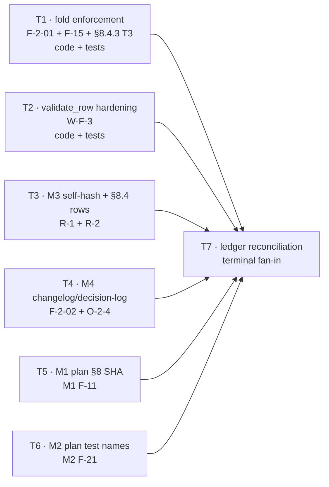

# Plan v1.0 — eval-consolidation-debt-cleanup

**Plan version:** 1.0 (2026-08-14) · **Status:** Planned — not executed · **Orchestrator skill:** v0.8
**Governance:** **Non-charter.** This plan is not charter-governed; the §1 charter-mode binding block (validation item 18) is omitted by design, and the §Budget carryability HALT (item 19) is advisory here.
**Declared subtask count:** 7 (T1–T7) — inside the §Budget range 4–10. No `merge-candidate` flag.
**Governing ledger:** `.dev/pending/eval-consolidation-open-items.md` (updated 2026-08-14, M4 rev 2 intake)
**Author:** orchestrator-planning v0.8 · **Auditor pass:** runs separately on Opus (see §8.5)

---

## 0. Context map intake

| Field | Value |
|---|---|
| **Path consumed** | `.dev/plans/eval-consolidation-debt-cleanup/context-map.md` |
| **Readiness verdict** | **CONDITIONAL** |
| **Generated by (skill version)** | `pre-plan-exploration v0.3` |
| **Map commit SHA** | `c8a36fcdc59ac587d5be49a3d8260e57c9048b64` |
| **Current HEAD at planning time** | `c8a36fcdc59ac587d5be49a3d8260e57c9048b64` — **staleness: none.** Map SHA == planning HEAD. |
| **Branch** | `dev2` |
| **Scope-area labels flagged in §Ambiguity flags** | Flag 1 (item 6 — M2 plan entry-point path moved), Flag 2 (item 6 — F-21 possibly already fixed on disk), Flag 3 (item 3 — §8.4.3 / §8.4.1 rows not byte-located), Flag 4 (item 5 — M1 replacement tree SHA required derivation). Flag 5 is an explicit negative check, not a flag. |

**CONDITIONAL handling (per §0).** Planning proceeds. Every flagged ambiguity appears in §5.2 as items **A-1 … A-4**, and each affected subtask carries the required kill criterion `halt if context-map flag <N> is unresolved at execution start` — see T3 (flag 3), T5 (flag 4), T6 (flags 1 and 2).

**Flags resolved by the orchestrator at planning time.** Two of the four flags were closed with direct evidence during plan authoring, so their executors receive facts rather than open questions. The kill criteria remain armed anyway, because a resolved flag can still be falsified at execution start.

- **Flag 1 → resolved (path corrected).** `Test-Path ".dev/plans/eval-consolidation-m2-s2-preplan-assessments/plan.md"` returns `False`; `Test-Path ".dev/archive/eval-consolidation-m2-s2-preplan-assessments/plan.md"` returns `True`, and the sibling tree (`plan.v1.0.md`, `decision-logs/`, `packets/`, `signoffs/`, `escalations/`) is present. T6's Files to touch cites the **archive** path. Residual: no move-log explains the relocation, so T6 must not treat the archive path as *canonical* beyond reading and (conditionally) editing that one file — it must not relocate anything back.
- **Flag 3 → resolved (rows byte-located).** In `.dev/plans/eval-consolidation-m3-s2-build/plan.md`: §8.4.3 assumption **24** is at **line 1587**; §8.4.1 **Q-6** is at **line 1576**; and a **second, unnamed Q-6 row** exists at **line 1604** under §8.4.5. The binding v5 self-hash row 0⁴ is at **line 1552** (`65bc48c4806477e09d21cae9d9a55cf2ed99035f`). T3's packet still instructs grep-by-string rather than edit-by-line-number, because T3's own edits shift every line number below its first insertion.
- **Flag 2 → confirmed as the map described (do not "fix" what is already correct).** `git grep -n "test_value_threshold_boundary_pin\|test_span_threshold_boundary_pin" HEAD` returns **no matches** anywhere in the tree, and the correct names exist at `eval/content/tests/test_agreement.py:231` and `:247`. T6's expected outcome is therefore **no edit to the M2 plan**, proven by an unchanged `git hash-object`. See §2.7 RH-4.
- **Flag 4 → not resolvable as stated; escalated into the contract instead.** Git facts confirmed: M1 T12 = `bf853e389c3f8c1c040f49120d7d3165c173be3a`, M1 T14 = `5b447058d41f6092b0569199470039a6f3b62121` (T12 is an ancestor of T14; T14 is an ancestor of HEAD), and **no commit exists for M1 T13** (its diff was entirely gitignored `.dev/` prose). The map's candidate SHA is arithmetically right and *semantically wrong for this slot*: M1 plan §8.1 also records `Result: 983 passed / 6 skipped` and `Execution span: T2–T11 … ad25fea`, so swapping the SHA alone would assert a verification that never ran at that tree. §2.7 RH-1 resolves this by requiring annotation over substitution; T5 carries the flag-4 kill criterion and is routed off Composer (§4 T5).

**Binding-artifact resolvability (§0 rule).** `.dev/` is gitignored (`.gitignore:258`); this program force-adds selected subtrees ("Option C"). Two consequences, both handled rather than waived:

1. **This plan's own artifacts must be tracked.** `git ls-files .dev/plans/eval-consolidation-debt-cleanup` is currently **empty** — the context map is on-disk only. Every artifact of this plan (`context-map.md`, `plan.md`, `packets/`, `changelogs/`, `decision-logs/`) is force-added under §2.7 **RH-5**, following the `eval-consolidation-m4-onboarding-runbook` precedent (that tree *is* tracked). Until RH-5 lands, the context map is **informational**, not binding.
2. **Four fix-target artifacts are untracked and stay untracked.** `.dev/plans/eval-consolidation-m3-s2-build/plan.md`, `.dev/plans/eval-consolidation-m1-metric-guardrail-hardening/plan.md`, `.dev/archive/eval-consolidation-m2-s2-preplan-assessments/plan.md`, `.dev/audits/eval-consolidation/M3/r23-selfhash-evidence.md`, and `.dev/pending/eval-consolidation-open-items.md` are all confirmed untracked. Force-adding them is **out of scope** (see §1 non-goals — no "while I'm in here" cleanup), so §8.2 cannot satisfy `git show HEAD:<path>` for them. This is the standing **M2 F-11 / Option C** gap, recorded as an explicit §8.2 deviation with `git hash-object` content-SHA pinning as the substitute falsifier (§2.7 **RH-3**), *not* as an unremarked omission. Tracked in §5.2 as A-10.

**Consumption mapping applied.** §File map rows → §4 *Files to touch* (all 7 subtasks resolve to explicit paths; **no** subtask is "unknown — discovery required", so validation item 14 is satisfied without deferral). §Interface inventory `suspect_modified` rows (`load_gold_exclusions`, `default_gold_path`, `EvalHarness.__init__`, `harness_cli.main`, `validate_row`, `TrustStatementRow`) → §2.1 seed. §Coupling surfaces 1–4 → §5.4 items C-3, C-4, C-5. §Ambiguity flags 1–4 → §5.2 items A-1…A-4. §Prior reasoning consulted: M4 `decision-logs/T13.md`'s landed "unknown slug → `{}`" contract is **preserved, not superseded** (§5.2 A-7); no §2 row contradicts a landed prior decision, so no supersession subtask is required.

---

## 1. Task statement

Close six tracked **tier-1** findings carried in the eval-consolidation program's open-items ledger (`.dev/pending/eval-consolidation-open-items.md`) so that the M0–M4 record is accurate and the two live production defects it names are actually fixed. Two findings are production code plus hermetic tests: **F-2-01 + F-15 + §8.4.3 T3** (a `company_slug` parameter contract accepted at three call sites without any check that the value is in folded form, plus an unguarded fold in `harness_cli.main` that can raise *after* a completed run) and **W-F-3** (`validate_row`'s §16 null-side conditionals are incomplete for `method` and `rung`, with no mutation tests). The remaining four are pure record hygiene — **R-1 + R-2** (M3 stale self-hash quotations and two stale §8.4 disposition rows), **F-2-02 + O-2-4** (M4 T11/T12 changelog attribution drift and a stale T11 decision-log deferral), **M1 F-11** (plan §8 cites a pre-T12–T14 tree SHA), and **M2 F-21** (plan cites test names that do not exist) — with zero code risk. A terminal subtask reconciles the six ledger rows so the tracker stops asserting Open for work that landed, which is the same drift class the four record findings exist to correct.

**Non-goals:**

- **No spec or charter amendments.** `ESC-T12-1` (spec §19/D4 bench exception) and `M1 F-10` (charter M1 block touch-up) are explicitly out of scope — routed to idea-orch (Tier 3) and the charter (Tier 2) respectively.
- **No operator-only items.** `UGA-1` (upstream grounding audit), `F-14` (rung-3 `assessment_metrics` rows), and `M4-F-14` (M4 context-map staleness) are operator dispositions, not this plan's work.
- **No `eval/program/registry.yaml` disposition changes** beyond what closing a specific named finding above requires. No registry schema edits. None of the six findings requires a registry edit; a diff that touches it is a scope violation to report, not to execute.
- **No refactoring, renaming, or "while I'm in here" cleanup** beyond the named finding in each subtask. Specifically excluded: the O-2-1 function-level import in `bootstrap.py:643`, the O-4 dead `import sys`, `resolve_company_slug`'s missing deprecation marker, F-16's SQL `chunk_id` interpolation, and force-adding the four untracked `.dev/` fix targets.
- **No new dependencies.** No `requirements.txt` / `pyproject` change.
- **No new test files and no changes to `pytest.ini`.** New tests land in existing files inside the declared `testpaths`.
- **No M4 packet Files-to-touch amendments.** The ledger offers this as optional for F-2-02 ("orchestrator may amend"); this plan declines it — T4 corrects the changelog and decision-log records only.
- **No re-measurement of M1's §8 test suite.** M1 F-11 is closed as record hygiene (§2.7 RH-1), not by re-running a four-milestone-old gate.

---

## 2. Shared contracts

Binding on **all** subagents. Drift here is the costliest failure mode in this plan, because five of seven subtasks write records *about* contracts rather than code.

### 2.1 Types / interfaces

| Surface | Owner | Typed home | Construction / round-trip test |
|---|---|---|---|
| **NEW** `require_folded_company_slug(company_slug: str) -> str` | **T1** | Module-level function in `eval/retrieval/companies.py`. Returns the input unchanged when it is already canonical; raises `PreconditionError` otherwise. | `eval/retrieval/tests/test_companies.py::test_require_folded_company_slug_accepts_folded_slug`, `::test_require_folded_company_slug_rejects_display_name`, `::test_require_folded_company_slug_rejects_empty` |
| `load_gold_exclusions(path: Path = GOLD_EXCLUSIONS_PATH, *, company_slug: str) -> dict[str, str]` | T1 | `eval/retrieval/gold/bootstrap.py:278`. **Signature unchanged**; behavior narrows — calls `require_folded_company_slug` before the existing emptiness check's `strip()` result is used. | `test_gold_exclusions.py::test_load_gold_exclusions_rejects_unfolded_company_slug` and `::test_load_gold_exclusions_unknown_folded_slug_returns_empty` |
| `default_gold_path(company_slug: str) -> Path` | T1 | `eval/retrieval/harness.py:96`. **Signature unchanged**; behavior narrows. | `test_harness_fixture.py::test_default_gold_path_rejects_unfolded_company_slug` |
| `main(argv: list[str] \| None = None) -> int` (`harness_cli`) | T1 | `eval/retrieval/harness_cli.py:91`. **Signature unchanged**; the fold currently at line 121 moves inside the existing `try` at lines 96–100 and its result is reused for the summary line. | `test_harness_cli.py::test_run_unnormalizable_company_name_fails_before_harness_run` |
| `validate_row(row: TrustStatementRow) -> None` | **T2** | `eval/retrieval/trust_statement.py:174`. **Signature unchanged**; two new raise branches. | `test_trust_statement.py::test_validate_row_rejects_method_outside_ingest_completeness`, `::test_validate_row_rejects_rung_outside_content_correctness_on_attested`, plus the two positive-preservation tests in §2.3 |

**Placement is binding, because the alternative deadlocks on an import cycle.** `eval/retrieval/harness.py:24` imports `eval.retrieval.gold.bootstrap` at module level, and `bootstrap.py` imports `harness` only at function level (`:1071`) to break that cycle. `companies.py` is a leaf (imports `re` only) and `errors.py` imports nothing, so `companies.py → errors.py` is safe and is the **only** placement both call sites can import at module level. Do not host the guard in `harness.py` or `bootstrap.py`.

**Typed-surface binding rule — satisfied, not waived.** This plan introduces **no** new user-visible field, config key, dataclass attribute, or construction parameter. The single new symbol above has an owning subtask, a typed home, and three construction tests. Nothing is *deferred to Tn*; there are no prose-only keys and no `getattr`-papered defaults.

**No dataclass shape changes.** `TrustStatementRow`'s field list and `__post_init__` are **not** modified by T2. T2 changes `validate_row` only. Hardening the dataclass is a different (unscoped) decision.

### 2.2 Error envelope

| Condition | Type | Binding message substring |
|---|---|---|
| `company_slug` is not in canonical folded form (T1 guard) | `PreconditionError` (from `eval.retrieval.errors`) | `company_slug must be canonical` — plus the offending value rendered with `!r` |
| Display name folds to empty (existing, **unchanged**) | `UnnormalizableCompanySlugError(ValueError)` raised by `canonical_company_slug` | unchanged — `folds to empty after normalization` |
| `method` non-null outside `ingest_completeness` (T2) | `TrustStatementGenerationError` | `method must be null outside ingest_completeness` |
| `rung` non-null outside `content_correctness` on `attested`/`partial` (T2) | `TrustStatementGenerationError` | `rung must be null outside content_correctness` |

`PreconditionError` is binding for the fold guard, not illustrative: M4 rev 2 **F-2-01** states T13's contract bindings already *claim* `PreconditionError` for a missing or unfolded `company_slug`, so this closes the finding by making code match the landed contract text rather than by editing the contract. It is also already caught: `harness_cli.main` wraps its harness construction in `except (PreconditionError, ValueError)` at `:98` and `:144`, so a guard raise becomes exit code 1 with a stderr line, not a traceback.

T2's two messages must reuse the module's existing prefix **verbatim** — `f"row ({row.company}, {row.layer}, {row.surface}): "` — so the new raises are indistinguishable in shape from the eleven existing ones. Both new branches raise `TrustStatementGenerationError`, the module's DG-14 whole-artifact halt class; **no new exception type is introduced anywhere in this plan.**

**Wire / HTTP: N/A with reason.** No HTTP surface, header, status code, or auth scheme is in scope. Both touched packages are library plus local CLI. This matches the M4 plan's own §2.7 note ("M4 adds no HTTP surface, no headers, no auth scheme and no status codes"). No event, topic, or queue names either.

### 2.3 Naming

**Production symbols added:** exactly one — `require_folded_company_slug` (T1). No renames, no deletions, no module moves anywhere in this plan.

**Test names are frozen here** (contract-anchor: §4 kill criteria and §8.3 evidence cite these strings, so drift is a contract violation, not a style choice):

| File | Test name | Owner |
|---|---|---|
| `eval/retrieval/tests/test_companies.py` | `test_require_folded_company_slug_accepts_folded_slug` | T1 |
| `eval/retrieval/tests/test_companies.py` | `test_require_folded_company_slug_rejects_display_name` | T1 |
| `eval/retrieval/tests/test_companies.py` | `test_require_folded_company_slug_rejects_empty` | T1 |
| `eval/retrieval/tests/test_gold_exclusions.py` | `test_load_gold_exclusions_rejects_unfolded_company_slug` | T1 |
| `eval/retrieval/tests/test_gold_exclusions.py` | `test_load_gold_exclusions_unknown_folded_slug_returns_empty` | T1 |
| `eval/retrieval/tests/test_harness_fixture.py` | `test_default_gold_path_rejects_unfolded_company_slug` | T1 |
| `eval/retrieval/tests/test_harness_cli.py` | `test_run_unnormalizable_company_name_fails_before_harness_run` | T1 |
| `eval/retrieval/tests/test_trust_statement.py` | `test_validate_row_rejects_method_outside_ingest_completeness` | T2 |
| `eval/retrieval/tests/test_trust_statement.py` | `test_validate_row_rejects_rung_outside_content_correctness_on_attested` | T2 |
| `eval/retrieval/tests/test_trust_statement.py` | `test_validate_row_accepts_method_on_ingest_completeness` | T2 |
| `eval/retrieval/tests/test_trust_statement.py` | `test_validate_row_accepts_rung_on_content_correctness` | T2 |

**Artifact paths (frozen).** Plan-local artifacts live at `.dev/plans/eval-consolidation-debt-cleanup/`: `plan.md`, `context-map.md`, `packets/T<n>.md`, `changelogs/T<n>.md`, `decision-logs/T<n>.md`. Treat any drift between `decision-logs/` and `decisions/` as a contract violation, not a cleanup item.

**Repo-root `CHANGELOG.MD` section heading (frozen contract-anchor string, exact bytes, em dash U+2014):**

```
## eval-consolidation-debt-cleanup — 2026-08-14
```

**T3 creates this heading if absent** (it must, because R-1's own disposition requires the correction to land as a *later* CHANGELOG entry rather than a rewrite of the R23 line). **T7 appends to it.** No other subtask writes to repo-root `CHANGELOG.MD` — see §5.4 C-1.

### 2.4 Logging

**N/A with reason.** This plan adds no log emission, no logger, no structured field, and no sink change. The T1 and T2 guards *raise*; they do not log. `harness.py`'s existing `logging` usage is untouched. Executors must not add `logger.warning`-style breadcrumbs alongside the new raises — a guard that logs and continues is the failure mode both findings describe.

### 2.5 Tests

- **Framework:** `pytest`. **Gate command:** `python -m pytest -q` from repo root.
- **Hermetic only.** No warehouse query, no `SparkSession`, no network, no Databricks SDK call in any new test. `harness_cli` tests follow the established pattern in `test_harness_cli.py:26-36` — `@patch("eval.retrieval.harness_cli.EvalHarness")` plus `@patch("eval.retrieval.harness_cli._build_store")`, then call `main(argv)`.
- **Location.** New tests go into the **existing** files named in §2.3. `pytest.ini` declares `testpaths = tests eval/retrieval/tests eval/content`; a test outside those three roots does not run under CI, which is M3's live carried coverage gap #4. **No new test file, no `pytest.ini` edit.**
- **Baseline.** M4 rev 2 recorded **1201 passed / 1 skipped (1202 collected)** at `c8a36fc`. Expected after T1 (+7) and T2 (+4): **1212 passed / 1 skipped**. No subtask may reduce the pass count or introduce a skip.
- **Dirty-tree warning.** The working tree at planning time carries unrelated untracked test files (`eval/retrieval/tests/test_calibration_samples.py`, `test_onboarding_runbook.py` modifications, `eval/content/tests/test_exec_summary_spot_check_rubric.py`) from other work. Local counts will therefore exceed the baseline. §8.1's snapshot must be measured on a **clean checkout** of the handoff SHA — a local dirty-tree run does not satisfy §8.1 (§5.2 A-11).
- **Mutation verification (binding for T2, and the reason W-F-3 stayed open).** W-F-3 asks for *mutation tests*, which a passing test alone does not demonstrate. T2 must, for **each** of its two new guards, temporarily disable that guard, confirm the corresponding named test **fails**, restore the guard, and record the observed failure in `changelogs/T2.md`. Precedent: M3 R21's KC2 mutation check. A named test that passes both with and without the guard is not a falsifier.
- **Positive-preservation is mandatory, not optional.** T1 must prove a well-formed-but-unregistered slug still returns `{}` (M4 T13's landed contract), and T2 must prove `method` on `ingest_completeness` rows and `rung` on `content_correctness` rows still validate. A guard that closes a finding by breaking the happy path is a failed subtask.

### 2.6 CLI surface

**No flag, subcommand, or CLI string is added, removed, renamed, or re-defaulted by this plan.** Frozen strings that T1 reads and must not alter: subcommands `run`, `validate-baseline`; flags `--store-backend`, `--run-type`, `--company-name`, `--catalog`, `--baseline-ref-run-id`, `--sqlite-path`, `--registry-path`, `--gold-path`, `--reports-dir`, `--affected-intents`, `--ablation-config`, `--current-run-id`. T1 must not touch `build_parser()`.

The existing downstream guard is named so freezing is checkable rather than asserted: `eval/retrieval/tests/test_onboarding_runbook.py` parses **every** bash CLI block in `eval/program/onboarding_runbook.md` against the landed `build_parser()`. Any parser change breaks that test, which is how CLI drift surfaces without a separate manifest.

The `run` summary line's **shape** is also frozen (M4 T12 landed it as a §2.4 surface): `harness_cli: run_id=… company=<slug> catalog=…`. T1 changes *where* `<slug>` is computed, never the printed text. `test_run_summary_line_names_company_slug_and_catalog` is the existing falsifier.

### 2.7 Record-hygiene contract (binding on T3, T4, T5, T6, T7)

Four of the six findings are stale *records*. Correcting a record badly reproduces the defect one level down, which is exactly what R-1 is. These six rules are therefore contract rows, not style guidance.

- **RH-1 — Annotate, don't rewrite.** Where the stale text is itself a historical record — a verbatim command transcript, a landed §8 completion snapshot, a prior subtask's own changelog claim — correct it by annotation (strikethrough, or an appended dated note) that names this plan's subtask, rather than overwriting history. **Verbatim command transcripts are immutable.** Program precedent: M3 R22/R20's "annotate-don't-rewrite" (M3 plan `:895`, `:1554`) and the M3 rev-5 disposition for R-1.
- **RH-2 — Pointer-only hashes.** No artifact corrected by this plan may print a self-hash literal. Cite the binding location instead (for M3: "plan §8.2 row 0⁴"), per M3 **OD-v5-1**. This is binding, not stylistic: T3 edits `plan.md`, which changes row 0⁴'s value, so any literal copied elsewhere is stale the moment T3 lands (§5.4 C-2).
- **RH-3 — Content-SHA falsifiers.** For every `.dev/` file it edits, a record subtask records `git hash-object <path>` **before and after** in its changelog. A deliberate no-op outcome is proven by `before == after`. This is what makes doc-edit kill criteria falsifiable for untracked files, where `git diff` shows nothing.
- **RH-4 — Verify before edit.** Before editing, re-verify that the finding's quoted stale string actually exists at the declared path. If it does not, the correct, **in-scope** outcome is: report "already correct — ledger stale", edit nothing, and let T7 close the row with a stale-ledger note. This is **not** a HALT, and it is **not** licence to edit adjacent prose to show output.
- **RH-5 — Plan artifacts are tracked.** Every artifact under `.dev/plans/eval-consolidation-debt-cleanup/` is force-added (`git add -f`) so §8.2 resolves at HEAD. Precedent: the `eval-consolidation-m4-onboarding-runbook` tree is tracked this way. This rule does **not** extend to the four untracked fix targets (§1 non-goals; §5.2 A-10).
- **RH-6 — Attribution marker (frozen contract-anchor string).** Every annotation this plan lands into an existing document carries the exact marker `[eval-consolidation-debt-cleanup T<n>, 2026-08-14]`, with `<n>` the emitting subtask. One `grep -rn "eval-consolidation-debt-cleanup T"` then enumerates the plan's entire record footprint, which is how §8.3 is evidenced and how T7 verifies closure claims instead of trusting them.

### 2.8 Decision logs

**T1 is the only `architectural` subtask.** Its decision log path is frozen at:

```
.dev/plans/eval-consolidation-debt-cleanup/decision-logs/T1.md
```

`standard`-tier subtasks (T2, T3, T4, T5, T7) emit a decision log **only** if the executor flags a fork; if emitted, it uses the same directory and `T<n>.md` name. `trivial`-tier T6 emits none.

**Decision-log supersession check (performed at planning time).** No decision log in scope narrates behavior that this plan reverses. M4 `decision-logs/T13.md`'s "unknown slug → `{}`" clause is *preserved* by T1's design, not superseded (§5.2 A-7). T4 *edits* M4 `decision-logs/T11.md` — but only its stale "Items deferred" line, under RH-1 annotation, which is itself the O-2-4 fix rather than a supersession. No supersession banner is owed by any subtask.

### 2.9 Out-of-contract files — touching any of these is a HALT

`eval/program/registry.yaml` · `eval/program/eval_debt/eval_debt.yaml` · `eval/program/onboarding_runbook.md` · anything under `eval/retrieval/gold_labels/` or `eval/retrieval/gold/gold_exclusions.yaml` · `eval/retrieval/companies.py`'s existing `canonical_company_slug` **body** (T1 adds a sibling function; it must not alter the four-step fold) · `pytest.ini` · `.gitignore` · the charter and spec under `.dev/specs/` · `eval/retrieval/scripts/apply_ops_ddl.sql`.

---

## 3. Dependency DAG



**Parallel group:** `{T1, T2, T3, T4, T5, T6}` — all six may run concurrently. **Rank 2:** `{T7}`.

Parallel safety is evidence-backed, not assumed. Context-map **Surface 2** (confirmed) establishes that `trust_statement.py` imports none of `companies` / `gold.bootstrap` / `harness`, and that neither `bootstrap.py` nor `harness_cli.py` imports `trust_statement.py` — so T1 and T2 touch disjoint files with no shared import or call path. **Surface 3** (confirmed) establishes that T3, T4, T5, and T6 touch four disjoint file sets across four milestones' directories, with no file appearing in more than one.

**Edges into T7 are evidence dependencies, not file dependencies:** T7 transcribes each subtask's landed outcome (including a possible no-op from T6) into the ledger, so it cannot start before all six report.

**Soft dependency — `T3 --> T7` is also the plan's only file-level edge.** Both write repo-root `CHANGELOG.MD`: T3 creates the §2.3 frozen section heading plus its R-1 annotation bullet, T7 appends the fan-in bullets. T7's terminal position makes the ordering free. If T3 HALTs, T7 must create the heading itself under the identical frozen string — this is the one case where two subtasks may write the same line, and it is safe only because they never run concurrently. No other pair of subtasks shares a file.

**No cycles. No orphans.** Every node has exactly one outbound edge into the fan-in, and T7 has six inbound edges and no outbound.

---

## 4. Subtask specs

### T1 — Fold enforcement across the `company_slug` parameter contract

| Field | Content |
|---|---|
| **ID** | `T1` |
| **Closes** | M4 rev 2 **F-2-01**, rev 1 **F-15** (carried), M4 plan **§8.4.3 T3** / observation **O-2-2**; M4 rev 2 coverage gaps **1** and **2** |
| **Scope** | Add one shared guard, `require_folded_company_slug`, to `eval/retrieval/companies.py`, and call it from the three sites that accept a `company_slug`-typed value without checking it is folded: `load_gold_exclusions`, `default_gold_path`, and `EvalHarness.__init__`'s slug path. Separately, move `harness_cli.main`'s fold of `--company-name` inside the existing fail-handled `try` so an unnormalizable name cannot raise *after* a completed run on the `--gold-path` branch. |
| **Recommended executor** | **Claude Sonnet 5 Thinking (or stronger).** *Not* Composer-eligible: the subtask spans three modules under a live import cycle, must preserve a landed contract from another milestone's decision log (`unknown slug → {}`) while narrowing an adjacent path, and must relocate control flow in `main` so the fold precedes all side effects. Those are judgment calls beyond mechanical text or code correction. |
| **Files to touch** | `eval/retrieval/companies.py` (add guard) · `eval/retrieval/gold/bootstrap.py` (`load_gold_exclusions`, `:278-288`) · `eval/retrieval/harness.py` (`default_gold_path`, `:96-97`) · `eval/retrieval/harness_cli.py` (`main`, `:96-100` and `:121`) · `eval/retrieval/tests/test_companies.py` · `eval/retrieval/tests/test_gold_exclusions.py` · `eval/retrieval/tests/test_harness_fixture.py` · `eval/retrieval/tests/test_harness_cli.py` · `.dev/plans/eval-consolidation-debt-cleanup/changelogs/T1.md` · `.dev/plans/eval-consolidation-debt-cleanup/decision-logs/T1.md` |
| **Contract bindings** | All of §2. Load-bearing: §2.1 (placement in `companies.py` is binding — import-cycle constraint), §2.2 (`PreconditionError`; message substring `company_slug must be canonical`), §2.3 (seven frozen test names), §2.5 (hermetic; positive-preservation mandatory), §2.6 (CLI surface frozen; do not touch `build_parser()`), §2.9 (do not modify `canonical_company_slug`'s body). §2.7 does not apply (T1 lands no annotations into third-party records). |
| **Inputs** | None — T1 is a source node. |
| **Outputs** | `require_folded_company_slug` in `companies.py`; three guarded call sites; relocated fold in `harness_cli.main` with the second fold at `:121` removed and its value reused; seven named tests; `changelogs/T1.md`; `decision-logs/T1.md` (**required** — architectural tier) recording the placement alternatives considered (shared leaf-module guard vs duplicated inline check vs `NewType`/validated wrapper), the chosen rationale, the import-cycle constraint, and the explicit assumption that `canonical_company_slug` is idempotent. |
| **Kill criteria** | 1. **HALT** if `require_folded_company_slug` cannot live in `companies.py` without a circular import — report the observed cycle; do not relocate the guard to `harness.py` or `bootstrap.py` on your own authority (that placement is a §2.1 contract row). 2. **HALT** if `test_load_gold_exclusions_unknown_folded_slug_returns_empty` cannot be made to pass alongside the new guard — that means the fix has collapsed M4 T13's "well-formed-but-unknown slug → `{}`" contract into the unfolded-slug error path, which is a contract violation, not a test problem. 3. **HALT** if `python -m pytest -q` shows **any** pre-existing test failing that passed before your change (name the test and the assertion); a required edit to an existing test's *expectations* is a contract question, not an executor decision. 4. **HALT** if closing §8.4.3 T3 appears to require a change to `build_parser()` or to any string in §2.6. 5. **HALT** if the fix would require editing `canonical_company_slug`'s body (§2.9) — the fold is already correct at `companies.py:18-35`; only its call sites are missing. |
| **Log tier** | **`architectural`** — introduces a new production symbol consumed by two other modules, and chooses among real alternatives for where enforcement lives. Decision log required at the §2.8 path. |
| **Risks & mitigations** | *Over-broad guard rejects legitimate slugs* → mitigated by the idempotence assumption (§5.2 A-5) plus `test_require_folded_company_slug_accepts_folded_slug` on `elder_care`, `clearsulting`, and `acme_corp`. *Guard placed behind the existing `strip()` so a padded slug slips through* → the guard must run on the **raw** parameter, and `test_load_gold_exclusions_rejects_unfolded_company_slug` should use `"Elder Care"` (spaces and capitals, the exact F-2-01 example). *Moving the fold in `main` changes the summary line* → §2.6 freezes the printed shape and `test_run_summary_line_names_company_slug_and_catalog` is the existing falsifier. *SQL-side UDF divergence* (§5.4 C-5) → disproven by design, since kill criterion 5 forbids touching the fold's semantics. |

### T2 — `validate_row` §16 null-side hardening plus mutation evidence

| Field | Content |
|---|---|
| **ID** | `T2` |
| **Closes** | M0 **W-F-3 / F-3** (Open, overdue) |
| **Scope** | Add the two missing null-side conditionals to `validate_row`: reject a non-null `method` outside the `ingest_completeness` layer, and reject a non-null `rung` outside `content_correctness` when attestation is `attested` or `partial`. Add the four named tests and record a mutation check for each new guard. |
| **Recommended executor** | **Composer 2.5 Fast.** Single-file family (`trust_statement.py` plus its own test file), the two guards' placement and exact messages are pinned in §2.1/§2.2, the four test names are frozen in §2.3, and every kill criterion resolves to a named test outcome or a `grep` result. Nothing here requires a judgment call. |
| **Files to touch** | `eval/retrieval/trust_statement.py` (`validate_row`, `:174-245` — **only** this function) · `eval/retrieval/tests/test_trust_statement.py` · `.dev/plans/eval-consolidation-debt-cleanup/changelogs/T2.md` |
| **Contract bindings** | All of §2. Load-bearing: §2.1 (`validate_row` signature unchanged; `TrustStatementRow` and `__post_init__` **not** modified), §2.2 (`TrustStatementGenerationError`; verbatim `f"row ({row.company}, {row.layer}, {row.surface}): "` prefix; the two binding message substrings), §2.3 (four frozen test names), §2.5 (mutation verification is mandatory; positive-preservation mandatory). §2.7 does not apply. |
| **Inputs** | None — T2 is a source node. |
| **Outputs** | Two new raise branches in `validate_row`; four named tests (two falsifiers, two positive-preservation); `changelogs/T2.md` containing the two mutation-check observations (guard disabled → which named test failed, with the assertion text → guard restored). |
| **Kill criteria** | 1. **HALT** if any existing test in the suite constructs a `TrustStatementRow` that the new guards would reject — name the test and the row; that would mean a production or fixture path relies on off-layer `method`/`rung` and the finding's premise is wrong. (Planning-time evidence: all five `TrustStatementRow` constructions in `test_trust_statement.py` pass `method=None, rung=None`, and all thirteen production construction sites in `trust_statement.py` set `method` only on `ingest_completeness` rows and `rung` only on `content_correctness` rows.) 2. **HALT** if either mutation check *passes* — i.e. disabling a new guard leaves its named test green. That test is not a falsifier and W-F-3 is not closed by it. 3. **HALT** if closing the finding appears to require editing `TrustStatementRow.__post_init__`, the `METHODS`/`RUNGS`/`LAYERS` vocabularies, or any row-producing helper — scope is `validate_row` only. 4. **HALT** if `python -m pytest -q` shows any previously passing test now failing. 5. **Report, do not resolve:** `METHODS` and `RUNGS` both contain the literal string `"null"` as a vocabulary member. Treat a `method`/`rung` value of `"null"` (the string) as **present** and therefore rejectable off-layer, since the guards key on `is not None`. If this collides with any existing test or fixture, that is kill criterion 1. |
| **Log tier** | **`standard`** — non-trivial logic in an established pattern (eleven sibling guards already exist in the same function), no new contract surface beyond message substrings asserted by tests inside this same subtask. Decision log only if the executor flags a fork. |
| **Risks & mitigations** | *`rung` guard placed in the wrong branch.* The existing `elif row.rung is not None` at `:231` attaches to `if row.attestation in {"attested","partial"}` at `:225` and therefore only fires for `not_attested` / `known_gap`. The gap is the missing case **inside** the `attested`/`partial` branch when `layer != "content_correctness"`. Mitigated by the frozen test name `test_validate_row_rejects_rung_outside_content_correctness_on_attested` — the `_on_attested` suffix pins the branch. *`method` guard wrongly conditioned on attestation* → the `method` rule is layer-only and unconditional on attestation; §2.2's message substring omits any attestation term, and `test_validate_row_accepts_method_on_ingest_completeness` covers a non-`attested` ingest row. |

### T3 — M3 self-hash citation hygiene, §8.4 disposition rows, and mandatory self-hash re-fill

| Field | Content |
|---|---|
| **ID** | `T3` |
| **Closes** | M3 rev 5 **R-1** and **R-2** (both Open, minor) |
| **Scope** | Make the two stale self-hash *quotations* pointer-only (repo-root `CHANGELOG.MD`'s R23 entry, and `r23-selfhash-evidence.md`'s Forward statement), correct the two stale M3 plan §8.4 disposition rows (§8.4.3 assumption 24, §8.4.1 Q-6, plus the sibling Q-6 row in §8.4.5), and then re-fill the plan's §8.2 row 0⁴ self-hash, because editing `plan.md` invalidates it. |
| **Recommended executor** | **Claude Sonnet 5 Thinking (or stronger).** *Not* Composer-eligible: the subtask must distinguish an immutable command transcript from a correctable narrative claim within the same file, must write pointer-only prose whose *correctness* the self-hash guard cannot check, and must execute a terminal hash re-fill whose ordering is load-bearing for M3's audit chain. Mis-scoped output here re-creates R-1 rather than closing it. |
| **Files to touch** | `CHANGELOG.MD` (repo root — creates the §2.3 frozen section heading plus the R-1 annotation bullet; **does not rewrite** the R23 line at `:43`) · `.dev/audits/eval-consolidation/M3/r23-selfhash-evidence.md` (Forward statement, `:18-24` — **not** the pre-fill transcript at `:9-14`) · `.dev/plans/eval-consolidation-m3-s2-build/plan.md` (§8.4.3 assumption 24 row, §8.4.1 Q-6 row, §8.4.5 Q-6 row, and finally the §8.2 row 0⁴ hash slot) · `.dev/plans/eval-consolidation-debt-cleanup/changelogs/T3.md` |
| **Contract bindings** | All of §2. Load-bearing: §2.7 **RH-1** (the pre-fill transcript is an immutable command record; the R23 CHANGELOG line is history — annotate via a later entry), **RH-2** (pointer-only; no hash literal anywhere in your output), **RH-3** (before/after `git hash-object` for all three `.dev`-side and root files), **RH-4** (verify each quoted stale string first), **RH-6** (marker `[eval-consolidation-debt-cleanup T3, 2026-08-14]`), §2.3 (exact CHANGELOG heading bytes). §2.1–§2.2, §2.5–§2.6 do not apply — T3 ships no code and no tests. |
| **Inputs** | None — T3 is a source node. Reference facts supplied in the packet: binding row 0⁴ value and location; the two stale literals; the three row locations. |
| **Outputs** | Pointer-only annotation in `CHANGELOG.MD` under the new frozen section heading; corrected Forward statement in `r23-selfhash-evidence.md`; three corrected disposition rows in M3 `plan.md`; **re-filled §8.2 row 0⁴** with `python .dev/audits/eval-consolidation/M3/verify_plan_selfhash.py` printing `STATUS: PASS` as the terminal action; `changelogs/T3.md` with the six before/after content SHAs and the verify-script output pasted verbatim. |
| **Kill criteria** | 1. **HALT if context-map flag 3 is unresolved at execution start** — i.e. if `grep -n "assumption 24"`-equivalent searches for the row texts quoted in your packet do not locate exactly the three rows described (§8.4.3 assumption 24, §8.4.1 Q-6, §8.4.5 Q-6) in `.dev/plans/eval-consolidation-m3-s2-build/plan.md`. Do not edit by line number; the numbers in this packet shift as soon as you insert your first line. 2. **HALT** if `verify_plan_selfhash.py` exits `2` with `expected exactly one v5 self-hash slot (row 0⁴), found N` — your prose has either duplicated or destroyed the slot pattern `eval-consolidation-m3-s2-build/plan.md` `<hex>` — §8 (v5) handoff. Restore before proceeding. 3. **HALT** if the final `verify_plan_selfhash.py` run does not print `STATUS: PASS`. A `FAIL` means the declared hash no longer matches the file, which is precisely the R-1-class defect this subtask closes. 4. **HALT** if closing R-1 appears to require printing a corrected hash literal into `CHANGELOG.MD` or `r23-selfhash-evidence.md` — that violates RH-2 and goes stale the moment you re-fill row 0⁴. 5. **HALT** if the quoted stale values are not found where the packet says: `542daaf4` in `CHANGELOG.MD:43`, `8a878904` in `r23-selfhash-evidence.md` at both `:13` (transcript — leave it) and `:20`'s Forward claim (correct it). 6. **HALT** if the pre-fill transcript block at `r23-selfhash-evidence.md:9-14` would need to change to make the document self-consistent — a command transcript is immutable under RH-1; report the tension instead. |
| **Log tier** | **`standard`** — multi-file record correction plus a procedural hash re-fill, but with no design fork: pointer-only is already settled by M3's **OD-v5-1** and re-pinned as §2.7 RH-2. Not architectural. Decision log only if the executor flags a fork. |
| **Risks & mitigations** | *Ordering error re-breaks the self-hash.* The row 0⁴ re-fill must be the **last** edit to `plan.md`; any later prose touch invalidates it. Mitigated by kill criterion 3 and by pasting the verify output into the changelog. *Fixing only the §8.4.1 Q-6 row.* A second Q-6 row exists at §8.4.5 (`:1604`) and would contradict the corrected one — §5.4 C-6; both are in Files to touch. *R-1 recurrence.* Mitigated by RH-2, which makes the pointer-only rule a contract row rather than a preference. *The v4 stale values (`a96c4f85`, `ced7ff42`, `93780622`) are already correctly annotated as historical* at `plan.md:1554` and `:1626` — do not re-annotate them; assumption 24's defect is that it claims the stale set is **limited** to those, when `CHANGELOG.MD:43` and the evidence doc also carry stale values. |

### T4 — M4 T11/T12 changelog attribution and T11 decision-log back-annotation

| Field | Content |
|---|---|
| **ID** | `T4` |
| **Closes** | M4 rev 2 **F-2-02** (changelog / record half) and observation **O-2-4** |
| **Scope** | Correct three record claims in the M4 plan's artifact tree against verified git evidence: T11's changelog claims a runbook Step 6 edit its own commit lacks; T12's changelog describes its runbook diff as "Step 3 serverless only" when that commit carries a second hunk belonging to T11; and T11's decision log still describes an operator signature as an unfilled placeholder after it was signed. |
| **Recommended executor** | **Composer 2.5 Fast.** Single artifact family (one M4 plan directory), three named files, three exact target strings, and the corrective facts are already established by git evidence quoted in the packet — no inference required. Every kill criterion is a string match or a content SHA. |
| **Files to touch** | `.dev/plans/eval-consolidation-m4-onboarding-runbook/changelogs/T11.md` (`:9`) · `.dev/plans/eval-consolidation-m4-onboarding-runbook/changelogs/T12.md` (`:3` and `:13`) · `.dev/plans/eval-consolidation-m4-onboarding-runbook/decision-logs/T11.md` (`:33`) · `.dev/plans/eval-consolidation-debt-cleanup/changelogs/T4.md` |
| **Contract bindings** | All of §2. Load-bearing: §2.7 **RH-1** (these are prior subtasks' own records — annotate, do not silently restate), **RH-3** (before/after content SHAs; note these three files **are** git-tracked, so `git diff` is available as a second falsifier), **RH-4**, **RH-6** (marker `[eval-consolidation-debt-cleanup T4, 2026-08-14]`), §2.9 (`eval/program/onboarding_runbook.md` is out of contract — the runbook content is **correct**; only the records about it are wrong). §2.1–§2.6 do not apply. |
| **Inputs** | None — T4 is a source node. Git evidence supplied in the packet. |
| **Outputs** | Three corrected/annotated record claims; `changelogs/T4.md` with before/after content SHAs and the three quoted before/after strings. |
| **Kill criteria** | 1. **HALT** if any of the three quoted stale strings is absent at its declared path (RH-4: report "already correct", edit nothing, do not go hunting for adjacent prose to fix). 2. **HALT** if the correction appears to require editing `eval/program/onboarding_runbook.md` — the runbook's two hunks are correct as landed; only the attribution records are wrong (§2.9). 3. **HALT** if the correction appears to require editing `.dev/plans/eval-consolidation-m4-onboarding-runbook/plan.md`, any file under `packets/`, or the signoff — **packet Files-to-touch amendment is an explicit §1 non-goal**; report the coupling (§5.4 C-7) instead of expanding scope. 4. **HALT** if `git show --stat 0e86004` lists `eval/program/onboarding_runbook.md`, or if `git show 2ceb25d -- eval/program/onboarding_runbook.md` does **not** show two hunks (Step 3 Option C caveat, and promotion-checklist item 5 "Bloated-gold baseline label") — that would falsify F-2-02's premise and the corrections must not be written. 5. **HALT** if `signoffs/T11-clearsulting-bloated-gold-disposition.md` does **not** show `Status: signed` at `:3` and an operator signature at `:57` — O-2-4's premise would be false and the placeholder line would be accurate. |
| **Log tier** | **`standard`** — three files, mechanical text corrections, no design fork; the "brief why" is needed because a reader must understand *why* T12's changelog now describes a hunk T12 did not author. Not `trivial` (multi-file), not `architectural`. |
| **Risks & mitigations** | *Correction reads as rewriting history* → RH-1 annotation with the RH-6 marker keeps the original claim visible and dates the correction. *Scope creep into the disclosed-but-unfixed halves of F-2-02* (T11/T13 editing `test_eval_debt.py` and `test_gold_kpi_pdf_branch.py` outside declared scope) → those are **already self-disclosed** at `decision-logs/T11.md:29` and are not this subtask's target; kill criterion 3 blocks the expansion. *Over-correcting T12's changelog into claiming T11's output* → the correct framing is that the hunk **landed in T12's commit but belongs to T11's scope**, which is what the audit found; both changelogs must tell the same story after T4. |

### T5 — M1 plan §8 stale tree-SHA record correction

| Field | Content |
|---|---|
| **ID** | `T5` |
| **Closes** | M1 **F-11** (Open; "Record hygiene only" per the ledger) |
| **Scope** | Correct the M1 plan's two citations of the pre-T12–T14 tree SHA `ad25fea` so the §8 snapshot stops implying a re-issue that never happened — **without** manufacturing a verification result at a tree where the suite was never run. |
| **Recommended executor** | **Claude Opus 5 Thinking (or comparable).** **Explicitly flagged non-Composer per the invocation's model-routing rule.** The replacement SHA is *not* independently derivable as a verification anchor: the honest correction is not a string swap but a judgment about what M1 §8.1 is allowed to claim. Writing a looser kill criterion to keep this Composer-eligible would license exactly the false-snapshot outcome this subtask exists to avoid. |
| **Files to touch** | `.dev/plans/eval-consolidation-m1-metric-guardrail-hardening/plan.md` (header `:3`; §8.1 Tree SHA row `:345`; and the §8.1 rows that must stay consistent with it — `Result` `:349` and `Execution span` `:350`) · `.dev/plans/eval-consolidation-debt-cleanup/changelogs/T5.md` |
| **Contract bindings** | All of §2. Load-bearing: §2.7 **RH-1** (the §8.1 snapshot is a landed historical measurement — annotate, do not overwrite), **RH-3**, **RH-4**, **RH-6** (marker `[eval-consolidation-debt-cleanup T5, 2026-08-14]`), §1 non-goals (**no re-measurement of M1's suite**). §2.1–§2.6 do not apply. |
| **Inputs** | None — T5 is a source node. Verified git facts supplied in the packet. |
| **Outputs** | Header `:3` and §8.1 corrected so that (a) `ad25fea` is retained and labeled as the tree at which the recorded `983 passed / 6 skipped` result was actually measured, (b) the "will be re-issued after T12–T14 land" clause is resolved rather than left pending — T12 landed at `bf853e3`, T14 at `5b447058`, and M1 T13 produced **no** tracked commit, and (c) the fact that §8 was never re-measured at the post-T14 tree is stated plainly rather than implied. `changelogs/T5.md` with before/after content SHAs, the before/after text of every edited line, and a one-paragraph "why annotate rather than swap" rationale. |
| **Kill criteria** | 1. **HALT if context-map flag 4 is unresolved at execution start** — specifically, if any of these three git facts fails to verify: `git merge-base --is-ancestor bf853e38… 5b447058…` exits 0; `git merge-base --is-ancestor 5b447058… HEAD` exits 0; and `git log --all --grep` finds **no** commit for M1's T13 (`5bbd3a1 T13` belongs to M4, not M1). 2. **HALT — do not proceed — if the correction you are about to write would leave §8.1 asserting the `983 passed / 6 skipped` result against any SHA other than `ad25fea`.** A snapshot whose SHA and verification result disagree is a fabricated §8.1 and is a worse finding than F-11 itself. If the only way you can see to close F-11 is to swap the SHA, HALT and report. 3. **HALT** if closing F-11 appears to require re-running M1's verification command (`python -m pytest eval/retrieval/tests/ tests/ -q`) at `5b447058` — that is an explicit §1 non-goal; report it as the residual instead. 4. **HALT** if `:3` or `:345` does not contain the literal `ad25fea6ead980763d4a8e32cde19931e654be69` (RH-4). 5. **HALT** if the edit would touch M1 §8.2's artifact-chain content SHAs, §8.3, or §8.4 — those cite artifacts measured at `ad25fea` and remain valid; scope is the header line and the §8.1 snapshot block only. |
| **Log tier** | **`standard`** — single file, but the "brief why" is load-bearing: a future auditor must be able to see that the un-re-measured §8 was a recorded decision, not an oversight. Not `architectural` (annotate-don't-rewrite is an existing program convention, not a new pattern). |
| **Risks & mitigations** | *The obvious "fix" is the wrong one.* Swapping `ad25fea` → `5b447058` closes the ledger row and silently creates a false §8.1 — mitigated by kill criterion 2, which forbids that specific edit shape. *Ambiguity about which SHA the operator meant* (map flag 4: T14's commit vs current HEAD) → dissolved by the chosen approach: no SHA is promoted to snapshot anchor, so the choice does not have to be made. If the operator later wants a re-measured v2.1 §8, that is a separate, larger subtask and T5's changelog must say so. |

### T6 — M2 plan cited test names (verify-first, expected no-op)

| Field | Content |
|---|---|
| **ID** | `T6` |
| **Closes** | M2 **F-21** (Open, trivial) |
| **Scope** | Re-verify the two citation sites the M2 audit named for F-21 and confirm whether the wrong test names are still present. Planning-time evidence says they are not, in which case the correct outcome is to change nothing and let T7 close the row as a stale-ledger entry. |
| **Recommended executor** | **Composer 2.5 Fast.** Single file, single deterministic check, and the kill criteria are a `git grep` exit state plus a `git hash-object` equality — fully falsifiable. The one real hazard (editing prose that is already correct) is neutralized by making "no diff" the *declared expected outcome* with an unchanged content SHA as its proof, rather than by relying on executor restraint. |
| **Files to touch** | `.dev/archive/eval-consolidation-m2-s2-preplan-assessments/plan.md` (**archive** path — the ledger's implied `.dev/plans/…` path does not exist; sites at `:138` §2 A-C5 *Landed:* line and `:515` §8.3 evidence table) — **edit only if the stale strings are actually present** · `.dev/plans/eval-consolidation-debt-cleanup/changelogs/T6.md` |
| **Contract bindings** | All of §2. Load-bearing: §2.7 **RH-4** (verify before edit; "already correct" is a valid in-scope outcome, **not** a HALT), **RH-3** (unchanged content SHA is the proof of a deliberate no-op), **RH-6** (marker required only if an annotation is actually landed), §1 non-goals (no relocating the archived plan tree). §2.1–§2.6 do not apply. |
| **Inputs** | None — T6 is a source node. |
| **Outputs** | Either (a) the expected case: **no edit**, plus `changelogs/T6.md` recording the `git grep` result, the two verified correct citations at `:138` and `:515`, the identical before/after `git hash-object` value, and the conclusion "F-21 already fixed on disk; ledger row stale"; or (b) if the stale strings are found: a corrected citation at each site under RH-1/RH-6, with before/after content SHAs. |
| **Kill criteria** | 1. **HALT if context-map flag 1 is unresolved at execution start** — if `.dev/archive/eval-consolidation-m2-s2-preplan-assessments/plan.md` does not exist, report the path resolution failure; do **not** search the tree for a substitute plan file to edit. 2. **HALT if context-map flag 2 resolves ambiguously** — i.e. if `git grep -n "test_value_threshold_boundary_pin\|test_span_threshold_boundary_pin" HEAD` and a direct on-disk search of `plan.md` **disagree** with each other about whether the stale names are present. (The file is untracked, so `git grep HEAD` cannot see it; the on-disk search is authoritative and both must be reported.) 3. **HALT** if the correct names `test_evaluate_thresholds_numeric_value_pass_and_fail` and `test_evaluate_thresholds_numeric_span_pass_and_fail` do **not** exist in `eval/content/tests/test_agreement.py` (planning-time: `:231` and `:247`) — then neither the plan's current text nor the audit's proposed text is right, and the finding needs re-scoping. 4. **HALT** if you conclude an edit is warranted for any reason other than "a quoted stale test name is present at `:138` or `:515`". 5. **Falsifiable no-op requirement:** if no stale string is found, `git hash-object` of the M2 `plan.md` **must** be byte-identical before and after your subtask. A changed SHA with no stale string found is a failed subtask. |
| **Log tier** | **`trivial`** — single file, mechanical verification, expected zero-diff, no design fork, and it anchors no string consumed by another subtask (T7 reads its reported *outcome*, not a symbol it defines). One-line changelog plus the required SHA evidence; no decision log. |
| **Risks & mitigations** | *Output pressure produces an unnecessary edit* → the expected outcome is explicitly "no diff", and kill criterion 5 makes the no-op the *falsifiable* deliverable rather than an absence of work. *Wrong file edited* (map flag 1) → the archive path is pinned in Files to touch and kill criterion 1 forbids substitute-hunting. *Ledger closed on a false premise* → T7 must reproduce T6's grep independently (§5.4 C-8), not just copy its claim. |

### T7 — Ledger reconciliation (terminal fan-in)

| Field | Content |
|---|---|
| **ID** | `T7` |
| **Closes** | The bookkeeping half of all six findings: it is what makes `.dev/pending/eval-consolidation-open-items.md` stop asserting **Open** for work that landed. |
| **Scope** | Update the ledger rows for the six findings to their landed status with evidence pointers, and append this plan's fan-in bullets to the repo-root `CHANGELOG.MD` section T3 created. Every closure claim must be independently verified against a landed artifact, not transcribed from a prior subtask's assertion. |
| **Recommended executor** | **Claude Sonnet 5 Thinking (or stronger).** *Not* Composer-eligible despite being mechanical in shape: a wrongly-asserted **Closed** row is the R14/R15 false-claim pattern, landing in the ledger that governs the whole program — the highest-consequence failure available in this plan. Independent re-verification of six heterogeneous evidence types is judgment work, and loosening the verification requirement to keep it Composer-eligible is exactly the trade the invocation forbids. |
| **Files to touch** | `.dev/pending/eval-consolidation-open-items.md` (Quick-open-items table rows 2, 3, 4, 8, 9, 12, 13, 14, plus the corresponding milestone-section rows for W-F-3, R-1, R-2, M1 F-11, M2 F-21, F-2-01, F-2-02, F-15, §8.4.3 T3, O-2-4, and the cross-milestone priority-queue rows 2, 3, 4, 6, 7, 9, 10, 11) · `CHANGELOG.MD` (append to the §2.3 frozen section only) · `.dev/plans/eval-consolidation-debt-cleanup/changelogs/T7.md` |
| **Contract bindings** | All of §2. Load-bearing: §2.3 (append under the **exact** frozen heading; create it only if T3 HALTed), §2.7 **RH-1** (the ledger's status legend and history stay intact — change status cells and add validation notes; do not delete rows), **RH-3**, **RH-6** (one `grep -rn "eval-consolidation-debt-cleanup T"` must enumerate the full footprint you are attesting to), §2.9. §2.1–§2.6 do not apply. |
| **Inputs** | **T1, T2, T3, T4, T5, T6** — each subtask's `changelogs/T<n>.md` (with its before/after content SHAs, named tests, and reported outcome) and `decision-logs/T1.md`. |
| **Outputs** | Six findings' ledger rows moved to **Closed** (or, for M2 F-21, **Closed — ledger was stale; no artifact edit required**) with a one-line validation note naming the landed evidence per row; the M4 rev 2 coverage-gap rows 1 and 2 updated to reflect T1's falsifiers; the fan-in bullets in `CHANGELOG.MD`; `changelogs/T7.md` recording, per finding, the independent check performed and its result. |
| **Kill criteria** | 1. **HALT** if any of `changelogs/T1.md` … `changelogs/T6.md` is absent, or lacks the before/after content SHAs (record subtasks) or the named tests and mutation-check observations (T2) that §2 requires — an unevidenced closure is the defect class this plan exists to remove. 2. **HALT** if your **independent** re-verification of any finding disagrees with that subtask's reported outcome. Required independent checks, not transcriptions: for T1 and T2, `python -m pytest -q` collects and passes the eleven §2.3 test names (`-k` by name) and the total is **1212 passed / 1 skipped** on a clean checkout; for T3, `python .dev/audits/eval-consolidation/M3/verify_plan_selfhash.py` prints `STATUS: PASS`; for T4, `git diff` on the three tracked M4 record files shows the corrections; for T5, `ad25fea` still appears at M1 `plan.md:345` **and** is now labeled as the measured tree; for T6, an on-disk search of the M2 archive plan for the two stale test names returns nothing. 3. **HALT** if any subtask HALTed — do **not** close its ledger row; record the HALT in the row's validation cell and report. 4. **HALT** if closing a row appears to require a change to `eval/program/registry.yaml`, `eval_debt.yaml`, the charter, or the spec (§1 non-goals, §2.9): the M0 registry pendings, `ESC-T12-1`, `M1 F-10`, `UGA-1`, `F-14`, and `M4-F-14` rows must be left **exactly** as they are. 5. **HALT** if `grep -rn "eval-consolidation-debt-cleanup T"` returns markers from a subtask whose changelog you did not receive — that indicates an edit you cannot attest to. |
| **Log tier** | **`standard`** — single file plus a changelog append, but it is the program's record of record and the "brief why" must carry the per-row evidence. Not `architectural` (no new pattern, no design fork). |
| **Risks & mitigations** | *False closure* → kill criterion 2's independent-check list, and RH-6's single-grep footprint enumeration. *Silent scope drift into adjacent open rows* → kill criterion 4 names the rows that must not move. *Status-legend abuse* → the ledger already defines Open / Half-open / Deferred / Closed; T6's outcome is **Closed**, not Deferred, because the substance is correct and only the tracker was stale. *T3 HALTed and the CHANGELOG heading is missing* → T7 creates it under the identical frozen §2.3 string (the plan's only sanctioned two-writer line; safe because T7 is terminal). |

---

## 5. Adversarial pass

**Lens declaration.** §5 was answered using the **packet-only executor persona**: for each item below I asked "if I received only this `T<n>` packet plus the executor SKILL.md, where would I halt, guess, or silently drift?" The lens did real work here rather than ritual work — it produced three findings that changed the plan's shape: **C-1** (the shared-`CHANGELOG.MD` conflict) forced per-subtask changelogs into a plan-local directory; **C-2** (the self-hash re-fill) turned RH-2 from a stylistic preference into a binding contract row and added T3's kill criteria 2–4; and **A-9** (the governing ledger would remain stale) is why T7 exists at all. Each was discovered by writing a packet and finding it unexecutable as drafted, which is §6's validation pass folded forward.

*The invocation refers to this block's first subsection as "§9.1 rejected decompositions"; it is numbered §5.1 here per the skill's schema.*

### 5.1 Rejected decompositions

1. **Merge T5 (M1 F-11) and T6 (M2 F-21) into one "cross-plan doc corrections" subtask.** *Rejected.* The invocation left this to my judgment, and the deciding factor is that these two subtasks have *opposite* failure modes. T6's correct outcome is very likely a **zero-byte diff** — its whole risk is an executor editing prose that is already right. T5's correct outcome requires a careful judgment edit — its whole risk is an executor making the obvious, wrong, one-token substitution. Merging them puts "do nothing here" and "think hard and write here" in one packet, and an executor under output pressure resolves that tension by editing both. They also route to different models (T6 is cleanly Composer-eligible; T5 is explicitly not), so merging would force the whole unit onto the stronger model and discard the routing signal. Their shared log tier is *not* actually shared either — T6 is `trivial`, T5 is `standard`, because T5's rationale must survive for a future auditor. Diff size favored merging; every other axis opposed it.
2. **Split T1 into three per-file subtasks** (`bootstrap.py`, `harness.py`, `harness_cli.py`). *Rejected* — the invocation forbids it, and context-map **Surface 1** (confirmed) supplies the reason: the three sites share one `company_slug` parameter contract, so fixing them in separate subtasks means whichever lands last decides whether the guard is shared or triplicated, and whichever is skipped keeps F-15 alive.
3. **Omit T7 and leave the ledger to the operator.** *Rejected.* Four of the six findings *are* stale records. Landing six fixes while the governing ledger keeps asserting **Open** would recreate the exact drift class being closed, in the one artifact the next auditor reads first. Keeping the ledger write in a single terminal subtask also removes what would otherwise be a six-way write conflict on one file.
4. **One mega record-hygiene subtask (T3+T4+T5+T6).** *Rejected.* Four milestones, four different correction conventions, one self-hash re-fill procedure, and four independent kill-criteria sets. A single criterion firing (T3's verify-script `FAIL`, say) would strand three unrelated and otherwise-complete fixes behind it.
5. **A separate verification subtask owning T2's mutation checks.** *Rejected.* Mutation evidence is only meaningful next to the code it falsifies; splitting it invites the T2 executor to treat "tests pass" as done, which is precisely how W-F-3 stayed open across five milestones.
6. **Fold T1's `harness_cli` half (§8.4.3 T3) into its own subtask.** *Rejected* — the invocation requires the merge, and it is right: `main`'s fold at `:121` and the `default_gold_path` guard are two manifestations of one gap (O-2-2 is literally logged as "§8.4.3 T3 gap second manifestation"), and the fix reuses the same guard and the same error envelope.

### 5.2 Load-bearing assumptions

Tuple shape: `(claim | contract surface referenced | failure mode | subtask IDs)`. **A-1…A-4 are the four context-map ambiguity flags, included as required by §0's CONDITIONAL rule.**

- **A-1** *(context-map flag 1)* — `(The M2 plan to correct lives at .dev/archive/eval-consolidation-m2-s2-preplan-assessments/plan.md, not the .dev/plans/… path the ledger implies | §4 T6 Files to touch; §2.7 RH-4 | executor halts on a missing file and burns a subtask cycle, or worse, finds a same-named file elsewhere and edits it | T6)`
- **A-2** *(context-map flag 2)* — `(M2 F-21 is already fixed on disk — the wrong test names appear nowhere in the tree — so the correct outcome is no edit | §2.7 RH-4; §4 T6 kill criterion 5 | executor edits already-correct prose to show output and introduces fresh drift into a closed milestone's plan | T6)`
- **A-3** *(context-map flag 3)* — `(The three stale M3 disposition rows are locatable by their quoted text, and line numbers 1576/1587/1604 are valid only until T3's first insertion | §4 T3 Files to touch; §2.7 RH-4 | executor edits by line number and corrects the wrong numbered row in a 1650-line file full of numbered assumption and Q-rows | T3)`
- **A-4** *(context-map flag 4)* — `(No tree SHA can honestly anchor M1 §8.1's recorded 983-passed result except ad25fea, because the suite was never re-run after T12–T14 | §2.7 RH-1; §4 T5 kill criterion 2 | executor swaps in 5b447058 and manufactures a §8.1 asserting a verification that never ran — a worse finding than F-11 | T5)`
- **A-5** — `(canonical_company_slug is idempotent, so fold(x) == x is a valid test of "already folded" | §2.1 require_folded_company_slug; companies.py:18-35 | if the fold were non-idempotent the guard would reject legitimate slugs and break every production call site | T1)`
- **A-6** — `(No production or fixture path constructs a TrustStatementRow with non-null method outside ingest_completeness or non-null rung outside content_correctness | §2.1 validate_row; the thirteen construction sites in trust_statement.py and five in test_trust_statement.py | T2's guards break production row derivation and the finding's premise is wrong | T2)`
- **A-7** — `(M4 T13's landed contract "well-formed but unknown slug → {}" is distinct from "unfolded slug → error" and must survive T1 | §2.2 error envelope; M4 decision-logs/T13.md; §2.5 positive-preservation | T1 collapses two code paths and makes lookups for any unregistered company raise instead of returning {} | T1)`
- **A-8** — `(PreconditionError is the right envelope because F-2-01 says T13's contract text already claims it, and harness_cli.main already catches it at :98 and :144 | §2.2 Error envelope row 1 | a guard raising an uncaught type turns a clean exit-1 into a traceback — the same defect shape as §8.4.3 T3 | T1)`
- **A-9** — `(The six ledger rows are the authoritative closure record; leaving them Open reproduces the drift class this plan closes | §2.7 RH-3; §4 T7 | the plan lands, the ledger still says Open, and the next auditor re-opens all six | T7)`
- **A-10** — `(Four fix-target .dev/ artifacts are untracked and will not satisfy §8.2's git show HEAD: requirement; content-SHA pinning is the sanctioned substitute | §0 binding-artifact resolvability; §8.2; §2.7 RH-3 | the auditor cannot read the landed fixes at HEAD and either blocks the handoff or accepts an unverifiable claim | T3,T5,T6,T7)`
- **A-11** — `(The working tree carries unrelated untracked test files, so local pass counts exceed the 1201-passed baseline | §2.5 Tests baseline; §8.1 | §8.1 is measured on a dirty tree, which the skill invalidates outright, and T7's 1212-passed check fails for a reason unrelated to this plan | T1,T2,T7)`
- **A-12** — `(The M3 verify script's SLOT_PATTERN requires exactly one match of the row-0⁴ text shape; prose that mentions plan.md with a hex string near "§8 (v5) handoff" can break it | §2.7 RH-2; .dev/audits/eval-consolidation/M3/verify_plan_selfhash.py:17-20; §4 T3 kill criterion 2 | T3's own pointer prose makes the guard exit 2, and an executor reads that as "the guard is broken" rather than "my edit broke it" | T3)`

### 5.3 Highest re-plan risk

**T1.** It is the only subtask that changes runtime behavior at three call sites simultaneously, under a live import cycle, while preserving a contract landed by a different milestone. The realistic surprise is not the guard itself but a **fixture collision**: some existing test or production path may pass a display name or a padded slug into `load_gold_exclusions` / `default_gold_path` / `EvalHarness(company_slug=…)` that the planning-time grep did not reach (the map explicitly notes that `.dev/`-scoped searches in this repo returned unreliable empty results). If that surfaces, T1's kill criterion 3 fires and the question "is this fixture wrong, or is the guard too strict?" is a contract question that belongs to a re-plan, not to the executor.

Secondary, and different in kind: **T3** carries the highest *process* risk. Its correctness has two layers — the hash re-fill, which the verify script proves mechanically, and the pointer-only prose, which **no automated check can validate**. A T3 that ends with `STATUS: PASS` and subtly wrong narrative is the failure mode R-1 already demonstrates, so it is routed to a stronger model and named as a §8.5 cold-read seed rather than trusted to its own green check.

### 5.4 Hidden couplings

Tuple shape: `(claim | contract surface referenced | failure mode | subtask IDs)`, each marked **confirmed** or **suspected**.

- **C-1 · confirmed** — `(Every subtask would, by executor-skill default, append a changelog bullet to repo-root CHANGELOG.MD, making one file the write target of all seven | §2.3 frozen heading "## eval-consolidation-debt-cleanup — 2026-08-14"; §2.7 RH-3 | six concurrent executors conflict on one file, or each creates its own duplicate section heading, and the R-1 annotation lands in a section T7 later rewrites | T1,T2,T3,T4,T5,T6,T7)` — **Evidence:** the M3/M4 waves both show multi-subtask CHANGELOG.MD edits (M3 Q-3 was literally an orphaned-bullet repair caused by one subtask's edit clobbering another's). **Mitigation (landed in the plan's shape):** per-subtask changelogs live at `.dev/plans/eval-consolidation-debt-cleanup/changelogs/T<n>.md`; repo-root `CHANGELOG.MD` is written by exactly **two** subtasks, T3 (creates heading + R-1 annotation) and T7 (terminal fan-in), and they are DAG-ordered.
- **C-2 · confirmed** — `(Editing M3 plan.md changes its bytes and therefore invalidates the §8.2 row 0⁴ self-hash, so any corrected hash literal written into CHANGELOG.MD or r23-selfhash-evidence.md is stale on landing | §2.7 RH-2 pointer-only; plan.md:1552 row 0⁴; verify_plan_selfhash.py | R-1 recurs one level down — the corrected artifacts quote a hash that no longer verifies, which is the identical defect | T3)` — **Evidence:** the M3 plan anticipated this in its own §8.4.4 coupling 18 ("post-R23 §8 handoff update recomputes row 0⁴"), and OD-v5-1 exists for exactly this reason. **Not surfaced by the context map** — found during plan authoring by reading the verify script. This is why RH-2 is a contract row and why T3's re-fill is required and terminal.
- **C-3 · confirmed** — `(The three T1 call sites share one company_slug parameter contract; guarding fewer than all three leaves the bug alive on the rest | §2.1 require_folded_company_slug; bootstrap.py:278, harness.py:96, harness_cli.py:121 | F-15 re-manifests on whichever site is skipped, and the ledger row closes on a partial fix | T1)` — context-map Surface 1, confirmed.
- **C-4 · confirmed negative** — `(T1 and T2 share no import or call path, so they are genuinely parallel | trust_statement.py module imports :19-21 vs eval.retrieval.companies / gold.bootstrap / harness | none — this is a negative finding recorded to justify the parallel edge rather than assume it | T1,T2)` — context-map Surface 2, confirmed by direct import inspection.
- **C-5 · suspected** — `(eval/retrieval/scripts/apply_ops_ddl.sql:115 defines a warehouse-side canonical_company_slug UDF sharing the Python function's name | apply_ops_ddl.sql:115; trust_statement.py:932 fetch_company_domain_sql | if T1 changed the Python fold's semantics, the SQL UDF would silently diverge and cross-language slug resolution would drift | T1)` — **Disproven by design constraint, not by inspection:** T1 adds a *caller-side* guard and §2.9 plus T1 kill criterion 5 forbid touching `canonical_company_slug`'s body. **What would disprove the mitigation:** any T1 diff hunk inside `companies.py:18-35`. Recorded as suspected rather than closed because the constraint is enforced by review, not by a test.
- **C-6 · confirmed** — `(A second Q-6 disposition row exists at M3 plan.md §8.4.5 (:1604) beyond the §8.4.1 row (:1576) that R-2 names | §2.7 RH-4; §4 T3 Files to touch | correcting only the named row leaves a sibling row asserting the opposite status in the same document — an R-1-shaped defect created by the R-2 fix | T3)` — **Evidence:** both rows read at planning time; §8.4.1 `:1576` says `open (carried)` and §8.4.5 `:1604` says `open (non-blocking)`. **Not surfaced by the context map** (which had not byte-located either row).
- **C-7 · suspected** — `(T4 corrects the M4 changelogs' account of T12's undeclared second runbook hunk, but the M4 plan's own §8.4 / Files-to-touch narrative may still describe the pre-correction state | .dev/plans/eval-consolidation-m4-onboarding-runbook/plan.md; §2.7 RH-1 | the changelogs and the plan they belong to tell different stories — narrative drift of the same class §7's DoD rule exists to prevent | T4)` — **What would disprove it:** confirming the M4 plan already discloses F-2-02 as a carried rev-2 finding, in which case the plan narrative is accurate and nothing is owed. **Deliberately not resolved into scope:** §1 non-goals forbid M4 packet/plan amendments, so T4 kill criterion 3 requires the executor to *report* this coupling rather than expand into it. If real, it is a §7 amendment candidate for this plan, not a T4 edit.
- **C-8 · confirmed** — `(T7 asserts Closed for six findings on the strength of six other subtasks' self-reports | §2.7 RH-3/RH-6; §4 T7 kill criterion 2 | a subtask that believes it succeeded but did not gets its false claim laundered into the program ledger — the R14 false-KC4-claim pattern that cost M3 an entire audit revision | T7 ← T1,T2,T3,T4,T5,T6)` — **Mitigation:** T7's kill criterion 2 enumerates a distinct independent check per finding (pytest by test name, verify-script PASS, `git diff`, on-disk grep, SHA-label inspection), and RH-6 gives one grep that enumerates the whole footprint being attested.

---

## 6. Executor packets

One self-contained packet per subtask, at `.dev/plans/eval-consolidation-debt-cleanup/packets/T<n>.md`. Each contains §1 verbatim, §2 verbatim, its own §4 block verbatim, the §5.2 and §5.4 items whose tuples name it, and resolved inputs. The plan references them and does not duplicate them.

| Packet | Subtask | §5.2 items filtered in | §5.4 items filtered in | Inputs resolution |
|---|---|---|---|---|
| `packets/T1.md` | T1 fold enforcement | A-5, A-7, A-8, A-11 | C-1, C-3, C-4, C-5 | none (source node) |
| `packets/T2.md` | T2 `validate_row` | A-6, A-11 | C-1, C-4 | none (source node) |
| `packets/T3.md` | T3 M3 R-1/R-2 | A-3, A-10, A-12 | C-1, C-2, C-6 | none (source node); reference facts inlined |
| `packets/T4.md` | T4 M4 F-2-02/O-2-4 | *(none name T4 in §5.2)* | C-1, C-7 | none (source node); git evidence inlined |
| `packets/T5.md` | T5 M1 F-11 | A-4, A-10 | C-1 | none (source node); git facts inlined |
| `packets/T6.md` | T6 M2 F-21 | A-1, A-2, A-10 | C-1 | none (source node) |
| `packets/T7.md` | T7 ledger fan-in | A-9, A-10, A-11 | C-1, C-8 | **T1–T6 changelogs + `decision-logs/T1.md` — to be supplied at execution time** |

**Self-contained verification.** Each packet was checked by re-reading it as if it were the only document available. Three drafts failed and were fixed rather than shipped: T3's first draft assumed the reader knew what row 0⁴ was (now inlined with its value, location, and the verify command); T6's first draft would have sent an executor to a non-existent path (now the archive path with flag-1 context); T7's first draft said "verify the prior subtasks landed" without saying how (now six named checks). These three failures are the §6 validation pass doing its job, and they correspond to §5.4 C-2, §5.2 A-1, and §5.4 C-8 respectively — the lens and the packet pass agree, which is the correlation the skill asks for.

**Retired-string sweep.** No cross-cutting artifact changed mid-plan, so no retired string needs sweeping. Strings deliberately frozen once and reused across packets: the CHANGELOG section heading (§2.3), the RH-6 attribution marker, the eleven test names, the message substrings in §2.2, and `require_folded_company_slug`. Two path-shaped retirement risks were checked explicitly: (a) no packet may reference `.dev/plans/eval-consolidation-m2-s2-preplan-assessments/` — the archive path is used throughout (flag 1); (b) no packet references `.dev/plans/_pending/` — the context map was authored in place at the final plan path, so the §Path-discipline promotion move does not apply.

---

## 7. Amendment subtasks

**N/A at v1.0.** No audit or late discovery has produced blocking findings against this plan. If the Opus auditor pass returns majors, they land here as narrowly-scoped amendment subtasks numbered from **T8**, each with explicit DAG edges from every implicated consumer, a DoD covering both the fix and back-annotation of §2 and the relevant §5 narrative, and its own self-contained packet — not a re-draft of §1–§6.

Two findings are already identified as the most likely §7 candidates, so they are named now rather than discovered later: **§5.4 C-7** (M4 plan narrative alignment, if T4's report confirms it) and the **§8.2 untracked-artifact deviation** (§5.2 A-10), if the auditor declines to accept content-SHA pinning as a substitute for `git show HEAD:`. Neither is a charter or hub matter, so both route to §7 rather than to an escalation ladder — this plan is non-charter and has no hub registry above it.

---

## 8. Auditor handoff

> **Status: ARMED BUT UNFILLED.** §8 freezes only when the plan is marked *Complete*, and this plan is at **Planned — not executed**. §8.1's tree SHA and clean-checkout verification result do not exist yet, and inventing them is the exact defect class T5 and T7 exist to prevent. What follows is the fully-specified frame: every row names the artifact and the check that will evidence it, so filling §8 after execution is transcription rather than authorship. **The handoff is invalid until §8.1 and §8.3 carry real values and every §8.4 item is marked.** §8.5 is complete and usable now, because cold-read seeds are a planning judgment, not a measurement.

### 8.1 Completion snapshot — to be filled at Complete

| Field | Value at handoff | Fill rule |
|---|---|---|
| Tree SHA | *(unfilled)* | The commit that lands T7. Not a working-tree state. |
| Verification command | `python -m pytest -q` | Run from repo root. Same command §2.5 declares as the gate. |
| Checkout state | *(unfilled)* | **Must be a clean checkout of the named SHA.** A dirty-tree run does not satisfy §8.1. The tree at planning time is dirty with unrelated untracked eval files (§5.2 A-11), so a fresh clone or `git worktree add` at the handoff SHA is required — the M3 wave's "bare worktree Run A" is the program precedent. |
| Result | *(unfilled)* | Expected **1212 passed / 1 skipped / 0 failed**, exit 0 — the M4 rev 2 baseline of 1201/1 plus T1's 7 and T2's 4. A different total must be explained inline, not silently recorded. |
| Environment | *(unfilled)* | Python and pytest versions, as M1 §8.1 did. |
| Auxiliary check | *(unfilled)* | `python .dev/audits/eval-consolidation/M3/verify_plan_selfhash.py` → `STATUS: PASS` required (T3). This is not part of pytest and must be run and recorded separately. |

**The auditor re-runs the suite independently** at this same SHA as its first Phase-2 action. §8.1 is the anchor that makes both runs target one state; it does not make the auditor's run redundant.

### 8.2 Artifact chain — auditor read order

| # | Path | Resolution at handoff SHA |
|---|---|---|
| 1 | `.dev/plans/eval-consolidation-debt-cleanup/context-map.md` | `git show HEAD:<path>` — **requires RH-5 force-add.** Staleness note: map SHA `c8a36fc` equals planning HEAD; if the handoff SHA differs (it will, since this plan commits work), the map is stale **only** by its own commits — re-verify touched-file facts, not the whole map. |
| 2 | `.dev/plans/eval-consolidation-debt-cleanup/plan.md` | this document · `git show HEAD:` (RH-5) |
| 3–9 | `.dev/plans/eval-consolidation-debt-cleanup/packets/T1.md` … `T7.md` | `git show HEAD:` (RH-5) |
| 10–16 | `.dev/plans/eval-consolidation-debt-cleanup/changelogs/T1.md` … `T7.md` | `git show HEAD:` (RH-5) — each carries the §2.7 RH-3 content SHAs |
| 17 | `.dev/plans/eval-consolidation-debt-cleanup/decision-logs/T1.md` | `git show HEAD:` (RH-5) — the only architectural decision log |
| 18 | `.dev/pending/eval-consolidation-open-items.md` | ⚠ **untracked — §8.2 deviation.** `git hash-object` before/after in `changelogs/T7.md` |
| 19 | `.dev/plans/eval-consolidation-m3-s2-build/plan.md` | ⚠ **untracked — §8.2 deviation.** SHAs in `changelogs/T3.md`; independently re-verifiable via the verify script |
| 20 | `.dev/audits/eval-consolidation/M3/r23-selfhash-evidence.md` | ⚠ **untracked — §8.2 deviation.** SHAs in `changelogs/T3.md` |
| 21 | `.dev/plans/eval-consolidation-m1-metric-guardrail-hardening/plan.md` | ⚠ **untracked — §8.2 deviation.** SHAs in `changelogs/T5.md` |
| 22 | `.dev/archive/eval-consolidation-m2-s2-preplan-assessments/plan.md` | ⚠ **untracked — §8.2 deviation.** Unchanged-SHA proof in `changelogs/T6.md` |
| 23 | `.dev/plans/eval-consolidation-m4-onboarding-runbook/{changelogs/T11.md,changelogs/T12.md,decision-logs/T11.md}` | **tracked** — `git show HEAD:` and `git diff` both available (T4) |
| 24 | `CHANGELOG.MD` | **tracked** — the frozen §2.3 section (T3 + T7) |
| 25 | `.dev/audits/eval-consolidation/M4/2026-08-14-…-audit.md` (rev 2) · `…/M3/…-rev5.md` · `…/M2/2026-08-12-…-audit.md` · `…/M0/2026-08-10-…-audit.md` | **tracked** — the source audits for the six findings |

**Declared deviation, not an omission.** Rows 18–22 cannot satisfy `git show HEAD:<path>`; they are gitignored on-disk-only artifacts and force-adding them is a §1 non-goal. This is the standing **M2 F-11 / Option C** gap, and the substitute falsifier is §2.7 RH-3 content-SHA pinning. §5.2 **A-10** carries it. The auditor should either accept the substitute or raise it as a finding — but it is disclosed, not hidden, and the skill's "no out-of-tree binding artifacts" rule is satisfied in the sense that matters: **no row 18–22 artifact is cited as *binding* on implementers.** They are fix targets and evidence.

### 8.3 §2 evidence — to be filled at Complete

| §2 row | Landed artifact (file:symbol) | Proving check |
|---|---|---|
| 2.1 `require_folded_company_slug` | `eval/retrieval/companies.py:require_folded_company_slug` | `test_companies.py::test_require_folded_company_slug_{accepts_folded_slug,rejects_display_name,rejects_empty}` |
| 2.1 `load_gold_exclusions` narrowing | `eval/retrieval/gold/bootstrap.py:load_gold_exclusions` | `test_gold_exclusions.py::test_load_gold_exclusions_rejects_unfolded_company_slug` **and** `::test_load_gold_exclusions_unknown_folded_slug_returns_empty` (the positive-preservation half is required evidence, not optional) |
| 2.1 `default_gold_path` narrowing | `eval/retrieval/harness.py:default_gold_path` | `test_harness_fixture.py::test_default_gold_path_rejects_unfolded_company_slug` |
| 2.1 `harness_cli.main` fold relocation | `eval/retrieval/harness_cli.py:main` | `test_harness_cli.py::test_run_unnormalizable_company_name_fails_before_harness_run` — must assert exit 1 **and** `run` not called |
| 2.1 `validate_row` two guards | `eval/retrieval/trust_statement.py:validate_row` | the four `test_validate_row_*` names **plus** the two mutation-check records in `changelogs/T2.md` |
| 2.2 Error envelope | `PreconditionError` / `TrustStatementGenerationError` raise sites | tests assert on the four binding message substrings |
| 2.3 Naming | `require_folded_company_slug`; eleven frozen test names; frozen CHANGELOG heading | `python -m pytest -q -k` by name for all eleven; `grep -n "^## eval-consolidation-debt-cleanup — 2026-08-14" CHANGELOG.MD` returns exactly **one** line |
| 2.4 Logging | N/A by contract | `git diff` shows no `logger`/`logging` addition in any touched file |
| 2.5 Tests | `pytest.ini` unchanged; no new test file | `git diff pytest.ini` empty; `git status` shows no new file under the three testpaths |
| 2.6 CLI surface | `build_parser()` unchanged | `git diff eval/retrieval/harness_cli.py` shows no hunk inside `build_parser`; `test_onboarding_runbook.py` passes |
| 2.7 RH-1…RH-6 | annotations across five documents | `grep -rn "eval-consolidation-debt-cleanup T"` enumerates the full footprint; every hit traces to the emitting subtask's changelog |
| 2.7 RH-2 pointer-only | `CHANGELOG.MD`, `r23-selfhash-evidence.md` | **no 40/64-hex literal** in either T3-authored passage; `verify_plan_selfhash.py` → `PASS` |
| 2.7 RH-3 content SHAs | `changelogs/T3.md`, `T4.md`, `T5.md`, `T6.md`, `T7.md` | each edited `.dev/` file has before **and** after `git hash-object`; T6's must be **equal** |
| 2.7 RH-5 tracked artifacts | `.dev/plans/eval-consolidation-debt-cleanup/**` | `git ls-files` returns every plan artifact (currently returns **nothing** — this is the row most likely to be silently skipped) |
| 2.8 Decision log path | `.dev/plans/eval-consolidation-debt-cleanup/decision-logs/T1.md` | file exists at exactly that path; no `decisions/` variant anywhere |
| 2.9 Out-of-contract files | — | `git diff --stat` touches none of the §2.9 list |

### 8.4 §5 disposition — to be filled at Complete

Every item below must be marked **closed** (evidence cited), **open** (what would close it; blocks merge or not), or **treat-as-prediction** (auditor re-verifies against code). Pre-assigned expectations, to be confirmed or overturned — not to be copied without checking:

| Item | Expected disposition | Closing evidence |
|---|---|---|
| A-1 (flag 1 path) | closed | T6 executed against the archive path without halting |
| A-2 (flag 2 already-fixed) | closed | `changelogs/T6.md` records equal before/after content SHA |
| A-3 (flag 3 row location) | closed | `changelogs/T3.md` quotes the three corrected rows by text |
| A-4 (flag 4 SHA) | closed | M1 `plan.md:345` still names `ad25fea`, now labeled as the measured tree |
| A-5 (fold idempotence) | closed | `test_require_folded_company_slug_accepts_folded_slug` |
| A-6 (no off-layer rows in production) | closed | full suite green plus T2's two positive-preservation tests |
| A-7 (unknown-slug → `{}`) | closed | `test_load_gold_exclusions_unknown_folded_slug_returns_empty` |
| A-8 (`PreconditionError` caught) | closed | `test_run_unnormalizable_company_name_fails_before_harness_run` asserts exit 1, not a traceback |
| A-9 (ledger authority) | closed | six ledger rows moved with per-row validation notes |
| A-10 (untracked artifacts) | **open — non-blocking** | Closes only by force-adding rows 18–22, which is a §1 non-goal. Standing M2 F-11. Auditor decides whether the RH-3 substitute suffices. |
| A-11 (dirty tree) | closed | §8.1 records a clean-checkout run |
| A-12 (verify-script slot pattern) | closed | final `verify_plan_selfhash.py` prints `PASS`, exit 0 |
| C-1 (CHANGELOG contention) | closed | exactly one `## eval-consolidation-debt-cleanup — 2026-08-14` heading; per-subtask changelogs in the plan-local directory |
| C-2 (self-hash re-fill) | closed | `PASS` **and** no hex literal in T3's CHANGELOG/evidence-doc prose |
| C-3 (three call sites) | closed | three guard call sites in `git diff`; one test per site |
| C-4 (T1/T2 independence) | closed | no shared file in the two subtasks' diffs |
| C-5 (SQL UDF) | **treat-as-prediction** | Auditor verifies against code: `git diff` must contain **no** hunk inside `companies.py:18-35`. The mitigation is review-enforced, not test-enforced. |
| C-6 (second Q-6 row) | closed | both Q-6 rows consistent after T3 |
| C-7 (M4 plan narrative) | **open — auditor call** | T4 reports whether the M4 plan still narrates the pre-fix state. If yes → §7 amendment candidate. Deliberately out of T4's scope. |
| C-8 (false closure) | closed | `changelogs/T7.md` records six independent checks with results |

### 8.5 Cold-read seeds

Written for an auditor who has **not** seen this planning session and must reconstruct contract intent from the packets and the code alone. Read these before any narrative artifact, in this order. Each seed names what to look for, because the point is drift detection, not familiarization.

1. **`eval/retrieval/companies.py`** — Does `require_folded_company_slug` exist, is it a *sibling* of `canonical_company_slug` rather than an edit to it, and does the four-step fold at `:18-35` still read exactly as it did (`_NON_ALNUM_RUN` sub → lower → strip `_` → raise on empty)? Any hunk inside the fold body is the §5.4 C-5 prediction firing. Then check the import: `companies.py` must import `PreconditionError` from `errors.py` and nothing else new — an import of `harness` or `bootstrap` here means the executor solved the placement problem by creating a cycle.
2. **`eval/retrieval/harness_cli.py:91-126`** — The single highest-value diff in the plan. The fold of `--company-name` must occur **inside** the `try` that returns exit 1, and the summary line must reuse that value. If a `canonical_company_slug(args.company_name)` call still sits after `harness.run(...)`, §8.4.3 T3 is not closed regardless of what the changelog says. `mock_harness.run.assert_not_called()` in the new test is the intent: the failure must precede all side effects.
3. **`eval/retrieval/trust_statement.py:174-245`** — Read the branch structure, not the raise messages. The `rung` rule must fire **inside** the `attestation in {"attested","partial"}` branch for layers other than `content_correctness`; the pre-existing `elif row.rung is not None` at the branch's tail covers only `not_attested`/`known_gap` and was never the gap. The `method` rule must be layer-only and unconditional on attestation. A `method` guard nested under an attestation condition is a plausible-looking miss that passes a carelessly written test.
4. **`.dev/plans/eval-consolidation-m3-s2-build/plan.md` §8.2 row 0⁴ (near `:1552`) and §8.4.1/§8.4.3/§8.4.5** — Run `python .dev/audits/eval-consolidation/M3/verify_plan_selfhash.py` yourself; `PASS` is necessary and not sufficient. Then check the harder thing the script cannot: do `CHANGELOG.MD`'s new section and `r23-selfhash-evidence.md`'s Forward statement contain **any** hash literal? A corrected literal is a re-manifestation of R-1, because this subtask changed the very value such a literal would quote. Also confirm the pre-fill transcript at `r23-selfhash-evidence.md:9-14` is byte-unchanged — it is a command record and was contractually immutable.
5. **`.dev/plans/eval-consolidation-m1-metric-guardrail-hardening/plan.md` `:3` and `:341-350`** — The trap is an edit that *looks* like a fix. §8.1 records `983 passed / 6 skipped` and `Execution span: T2–T11 … ad25fea`. If the Tree SHA row now names `5b447058` or any other commit while the Result row is unchanged, the subtask manufactured a verification that never ran — a more serious finding than the F-11 it was closing. The intended shape is that `ad25fea` **stays** and is relabeled as the tree where that result was measured, with the never-re-measured status stated plainly.
6. **`.dev/pending/eval-consolidation-open-items.md`** — Read last, and treat every **Closed** cell as a claim to test rather than a status to accept. Each closure should name landed evidence; verify two or three at random against the artifacts rather than against `changelogs/T7.md`. Confirm the rows this plan was forbidden to touch are untouched: `ESC-T12-1`, `M1 F-10`, `UGA-1`, `F-14`, `M4-F-14`, and the three M0 registry pendings.

**One grep orients the whole review:** `grep -rn "eval-consolidation-debt-cleanup T"` enumerates every annotation this plan landed (§2.7 RH-6). A marker with no corresponding changelog entry, or a changelog entry claiming an annotation with no marker, is record drift on its face.

### 8.6 Audit remediation cross-link

Omitted — no §7 amendment fired at v1.0. It is added if and when one does.

---

## Validation before finalizing

| # | Rule | Status |
|---|---|---|
| 1 | All required fields present; no TBD in kill criteria or contract bindings | **pass** — 7/7 subtasks carry all nine fields; every kill criterion resolves to a test name, a command output, a string match, or a content SHA |
| 2 | DAG has no cycles, no orphans | **pass** — six source nodes, one terminal sink, six edges |
| 3 | Parallel safety | **pass** — disjointness evidenced by context-map Surfaces 2 and 3; the one shared-file risk (C-1) is removed by routing per-subtask changelogs plan-local and DAG-ordering the two `CHANGELOG.MD` writers |
| 4 | ≥1 rejected alternative and ≥1 load-bearing assumption | **pass** — six rejected decompositions, twelve assumptions |
| 5 | Log tiers match scope; no `trivial` subtask owns a contract-anchor string | **pass** — 1 architectural (T1), 5 standard, 1 trivial (T6, which defines no downstream string) |
| 6 | Packet emission complete; self-contained verified | **pass** — 7 packets; three failed the self-contained read and were revised (§6) |
| 7 | Typed-surface binding satisfied | **pass** — one new symbol with owner, typed home, and three construction tests; no new config key exists, so nothing is *deferred to Tn* |
| 8 | CLI strings frozen before downstream packets | **pass** — §2.6 freezes the full flag/subcommand set against the landed `build_parser()`; no subtask changes it; `test_onboarding_runbook.py` is the standing guard |
| 9 | Amendment DoD includes back-annotation | **N/A** — no §7 amendment at v1.0; the requirement is stated in §7 for future ones |
| 10 | Wire contract matches shipped behavior | **N/A with reason** — no HTTP/auth/status surface (§2.2). Message substrings that *are* binding are marked binding and asserted by tests |
| 11 | Decision-log paths frozen; content current | **pass** — T1's path in §2.8; supersession check performed at planning time (§2.8) and none owed |
| 12 | §5.2/§5.4 conform to tuple shape, attributable to `Tn` | **pass** — 12 + 8 items, all with explicit subtask IDs |
| 13 | §5 answered via packet-only executor lens | **pass** — declared at §5 head with the three findings it produced |
| 14 | Context map present where required | **pass** — consumed at §0; **no** subtask has "unknown — discovery required" |
| 15 | §8.1 snapshot valid | **not yet satisfiable** — plan not executed. §8 is explicitly marked ARMED BUT UNFILLED with fill rules; the handoff is invalid until filled |
| 16 | §8.2 chain resolves at HEAD | **partially satisfiable** — rows 1–17, 23–25 will resolve under RH-5; rows 18–22 are a **declared** deviation (§5.2 A-10) with content-SHA substitutes, not silent omissions |
| 17 | §8.4 disposition complete | **pre-assigned, not final** — all 20 items carry an expected disposition to be confirmed at Complete |
| 18 | Charter binding declared | **N/A** — non-charter plan, omitted per the invocation |
| 19 | Carryability | **advisory** — 7 subtasks, inside 4–10; no HALT, no `merge-candidate` flag |

**Known incomplete, stated rather than papered over (per §Role).** Rules 15 and 17 cannot be satisfied at planning time, and rule 16 carries a declared deviation. §8 is therefore a frame, not a handoff: this plan is **executable** but **not auditable** until T7 lands and §8.1/§8.3/§8.4 are filled from real runs.
