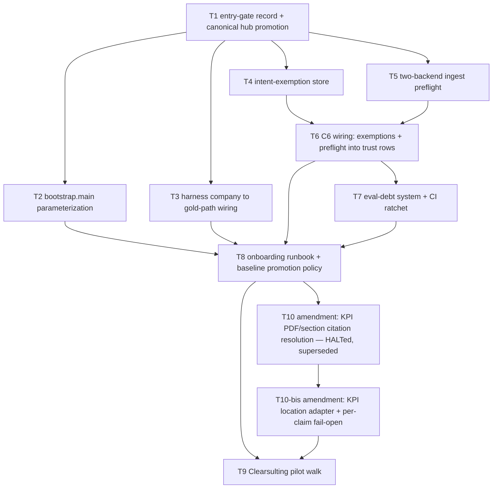

# Orchestrator plan — M4 / S3 Company Onboarding Runbook

**Plan version:** 1.3 · **Date:** 2026-08-14 · **Status:** T1–T10-bis landed; T9 pilot COMPLETE @ `6f6e9ac`; T10 HALTed (audit record only, superseded by T10-bis @ `231941b`); RB-DEFECT-T9-1 @ `0a5b2f2`, RB-DEFECT-T9-2 resolved by T10-bis, RB-DEFECT-T9-3 closed @ `6f6e9ac`
**Produced by:** orchestrator-planning v0.8 (charter-governed mode)
**Planning tree SHA:** `3126c2b08c7b9ae8c484f437948c271c27aee217` (clean working tree)
**Amendment tree SHA (v1.1 authoring):** working tree at `0a5b2f2` + uncommitted `.dev/t9_kpi_location_probe.py` (untracked, unrelated to this amendment)
**Amendment tree SHA (v1.2 authoring):** working tree at `0a5b2f2`, clean; T10 produced **no commit** (drafted then reverted on HALT per its changelog) — v1.2 authors against the same base T9's second HALT ran against.
**Amendment tree SHA (v1.3 completion):** HEAD at `6f6e9ac`
**Subtask count:** 10 (T1–T9 original + **T10 amendment unit**, of which **T10-bis is a continuation/re-attempt, not an 11th slot** — see Validation record item 19 for the counting rationale; declared §Budget 4–10 — carryability check: **at ceiling**, unchanged from v1.1)

**v1.1 amendment summary (RB-DEFECT-T9-2).** T9's re-run (post RB-DEFECT-T9-1) HALTed at runbook Step 3 on a **second, distinct** defect: `_positives_from_kpi_citations` (`eval/retrieval/gold/bootstrap.py:722-726`) fail-closes on **any** non-Excel-shaped KPI citation location, and 6 of Clearsulting's 20 KPI citations are PDF section locations (registry `A-09` overlay). Operator-chosen resolution: extend the KPI bootstrap branch to resolve PDF/section citations, reusing the page/section chunk-resolution pattern `_positives_from_citations` already uses for non-KPI agents (lines 678-706). This is a **new amendment subtask, T10**, with DAG edge `T10 --> T9`. Full detail at §7.

**v1.2 amendment summary (T10 HALT → T10-bis, Option A).** T10's executor investigated the v1.1 packet's literal instruction (reuse `_parse_page_from_location` / `_section_pattern_from_location` directly on raw Clearsulting KPI PDF `location` strings) and HALTed **before any commit**, per its own kill criterion: warehouse verification (read-only) showed **0/6** of the named PDF citations resolve to chunks that way — the packet's own worked approach was insufficient, not merely under-tested. T10's decision log records a further finding, obtained by continued investigation under the same HALT: a **KPI-specific location-normalization adapter** (strip the `Section: ` prefix and the `, Page N` suffix before calling the shared helpers) raises resolution to **4/6**; the remaining **2/6** (`bench_note` and `utilization_by_segment — leadership/sales-focused <50%`, both on the diligence-report PDF, both mapped to `kpi.retrieve_bench_and_capacity`) do not resolve under any location-string transform because their cited section title (`Other EBITDA considerations`) is not a `section_header` value anywhere in that document's chunk rows — the content lives under `Overview` and `Description of adjustment` instead. This is a corpus **overlay mismatch** (registry `A-09`), not a format defect, and is unresolvable by bootstrap code.

Per operator directive 2026-08-14 (Option A), this is **not** a re-plan: it is a same-slot continuation of the T10 amendment unit, named **T10-bis** to preserve T10's HALT record as an audit trail (T10 stays in the plan, marked HALTed/superseded; it is not deleted or silently re-authored). T10-bis's scope is T10's original scope **plus** the normalization adapter, **plus** a fail-closed narrowing discovered by the HALT: the two corpus-overlay claims must degrade the owning intent (or, if the intent has no other resolvable citation, the intent itself) to an honest `bootstrap_failed` outcome via the bootstrap's **existing** fallback/failure path, rather than raising an uncaught `PreconditionError` that kills the entire multi-intent `bootstrap()` call for every Clearsulting intent (T10's own root-cause note: `_try_positive_methods` does not catch `PreconditionError`, so a single unresolvable citation anywhere aborts the whole run — confirmed by reading `bootstrap.py:474-490`). T9's Step 4 then annotates the resulting gap as an `overlay_mismatch` exemption, which is precisely what the exemption store (T4) exists for. DAG: `T10 --> T10-bis --> T9` (chain, per the operator's stated preference to preserve the HALT audit trail as a distinct node rather than merge). Full detail at §7.

**v1.3 amendment summary (milestone landed).** Completeness sweep 2026-08-14 closed the milestone; all subtasks executed; plan header was stale post-T9 re-run.

---

## 0. Context map intake

| Field | Value |
|-------|-------|
| Path consumed | `.dev/plans/eval-consolidation-m4-onboarding-runbook/context-map.md` (promoted from `_pending/` at planning start; see Path discipline below) |
| Readiness verdict | **CONDITIONAL** |
| Generating skill version | pre-plan-exploration v0.3 (charter mode) |
| Commit SHA the map was generated against | `3126c2b08c7b9ae8c484f437948c271c27aee217` — **equal to planning HEAD; map is not stale** |
| Scope-area labels flagged in §Ambiguity flags | entry-gate verification; item 30–32 gold scope; Clearsulting pilot (Flag 1) · registry hub subtasks; item 35 CI-ratchet wiring; validator pytest updates (Flag 2) · item 35 runbook authoring; eval_debt layout; exemption store placement (Flag 3) · item 34; trust_statement ingest layer; runbook preflight step (Flag 4) · item 31 (Flag 5) · items 32–33, 36 pilot (Flag 6) · item 32, pilot item 36 (Flag 7) |

**Path discipline.** The map was consumed at `.dev/plans/_pending/eval-consolidation-m4-onboarding-runbook/`. Per the skill's path-discipline rule the directory was promoted to `.dev/plans/eval-consolidation-m4-onboarding-runbook/` as this plan's first action — a contract move with no content edits. Any later reference to a `_pending/` path in this plan or in any packet is a retired-string-sweep target.

**Binding-artifact resolvability.** `.dev/` is gitignored under owner Option C (charter §Status; M2 finding F-11; M3 standing condition). Every binding artifact this plan cites is therefore either (a) tracked — `eval/program/registry.yaml`, `eval/program/source_manifest.yaml`, `eval/retrieval/**`, `tests/**` — or (b) an on-disk `.dev/` artifact whose provenance is established by `git hash-object` on the working tree, which is the standing operator-approved substitute recorded at charter §Status and re-affirmed by the M3 audit. The spec pin was re-verified this session: `git hash-object .dev/specs/eval-consolidation-program/spec.md` = `9fd6772a7cc2f870c529735f19bf3ab5a3bef5e2`, matching charter §1 v0.2.27. This is the only exception class, it is program-wide, and it is not novel to M4.

**Prior HALT and its discharge.** Planning halted once at §0 on the charter's M4 entry gate — `.dev/plans/eval-consolidation-m4-onboarding-runbook/orchestrator-halt.md`, tree SHA `3126c2b0…`. Two of four registry preconditions were undischarged. Discharged by operator directive, 2026-08-13, in the planning session:

| Precondition | Disposition |
|--------------|-------------|
| `GAP-108-operator-escalation-not-recorded` (item 30) | **Escalation granted — go for multi-company gold.** M4 builds the go branch: Clearsulting receives a real gold corpus, a harness baseline, and per-company baseline promotion. The registry row is landed by **T1** with this directive as `evidence_refs`. |
| `UGA-1` | **Waived to execution time** by explicit operator directive, on spec §18's own wording of the trigger ("before any S3 onboarding work"). Precedent: charter §Status, entry-gate item 2, operator "proceed-anyway". Planning proceeds; the waiver is armed as a kill criterion on **T7**, the eval-debt subtask. |
| `REG-CANON-1` | Discharged by Amendment A4 (governance). The stale registry row and the still-dual-path code are closed by **T1**. |
| `CID-STABLE-1` | Discharged — named deferral with trigger and rationale present on the row. No M4 work. |

**Consumption mapping applied.** §File map direct rows → §4 Files to touch. §Interface inventory `suspect_modified` → §2 Types/interfaces seed. §Coupling surfaces 1–7 → §5.4 with `Tn` IDs substituted for scope-area labels. §Ambiguity flags → §5.2 with `Tn` IDs substituted. §Prior reasoning consulted: R12's mirror-not-move decision is **superseded** by T1 under charter Amendment A4's explicit grant, and T1's Outputs carry the supersession banner required by the decision-log supersession rule.

**CONDITIONAL handling.** Flags 1, 2, 3, 4 and 7 are resolved in this plan — by operator directive (1), by charter grant (2), and by §2 contract pins (3, 4, 7). Flags 5 and 6 remain open at execution start and are carried as kill criteria on the subtasks whose scope-area labels match: Flag 5 → T2; Flag 6 → T4 and T9.

---

## 1. Task statement

**Charter binding (charter-governed plan — mandatory declarations).**

- **(a) Active milestone:** **M4 / S3 — Company Onboarding Runbook.**
- **(b) Charter version:** `.dev/specs/eval-consolidation-program/eval_consolidation_program_milestone_charter.md`, **v0.1.3 (Amendment A4, 2026-08-13)**.
- **(c) Milestone non-goals, copied verbatim from the §6 Stub M4 invocation stub:**

  > `Non-goals: charter §3 M4 block; Clearsulting parser work (product-side).`

  The stub's reference resolves to charter §3 M4 **Explicit non-goals**, also verbatim:

  > `Program-wide §2/§18/§19 non-goals; the Clearsulting parser work itself (product-side; this milestone is eval-onboarding only); any new eval-surface design beyond what the runbook documents.`

The milestone's charter block is the scope ceiling. Scope this plan implies but the charter block does not grant is a charter escalation (Tier 2), never a §1 edit.

**What is being built and why.** M4 turns per-company eval from a bespoke exercise into a written, executable procedure, and then proves the procedure by walking it. Concretely: parameterize the gold bootstrap so it is not hardcoded to Elder Care (item 31); wire the harness so a company name resolves its own gold corpus instead of silently loading `elder_care.yaml` (item 32); build the intent-exemption model so a corpus-limited company produces honest `known_gap` rows rather than fabricated gold (item 33); build a two-backend ingest preflight behind the §8.4 contract so the sibling program's `doc_status` landing is a parameter swap rather than a redesign (item 34); author the onboarding runbook and the per-company baseline promotion policy, and wire the eval-debt system that keeps a partially-onboarded company's debt visible (item 35); and walk the whole thing end to end with Clearsulting as the thin-data pilot (item 36). The program's designed extension path is new-company onboarding (spec §11.2); S3 exists to make that path require zero design work, and G7 is exactly that claim, demonstrated rather than asserted.

Per the operator's item-30 escalation this milestone builds the **multi-company gold** branch: the pilot authors a real `clearsulting.yaml` gold corpus and promotes a real per-company baseline, rather than an exemption-only walk.

**Non-goals** (this plan's own, additional to and consistent with the charter block above):

- No Clearsulting parser, ingestion or corpus work. If the pilot finds the corpus wanting, that is an exemption annotation or an eval-debt row, never a product fix inside this plan.
- No new eval surface, metric, rung, or trust layer. M4 documents and parameterizes what M0–M3 built.
- No re-litigation of M0–M3 findings. The open items in `.dev/pending/eval-consolidation-open-items.md` (W-F-3, R-1/R-2, F-11, F-14, F-21, ESC-T12-1) stay where they are; M4 touches one of them only where a subtask's own diff makes it unavoidable, and says so.
- No spec or charter content changes. Defects route the escalation ladder.
- No CI automation of cluster paths (spec §2). The eval-debt CI ratchet is a hermetic pytest, not a warehouse job.
- No schema change to `registry.yaml`, `source_manifest.yaml`, or the §8.2 trust row. M4 adds rows and files, never fields (spec §11.1, rows-not-schema).

---

## 2. Shared contracts

Binding on every subtask unless a subtask's **Contract bindings** field names an exception.

### 2.1 Types / interfaces

Every user-visible field, config key and construction parameter below names its owning subtask, its typed surface, and the test that proves it. No prose-only keys; no `getattr`-papered defaults.

| Symbol / key | Owner | Typed surface | Proving test |
|---|---|---|---|
| `bootstrap.main(argv: list[str] \| None = None) -> int` | T2 | `argparse.ArgumentParser` built by new `bootstrap.build_parser()` | `eval/retrieval/tests/test_gold_bootstrap.py::test_main_parses_company_catalog_output` |
| `--company` (bootstrap CLI, default `DEFAULT_COMPANY_NAME`) | T2 | parser arg → `GoldLabelBootstrap(company_name=…)` | same |
| `--catalog` (bootstrap CLI, default `DEFAULT_CATALOG` = `uc13_ale`) | T2 | parser arg → `GoldLabelBootstrap(catalog=…)` | same |
| `--output` (bootstrap CLI, default = `default_gold_path(canonical_company_slug(company))`) | T2 | parser arg → `write_gold_labels(path=…)` | `…::test_main_output_defaults_to_company_gold_path` |
| `harness.default_gold_path(company_slug: str) -> Path` | T3 | existing function; **the default argument is removed** — callers must pass a slug | `eval/retrieval/tests/test_harness_fixture.py::test_default_gold_path_requires_slug` |
| `EvalHarness.__init__(..., company_slug: str \| None = None)` | T3 | keyword-only param; `gold_path` resolution = explicit `gold_path` → else `default_gold_path(company_slug)` → else `PreconditionError` | `…::test_harness_resolves_gold_path_from_company_slug` |
| `harness_cli run --gold-path` (optional) | T3 | when omitted, resolved from `--company-name` via `canonical_company_slug` | `eval/retrieval/tests/test_harness_cli.py::test_run_derives_gold_path_from_company_name` |
| `IntentExemption` dataclass — `company, intent_id, surface, coverage, reason, corpus_evidence, approved_by` | T4 | frozen dataclass in `eval/retrieval/exemptions.py`, §8.3 field set exactly | `eval/retrieval/tests/test_exemptions.py::test_roundtrip_write_then_load` |
| `load_exemptions(path: Path) -> list[IntentExemption]` | T4 | module function | same |
| `write_exemption(path: Path, exemption: IntentExemption) -> None` | T4 | module function, fail-closed | `…::test_write_rejects_unfoldable_company`, `…::test_write_rejects_coverage_surface_mismatch` |
| Exemption store file `eval/program/eval_exemptions.yaml`, top-level `schema_version: 1` + `exemptions: []` | T4 | YAML committed artifact | `…::test_committed_store_validates` |
| `run_ingest_preflight(*, backend, company_slug, catalog, company_display, execute_sql=None, spark=None) -> IngestProbeResult` | T5 | module function in `eval/retrieval/ingest_preflight.py` | `eval/retrieval/tests/test_ingest_preflight.py::test_both_backends_satisfy_return_contract` |
| `backend` ∈ `{"sql_chunk_count", "doc_status"}` | T5 | `Literal` on the parameter, membership-checked fail-closed | `…::test_unknown_backend_rejected` |
| `IngestProbeResult` (unchanged §8.4 shape) | T5 | existing dataclass in `trust_statement.py`, **re-exported** from `ingest_preflight` — not redefined | `…::test_result_type_is_the_trust_statement_dataclass` |
| Eval-debt ledger `eval/program/eval_debt/eval_debt.yaml`, `schema_version: 1` + `debts: []`; row = `{id, company, surface, layer, kind, opened_at, evidence_refs, closes_when}` | T7 | dataclass `EvalDebtRow` + loader in `eval/retrieval/eval_debt.py` | `eval/retrieval/tests/test_eval_debt.py::test_ledger_roundtrip` |
| Runbook `eval/program/onboarding_runbook.md` | T8 | markdown, tracked | `eval/retrieval/tests/test_onboarding_runbook.py::test_runbook_commands_match_cli_surface` |
| **HALTed (v1.1, T10) — superseded, not landed:** `GoldLabelBootstrap._positives_from_kpi_citations` PDF/section citation resolution via a naive reuse of `_parse_page_from_location` / `_section_pattern_from_location` on raw locations. Kill criterion fired at 0/6 warehouse resolution before any commit; no code landed. Row kept for audit trail; superseded by the T10-bis row below. | T10 | — (never landed) | — (never landed; no test authored per T10's changelog) |
| **Landed (v1.2, T10-bis):** `GoldLabelBootstrap._positives_from_kpi_citations` PDF/section citation resolution — (a) a KPI-only location-normalization adapter (strips `Section: ` prefix and `, Page N` suffix before the section-pattern call; page parsing is unaffected since `_parse_page_from_location` already searches rather than anchors) makes the shared page/section chunk query resolve 4 of the 6 Clearsulting PDF citations; (b) for the remaining case — a PDF-branch citation whose adapted section pattern still resolves to zero chunks — the branch **no longer raises** `PreconditionError` for that citation; it skips the citation, records it in `GoldLabel.notes` as unresolved, and lets the bootstrap's **existing** pass-1/pass-2 fallback chain (`_try_positive_methods` → `POSITIVE_FALLBACK_CHAIN`) degrade the owning intent to `bootstrap_failed` if no other citation supplies positives — this is not a new failure path, it is the same path an intent with zero citation matches already takes today. Excel-branch zero-chunk handling is **unchanged** (still raises `PreconditionError`, per the original T10 packet). | T10-bis | `eval/retrieval/gold/bootstrap.py::GoldLabelBootstrap._positives_from_kpi_citations` (plus a new `_normalize_kpi_pdf_location` or equivalent adapter helper in the same module) | `eval/retrieval/tests/test_gold_excel_branch.py::test_kpi_pdf_branch_resolves_section_location` (or a new `test_gold_kpi_pdf_branch.py` under `eval/retrieval/tests/`) plus `…::test_kpi_pdf_branch_zero_chunks_skips_without_raising`, `…::test_kpi_pdf_branch_intent_degrades_to_bootstrap_failed_when_no_citation_resolves`, and a regression assertion that `test_kpi_excel_branch_resolves_both_location_forms` and `test_non_kpi_agent_citation_path_unchanged` stay green |

**Deferred, with blocking follow-up IDs.** `doc_status` backend richness is bounded by what the sibling program has landed: T5 ships the backend against the columns `databricks/jobs/scripts/status_store.py` exposes today and returns `status: denominator_undefined` where the sibling has no expected-count column. Fuller semantics are **deferred to a post-M4 registry row `PREFLIGHT-DOCSTATUS-1`**, which T5's Outputs must create. `cell` / `char_offset` locator kinds stay reserved (spec §16) — not M4's.

### 2.2 Error envelope

- Every new exception subclasses `eval.retrieval.errors.EvalError`. New types: `ExemptionValidationError` (T4), `IngestPreflightError` (T5, raised **only** for programmer error such as an unknown backend — never for a probe outcome), `EvalDebtError` (T7).
- **The §8.4 boundary never raises.** `run_ingest_preflight` returns an `IngestProbeResult` in all cases; a probe failure is `status: probe_failed`, an unobtainable **or zero** denominator is `status: denominator_undefined`, and no ratio is ever computed against a zero denominator (spec §8.4, S-38). Zero in-generator retries (S-36).
- **Write-path fold rejection raises.** Every program-owned write of a company key calls `eval.retrieval.companies.canonical_company_slug` and lets `UnnormalizableCompanySlugError` propagate. Re-implementing the fold is a contract violation (spec §8.2 golden-vector contract, S-42); the write path *calls* the one exported callable.
- Trust-statement generation keeps its existing whole-artifact halt via `TrustStatementGenerationError` (DG-14). T6 adds no new halt class and no new row-level degrade path.
- CLI entry points return `int` exit codes: `0` success, `1` handled failure with a message on stderr. No CLI raises a traceback for an expected condition.

### 2.3 Naming

| Artifact | Path — frozen |
|---|---|
| Exemption store | `eval/program/eval_exemptions.yaml` |
| Exemption module | `eval/retrieval/exemptions.py` |
| Ingest preflight module | `eval/retrieval/ingest_preflight.py` |
| Eval-debt ledger | `eval/program/eval_debt/eval_debt.yaml` |
| Eval-debt module | `eval/retrieval/eval_debt.py` |
| Onboarding runbook | `eval/program/onboarding_runbook.md` |
| Per-company gold corpus | `eval/retrieval/gold_labels/<canonical_slug>.yaml` — **resolved only via `harness.default_gold_path`**, never string-formatted at a call site |
| Decision logs | `.dev/plans/eval-consolidation-m4-onboarding-runbook/decision-logs/T<n>.md` |
| Changelogs | `.dev/plans/eval-consolidation-m4-onboarding-runbook/changelogs/T<n>.md` |

**Path decision (context-map Flag 3), recorded here as the single authority.** The charter §3 M4 cell names `contracts/evals/onboarding_runbook.md` and `contracts/evals/eval_debt/`. Amendment A1 supersedes the `contracts/evals/*` prefix program-wide and says the residual M4 mentions "stand corrected-by-reference to the spec's paths" — but the spec names **no** path for either artifact, so A1's correction has no referent here and the orchestrator must pin one. Per operator directive 2026-08-13 both land under **`eval/program/`**, beside the now-canonical `registry.yaml`. Rationale: it is tracked (unlike `.dev/eval-program/` under Option C), it is where Amendment A4 just moved the program hub, and it keeps every program-state artifact in one tracked directory. `contracts/evals/` is a **retired string** for this milestone: no packet, test, runbook line or docstring may name it.

**Catalog.** `uc13_ale` everywhere in this milestone. Eval defaults are `uc13_ale`; `databricks/jobs/**` scripts default to `uc13`. Every new CLI takes `--catalog` with default `uc13_ale`, and every runbook step states the catalog explicitly.

### 2.4 Logging

`eval/retrieval/**` uses no logging framework: CLIs print a human-readable summary line to stdout and return an `int`. New CLIs match that convention exactly — no `logging` import, no structured sink, no new dependency. The one required field discipline is that every CLI summary line names the **company slug** and the **catalog** it acted on, so a runbook walk transcript is self-describing about which company and catalog each step touched.

### 2.5 Tests

- Framework `pytest`; configuration in the repo-root `pytest.ini`, whose `testpaths` are `tests eval/retrieval/tests eval/content`. **New test files must land inside one of those three roots or they will not run** — this is a live trap (M3 rev 5 coverage gap 4).
- Naming `test_<module>.py`, functions `test_<behavior>`.
- **Hermetic by default.** No test reaches the warehouse or a cluster. Spark and SQL executors are injected and mocked, following the existing patterns in `test_gold_bootstrap.py` (mock Spark) and `test_trust_statement.py` (callable `execute_sql`).
- **The one exception is T9**, the pilot, which is live-warehouse work by definition. Its evidence is a recorded transcript plus committed artifacts, not a pytest.
- Every subtask that lands code lands its tests in the same diff. A subtask whose tests are deferred is HALTed, not merged.
- The suite must be green at each subtask's close: `pytest -q` from the repo root.

### 2.6 CLI surface — frozen

These strings are frozen against their implementing subtask's output and are quoted verbatim by T8's runbook and T9's pilot. Any later drift is a contract violation, not documentation polish.

```
python -m eval.retrieval.gold.bootstrap --company "<Display Name>" --catalog uc13_ale [--output <path>]
python -m eval.retrieval.harness_cli run --company-name "<Display Name>" --catalog uc13_ale --store-backend delta [--gold-path <path>]
python -m eval.retrieval.exemptions add --company "<Display Name>" --intent-id <intent> --surface <fta_numeric|legal_register|exec_summary|null> --coverage <eliminates|narrows|null> --reason <corpus_absent|corpus_thin|overlay_mismatch> --evidence <k=v> --approved-by operator
python -m eval.retrieval.exemptions list [--company "<Display Name>"]
python -m eval.retrieval.ingest_preflight --company "<Display Name>" --catalog uc13_ale --backend <sql_chunk_count|doc_status>
python -m eval.retrieval.eval_debt open --company "<Display Name>" --surface <surface> --kind <kind> --closes-when "<condition>"
python -m eval.retrieval.eval_debt list [--company "<Display Name>"]
python -m eval.retrieval.trust_statement generate --catalog uc13_ale --registry eval/program/registry.yaml
```

**Freeze order.** T8's packet is emitted only after T2, T3, T4, T5 and T7 have landed their parsers. If an implementing subtask must change a flag, it reports the change and the orchestrator re-emits T8's and T9's packets before either starts.

### 2.7 Wire / error-envelope alignment

M4 adds no HTTP surface, no headers, no auth scheme and no status codes. The only wire-shaped contract is the §8.4 return record, whose binding values are the three `status` members and the two `backend` members enumerated in §2.1 and §2.2. The spec's §8.4 YAML block is **illustrative** for its numbers (`completeness: 0.52`, `denominator: 412`) and **binding** for its field names and its `status` / `backend` vocabularies.

### 2.8 Registry hub discipline

`eval/program/registry.yaml` is the sole canonical hub from T1 onward (charter §4, Amendment A4). After T1, `.dev/eval-program/registry.yaml` is a **retired string**: no module, test, docstring or runbook line may reference it, and `sync_registry_mirror()` no longer exists. Registry writes in this milestone are row edits and row additions only — never a schema change.

---

## 3. Dependency DAG



**Parallel groups.** `{T2, T3, T4, T5}` may run in parallel once T1 lands. Everything after T6 is strictly sequential.

**v1.1 amendment edge.** `T10` is inserted between `T8` (already landed) and `T9` (re-run). `T8 --> T10` is a formality — T10 does not consume the runbook's content, only the fact that T8 has landed and frozen the CLI surface T10 must not alter.

**v1.2 amendment edge (supersedes the v1.1 `T10 --> T9` edge).** T10 HALTed without a commit, so `T10 --> T9` never became live. `T10 --> T10-bis` records that T10-bis is the same amendment unit's continuation (its packet inherits T10's HALT evidence and decision log as required reading, per the operator's preference for a chained node over a merged rewrite — preserves the audit trail rather than erasing the failed attempt). `T10-bis --> T9` is now the load-bearing edge: T9's re-run consumes T10-bis's landed bootstrap fix and does not start until T10-bis's tests are green. T10 itself has no outbound edge to T9 any longer — it is a terminal, non-landed HALT record.

**Soft dependency.** `T2 --> T8` and `T3 --> T8` are freeze edges rather than build edges: T8 needs T2's and T3's *frozen CLI strings*, not their internals. They could be parallelized if the CLI surface in §2.6 were treated as authoritative ahead of implementation — but §2.6 is a plan-level freeze that an implementing subtask may still report against, so the edges are kept hard. Same reasoning for `T7 --> T8`.

**Serialization note.** `T4 --> T6` and `T5 --> T6` exist because T6 is the only writer of `eval/retrieval/trust_statement.py` in this plan. T4 and T5 must not touch that file; if either finds it must, that is a coupling violation to report, not to resolve.

---

## 4. Subtask specs

### T1 — Entry-gate record and canonical hub promotion

| Field | Content |
|---|---|
| **ID** | T1 |
| **Scope** | Land the item-30 operator escalation as a registry row, and complete Amendment A4's REG-CANON-1 promotion in code and tests by retiring the `.dev/eval-program/registry.yaml` byte-parity mirror. |
| **Files to touch** | `eval/program/registry.yaml`; `eval/retrieval/tests/test_eval_program_registry.py` |
| **Contract bindings** | All of §2. §2.8 is this subtask's primary output. §2.5 applies; the registry validator suite must stay green. |
| **Inputs** | Operator directive 2026-08-13 (this plan's §0 table) — the escalation decision and its rationale |
| **Outputs** | (a) `GAP-108-operator-escalation-not-recorded` row: `status: closed`, `evidence_refs` non-empty (§7.1's status-conditional rule — a `closed` row with empty `evidence_refs` fails item 2a), rationale stating the go branch for multi-company gold. (b) `REG-CANON-1` row: disposition moved off `deferred` to reflect A4's landing, with evidence. (c) `sync_registry_mirror()`, `CANONICAL_REGISTRY_PATH`, `MIRROR_REGISTRY_PATH` and the byte-parity test removed from `test_eval_program_registry.py`; `REGISTRY_PATH` remains the single path constant. (d) Decision log at `.dev/plans/eval-consolidation-m4-onboarding-runbook/decision-logs/T1.md`. (e) **Supersession banner** at the top of `.dev/plans/eval-consolidation-m3-s2-build/decision-logs/R12.md` pointing to T1's log as the new authority on registry hub ownership — R12 chose mirror-not-move and still scans as current. (f) Changelog. |
| **Kill criteria** | Halt and report if: removing the parity guard makes any other test in `pytest -q` fail (indicates an undiscovered consumer of the `.dev/` path); **or** any tracked file outside the two Files-to-touch still references `.dev/eval-program/registry.yaml` after the edit (run `rg -n "\.dev/eval-program/registry\.yaml"` — the residue is a retired-string sweep the orchestrator must scope, not this executor); **or** the item-2a validator suite reports a matrix violation on either edited row. |
| **Log tier** | **architectural** — changes hub ownership and supersedes a landed decision log. Decision log required at the §2.3 path: alternatives, choice rationale, assumptions, deferred items. |
| **Risks & mitigations** | *Risk:* the `.dev/` canonical file still exists on disk and an operator later edits it, believing it is authoritative. *Mitigation:* T1's decision log states the retirement explicitly and T8's runbook names `eval/program/registry.yaml` as the only registry path an onboarding walk touches. *Risk:* the mirror test currently `pytest.skip`s when the `.dev/` file is absent (bare worktree), so its removal may look like coverage loss. *Mitigation:* it is coverage of a retired invariant; say so in the changelog rather than replacing it. |

### T2 — `bootstrap.main()` parameterization (spec item 31)

| Field | Content |
|---|---|
| **ID** | T2 |
| **Scope** | Give the gold bootstrap a real CLI — `--company`, `--catalog`, `--output` — replacing `main()`'s hardcoded Elder Care paths, and cover the argv→path wiring with the test it has never had. |
| **Files to touch** | `eval/retrieval/gold/bootstrap.py` (`main`, new `build_parser`); `eval/retrieval/tests/test_gold_bootstrap.py` |
| **Contract bindings** | All of §2. §2.1 rows 1–4, §2.6 line 1, §2.3's gold-path rule. |
| **Inputs** | T1 (landed hub state; no artifact consumed) |
| **Outputs** | `build_parser() -> ArgumentParser` and `main(argv=None) -> int` in `bootstrap.py`; tests named in §2.1; changelog. No decision log unless the executor flags one. |
| **Kill criteria** | Halt and report if: `--output`'s default cannot be derived by importing `harness.default_gold_path` without creating an import cycle (`bootstrap` ← `harness` direction must be checked — **do not** re-derive the filename by string-formatting as a workaround); **or** `GoldLabelBootstrap.__init__` turns out not to accept `company_name`/`catalog` as the context map's interface inventory records; **or** the existing `main()` has an undocumented caller outside `__main__` (`rg -n "bootstrap.*main\("`). **Flag-5 criterion:** halt if context-map flag 5 is unresolved at execution start — specifically, if no falsifier can be written for argv→path wiring without a live Spark session, report rather than shipping the CLI untested. |
| **Log tier** | **standard** — the tier is set by downstream contract surface, not by file count: this subtask freezes three CLI flags that T8's runbook and T9's pilot both quote. |
| **Risks & mitigations** | *Risk:* `main()` currently imports `pyspark` at call time and raises without an active session, so a hermetic test must exercise the parser without reaching that import. *Mitigation:* split parsing from execution — `build_parser`/argument resolution is testable pure code; the Spark acquisition stays inside `main`'s body after resolution. |

### T3 — Harness company → gold-path wiring (spec item 32)

| Field | Content |
|---|---|
| **ID** | T3 |
| **Scope** | Make company identity determine the gold corpus: `EvalHarness` resolves `gold_path` from a company slug, and `harness_cli run` derives `--gold-path` from `--company-name` when the flag is omitted. |
| **Files to touch** | `eval/retrieval/harness.py` (`default_gold_path`, `EvalHarness.__init__`); `eval/retrieval/harness_cli.py` (`build_parser`, `main`); `eval/retrieval/tests/test_harness_fixture.py`; new `eval/retrieval/tests/test_harness_cli.py` |
| **Contract bindings** | All of §2. §2.1 rows 5–7, §2.6 line 2. |
| **Inputs** | T1 (landed hub state; no artifact consumed) |
| **Outputs** | `default_gold_path` with its `"elder_care"` default argument **removed**; `EvalHarness(company_slug=…)`; `harness_cli` derivation via `canonical_company_slug`; the two tests named in §2.1; changelog. |
| **Kill criteria** | Halt and report if: removing `default_gold_path`'s default argument breaks a caller outside the Files to touch (`rg -n "default_gold_path\("` before editing); **or** `EvalHarness` has a caller that passes neither `gold_path` nor a company and would newly raise `PreconditionError` — the silent-Elder-Care fallback is the defect being removed, so a real caller relying on it is a finding to report, not to preserve; **or** `harness_cli run` turns out to accept a company display name that is already a slug, making the fold a no-op that masks a wrong resolution. |
| **Log tier** | **standard** — contract-anchor override applies (the resolution rule is quoted by the runbook and relied on by the pilot). |
| **Risks & mitigations** | *Risk:* this is the confirmed Surface-3 defect — a Clearsulting harness run today loads `elder_care.yaml` while filtering on `company_name`, yielding an empty gold map and a meaningless baseline. Fixing it may turn previously "passing" runs into loud failures. *Mitigation:* that is the intended outcome; the changelog must state that any pre-M4 non-Elder-Care harness run is invalidated by construction. |

### T4 — Intent-exemption model and annotation store (spec item 33)

| Field | Content |
|---|---|
| **ID** | T4 |
| **Scope** | Build the §8.3 exemption annotation store — dataclass, committed YAML, fail-closed write path calling the exported fold, and a CLI — so a corpus-limited company produces annotations instead of fabricated gold. |
| **Files to touch** | new `eval/retrieval/exemptions.py`; new `eval/program/eval_exemptions.yaml`; new `eval/retrieval/tests/test_exemptions.py` |
| **Contract bindings** | All of §2. §2.1 rows 8–11, §2.2's write-path rule, §2.6 lines 3–4. **Exception:** T4 must not touch `eval/retrieval/trust_statement.py` — C6 consumption is T6's. |
| **Inputs** | T1 (landed hub state; no artifact consumed) |
| **Outputs** | `IntentExemption`, `load_exemptions`, `write_exemption`, `ExemptionValidationError`, and an `add`/`list` CLI; the committed store seeded with `schema_version: 1` and an empty `exemptions:` list; tests covering roundtrip, unfoldable-company rejection, and the `coverage`/`surface` mutual-requiredness rule; changelog; decision log. |
| **Kill criteria** | Halt and report if: the three §8.3 cases cannot be made disjoint by construction in the validator — `surface` + `eliminates`, `surface` + `narrows`, `surface: null` ⇒ `coverage: null` (spec §8.3, HALT-16); **or** the write path cannot call `companies.canonical_company_slug` without an import cycle (re-implementing the fold is forbidden — spec §8.2 S-42, and item 33's own text says the check *calls* item 20's export); **or** the `reason` vocabulary needed by the Clearsulting case is not covered by `corpus_absent | corpus_thin | overlay_mismatch` (the vocabulary is scaffolded and grows from pilot evidence — but growing it is a spec §16 touch, which routes tier 3, not a local edit). **Flag-6 criterion:** halt if context-map flag 6 is unresolved at execution start — if it is not determinable which Clearsulting corpus gaps are exemptions versus `bootstrap_failed` intents versus operator-authored gold, land the store and its tests with an **empty** `exemptions:` list and leave population to T9, reporting the deferral. |
| **Log tier** | **architectural** — new committed canonical artifact with a schema and a fail-closed write contract. Decision log required at the §2.3 path. |
| **Risks & mitigations** | *Risk:* the store is scaffolded and "expected to evolve from pilot usage" (spec §8.3), which invites over-building. *Mitigation:* implement exactly the §8.3 field set and the three disjoint cases; no extra fields, no inferred intent→surface mapping (the correspondence is recorded at write time by the annotator, never derived from intent prefixes — S-29). |

### T5 — Two-backend ingest preflight (spec item 34)

| Field | Content |
|---|---|
| **ID** | T5 |
| **Scope** | Extract the §8.4 preflight into a shared module exposing both backends behind one return contract, so `doc_status` becomes a parameter swap rather than a redesign. |
| **Files to touch** | new `eval/retrieval/ingest_preflight.py`; new `eval/retrieval/tests/test_ingest_preflight.py`; `eval/program/registry.yaml` (append the `PREFLIGHT-DOCSTATUS-1` follow-up row) |
| **Contract bindings** | All of §2. §2.1 rows 12–14, §2.2's never-raise rule, §2.6 line 5, §2.7. **Exception:** T5 must not modify `trust_statement.py`'s behaviour; it may only re-export `IngestProbeResult` from it. Rewiring `trust_statement.run_ingest_probe` to delegate is **T6's** edit. |
| **Inputs** | T1 (landed hub state; no artifact consumed) |
| **Outputs** | `run_ingest_preflight` with both backends; `IngestPreflightError`; a CLI; tests proving both backends return the identical record shape and that all three `status` values are reachable; the `PREFLIGHT-DOCSTATUS-1` registry row; changelog; decision log. |
| **Kill criteria** | Halt and report if: the `doc_status` backend cannot produce an expected-document **denominator** from what `databricks/jobs/scripts/status_store.py` exposes — in that case return `status: denominator_undefined` and record the limitation on `PREFLIGHT-DOCSTATUS-1` rather than fabricating a count (spec §8.4 forbids a fabricated denominator and forbids a ratio against zero); **or** the two backends cannot satisfy the identical field set without widening `IngestProbeResult` (a §8.4 shape change is a spec touch, tier 3); **or** any backend path can raise across the module boundary under a mocked failure. **Flag-4 criterion:** flag 4 is resolved by this plan — the answer is a new shared module, not an extension of `run_ingest_probe` and not a wrapper over `measure_attestation`. Halt if that resolution proves unbuildable rather than silently choosing another shape. |
| **Log tier** | **architectural** — new module boundary between two backends and their consumer; decision log required at the §2.3 path, and it must state why the shared module beat the two rejected shapes. |
| **Risks & mitigations** | *Risk:* `measure_attestation.run_attestation_query(spark, catalog, schema, company_name)` already queries `doc_status` on a Spark session, while `trust_statement.run_ingest_probe` takes a callable `execute_sql`. Two injection styles must live behind one signature. *Mitigation:* the signature in §2.1 accepts both `execute_sql` and `spark` as optional keywords and validates that exactly the one the chosen backend needs is supplied — a fail-closed programmer-error check, which is the only condition `IngestPreflightError` exists for. |

### T6 — C6 wiring: exemptions and preflight into trust-statement rows

| Field | Content |
|---|---|
| **ID** | T6 |
| **Scope** | Make the trust statement read the two new stores: union the exemption store's companies into the §12.2 derived domain, generate `known_gap` rows from `coverage: eliminates` annotations, relabel `narrows` partials, and route the ingest row through the shared preflight. |
| **Files to touch** | `eval/retrieval/trust_statement.py`; `eval/retrieval/tests/test_trust_statement.py` |
| **Contract bindings** | All of §2. §2.2's halt-class rule (no new halt classes), §2.7. |
| **Inputs** | **T4** — `eval/retrieval/exemptions.py` API and the committed store shape. **T5** — `run_ingest_preflight`'s signature and `IngestProbeResult` re-export. Both to be supplied at execution time as landed code. |
| **Outputs** | Domain union with exemption-store companies (spec §12.2, gated on item 33 landing); `known_gap` row generation with the exemption's `reason` carried verbatim and multi-annotation resolution by §16 severity precedence (`corpus_absent` > `corpus_thin` > `overlay_mismatch`) over that surface's `eliminates` annotations only; `exempted_corpus_failures` relabel keyed on **(company, surface)**, never on company alone; `run_ingest_probe` delegating to `run_ingest_preflight`; tests for each branch; changelog; decision log. |
| **Kill criteria** | Halt and report if: the `known_gap` branch cannot be made unreachable-until-item-33 in a way that leaves pre-M4 regeneration output byte-identical for Elder Care (an empty exemption set must yield exactly today's rows — spec §12.2 DG-10); **or** the `exempted_corpus_failures` relabel would key on company rather than (company, surface) — that is the HALT-16 defect and it silently reports genuine `contradicted` verdicts as ratified gaps; **or** wiring the preflight changes the `method` field's provenance-conditional requiredness (HALT-21), including the `__unnormalizable__` sentinel's probe-skip path, which must keep `method: null` by the general rule and not by a new exception. |
| **Log tier** | **architectural** — extends the C6 hub (charter §4 row 5) and activates a derivation branch that has been unreachable since S0. Decision log required at the §2.3 path. |
| **Risks & mitigations** | *Risk:* DG-18's named limitation becomes reachable here — a company with only retrieval-scoped (`surface: null`) exemptions and no baseline gets a full seven-row all-`not_attested` set. *Mitigation:* that is the accepted direction of the HALT-12 trade; do not add the union-narrowing predicate (its remediation trigger has not fired). State it in the decision log and let T7 open an eval-debt row if the pilot hits it. |

### T7 — Eval-debt system and CI ratchet (spec item 35, system half)

| Field | Content |
|---|---|
| **ID** | T7 |
| **Scope** | Build the eval-debt ledger and its ratchet: a committed record of what a partially-onboarded company still owes, with a hermetic test that prevents debt from growing silently. |
| **Files to touch** | new `eval/retrieval/eval_debt.py`; new `eval/program/eval_debt/eval_debt.yaml`; new `eval/retrieval/tests/test_eval_debt.py` |
| **Contract bindings** | All of §2. §2.1 row 15, §2.3's path decision, §2.6 lines 6–7. §2.5's hermetic rule is load-bearing: the ratchet is a pytest, **not** a CI cluster job (spec §2 keeps cluster paths out of CI; §18 leaves the CI question deferred). |
| **Inputs** | **T6** — the trust-row derivation, which is what a debt row is opened against (a `not_attested` / `known_gap` / `partial` row is the evidence a debt cites). To be supplied at execution time as landed code. |
| **Outputs** | `EvalDebtRow`, loader, `open`/`list` CLI; the committed ledger; a **ratchet test** asserting that every open debt row cites a resolvable evidence ref and that the ledger's open-row count does not exceed a committed high-water mark recorded in the ledger header; changelog; decision log. |
| **Kill criteria** | Halt and report if: the ratchet cannot be made hermetic — if asserting "this debt is still real" requires a warehouse read, the ratchet must degrade to a shape-and-reference check and the limitation must be stated, never silently skipped (the HALT-11 vacuous-pass shape); **or** the ledger would duplicate state the registry already owns (a debt that is really a registry item belongs in `registry.yaml` as a row — spec §11.1, rows not schema, and §19 rejects a second program-state store); **or** the high-water-mark mechanism would let a debt be closed by deletion rather than by a recorded closure. **UGA-1 criterion (operator waiver, §0):** halt if `UGA-1` is still undischarged at this subtask's execution start **and** the operator has not re-affirmed the waiver — the grounding audit's findings are eval-debt content, and opening the ledger before they exist risks a ledger that reads complete while a known audit is outstanding. |
| **Log tier** | **architectural** — new committed artifact class plus a standing CI guard. Decision log required at the §2.3 path, and it must state the registry-vs-ledger boundary. |
| **Risks & mitigations** | *Risk:* "eval-debt system" is the least-specified item in the M4 checklist — spec §17 item 35 names it in one clause and §8.3/§8.5 give it no schema. Scope creep is the live danger. *Mitigation:* the ledger is a record, not a workflow: no state machine, no transitions, no severity model. Debt opens with evidence and closes with evidence. Anything richer is a new eval-surface design, which §1's non-goals forbid. |

### T8 — Onboarding runbook and per-company baseline promotion policy (spec item 35, document half)

| Field | Content |
|---|---|
| **ID** | T8 |
| **Scope** | Author the runbook that makes onboarding executable without design work, including the per-company baseline promotion policy, quoting only frozen CLI strings. |
| **Files to touch** | new `eval/program/onboarding_runbook.md`; new `eval/retrieval/tests/test_onboarding_runbook.py` |
| **Contract bindings** | All of §2. §2.6 is this subtask's primary input and it is frozen before this packet is emitted. §2.3's path decision. |
| **Inputs** | **T2, T3, T4, T5, T7** — the frozen CLI parsers. **T6** — the trust-row derivation the runbook's final step regenerates. All to be supplied at execution time as landed code; the packet quotes §2.6, and the executor must verify each quoted string against the landed parser before writing it into the runbook. |
| **Outputs** | The runbook, structured as the spec §11 worked example ordered walk — add company → ingest preflight → parameterized bootstrap → exemption annotations from the corpus profile → harness baseline → per-company baseline promotion → eval-debt rows → trust-statement regeneration — with the catalog stated at every step and each step's command copied from the landed parser. A **per-company baseline promotion policy** section stating what promotion requires for a company that is not Elder Care, referencing `promotion_gate.evaluate_promotion`'s actual parameters. A **"this is a runbook defect" clause**: anything requiring design work during a walk routes back as a registry item (spec §11.2). A test asserting every command block in the runbook parses against the corresponding `build_parser()`. Changelog; decision log. |
| **Kill criteria** | Halt and report if: any command the runbook needs does not exist in a landed parser (do not write aspirational commands — report the gap); **or** a step cannot be written without a decision the runbook itself would be making, which is by definition a design decision and therefore the G7 failure this milestone exists to prevent; **or** `evaluate_promotion` requires an argument (`e2e_agent_id`, `e2e_snapshot_table`, `candidate_score`, `candidate_total`) that a newly-onboarded company cannot supply — in that case the policy section must say so explicitly and open an eval-debt row rather than inventing a value. |
| **Log tier** | **architectural** — this document is the milestone's contract surface and the object G7 tests. Decision log required at the §2.3 path. |
| **Risks & mitigations** | *Risk:* the runbook is written against intent rather than against landed behaviour, and the pilot then discovers the drift. *Mitigation:* the parse test in Outputs is the mechanical guard; it makes a stale command a red test rather than a pilot surprise. *Risk:* `eval/retrieval/README.md` already documents a partial Clearsulting M-PHV1 pattern and will now contradict the runbook. *Mitigation:* the runbook is authoritative; add a pointer line to the README **only** if T8's diff makes the contradiction load-bearing, and report it otherwise — README edits are not in this subtask's Files to touch. |

### T9 — Clearsulting pilot walk (spec item 36)

| Field | Content |
|---|---|
| **ID** | T9 |
| **Scope** | Execute the runbook end to end against Clearsulting with zero design work, producing the gold corpus, exemption annotations, baseline and trust rows the walk calls for, and recording the transcript that G7 reads. |
| **Files to touch** | new `eval/retrieval/gold_labels/clearsulting.yaml`; `eval/program/eval_exemptions.yaml`; `eval/program/eval_debt/eval_debt.yaml`; `eval/program/registry.yaml` (item 36 row + any runbook-defect rows); pilot record under `.dev/plans/eval-consolidation-m4-onboarding-runbook/signoffs/T9-clearsulting-pilot.md` |
| **Contract bindings** | All of §2, **except §2.5's hermetic rule** — this is live-warehouse work by definition, and its evidence is a recorded transcript plus committed artifacts rather than a pytest. The `uc13_ale` catalog pin in §2.3 is strict. |
| **Inputs** | **T8** — the runbook, which is the only permitted path (spec §15.4: no adhoc per-company eval). To be supplied at execution time. |
| **Outputs** | A completed walk with every command's invocation and output recorded; the Clearsulting gold corpus committed; exemption annotations for the corpus gaps the profile shows (registry records Clearsulting at 0 LEGAL docs and KPI overlay A-09); a promoted per-company baseline; regenerated trust-statement rows including Clearsulting; **a runbook-defect list** — every point where the walk required a judgement the runbook did not supply, each filed as a registry row per spec §11.2; changelog; decision log. |
| **Kill criteria** | Halt and report if: the bootstrap yields zero resolvable positives for every Clearsulting intent — that is a corpus condition, and the correct output is exemption annotations plus a descope record with rationale, **never** fabricated or approximated gold (spec §6 S3 failure handling: "a pilot failure descopes S3 with rationale rather than forcing misleading YAML"); **or** any step requires editing code to proceed — that is a runbook defect and the walk stops there with the defect recorded, because a walk completed by patching code does not demonstrate G7; **or** the Clearsulting display name does not fold to the slug the gold filename and warehouse rows assume (`canonical_company_slug("Clearsulting")` must equal `clearsulting`). **Flag-6 criterion:** halt if context-map flag 6 is unresolved at execution start — if the operator has not determined which corpus gaps are exemptions versus `bootstrap_failed` intents versus operator-authored gold, stop and request the determination; guessing here produces exactly the fake gold the milestone forbids. |
| **Log tier** | **architectural** — this is the milestone's evidence and the input to G7. Decision log required at the §2.3 path, recording every judgement the walk had to make (each of which is a runbook defect by construction). |
| **Risks & mitigations** | *Risk:* the pilot is the plan's highest-variance subtask — it is the first contact between all eight prior subtasks and a real corpus. *Mitigation:* the runbook-defect list is a first-class output, so a walk that surfaces defects is a **successful** pilot that fails G7's "without design work" clause honestly, rather than a pilot quietly patched to look clean. *Risk:* the Clearsulting corpus rebuild history (charter Amendment A2's `m4-rollout-*` jobs) means the corpus may have moved since the registry's profile was written. *Mitigation:* the walk's first step is the ingest preflight, which reports exactly this. |

### T10 — Amendment: KPI PDF/section citation resolution (RB-DEFECT-T9-2)

| Field | Content |
|---|---|
| **ID** | T10 |
| **Scope** | Extend `GoldLabelBootstrap._positives_from_kpi_citations` so a KPI citation whose `location` is present but not Excel-shaped is resolved via the same page/section chunk-resolution query `_positives_from_citations` already uses for non-KPI agents, instead of unconditionally raising `PreconditionError`. Excel-shaped locations keep the existing tab-resolution path unchanged; a **missing** location (`not location`) still raises exactly as today. |
| **Files to touch** | `eval/retrieval/gold/bootstrap.py` (`_positives_from_kpi_citations`; optionally factor a shared page/section-resolution helper reused by both `_positives_from_citations` and the KPI branch — executor's call, but if factored it must not change `_positives_from_citations`'s observable behavior for non-KPI agents); `eval/retrieval/tests/test_gold_excel_branch.py` and/or a new `eval/retrieval/tests/test_gold_kpi_pdf_branch.py` (must land under `eval/retrieval/tests/` per §2.5's live-trap rule) |
| **Contract bindings** | All of §2. §2.1's new "Landed (v1.1, T10)" row is this subtask's primary output. §2.2 unchanged — no new exception type; `PreconditionError` remains the sole raise. §2.5 hermetic rule applies in full (T10 is not the pilot; it is ordinary bootstrap code and must be tested with `MockSpark`, following `test_gold_excel_branch.py`'s existing pattern). |
| **Inputs** | T9's first re-run HALT evidence (this amendment's own context, reproduced in full below and in the packet) — Databricks run `747100224120019`; signoff at `.dev/plans/eval-consolidation-m4-onboarding-runbook/signoffs/T9-clearsulting-pilot.md` Step 3 and its "PDF citation claims (warehouse sample)" table; `eval/retrieval/gold/kpi_claim_intent_map.yaml` at commit `0a5b2f2` (RB-DEFECT-T9-1 resolution — already landed, do not re-touch its claim-key content, only read it). |
| **Outputs** | (a) `_positives_from_kpi_citations` resolves PDF-shaped locations without raising, reusing `_parse_page_from_location` / `_section_pattern_from_location` (or a factored-out equivalent) against `{catalog}.ingestion.chunks`. (b) Fail-closed preserved: if the PDF-branch query returns zero chunks for a mapped claim, raise `PreconditionError` (mirroring the existing "Zero chunks for KPI Excel citation" message shape, e.g. "Zero chunks for KPI PDF citation …") — a widened branch must not silently drop a claim into an empty positive set. (c) Notes composition: intents with a mix of Excel and PDF citations must record both branches (e.g. extend the existing `excel_branch: …` note convention with a `pdf_branch: …` counterpart, or a unified note — executor's call, but the notes must be non-lossy: an auditor reading `GoldLabel.notes` must be able to tell which citations resolved via which branch). (d) Tests: at minimum, one test proving a pure-PDF-citation KPI intent resolves positives from a section/page location; one test proving the zero-chunks-on-PDF-branch kill path still raises; a re-run confirmation that `test_kpi_excel_branch_resolves_both_location_forms` and `test_non_kpi_agent_citation_path_unchanged` (both in `test_gold_excel_branch.py`) are unmodified and green. (e) Changelog. (f) Decision log at `.dev/plans/eval-consolidation-m4-onboarding-runbook/decision-logs/T10.md`, stating why "extend the branch" beat the two operator-named alternatives ("skip non-Excel mapped claims without hard-fail" and "reorder the runbook to allow `overlay_mismatch` exemptions before bootstrap for KPI intents with PDF-only claims") — both were named in the halt context and are explicitly **not** chosen; the log must say why (the skip option produces an honest-but-silent gap that Contract T2-a's fail-closed design forbids; the reorder option is a runbook-shape change, not a bootstrap fix, and would re-litigate T8's landed step order). |
| **Kill criteria** | Halt and report if: the page/section query pattern cannot be reused without changing `_positives_from_citations`'s own query shape or the 80-character section-pattern truncation for non-KPI agents (a shared-helper refactor that alters `test_non_kpi_agent_citation_path_unchanged`'s expected chunk IDs is a coupling violation, not a green light to update that test); **or** a Clearsulting PDF-mapped claim resolves to chunks via page/section matching but the resolved chunks are ambiguous across multiple candidate documents in a way `_positives_from_citations` does not already handle (that is a new ambiguity-resolution design, out of this amendment's scope — report it as a follow-up rather than inventing a new disambiguation rule); **or** any of the 6 Clearsulting PDF citations named in the signoff's "PDF citation claims" table still fail to resolve to at least one chunk after this change lands (that means the fix is necessary but not sufficient, and T9's re-run will re-HALT — report before declaring T10 done, do not mark this landed on partial coverage). |
| **Log tier** | **architectural** — this widens the KPI bootstrap's fail-closed contract (informally "Contract T2-a" in the signoff/decision-log record) with a real, operator-named set of rejected alternatives; it is not a mechanical extension of an established pattern to a new call site. Decision log required at the §2.3 path (`.dev/plans/eval-consolidation-m4-onboarding-runbook/decision-logs/T10.md`). |
| **Risks & mitigations** | *Risk:* the fix could be scoped too narrowly (only unblocks the 6 known Clearsulting claims) or too broadly (silently changes Excel-branch precedence or behavior for other companies). *Mitigation:* the kill criteria above pin both edges — all 6 named claims must resolve, and the two existing Excel/non-KPI tests must stay green and unmodified. *Risk:* `_positives_from_kpi_citations`'s `claim_map[claim] != intent.intent_id: continue` filter means one intent can carry both Excel- and PDF-shaped citations (confirmed by the signoff: `kpi.retrieve_bench_and_capacity` has PDF claims only, but other Clearsulting KPI intents may mix). *Mitigation:* the branch decision (Excel path vs. PDF path) must be made **per-citation inside the loop**, not once per intent — an intent-level branch would silently drop whichever shape it didn't choose. |

**T10 outcome: HALT, no commit.** See changelog and decision log at the paths in §2.3. This block is retained verbatim as the audit record of what was attempted and why it was insufficient; it is **not** a live spec for an executor to re-run. **T10-bis, immediately below, is the subtask an executor should actually receive next.**

### T10-bis — Amendment continuation: KPI location-normalization adapter + per-claim fail-open (Option A)

| Field | Content |
|---|---|
| **ID** | T10-bis |
| **Scope** | Same defect as T10 (RB-DEFECT-T9-2), same file, expanded fix shape discovered during T10's HALT investigation: (1) add a KPI-only location-normalization adapter that strips the `Section: ` prefix and the `, Page N` suffix from a PDF-shaped citation `location` before it is passed to `_section_pattern_from_location` (page parsing via `_parse_page_from_location` needs no change — it already `.search()`es rather than anchors); (2) narrow the fail-closed rule for the PDF branch only: a citation whose adapted location still resolves to zero chunks is **skipped with a note**, not raised — the owning intent falls through to the bootstrap's existing pass-1/pass-2 fallback chain and, if no other citation supplies positives, lands as `bootstrap_failed` exactly as an intent with zero citation matches does today. The Excel branch's zero-chunk behavior (raise `PreconditionError`) is unchanged. |
| **Files to touch** | `eval/retrieval/gold/bootstrap.py` (`_positives_from_kpi_citations`; add a private location-normalization helper, e.g. `_normalize_kpi_pdf_location(location: str) -> str`, adjacent to `_parse_page_from_location`/`_section_pattern_from_location`); `eval/retrieval/tests/test_gold_excel_branch.py` and/or a new `eval/retrieval/tests/test_gold_kpi_pdf_branch.py` (must land under `eval/retrieval/tests/` per §2.5's live-trap rule) |
| **Contract bindings** | All of §2. §2.1's "Landed (v1.2, T10-bis)" row (added above, superseding the never-landed T10 row) is this subtask's primary output. §2.2 unchanged — no new exception type; `PreconditionError` remains the only raise this module contributes, now scoped to (a) missing location, (b) Excel-branch zero chunks, (c) ambiguous/ungeneralizable resolution — **not** to a PDF-branch zero-chunk citation, which is the one narrowing this amendment makes. §2.5 hermetic rule applies in full — mocked `Spark`, no warehouse access, following `test_gold_excel_branch.py`'s existing `MockSpark`/`MockDataFrame` pattern. |
| **Inputs** | T10's full HALT record (changelog + decision log at `.dev/plans/eval-consolidation-m4-onboarding-runbook/changelogs/T10.md` and `.../decision-logs/T10.md`) — the 0/6 raw-reuse finding, the 4/6 normalized-adapter finding, and the 2/6 corpus-overlay finding, all reproduced in full in this subtask's packet; T9's original HALT evidence (`.dev/plans/eval-consolidation-m4-onboarding-runbook/signoffs/T9-clearsulting-pilot.md`, Step 3); `eval/retrieval/gold/kpi_claim_intent_map.yaml` at commit `0a5b2f2` (read-only, do not re-touch claim-key content). |
| **Outputs** | (a) `_normalize_kpi_pdf_location` (or equivalently named private helper) that strips a leading `Section: ` (case-insensitive) and a trailing `, Page \d+` from a PDF-shaped location string, leaving the bare section title; called only from the KPI PDF branch, never from `_positives_from_citations`'s existing non-KPI path (that function's own locations are not `Section: …, Page N`-shaped and must not be touched). (b) `_positives_from_kpi_citations` resolves the 4 of 6 named claims that the adapter unblocks (`delivery_capacity_note — average headcount`, `gross_margin_by_segment — Overall Recast Historical`, `contractor_pct_of_workforce — subcontracting fees disclosed`, `missing_kpis — revenue model transition note`) via the shared page/section chunk query against `{catalog}.ingestion.chunks`. (c) For the 2 remaining claims (`bench_note`, `utilization_by_segment — leadership/sales-focused <50%`, both mapped to `kpi.retrieve_bench_and_capacity`, both resolving to zero chunks even after normalization): the citation is skipped, not raised — record the skip in `GoldLabel.notes` (extend the existing `excel_branch: …` / prospective `pdf_branch: …` note convention with an explicit unresolved marker, e.g. `pdf_branch_unresolved: claim=...; location=...`, so an auditor can tell a citation was seen and could not be matched, as distinct from a citation that was never present). If `kpi.retrieve_bench_and_capacity` has no other resolvable citation, the intent must reach the bootstrap's ordinary `bootstrap_failed` outcome through the existing fallback chain — this subtask must **not** invent a new gold_status, a new note field shape beyond (c)'s marker, or a new exception path to get there. (d) Notes composition for the 4 resolved claims follows T10's original design: intents mixing Excel and PDF citations record both branches non-lossily. (e) Tests: at minimum — one test proving a pure-PDF-citation KPI intent resolves positives via the normalized section/page location; one test proving a PDF-branch zero-chunk citation is skipped (not raised) and recorded in notes; one test proving an intent whose only citations are unresolvable PDF citations degrades to `bootstrap_failed` via the existing fallback chain rather than raising past `bootstrap()`'s caller; a re-run confirmation that `test_kpi_excel_branch_resolves_both_location_forms` and `test_non_kpi_agent_citation_path_unchanged` are unmodified and green. (f) Changelog at `.dev/plans/eval-consolidation-m4-onboarding-runbook/changelogs/T10-bis.md`. (g) Decision log at `.dev/plans/eval-consolidation-m4-onboarding-runbook/decision-logs/T10-bis.md`, which must (i) state why the per-claim skip-on-zero-chunks behavior for the PDF branch is a deliberate, operator-approved narrowing of T10's original "raise on zero chunks" design rather than a silent regression — cite this plan's v1.2 amendment summary and T10's own root-cause note about `_try_positive_methods` not catching `PreconditionError`; (ii) carry forward, not re-litigate, T10's own rejected-alternatives record (skip-without-hard-fail was rejected **at the citation-shape level** by the operator for the format-fixable 4/6 — it is adopted here **only** for the 2/6 that are provably a corpus-content gap, not a format gap, which is a narrower and evidence-backed exception, not a reversal); (iii) supersede T10's decision log with a banner at the top of `decision-logs/T10.md` pointing to this log, per the decision-log supersession rule (T10's log currently reads as the live authority on this branch's design and it is not — it is the HALT record this log supersedes). |
| **Kill criteria** | Halt and report if: (1) any of the 4 claims named in Outputs (b) still fail to resolve to at least one chunk after the normalization adapter lands — that means the adapter's format hypothesis was also wrong for at least one case and the root-cause claim in T10's decision log needs re-verification, not a widened regex; (2) the skip-on-zero-chunk narrowing for the PDF branch cannot be scoped to the PDF branch alone without also silencing genuine Excel-branch zero-chunk failures (the two branches must remain independently fail-closed vs. fail-open — a shared helper that erases the distinction is a coupling violation); (3) `kpi.retrieve_bench_and_capacity` resolves to a **non-empty but wrong** positive set once the two unresolvable citations are skipped (e.g., picks up chunks from an unrelated section via an over-broad adapted pattern) — a wrong-but-nonzero match is worse than an honest `bootstrap_failed` and must be reported, not silently accepted because "it returned something"; (4) the shared page/section query pattern cannot be reused without changing `_positives_from_citations`'s own query shape or its 80-character section-pattern truncation for non-KPI agents (same coupling-violation rule T10 carried); (5) reusing the adapter surfaces a Clearsulting citation that resolves to chunks across multiple ambiguous candidate documents — new ambiguity-resolution design is out of scope, report as a follow-up. |
| **Log tier** | **architectural** — same tier as T10 for the same reason (widens a fail-closed contract with a real, evidence-backed rejected-alternative record), plus this subtask additionally narrows an error-handling boundary (`PreconditionError` scope), which is itself a contract change requiring its own documented rationale. Decision log required at `.dev/plans/eval-consolidation-m4-onboarding-runbook/decision-logs/T10-bis.md`. |
| **Risks & mitigations** | *Risk:* the skip-on-zero narrowing, if implemented at the wrong granularity (e.g., swallowing the exception at the `bootstrap()` or `_try_positive_methods` level instead of inside `_positives_from_kpi_citations`'s per-citation loop), could silently convert a genuine cross-company Excel-branch defect into a quiet `bootstrap_failed` for every future company, not just Clearsulting's two known PDF-overlay claims. *Mitigation:* the kill criteria pin the change to the PDF branch specifically; the decision log must show the diff is localized to the per-citation loop body, not to a shared exception handler. *Risk:* the normalization adapter could over-strip and produce a section pattern that accidentally matches an unrelated header on the same document (e.g. stripping too aggressively collapses two different section titles to the same short pattern). *Mitigation:* kill criterion (3) above exists exactly for this; the tests in Outputs (e) must assert the exact expected chunk IDs, not just "non-empty," mirroring `test_non_kpi_agent_citation_path_unchanged`'s existing assertion style. |

---

## 5. Adversarial pass

**Generative lens.** §5 was answered in the packet-only executor persona: for each item, "if I held only this `Tn` packet plus the executor SKILL.md, would I halt, and on what?" The lens did real work here — it is what produced T2's import-cycle criterion, T4's no-touching-`trust_statement` exception, and T5's two-injection-styles risk, none of which were visible from the plan-level view.

### 5.1 Rejected decompositions

1. **Two subtasks: "all the code" then "all the docs."** Matches the charter's 6-item projection most cheaply and is wrong: it puts the exemption store, the preflight module and the C6 wiring — three architectural-tier decisions with different rejected alternatives — inside one changelog entry with no decision log boundary, and it freezes the CLI surface inside the same subtask that consumes it, so §2.6's freeze-before-consume rule becomes unenforceable.
2. **Extending `trust_statement.run_ingest_probe` in place instead of a shared preflight module** (context-map Flag 4, option B). Smaller diff, no new module. Rejected: §8.4's whole purpose is that the backend is a **swap**, and a second backend grafted into the trust-statement generator makes the swap a generator edit. D8 states the abstraction exists precisely so the sibling landing is not a redesign.
3. **A plan carrying both branches of the item-30 escalation.** Considered before the operator's directive and rejected on charter §9.1's own reasoning: a plan whose shape its first precondition resolves is a plan whose decomposition is unknown at planning time. The halt was the correct output, and the directive is what made this plan writable.
4. **Merging T4 and T6** (exemption store and its C6 consumption). Tempting — one feature, one author. Rejected: T6 is the only permitted writer of `trust_statement.py`, and merging would put the C6 hub extension inside a subtask whose primary artifact is a new store, hiding a charter §4 hub extension behind a non-hub headline.

### 5.2 Load-bearing assumptions

Tuple shape: `(claim | contract surface referenced | failure mode | subtask IDs)`.

1. `(The item-30 operator escalation authorizes real second-company gold, so the pilot authors a corpus rather than exemptions alone | charter §3 M4 entry gate clause (i); registry row GAP-108-operator-escalation-not-recorded | if the directive is later read as narrower, T9's gold authoring is out of scope and the pilot's shape changes, forcing a re-plan | T1,T9)`
2. `(UGA-1's findings are eval-debt content and do not change any subtask's DAG position | charter §3 M4 entry gate clause (ii); spec §18 UGA-1 row | if the grounding audit invalidates M3's exec_summary attestations, T7's ledger and T6's trust rows describe a state that is no longer true, and the correction is a Tier-2 matter | T6,T7)`
3. `(eval/program/ is the correct home for the runbook and eval-debt artifacts | §2.3 Naming; charter §3 M4 contract surfaces; Amendment A1 | if a later charter amendment re-asserts contracts/evals/*, every runbook path, test path and packet quotation is a retired string requiring a sweep | T4,T7,T8,T9)`
4. `(GoldLabelBootstrap already accepts company_name and catalog, so item 31 is CLI work rather than engine work | §2.1 rows 1–4; eval/retrieval/gold/bootstrap.py:342 GoldLabelBootstrap.__init__ | if the engine hardcodes Elder Care internally below __init__, T2 becomes an engine change with a much larger blast radius and T9's gold is untrustworthy | T2,T9)`
5. `(harness.default_gold_path is the single authority for gold filenames, and no caller string-formats the path | §2.3 gold-path rule; harness.py:96 | two derivations drift, T2's --output default and T3's resolution disagree, and the pilot bootstraps to one path while the harness reads another — an empty gold map that looks like a retrieval failure | T2,T3,T9)`
6. `(The §8.3 reason vocabulary — corpus_absent, corpus_thin, overlay_mismatch — covers the Clearsulting cases | spec §16 Exemption reason row; §2.1 row 8 | an uncovered case has no legal annotation, and growing the vocabulary is a spec §16 touch routing tier 3 mid-execution | T4,T9)`
7. `(An empty exemption store leaves Elder Care's trust rows byte-identical | spec §12.2 DG-10; T6 kill criteria | if T6's union changes existing output, M3's landed G6 evidence no longer reproduces and the milestone has silently re-opened a closed gate | T6)`
8. `(The sibling doc_status program exposes enough for a second backend to satisfy §8.4 | spec §18 doc_status row; databricks/jobs/scripts/status_store.py | T5 ships a backend that can only ever return denominator_undefined, making the "two-backend" claim true in shape and empty in substance | T5)`
9. `(Clearsulting's warehouse corpus exists in uc13_ale at pilot time | §2.3 catalog pin; context map §Orchestrator handoff notes | the pilot cannot run, T9 halts, and G7 has no evidence | T9)`
10. `(pytest.ini's testpaths reach every new test file | §2.5; repo-root pytest.ini | a new test lands outside tests/, eval/retrieval/tests/ or eval/content/ and never runs — a green suite over an unexecuted falsifier, and M3 rev 5 coverage gap 4 is the precedent | T2,T3,T4,T5,T6,T7,T8,T10)`
11. **(v1.1 — disproven by T10's HALT, retained for record)** `(_positives_from_citations' page/section chunk query (bootstrap.py:686-706) generalizes correctly to KPI PDF citations without a doc-type- or agent-specific join predicate | eval/retrieval/gold/bootstrap.py:678-706 | if KPI PDF chunks require a different join (e.g. a chunk_type or workstream filter absent from the generic query) than financial_trends-style citations, reusing the shared query silently returns zero or the wrong chunks for a mapped claim, which T10's own zero-chunks kill criterion should catch but a wrong-but-nonzero match would not | T10,T9)` — **status:** the join itself generalizes fine (T10's warehouse probe found matching chunks once the section pattern was corrected); the false assumption was narrower — that the *shared query invocation, unmodified*, would work on raw `Section: …, Page N` strings. Superseded by assumption 12 below.
12. **(v1.2)** `(A KPI-only location-normalization adapter — strip `Section: ` prefix and `, Page N` suffix before `_section_pattern_from_location` — is sufficient to make the shared page/section query resolve every Clearsulting PDF citation whose cited section actually exists as a `section_header` value in the corpus | eval/retrieval/gold/bootstrap.py:182-190 `_section_pattern_from_location`; T10 decision log warehouse probe table | if a 5th or 6th claim that the T10 probe found resolvable at 4/6 turns out not to resolve once T10-bis's adapter is coded (as opposed to hand-probed via SQL), the adapter's format hypothesis is wrong and T10-bis's kill criterion (1) fires | T10-bis,T9)`
13. **(v1.2)** `(A PDF-branch citation that resolves to zero chunks even after normalization is a corpus-content gap (section absent from the document), not a code defect, and is therefore safe to skip-with-note rather than raise | T10 decision log root-cause table — `bench_note` / `utilization_by_segment` both show 0 chunks under every location-string transform, while the same document has chunks under `Overview` and `Description of adjustment` | if the section is actually present under a *different but discoverable* alias (e.g. a near-duplicate title truncated by the 80-char pattern limit) rather than genuinely absent, T10-bis's skip is masking a fixable format issue as an exemption-worthy corpus gap, and T9's `overlay_mismatch` annotation would be filed against the wrong root cause | T10-bis,T9)`

### 5.3 Highest re-plan risk

**T9, the pilot** — with the caveat that its risk is *technical* and largely intended. The pilot is the first contact between eight subtasks and a live corpus, and its kill criteria are deliberately easy to fire. A fired criterion is usually a runbook defect, which is a recorded output rather than a re-plan trigger; a re-plan is warranted only if the walk shows the *procedure's shape* is wrong (for example, if promotion cannot precede exemption annotation, inverting the runbook's order).

The runner-up on technical grounds is **T6**, because it activates a derivation branch that has been unreachable since S0 and touches the C6 hub. If assumption 7 fails — if wiring the exemption union perturbs Elder Care's existing rows — the failure lands on M3's closed G6 evidence and escalates past this plan.

**Process risk, surfaced separately rather than overloaded onto 5.3.** The dominant process risks here are (a) the `contracts/evals/*` versus `eval/program/` path question, now pinned in §2.3 but originating in a charter/spec disagreement this plan cannot fix, and (b) the `.dev/` Option C gitignore, which means several binding artifacts are provable only by working-tree hash. Both are program-level conditions carried since M0, both are named in §0, and neither is a re-plan candidate. They appear as coupling 8 below.

### 5.4 Hidden couplings

Tuple shape as above; each marked **confirmed** or **suspected**.

1. **confirmed** — `(Dual registry hub: canonical .dev copy versus tracked eval/program mirror | eval/retrieval/tests/test_eval_program_registry.py:sync_registry_mirror + CANONICAL_REGISTRY_PATH/REGISTRY_PATH | T1 retires the parity guard, but any consumer still reading the .dev path silently reads a stale registry after the next tracked-file edit | T1,T6,T8)` — evidence: the test module defines both constants and enforces byte parity at line 622ff; `trust_statement._DEFAULT_REGISTRY` already points at the tracked path and is asserted `.dev`-free by an existing test.
2. **confirmed** — `(Company slug fold: SQL read path versus Python write path | eval/retrieval/scripts/apply_ops_ddl.sql:ops.canonical_company_slug + eval/retrieval/companies.py:canonical_company_slug | divergence puts one company in the §12.2 domain twice, yielding two complete half-attested row sets that fail-closed generation cannot see | T4,T6,T9)` — evidence: spec §8.2 designates a golden-vector contract (`company_slug_vectors.yaml`) as the discharge mechanism, but **the artifact is not landed** — `git ls-files` finds it nowhere at planning SHA, and the `.dev/eval-program/` directory once expected to hold it is the hub T1 retires. The coupling is therefore **open** for this milestone: no subtask may create the artifact (out of M4's charter block) and no subtask may write a cross-backend agreement test. Carried to §8.4 as **open**.
3. **confirmed** — `(Harness gold-file path: company display name versus slug filename | eval/retrieval/harness.py:default_gold_path(company_slug="elder_care") versus EvalHarness.__init__ calling it with no argument; harness_cli --company-name unwired | a Clearsulting run loads elder_care.yaml while filtering on company_name, producing an empty gold map and a baseline that looks real | T2,T3,T9)` — evidence: `harness.py:96` and `harness.py:527` read directly.
4. **confirmed** — `(Two registries with one word: eval/retrieval/intent_registry.yaml versus eval/program/registry.yaml | bootstrap.load_registry / harness.default_registry_path versus §8.1 program registry | the runbook says "the registry" and an operator edits the wrong file; T2's --company work sits next to load_registry and invites the conflation | T2,T8)`.
5. **confirmed** — `(Catalog split uc13 versus uc13_ale | eval defaults uc13_ale; databricks/jobs/** defaults uc13; apply_ops_ddl(catalog="uc13") | a runbook step omitting --catalog reads an empty or wrong-catalog warehouse and the walk produces confident nonsense | T2,T5,T8,T9)` — evidence: `.dev/architecture/uc-13-ale/known-coupling-surfaces.md` Surface 1, and `apply_ops_ddl.py:84`.
6. **suspected** — `(Ingest preflight backend swap: sql_chunk_count versus doc_status | trust_statement.py:run_ingest_probe implements one backend inline; measure_attestation.py queries doc_status through a separate Spark-shaped API | T5 lands a second backend whose injection style does not fit T6's consumer, and the §8.2 method field stops being swap-safe | T5,T6)` — disproven by a shared `run_ingest_preflight()` that re-exports both backends under the §8.4 shape and is imported by both consumers, which is exactly what §2.1 row 12 specifies.
7. **suspected** — `(Gold bootstrap join key: file_name versus doc_id | bootstrap.py citation-resolution SQL versus production retrieval on doc_id | Clearsulting bootstrap resolution diverges from the live join path and the pilot's gold is subtly wrong rather than empty | T2,T9)` — disproven by bootstrap already using doc_id-first joins for the target company; the context map notes `file_name` appears in the bootstrap chunk queries, so this needs one grep at T9 execution start, not a design change.
8. **confirmed** — `(Charter-versus-spec artifact paths, and .dev/ Option C provability | charter §3 M4 contract surfaces (contracts/evals/*) versus Amendment A1 versus §2.3's eval/program/ pin | packets or the runbook quote a retired prefix, or an auditor cannot read a binding artifact from git | T4,T7,T8,T9)` — evidence: zero tracked files under `contracts/evals/`; A1's correction-by-reference has no spec referent for these two artifacts. Mitigated by §2.3's single pin plus the retired-string sweep discipline in §6.
9. **(v1.1) confirmed** — `(_positives_from_kpi_citations' per-citation loop already filters by claim_map[claim] == intent.intent_id before the Excel-shape check, so one intent can hold both Excel- and PDF-shaped citations for different claims | eval/retrieval/gold/bootstrap.py:718-726 (`for document, location, claim in refs: … if claim_map[claim] != intent.intent_id: continue`) | if T10 branches on location shape once per intent rather than once per citation inside the existing loop, it will resolve only one shape and silently drop the other, understating positives for any Clearsulting KPI intent that mixes Excel and PDF claims | T10)` — evidence: the loop and filter are read directly at the cited lines; the signoff's PDF-citation table shows at least one intent (`kpi.retrieve_headcount_attrition`) with two PDF claims from different documents, and the claim map (per RB-DEFECT-T9-1) may pair KPI intents with Excel claims elsewhere in the corpus, so mixing is plausible though not yet confirmed for this exact corpus snapshot. **This coupling now also binds T10-bis** — the same per-citation loop is where T10-bis's skip-on-zero-chunk narrowing must live, for the identical reason.
10. **(v1.2) confirmed** — `(bootstrap()'s uncaught-PreconditionError-kills-the-whole-run shape (_try_positive_methods, bootstrap.py:474-490, does not catch PreconditionError from _positives_for_method) is pre-existing behavior, not something T10-bis introduces | eval/retrieval/gold/bootstrap.py:392-404, 474-490 | if T10-bis's decision log frames the skip-on-zero narrowing as fixing a T10-bis-introduced problem rather than as declining to trigger a pre-existing whole-run-abort shape that already governs the Excel branch and every other citation-backfill call site, the narrative misattributes scope and a future reader may believe T10-bis changed exception-propagation semantics generally, when it only changed which conditions raise in one branch | T10-bis)` — evidence: read directly at the cited lines; `_try_positive_methods` has no `try/except` around `self._positives_for_method(intent, method)`.
11. **(v1.2) suspected** — `(T9's Step 4 overlay_mismatch exemption for kpi.retrieve_bench_and_capacity assumes the intent reaches bootstrap_failed status with a legible note, not that it silently vanishes from the gold file | eval/retrieval/gold_labels/clearsulting.yaml (not yet written); T10-bis Outputs (c) | if T10-bis's fallback-chain degradation produces a gold_status the exemption CLI or T9's classification rules do not expect (e.g. "partial" via filename_closure fallback picking up unrelated chunks, rather than a clean "bootstrap_failed"), T9's Step 4 exemption write may target a row that does not exist in the shape T9's packet describes | T10-bis,T9)` — disprovable at T10-bis test-authoring time by asserting the exact `gold_status` the fallback chain produces for a synthetic all-PDF-unresolvable intent; not yet run, hence suspected rather than confirmed.

---

## 6. Executor packets

Emitted to `.dev/plans/eval-consolidation-m4-onboarding-runbook/packets/T<n>.md`, one per subtask, each self-contained: §1 verbatim, §2 verbatim, the subtask's own §4 block verbatim, the §5.2 and §5.4 items naming that subtask, and resolved inputs.

| Packet | Emitted | Note |
|---|---|---|
| `packets/T1.md` | yes | — |
| `packets/T2.md` | yes | — |
| `packets/T3.md` | yes | — |
| `packets/T4.md` | yes | — |
| `packets/T5.md` | yes | — |
| `packets/T6.md` | yes | inputs T4/T5 marked "to be supplied at execution time" |
| `packets/T7.md` | yes | input T6 marked "to be supplied at execution time" |
| `packets/T8.md` | yes | landed — commit `8c68cf9` |
| `packets/T9.md` | **updated (v1.2)** | re-emitted after T10-bis's amendment lands — supersedes the v1.1 re-issue (which gated on T10, never landed); this version gates on **T10-bis** instead, adds the `overlay_mismatch` exemption requirement for the 2 unresolvable EBITDA claims to Step 4, and documents the 5 pre-existing legal `corpus_absent` exemptions explicitly so Step 4 is not scoped narrower than it needs to be |
| `packets/T10.md` | yes | **HALTed, no commit** — retained unmodified as the audit record; not re-issued, not deleted |
| `packets/T10-bis.md` | **new (v1.2)** | amendment continuation packet; self-contained per §6; supersedes `packets/T10.md` as the live executor packet for this defect |

**Retired-string sweep (v1.1, carried forward).** No CLI string, schema key, or path changes in the T10/T10-bis amendment — `_positives_from_kpi_citations` is an internal method, not a §2.6 surface.

**Retired-string sweep (v1.2).** T10's packet's claim "if the PDF-branch query returns zero chunks for a mapped claim, raise `PreconditionError`" is a **retired framing** as of T10-bis — it is superseded by the per-claim skip-on-zero-chunks narrowing. `packets/T10.md` itself is left unmodified (it is the audit record of what was tried), but no other packet, test, or narrative may cite T10's "raise on any zero-chunk PDF citation" framing as current behavior going forward; `packets/T9.md`'s re-issue is checked against this and states the corrected framing explicitly.

**Retired-string sweep.** Two strings are retired by this plan and must not appear in any emitted packet, test, docstring or runbook line: `.dev/eval-program/registry.yaml` (retired by T1 under Amendment A4) and `contracts/evals/` (retired by §2.3). If a cross-cutting artifact changes mid-plan — the CLI surface in §2.6, the exemption schema, the eval-debt row shape — the orchestrator greps every emitted packet for the retired strings and re-emits before the next executor starts. Cascade is the orchestrator's, not the executors'.

---

## 7. Amendment subtasks

### T10 — RB-DEFECT-T9-2 (KPI PDF/section citation resolution)

**Trigger.** T9's re-run (post RB-DEFECT-T9-1, commit `0a5b2f2`) HALTed a second time at runbook Step 3. Databricks run `747100224120019` shows the claim-map fix cleared the unmapped-key error, but `_positives_from_kpi_citations` (`eval/retrieval/gold/bootstrap.py:722-726`) fail-closes on non-Excel-shaped locations, and 6 of Clearsulting's 20 KPI citations are PDF section locations, blocking all four Clearsulting KPI `claim_target` intents. Full evidence: `.dev/plans/eval-consolidation-m4-onboarding-runbook/signoffs/T9-clearsulting-pilot.md` (Step 3, RB-DEFECT-T9-2).

**Blast-radius classification.** Within M4's boundaries — gold bootstrap only. Does not touch the C6 hub (`trust_statement.py`), the registry hub's schema, or any new eval surface; it widens one existing method's internal branch logic in a file T2 already owns as its Files-to-touch. §7 amendment path applies; no charter escalation.

**Amendment subtask.** **T10**, specified in full at §4 above.

**Explicit DAG edges from every implicated consumer.** `T8 --> T10` (formality — T8 already landed; T10 must not alter the frozen §2.6 CLI surface T8 quotes). `T10 --> T9` (load-bearing — T9's re-run consumes T10's landed fix and must not start before T10's tests are green). No other subtask (T1–T8) reads `_positives_from_kpi_citations`; the coupling is confirmed closed to those two edges (see §5.4 item 9's per-citation-loop caveat, which is T10-internal, not a cross-subtask coupling).

**Scope discipline.** No new architectural fork beyond the one named in T10's decision-log requirement (extend vs. skip vs. reorder — operator already chose "extend" in the halt context; T10's decision log documents why the two alternatives were rejected, it does not re-open the choice). No touch to `trust_statement.py`, the exemptions store schema, or `eval/program/onboarding_runbook.md` — if the pilot's re-run surfaces a genuine runbook-order defect distinct from RB-DEFECT-T9-2, that is a new, separate finding to route through this same §7 process, not folded into T10.

**DoD — code and narrative.** (a) Code: `_positives_from_kpi_citations` resolves PDF-shaped locations per T10's Outputs; tests land in the same diff (§2.5). (b) Narrative: §2.1's new "Landed (v1.1, T10)" row (already added above) is this amendment's back-annotation of the pre-fix state — the row itself states what changed and points to the proving tests; T10's own decision log supersedes nothing prior (no earlier architectural log described `_positives_from_kpi_citations`'s Excel-only shape as a design choice — T2's decision log, if any, predates this branch's discovery under Clearsulting load), so no supersession banner is required elsewhere. (c) Once T10 lands, T9's re-issued packet (`packets/T9.md`) must state RB-DEFECT-T9-2 as resolved with T10's commit reference, matching the pattern the prior RB-DEFECT-T9-1 re-issue already used.

**Self-contained packet.** `.dev/plans/eval-consolidation-m4-onboarding-runbook/packets/T10.md` — **retained as the HALT record; no longer the live packet for this defect.**

### T10-bis — RB-DEFECT-T9-2 continuation (KPI location adapter + per-claim fail-open, Option A)

**Trigger.** T10 HALTed before any commit: warehouse verification of the packet's literal instruction (reuse `_parse_page_from_location`/`_section_pattern_from_location` directly on raw locations) showed 0/6 resolution. Continued investigation under the same HALT (recorded in T10's own decision log, not a separate discovery event) found that a KPI-only location-normalization adapter reaches 4/6, and that the remaining 2/6 are a corpus-content gap (cited section title absent from the document's `section_header` values), not a format defect. Full evidence: `.dev/plans/eval-consolidation-m4-onboarding-runbook/decision-logs/T10.md` and `changelogs/T10.md`.

**Blast-radius classification.** Within M4's boundaries — identical to T10's own classification: gold bootstrap only, same file T2 already owns as Files-to-touch, no touch to the C6 hub, the registry schema, or any new eval surface. §7 amendment path applies; no charter escalation. The additional narrowing of `PreconditionError`'s scope (PDF-branch zero-chunk no longer raises) is an error-envelope change **local to this one method's one branch**, not a program-wide §2.2 envelope change — §2.2's own text is unchanged by this amendment (no new exception type; `PreconditionError` remains the sole raise this module contributes, just for a narrower condition set).

**Amendment subtask.** **T10-bis**, specified in full at §4 above, immediately following T10's (retained, HALTed) block.

**Explicit DAG edges from every implicated consumer.** `T10 --> T10-bis` (this amendment's own predecessor — T10-bis's packet is required to read T10's full HALT record as input, not merely reference it). `T10-bis --> T9` (load-bearing — supersedes the v1.1 `T10 --> T9` edge, which never went live because T10 never landed). No other subtask (T1–T8) reads `_positives_from_kpi_citations`; the coupling remains confirmed-closed to these two edges, same as T10's own finding, with the two additions in §5.4 items 10–11 above.

**Scope discipline.** No new architectural fork beyond the two named in T10-bis's decision-log requirement: (a) location-normalization adapter — mechanical, format-only; (b) skip-on-zero-chunks for the PDF branch only — an evidence-backed narrowing of T10's original design, not a re-opening of the "extend vs. skip vs. reorder" choice T10's own decision log already closed (T10-bis does not skip *citation-shape resolution generally*; it skips *only the specific case where resolution, correctly attempted, still finds zero chunks because the cited content is not in the corpus under that title*). No touch to `trust_statement.py`, the exemptions store schema, `eval/program/onboarding_runbook.md`, or the kill-criterion-fired evidence embedded in T10's own record.

**DoD — code and narrative.** (a) Code: `_positives_from_kpi_citations` plus the new normalization adapter, landed with tests, per T10-bis's Outputs. (b) Narrative: §2.1's row is updated above — T10's row is marked HALTed/superseded in place (not deleted, preserving the audit trail) and a new T10-bis row states what actually landed; T10-bis's own decision log must add a supersession banner to the top of `decision-logs/T10.md` per the decision-log supersession rule, since T10's log currently reads as an open investigation and it is in fact closed by T10-bis. (c) Once T10-bis lands, T9's re-issued packet (`packets/T9.md`) must (i) state RB-DEFECT-T9-2 as resolved with T10-bis's commit reference, (ii) require Step 4 to write `overlay_mismatch` exemptions for the 2 unresolvable EBITDA claims (`bench_note`, `utilization_by_segment — leadership/sales-focused <50%`) against `kpi.retrieve_bench_and_capacity`, and (iii) require Step 4 to also write the 5 `legal.*` `corpus_absent` exemptions the original signoff already identified as planned-but-blocked (§0/§4/§7's own text — these were never gated on T10 or T10-bis, only on bootstrap completing at all, and must not be dropped now that bootstrap can complete).

**Self-contained packet.** `.dev/plans/eval-consolidation-m4-onboarding-runbook/packets/T10-bis.md`, emitted alongside this amendment.

---

**Blast-radius routing, pre-committed** (this is a charter-governed plan):

- Within M4's boundaries → §7 amendment subtask with explicit DAG edges from every implicated consumer, scope limited to closing audit majors, and a DoD covering both the code fix and back-annotation of §2 and any §5 narrative that described the pre-fix state.
- Cross-milestone, or altering hub ownership ordering, or extending a hub contract surface beyond what charter §3 M4 grants — the registry hub, `assessment_metrics`, gold/baseline corpora, the fold contract, the C6 trust statement — → **charter escalation (Tier 2)**. The §7 path is not available for hub extension; absorbing hub scope by amendment bypasses the charter's serialization constraint.
- Root cause is a normative spec defect found during execution → **Tier 3**, spec return. The known live candidates are the §8.3 `reason` vocabulary (assumption 6) and the §8.4 shape (T5 kill criterion).

---

## 8. Auditor handoff

Produced when this plan is marked **Complete** (or **Complete + amendment landed**), frozen alongside the version bump and shipped in the same commit as the artifacts it cites. Not yet applicable at v1.1 — T9's re-run has not yet closed.

Required at that point: §8.1 completion snapshot (tree SHA plus `pytest -q` on a **clean checkout** of that SHA, result inline — a dirty-tree run does not satisfy it); §8.2 artifact chain, every path resolving at HEAD, with the `.dev/` Option C exception stated per §0; §8.3 per-row §2 evidence; §8.4 disposition of every §5.2 and §5.4 item as closed / open / treat-as-prediction; §8.5 cold-read seeds; §8.6 only if §7 fired.

**§7 has now fired twice for the same defect (v1.1 T10 → HALT; v1.2 T10-bis, RB-DEFECT-T9-2).** §8.6 will be required at the next *Complete* banner, pointing to: this section's T10 **and** T10-bis subsections above, `packets/T10.md` (HALT record) and `packets/T10-bis.md` (landed), `decision-logs/T10.md` (superseded, with its supersession banner) and `decision-logs/T10-bis.md` (current authority), and the §2.1 "HALTed (v1.1, T10)" and "Landed (v1.2, T10-bis)" rows. Add `eval/retrieval/gold/bootstrap.py` to the §8.5 cold-read seed list below once T10-bis lands (it is the amendment's sole code surface and is not yet in the pre-nominated list).

Pre-nominated §8.5 cold-read seeds, chosen from §2 contract anchors and §5.4 confirmed couplings: `eval/program/onboarding_runbook.md`, `eval/retrieval/trust_statement.py`, `eval/retrieval/exemptions.py`, `eval/retrieval/harness.py`, `eval/retrieval/tests/test_eval_program_registry.py`.

The auditor re-runs the full suite against the §8.1 SHA as its first Phase 2 action; §8.1 is the anchor for that run, not a substitute for it.

---

## Validation record

| # | Check | Result |
|---|---|---|
| 1 | All required fields present; no TBD in kill criteria or contract bindings | PASS |
| 2 | DAG acyclic, no orphans | PASS — 11 nodes total (v1.2 adds T10-bis alongside v1.1's T10), single source T1, single sink T9; T10 now has one inbound edge (`T8`) and one outbound edge (`T10 --> T10-bis`, not `T10 --> T9` — the v1.1 edge is retired since T10 never landed); T10-bis has one inbound edge (`T10`) and one outbound edge (`T10-bis --> T9`) |
| 3 | Parallel safety | PASS — `{T2,T3,T4,T5}` touch disjoint files; T6 is the sole writer of `trust_statement.py`, enforced by an explicit exception in T4's and T5's Contract bindings |
| 4 | ≥1 rejected alternative and ≥1 load-bearing assumption | PASS — 4 rejected decompositions; 13 load-bearing assumptions (v1.2 adds 12–13, and downgrades 11 to disproven-but-retained) |
| 5 | Log tiers match scope; no trivial-tier subtask owns a contract anchor | PASS — no trivial tier assigned; T2/T3 are standard under the contract-anchor override; T10-bis is architectural for the same reason T10 was, plus the error-envelope-scope narrowing |
| 6 | Packets emitted and self-contained | PASS for T1–T9, T10 (HALT record, retained unmodified), T10-bis (v1.2, live). `packets/T9.md` updated (v1.2) to gate on **T10-bis** landing, superseding its v1.1 gate on T10 — the same freeze-before-consume shape used for its original T8-dependency, carried forward across the amendment chain rather than dropped |
| 7 | Typed-surface binding | PASS — every §2.1 key names owner, typed surface and test; the one deferral (`doc_status` richness) carries blocking follow-up `PREFLIGHT-DOCSTATUS-1` |
| 8 | CLI strings frozen before downstream packets | PASS by construction — T8/T9 held |
| 9 | Amendment DoD includes narrative back-annotation | PASS — pre-committed in §7 |
| 10 | Wire contract matches shipped behavior; illustrative values labelled | PASS — §2.7 labels the spec's §8.4 numbers illustrative and its field names and vocabularies binding |
| 11 | Decision-log paths frozen; prior logs current | PASS — path in §2.3; R12's supersession banner is a T1 Output |
| 12 | §5.2/§5.4 entries conform to the tuple shape and name explicit `Tn` IDs | PASS |
| 13 | §5 answered under the packet-only lens | PASS — stated at §5 head with the findings it produced |
| 14 | Context map present where Files to touch would be unknown | PASS — no subtask carries "unknown — discovery required"; every path is a real file or a §2.3-pinned new file |
| 15 | §8.1 snapshot valid | N/A at v1.0 |
| 16 | §8.2 chain resolves at HEAD | N/A at v1.0 |
| 17 | §8.4 disposition complete | N/A at v1.0 |
| 18 | **Charter binding declared** — milestone ID, charter version, invocation-stub non-goals verbatim | PASS — §1 (a), (b), (c) |
| 19 | **Carryability** — honest subtask count against §Budget 4–10 | PASS, with an explicit counting rule stated here rather than left implicit. **Distinct-slot count remains 10** (T1–T9 + one T10 amendment unit). T10-bis is **not** a new slot: it is the same amendment unit's re-attempt after a kill-criterion HALT, following the same precedent the plan already uses for T9 itself — T9 was executed three times (original walk, RB-DEFECT-T9-1 re-run, RB-DEFECT-T9-2 re-run) under one `T9` ID and one budget slot, because a HALTed *execution* of a subtask is not a new subtask, it is the same subtask re-entered after its kill criterion fired and the blocking condition was addressed. T10-bis is named with a suffix rather than reusing the bare `T10` ID **only** because the operator asked for a distinct node to preserve the HALT audit trail as readable history (T10's packet, changelog, and decision log stay exactly as HALTed, rather than being overwritten in place) — that is a **presentation** choice for auditability, not a claim that a new subtask was decomposed. If a *third*, functionally distinct defect surfaces after T10-bis lands — one that is not a continuation of RB-DEFECT-T9-2's own investigation — that would be a genuine new amendment and **would** consume an 11th slot, at which point the ceiling is exceeded and the §Budget HALT-and-split-proposal rule applies without exception. This plan is not there: T10-bis is one investigation's continuation, not a second defect. |
