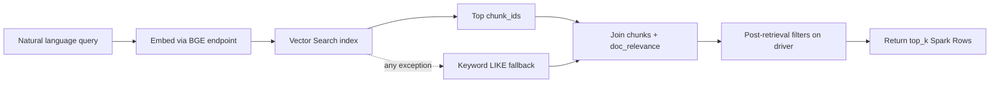

Section:      retrieval-layer-review
Version:      1.0.0
Last updated: 2026-06-20
Status:        read-only review (no code changes)
Scope:         `databricks/agents/shared/retrieval.py` and upstream/downstream callers

# UC13 retrieval layer — design review

Ad-hoc review of the inherited `semantic_search()` helper used by all Phase 3 diligence agents. The module works as pragmatic glue for batch jobs; several choices would feel wrong in a production RAG service and some concerns are objectively valid.

## One-line verdict

Prototype RAG that accumulated filters and fallbacks in Python because pushing them into Vector Search / SQL was harder — not a retrieval layer designed around ranking, tenancy, and observability from the start.

## What the module does

`semantic_search()` is the shared document-chunk retrieval entry point for UC13 Phase 3 agents (business model, financial trends, customer quality, KPI, legal, QoE, company profiler).

Flow:

1. Embed the query via MLflow deployments (`databricks-bge-large-en`).
2. Query `uc13.ingestion.embeddings_index` for `top_k × 3` chunk IDs.
3. Hydrate full rows from Delta: `uc13.ingestion.chunks` joined to `uc13.classification.doc_relevance`.
4. Apply post-retrieval filters in Python on the driver (length, filename, workstream, tier, source_type).
5. Cap to `top_k` and return a list of Spark `Row` objects.

On any exception (including empty vector results), fall back to keyword `LIKE` search over chunk text.



## Issues (objective)

### 1. Semantic ranking is discarded

Vector Search returns results in similarity order. The SQL path re-sorts by `priority_tier ASC`. Python filters and optional `source_type_priority` re-sort again. Final `top_k` is not “most similar to the query” — it is “similar-ish candidates, re-ranked by document tier.”

The function name oversells behavior; **tier-biased retrieval** is closer to reality.

### 2. Filters run in the wrong tier

The vector index syncs `workstream` and `priority_tier` from `uc13.ingestion.embeddings` (see `setup_vector_search.py`), but `query_index` never uses metadata filters. Instead:

- fetch `top_k × 3` globally
- join back to Delta
- filter in Python

The `3×` over-fetch is a band-aid. Aggressive filter combinations can still starve results — which is why callers duplicate **retry-without-filename-filter** logic in:

- `databricks/agents/workstreams/business_model_agent.py` (`_semantic_search_with_fallback`)
- `databricks/agents/subagents/workstream/financial/context_utils.py` (`semantic_search_with_fallback`)

Each retry re-embeds and re-queries (double cost).

### 3. No company scoping at search time

`company_name` exists on `uc13.ingestion.embeddings` but is **not** in the vector index `columns_to_sync`. Vector search runs across the full index; company isolation happens only in the follow-up SQL `WHERE`. Multi-company catalogs pay for global nearest-neighbors then discard cross-company hits.

### 4. Fallback is a blunt instrument

```python
except Exception as e:
    # → keyword LIKE on first 5 query tokens
```

Any exception triggers keyword search — embed failures, VS outages, bugs, and **empty vector results** (`ValueError("No results from vector search")`). Callers get no signal that retrieval mode or quality changed. `failure-taxonomy.md` lists this as “degraded” but nothing propagates `mode: vector | keyword` today.

### 5. SQL built by string interpolation

`company_name`, `chunk_id` lists, and keyword tokens are interpolated into SQL strings. Acceptable for controlled internal data rooms; brittle for quotes in filenames or company names. Not parameterized.

### 6. Two-hop, driver-bound architecture

Every agent tool call: embed → vector query → Spark SQL → `.collect()` → Python list filtering. Financial agents run many searches per run. Works on Databricks notebooks; does not compose like a normal service layer.

### 7. Accretion / hygiene

| Signal | Detail |
|--------|--------|
| Unused import | `import json` in `retrieval.py` |
| Split priority logic | `source_type_priority` in retrieval; CIM-first + per-chunk char limits in `context_utils.py` |
| Untyped return | `-> list` of Spark `Row`; no similarity scores |
| Join coupling | `chunks` ↔ `doc_relevance` on `file_name = filename` + `company_name`; naming drift drops metadata |

## What is defensible

- **Joining `chunks` + `doc_relevance`** — chunk text and classification live in separate tables; a join is unavoidable unless further denormalized.
- **Some post-filters** — chunk length and filename substring matching cannot all live in the vector index.
- **Pragmatic goal** — batch diligence orchestration glue, not a user-facing search API. “Good enough to ship the pipeline” is a coherent tradeoff even if the abstraction is messy.

## Refactor priorities (if/when)

Ordered by leverage:

1. Add `company_name` (and likely `source_type`) to VS index `columns_to_sync`; filter at `query_index` time.
2. Push `workstream` / `tier` into VS metadata filters instead of Python post-filtering.
3. Preserve similarity order, or document and implement an explicit merge (e.g. `score × tier_weight`).
4. Narrow the `except` handler; return structured result with `{chunks, mode, scores?}`.
5. Consolidate filename-filter fallback into one wrapper (remove BMA duplicate).
6. Parameterize SQL; add a typed result dataclass (align with `ToolResult` in `agent_base.py`).

## Related architecture docs

- `integration-seams.md` — UC13 → Vector Search seam, keyword fallback note
- `known-coupling-surfaces.md` — UC13 table/index names, endpoint defaults, workstream tags
- `public-interface-inventory.md` — `semantic_search` entry
- `failure-taxonomy.md` — Vector Search unavailable → L5 degraded path
- `dependency-graph.md` — `semantic_search` signature change breaks all agents

---

## Follow-ups — dive deeper

Use these as a reading / investigation checklist. Each item names **what to read**, **what question it answers**, and **what “done” looks like**.

### A. Index vs table schema drift

| Read | Question | Done when |
|------|----------|-----------|
| `databricks/jobs/scripts/setup_vector_search.py` | What columns are actually indexed vs what exists on `uc13.ingestion.embeddings`? | Table comparing embeddings DDL, `columns_to_sync`, and filters retrieval needs but cannot push down |
| `databricks/jobs/scripts/ingestion_parser.py` (embeddings write path) | Are `workstream` / `priority_tier` on embeddings always in sync with `doc_relevance`? | Confirm single writer path and whether stale embeddings can occur |

### B. Ranking and recall in production runs

| Read | Question | Done when |
|------|----------|-----------|
| `databricks/agents/workstreams/financial_trends_agent.py` + sub-agents under `subagents/workstream/financial/` | How many `semantic_search` calls per agent run? Any documented retrieval gaps? | Count of searches per run; list of `_add_gap` / retrieval gap strings tied to empty results |
| `test_pipeline.ipynb` (Cell 12 / FTA) | Do notebook runs log empty or sub-`min_results` retrievals for real companies? | Spot-check logs for `retrieved 0 chunks` or fallback prints |
| Agent reasoning traces (`_tool_call` output) | Does tier re-sort cause visibly wrong context (e.g. off-topic Tier 1 chunk beats on-topic Tier 2)? | 2–3 manual examples with query, returned files, and whether answer quality suffered |

### C. Fallback and failure behavior

| Read | Question | Done when |
|------|----------|-----------|
| `retrieval.py` except block + `failure-taxonomy.md` | How often does keyword fallback fire in practice vs true VS outage? | Decision: log metric or structured `mode` field; or accept status quo |
| Databricks job/cluster logs for Phase 3 runs | Are “Vector search failed” prints common or rare? | Frequency estimate from one full pipeline run |

### D. Duplicated workaround logic

| Read | Question | Done when |
|------|----------|-----------|
| `business_model_agent.py` `_semantic_search_with_fallback` | Identical to `context_utils.semantic_search_with_fallback`? | Diff the two; note params divergences |
| Grep `semantic_search(` across `databricks/agents/` | Who calls raw `semantic_search` vs wrapped fallback? | Inventory table: file, wrapper?, filters used |

### E. Multi-tenant / data isolation

| Read | Question | Done when |
|------|----------|-----------|
| Embeddings row counts per `company_name` | Can global VS query return another company’s chunk IDs before SQL filter? | Confirm with `SELECT company_name, COUNT(*) FROM uc13.ingestion.embeddings GROUP BY 1` |
| Product assumption | Is UC13 ever multi-company on one workspace/index simultaneously? | Yes/no from `PROJECT_HISTORY.md` or team; drives urgency of company filter in index |

### F. Context assembly (downstream of retrieval)

| Read | Question | Done when |
|------|----------|-----------|
| `context_utils.py` — `build_focused_context` | How does CIM-first sorting interact with retrieval’s `source_type_priority`? | Sequence diagram: retrieval sort → dedupe → context budget |
| Per-agent context builders (e.g. BMA’s own context path) | Do agents re-sort again after retrieval? | List agents that bypass `context_utils` |

### G. Security and robustness

| Read | Question | Done when |
|------|----------|-----------|
| Sample `company_name` and filenames in `uc13.ingestion.chunks` | Any names with single quotes or SQL-special chars? | Risk assessment for string-interpolated SQL |
| Databricks VS `query_index` filter API docs | Can metadata filters replace Python filters without index recreate? | Spike note: API constraints + migration steps |

### H. If refactoring — blast radius

| Read | Question | Done when |
|------|----------|-----------|
| `public-interface-inventory.md`, `dependency-graph.md` | What breaks if `semantic_search` return type or signature changes? | Checklist of files to update |
| `ingestion_parser.py` post-parse `sync_index` | Does index schema change require full re-sync or rebuild? | Steps documented for index migration |

---

## Open questions (retrieval-specific)

```
Question:     Is tier-biased ranking intentional product behavior, or an accidental side effect of ORDER BY priority_tier?
Impact:       Refactor priority #3; agent prompt design assumes “best” context
Closes when:  Product/engineering decision recorded; tests or eval set defined
```

```
Question:     Should keyword fallback remain silent, or become an explicit degraded mode in agent traces?
Impact:       failure-taxonomy L5, observability, confidence scoring in ToolResult
Closes when:  Trace schema includes retrieval_mode; agents surface medium/low confidence when keyword path used
```

```
Question:     Is multi-company sharing of one embeddings_index expected in production?
Impact:       Urgency of company_name in columns_to_sync and query filters
Closes when:  Deployment model confirmed (one company per run vs shared index)
```
