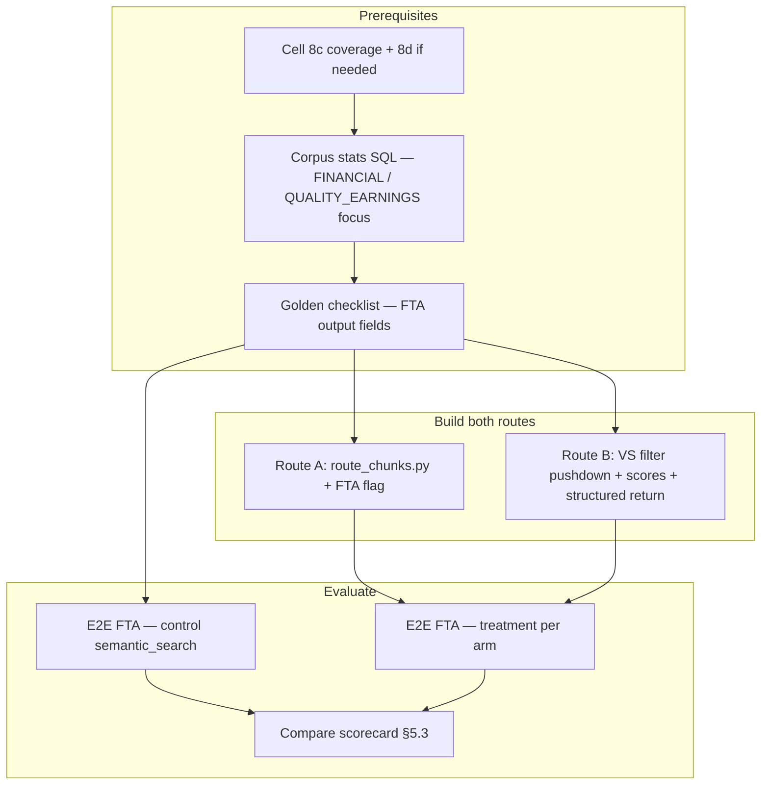

Section:      uc13-remediation-plan
Version:      1.1.0
Last updated: 2026-06-23
Status:        active planning doc — Route A vs Route B for financial assessment agent
Scope:         UC13 retrieval Route A (`route_chunks`) and Route B (fix in-repo Vector Search); E2E compare on `financial_trends_agent`

# UC13 remediation plan — Routes A & B

**Purpose:** Single planning doc for **Route A** (metadata router) vs **Route B** (enhance instantiated Vector Search). **Done** when both routes have an **E2E run on the financial assessment agent** (`financial_trends_agent.py` + sub-agents) and results are compared.

**Distilled from:** [uc13-retrieval-team-brief.md](./uc13-retrieval-team-brief.md), [uc-13_pain_central.md](./uc-13_pain_central.md), [retrieval-layer-review.md](./retrieval-layer-review.md), [uc13-retrieval-alternatives-assessment.md](./uc13-retrieval-alternatives-assessment.md), [uc13-retrieval-decision.md](./uc13-retrieval-decision.md), [uc13-retrieval-map.md](./uc13-retrieval-map.md).

**Out of scope here:** Route C (ReAct), Garden API, Cross-Analysis / Orchestrator agents, non-financial agent rollout, monorepo merge. See [uc-13_pain_central.md](./uc-13_pain_central.md) for the full pain registry.

**VS posture:** We remain **married to Vector Search** for now. Route B **fixes and enhances** the VS already in the repo. Route A tests whether a SQL metadata router can match or beat that path for the same agent — that comparison **is** the architecture decision (not a separate G0-3 debate).

**Mode:** Batch diligence only — not interactive Q&A.

---

## How to use

| Need | Section |
|------|---------|
| Execution order | §2 |
| Route A work | §3 |
| Route B work | §4 |
| A/B protocol & done definition | §5 |
| Files to touch | §6 |
| Record outcome | §7 Decision log |
| Work items tracked elsewhere | §8 |

---

## 1. Problem statement (why A vs B)

`semantic_search()` today behaves closer to **tier-biased metadata routing** than true semantic ranking: global VS query → post-filters on driver → `ORDER BY priority_tier`. FTA fires **~12–15 retrieval calls** per run (via sub-agents + `context_utils.semantic_search_with_fallback`).

| Route | Question it answers |
|-------|---------------------|
| **A** | Can `route_chunks()` (SQL router, no query-time embed) deliver equivalent extraction on FTA? |
| **B** | Does fixing filter pushdown, scores, and observability on **existing VS** improve FTA enough to justify keeping query-time semantic search? |

**Non-goals for this plan**

- Deprecating or removing the embeddings index / VS endpoint (Route B assumes they stay).
- Rolling either route to BMA, CQA, Legal, QoE, KPI, or profiler (post-decision work).
- Ingest-time digests (Route A Phase 2+) unless A/B fails on corpus size.
- Cross-encoder rerank (B-W6) unless B-lite shows recall gaps after filter pushdown.

---

## 2. Execution sequence

Upstream false negatives must be ruled out before comparing routes.



| Step | Exit criteria |
|------|---------------|
| **Prerequisites** | Coverage gaps fixed; corpus stats recorded for FTA workstreams; 15–20 field golden list for FTA |
| **Route A built** | `databricks/agents/shared/route_chunks.py` callable; FTA can run E2E on routed path |
| **Route B built** | VS filters + scores + `{chunks, mode, scores}` on FTA path; E2E runnable |
| **Done** | Both routes E2E on same company(ies); scorecard filled; winner logged §7 |

> **Note:** Route A and Route B touch different primary files (`route_chunks.py` vs `retrieval.py` / `setup_vector_search.py`). Shared FTA wiring (`context_utils.py`) is sequenced: build backends first, then flip flag per arm.

---

## 3. Route A — Metadata router

**Core bet:** Classification + tier + filename/section filters are sufficient for FTA chunk selection without query-time embeddings.

### 3.1 Work items

| ID | Task | Files |
|----|------|-------|
| A-W1 | **New module** `route_chunks()` — SQL mirror of `semantic_search` filter params (no embed) | `databricks/agents/shared/route_chunks.py` (**new**, not an extension of `retrieval.py`) |
| A-W2 | Params: `company_name`, `workstream_filter`, `tier_filter`, `file_name_filter`, `min_chunk_length`, `source_type_filter`, `top_k`, keyword predicates on `chunk_text` / `section_header` | `route_chunks.py` |
| A-W3 | Order: `priority_tier`, `file_name`, `chunk_index` (preserve current production ordering) | `route_chunks.py` |
| A-W4 | Return structured result: `{ chunks, mode: "routed", scores: null }` | `route_chunks.py`; consume in `context_utils.py` |
| A-W5 | FTA flag: sub-agents call `route_chunks` via `context_utils` instead of `semantic_search` | `context_utils.py`, `financial_trends_agent.py` (env/widget flag) |
| A-W6 | Do **not** delegate `semantic_search` → `route_chunks` globally; control arm keeps current `semantic_search` | — |

**SQL shape:**

```sql
SELECT c.*, r.workstream, r.priority_tier
FROM uc13.ingestion.chunks c
JOIN uc13.classification.doc_relevance r
  ON c.file_name = r.filename AND c.company_name = r.company_name
WHERE c.company_name = :company
  AND arrays_overlap(r.workstream, :workstreams)
  AND r.priority_tier <= :max_tier
  AND (:filename_predicate OR TRUE)
  AND (:keyword_predicate OR TRUE)
ORDER BY r.priority_tier, c.file_name, c.chunk_index
LIMIT :top_k
```

### 3.2 Route A gates

| Gate | Metric | Pivot if |
|------|--------|----------|
| G-A1 | Chunks per FTA workstream after `should_parse` + tier≤2 | Corpus too large for context budget without digests → see §8 A-P2 flag |
| G-A2 | FTA field coverage vs `semantic_search` control | Systematic misses on tier-1 financial docs |
| G-A3 | Citations on extracted facts | `source_doc` + `location` regress |
| G-A4 | FTA E2E runtime | Slower than control without quality gain |

**Commit A when:** Treatment ≥ control on golden fields; G-A2/G-A3 pass.

---

## 4. Route B — Fix in-repo Vector Search

**Core bet:** Similarity and filter pushdown matter once the existing VS path is fixed. VS stays; Route B enhances what is already instantiated.

### 4.1 Work items (ordered by leverage)

| ID | Task | Files |
|----|------|-------|
| B-W1 | Add `company_name` (+ `source_type` if needed) to `columns_to_sync`; re-sync index | `setup_vector_search.py`, `ingestion_parser.py` sync path |
| B-W2 | Push filters to `query_index`: `company_name`, workstream overlap, `priority_tier` | `retrieval.py` |
| B-W3 | Preserve VS similarity scores through hydrate (remove hydrate-only `ORDER BY priority_tier`) | `retrieval.py` |
| B-W4 | Explicit merge rank in Python, e.g. `sim × tier_weight` with documented weights | `retrieval.py` |
| B-W5 | Structured return `{ chunks, mode, scores }`; narrow `except` — distinguish vector / keyword / empty | `retrieval.py`, `context_utils.py` |
| B-W7 | FTA uses shared `semantic_search` path (enhanced); no separate B-only fork in sub-agents | `context_utils.py` |
| B-W8 | Parameterize SQL in `retrieval.py` (and `route_chunks.py` for parity) | `retrieval.py`, `route_chunks.py` |

### 4.2 B-lite (if A wins on quality but corpus is large and VS must stay hot)

| ID | Task |
|----|------|
| B-LITE-1 | B-W1 + B-W2 only — filter pushdown without full rerank |
| B-LITE-2 | Third E2E arm: FTA on B-lite vs A vs control |

### 4.3 Route B gates

| Gate | Metric | Pivot if |
|------|--------|----------|
| G-B1 | Recall@k with workstream filter vs post-hoc Python | No improvement; still starved results |
| G-B2 | FTA golden fields vs control | No extraction gain after VS fix |
| G-B3 | FTA E2E cost | Material runtime increase for no field gain |
| G-B4 | Index sync / ops | Sync remains blocker — see §8 P-06 |

**Commit B when:** G-B1/G-B2 pass; FTA fields beat or match Route A; VS enhancement justified.

---

## 5. A/B protocol — financial assessment agent

### 5.1 Target agent

**Financial assessment** = `financial_trends_agent.py` orchestrating:

- `revenue_sub_agent.py`
- `ebitda_sub_agent.py`
- `opex_sub_agent.py`

All retrieval via `context_utils.semantic_search_with_fallback` / `build_focused_context` today. See [uc13-retrieval-map.md](./uc13-retrieval-map.md) § FTA.

### 5.2 Prerequisites

On parsed company(ies) in `test_pipeline.ipynb`:

1. **Cell 8c** — coverage; **8d** if gaps.
2. **Corpus stats** (FTA workstreams):

```sql
SELECT r.company_name, ws AS workstream, COUNT(*) AS chunk_count
FROM uc13.ingestion.chunks c
JOIN uc13.classification.doc_relevance r
  ON c.file_name = r.filename AND c.company_name = r.company_name
LATERAL VIEW explode(r.workstream) t AS ws
WHERE r.should_parse = true
  AND r.priority_tier <= 2
  AND ws IN ('FINANCIAL', 'QUALITY_EARNINGS', 'FORECAST')
GROUP BY 1, 2
ORDER BY 1, 3 DESC;
```

3. **Golden checklist:** 15–20 required FTA output fields (revenue trend, EBITDA bridge, addbacks, WC, gaps, citations, etc.) — from spec + `financial_trends` schema.

### 5.3 Arms & scorecard

| Arm | Retrieval backend | FTA wiring |
|-----|-------------------|------------|
| **Control** | Current `semantic_search` | Default `context_utils` |
| **Route A** | `route_chunks()` | Flag → `route_chunks` in `context_utils` |
| **Route B** | Enhanced `semantic_search` | Default path after B-W1–5 land |
| **Optional B-lite** | B-W1–2 only | Third run if A wins but VS pushdown untested |

**Per arm — same company, same prompts, same `top_k` / filters:**

| Metric | How |
|--------|-----|
| Field pass / partial / miss | Golden checklist |
| `_data_room_gaps` count | FTA output |
| Citation presence | `source_doc` + `location` on facts |
| Runtime | Notebook / job timestamps |
| `retrieval_mode` | From structured return (B-W5 / A-W4) |

### 5.4 Decision table

| Outcome | Decision |
|---------|----------|
| Route A ≥ control on fields; corpus fits context | **Commit A** for FTA; plan rollout to other agents separately |
| Route B > Route A on tier-1 financial fields | **Commit B**; keep VS as primary path |
| Route A ≥ B; corpus large | **A + B-lite** (filter pushdown only) for ops insurance |
| Both routes fail same fields | **Upstream** — classifier, parser, FTA prompts (not retrieval arch) |
| A wins; digests needed (G-A1) | **Defer** ingest digests — §8 A-P2 |

### 5.5 Done definition

**Done** = prerequisites complete **and** E2E `financial_trends_agent` has run on **control**, **Route A**, and **Route B** (same company/companies), scorecard compared, winner recorded in §7.

---

## 6. File touch matrix (Routes A & B only)

| File | Route A | Route B |
|------|---------|---------|
| `databricks/agents/shared/route_chunks.py` | **New — primary** | — |
| `databricks/agents/shared/retrieval.py` | — | **Primary** |
| `databricks/agents/subagents/workstream/financial/context_utils.py` | A-W5 flag | B-W5, B-W7 |
| `databricks/agents/workstreams/financial_trends_agent.py` | A/B flag surface | — |
| `databricks/agents/subagents/workstream/financial/revenue_sub_agent.py` | — (via context_utils) | — |
| `databricks/agents/subagents/workstream/financial/ebitda_sub_agent.py` | — | — |
| `databricks/agents/subagents/workstream/financial/opex_sub_agent.py` | — | — |
| `databricks/jobs/scripts/setup_vector_search.py` | — | B-W1 |
| `databricks/jobs/scripts/ingestion_parser.py` | — | Re-sync after index schema |
| `databricks/jobs/notebooks/test_pipeline.ipynb` | E2E harness | E2E harness |

Full retrieval consumer map: [uc13-retrieval-map.md](./uc13-retrieval-map.md).

---

## 7. Decision log

Fill after E2E compare.

| Field | Value |
|-------|-------|
| Date | |
| Companies tested | |
| Corpus stats (max chunks/ws — FINANCIAL, QoE) | |
| Control field score | /20 |
| Route A field score | /20 |
| Route B field score | /20 |
| B-lite score (if run) | /20 |
| Winner | A / B / B-lite / upstream |
| Committed next step | |
| FTA rollout locked to | `route_chunks` / enhanced `semantic_search` |

---

## 8. Related work items — flagged, not in this plan

Items from the broader remediation distillation that are **out of scope for Route A/B** but tracked or in flight elsewhere. Do not block A/B on these unless noted.

| ID | Item | Status / where |
|----|------|----------------|
| **I-W1–I-W4** | `retrieval_mode` traces, fallback metrics | **Picked up in Route A A-W4 / Route B B-W5** (structured return). Standalone metrics (I-W4) → [uc-13_pain_central.md](./uc-13_pain_central.md) R-05, investigation C |
| **F-W1–F-W3** | Consolidate BMA/FTA/profiler fallback wrappers | **In flight** — recent FTA retriever work (`1aed882`); FTA already uses `context_utils`; BMA duplicate remains → pain central R-03 |
| **C-W1–C-W3** | BMA context budget; `source_type_priority` vs CIM-first | **Tracked** — pain central R-09; not needed for FTA A/B (FTA has `build_focused_context`) |
| **SQL-W1** | Audit special chars in company/filenames | **Tracked** — pain central R-06; SQL-W2 partially in A-W1/B-W8 |
| **O-02, O-06, O-07** | Coverage, workflow gap fill, index sync hard-fail | **Ops prerequisite** — run 8c/8d before E2E; pain central §2 |
| **P-05, P-06** | Parser rebuild discipline; sync failure path | **Tracked** — pain central P-05, P-06; G-B4 if sync blocks Route B |
| **A-03, A-06, A-07** | Non-financial agents; full pipeline E2E; citations | **Separate track** — pain central §4; A-06 is program-level done beyond this plan |
| **M-01–M-03, M-06** | Branch merge, catalog convention, API blast radius | **Tracked** — pain central §6; M-06 addressed via compat return type in A-W4/B-W5 |
| **A-P2-1–5** | Ingest digests; roll `route_chunks` to all agents | **Post-decision** — only if G-A1 fires |
| **B-W6** | Cross-encoder rerank | **Deferred** — optional after B-lite |
| **Route C** | ReAct adaptive loop | **Deferred** — Phase 2; batch-only scope |
| **S-02, S-03, S-05** | Cross-Analysis, Orchestrator, Garden API | **Deferred** — product/spec gaps |

---

## 9. Work status tracker (Routes A & B)

| ID | Task | Status | Notes |
|----|------|--------|-------|
| Prereq | Coverage + FTA corpus stats + golden list | ⬜ | Blocker |
| A-W1 | `route_chunks.py` new module | ⬜ | |
| A-W5 | FTA flag → routed path | ⬜ | |
| B-W1 | `company_name` in VS index | ⬜ | |
| B-W2 | VS metadata filters | ⬜ | |
| B-W3–5 | Scores + structured return | ⬜ | |
| E2E | FTA control run | ⬜ | |
| E2E | FTA Route A run | ⬜ | |
| E2E | FTA Route B run | ⬜ | |
| Done | Compare + §7 log | ⬜ | |

Status: ⬜ Not started · 🔄 In progress · ✅ Done · ⏸ Blocked

---

## 10. Related documentation

| Document | Role |
|----------|------|
| [uc13-retrieval-team-brief.md](./uc13-retrieval-team-brief.md) | Team summary |
| [uc-13_pain_central.md](./uc-13_pain_central.md) | Full pain registry + flagged items |
| [uc13-retrieval-map.md](./uc13-retrieval-map.md) | FTA call graph |
| [uc13-retrieval-decision.md](./uc13-retrieval-decision.md) | Gate worksheet (historical) |
| [qs_for_sync.md](../qs_for_sync.md) | Remaining sync questions (tier bias, time — **disregarded for this plan**) |

---

## 11. Changelog

| Version | Date | Change |
|---------|------|--------|
| 1.1.0 | 2026-06-23 | Narrow to Routes A/B only; FTA as target agent; VS married (B enhances in-repo VS); `route_chunks.py` new module; done = dual-route E2E compare; §8 flags for out-of-plan work items |
| 1.0.0 | 2026-06-23 | Initial centralized plan |
