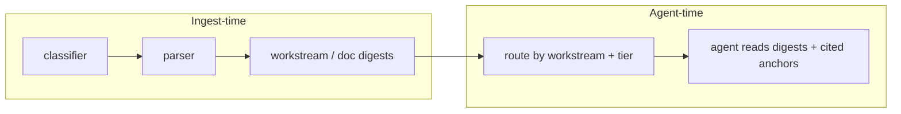

Section:      uc13-retrieval-alternatives-assessment
Version:      1.0.0
Last updated: 2026-06-20
Status:        design assessment (no code changes)
Scope:         Whether UC13 needs query-time semantic retrieval; alternatives via classification routing, ingest digests, and agent loops

# UC13 retrieval alternatives — design assessment

Assessment of whether UC13 requires a **semantic retrieval layer** (Vector Search + query-time embeddings), or whether **classification routing + ingest-time digests + gap-driven context expansion** is sufficient for batch diligence agents.

**Related docs:**

| Doc | Focus |
|-----|-------|
| [uc13-retrieval-reference.md](./uc13-retrieval-reference.md) | Consolidated UC13 + retrieval reference |
| [uc13-retrieval-map.md](./uc13-retrieval-map.md) | Per-file inventory, call graph |
| [retrieval-layer-review.md](./retrieval-layer-review.md) | Adversarial review of `semantic_search()` |

---

## Executive summary

**Verdict:** For UC13 as implemented today, **query-time semantic retrieval is likely not required to unblock the pipeline**. The inherited `semantic_search()` layer adds infra cost (embeddings index, sync blocking, ~45–55 query embeddings per run) while **discarding vector similarity order** in favor of priority-tier ranking and metadata filters.

What UC13 **does** need — regardless of embeddings — is **within-corpus chunk selection**: after classifying and routing documents to workstream agents, something must shrink hundreds of chunks down to a context budget (15k–25k chars for FTA; unconstrained for BMA today) while preserving citation anchors.

**Recommended direction:** Replace or bypass Vector Search with a **metadata router** (`route_chunks()` SQL) and optionally **ingest-time structured digests**; use **gap-driven expansion loops** (already partially present via filename-filter fallback) instead of 45+ static semantic queries.

---

## The question

> If you already classified docs, pre-filtered irrelevant ones (trace docs, volume, origin), and route subsets to specialized agents — can you skip semantic retrieval entirely? Instead: LLM-digest docs to normalized MD at ingest, agents ingest routed digests into context, and use LangGraph/LangChain-style loops to gather context and trim before extraction.

**Short answer:** Document-level routing — yes, largely already done. Chunk-level selection — still required, but embeddings are not the only (or best) tool for this codebase.

---

## What UC13 does today

UC13 is a **batch diligence pipeline**, not interactive search:

1. SharePoint → Unity Catalog Volume
2. **Document classifier** → `workstream` tags, `priority_tier`, `should_parse`
3. **Parser** → chunks + BGE embeddings + Vector Search index sync
4. **Workstream agents** → many handcrafted retrieval queries → LLM extraction → `uc13.analysis.*`
5. Citations via chunk metadata (`file_name`, `section_header`, `page_start`, `source_type`)

Product bar (Austin brief): associate-style first-pass diligence with **source-linked facts**. Cross-document reconciliation and orchestrator memo are spec'd but **not built**.

### Current retrieval pattern

```
embed query → VS (top_k × 3) → SQL hydrate (chunks ⋈ doc_relevance)
→ Python post-filters → cap top_k
(on any exception → keyword LIKE on first 5 query tokens)
```

**Critical behavior** (see [retrieval-layer-review.md](./retrieval-layer-review.md)):

- Vector similarity order is **discarded**; hydration uses `ORDER BY priority_tier ASC`
- Filters (`workstream`, `file_name`, `min_chunk_length`, `source_type`) run **in Python after** the vector query
- `company_name` is not in the VS index — global nearest-neighbor, then SQL discard
- ~**45–55 `semantic_search` invocations** per full pipeline run (before filename-filter retries)

The function behaves closer to **tier-biased metadata routing** than semantic ranking.

---

## Mapping the thesis to the codebase

### Already true: classify, pre-filter, route

| Layer | Implementation |
|-------|----------------|
| Document classification | `document_classifier.py` → `uc13.classification.doc_relevance` |
| Exclusion | `should_parse=false`, `BACKGROUND` workstream |
| Priority ordering | Tiers 1–3 per PE spec (CIM, QofE, financial model, …) |
| Agent routing | Workflow DAG: BMA, FTA, CQA, KPI, Legal, QoE |
| Per-query narrowing | Every `semantic_search` call sets `workstream_filter` + often `file_name_filter` |

Agents never see unparsed files. Routing to agents by diligence category is explicit.

### Not solved by classification alone: within-document chunk selection

A file tagged `FINANCIAL` may contain 50+ chunks spanning P&L, payroll, and customer detail. Agents need **which chunks** answer "headcount by geography" vs "addback schedule" vs "payor mix."

That is why agents fire many queries with long NL strings and filename hints — e.g. `revenue_sub_agent.py` runs 5 retrieval passes including CIM-first then QuickBooks fallback for customer concentration.

**Distinction:** document routing ≠ chunk selection.

### Valid alternative: ingest-time digests

Pre-compute structured MD (or JSON) per document or workstream at ingest:



**Pros:**

- Fits batch model — pay LLM cost once at ingest, not 50× at agent time
- Removes VS endpoint, index sync blocking, per-query BGE calls
- Priority tiers map naturally to digest ordering (CIM first, etc.)
- Simpler mental model for unblocking

**Risks:**

- **Citation fidelity** — digests must preserve `source_doc`, `source_location`, `raw_text` anchors; naive summarization loses page/cell-level provenance
- **Volume** — one digest per 200-tab Excel model is impractical; prefer per-sheet or per-section digests
- **Cross-document facts** — revenue may appear in CIM, segment Excel, and QuickBooks; need multi-doc topic digests or gap-driven raw-chunk fallback

### Valid alternative: agent loops (gap-driven expansion)

The codebase already approximates this without LangGraph:

| Mechanism | Location |
|-----------|----------|
| Filename-filter retry | `context_utils.semantic_search_with_fallback`, BMA `_semantic_search_with_fallback` |
| CIM-first then broader pass | `revenue_sub_agent` customer concentration |
| Context budget + tier sort | `build_focused_context()` |
| Missing-doc signals | `_data_room_gaps` in `agent_base.py` |

A LangGraph-style loop (extract → detect gaps → widen filters → trim → re-extract) is a cleaner expression of the same idea and **does not require embeddings**. Widening can mean: raise `tier_filter`, drop `file_name_filter`, add `section_header LIKE`, or fetch the next digest tranche.

---

## When semantic retrieval is vs isn't needed

### Likely sufficient without Vector Search (common UC13 case)

| Condition | Rationale |
|-----------|-----------|
| Single-company batch run | No ad-hoc user queries |
| Classifier removes noise via `should_parse` | Bounded corpus per workstream |
| Priority tiers match PE data-room reality | CIM/QofE/model carry most signal |
| Fixed diligence schemas per agent | 9 BMA tools, 5 FTA queries — not open search |
| Current VS barely uses similarity | SQL router loses little vs status quo |

**Conceptual SQL replacement** (no embeddings):

```sql
SELECT c.*, r.workstream, r.priority_tier
FROM uc13.ingestion.chunks c
JOIN uc13.classification.doc_relevance r
  ON c.file_name = r.filename AND c.company_name = r.company_name
WHERE c.company_name = :company
  AND arrays_overlap(r.workstream, :workstreams)
  AND r.priority_tier <= :max_tier
  AND (:filename_predicate OR TRUE)
  AND (:keyword_predicate OR TRUE)
ORDER BY r.priority_tier, c.file_name, c.chunk_index
LIMIT :top_k
```

Agent `query` strings become **keyword/section predicates** or **digest section IDs** — same intent, less infra.

### When true semantic retrieval may still help

| Condition | Rationale |
|-----------|-----------|
| Very large data rooms (1000+ chunks per workstream) | Metadata routing alone may exceed context budgets |
| Consistently bad filenames | Filename filters fail often; embeddings help **only if similarity is actually ranked** (not true today) |
| Open-ended questions | "Anything about FDA warning letters" — outside fixed agent tools |
| Interactive data-room Q&A | Not current UC13 scope |
| Poor section structure in parses | No `section_header` to route on |

Even then, fixing the current layer (VS metadata filters, preserve scores, company scoping) may be polish on a pattern agents do not fully exploit.

---

## What the inherited design suggests

`PROJECT_HISTORY.md` shows repeated iteration on chunking, embedding fields, and retrieval queries — symptomatic of fighting recall with plumbing rather than a clean retrieval design. The [retrieval-layer-review](./retrieval-layer-review.md) calls it "prototype RAG glue."

Agent retrieval queries are **declarative routing specs** disguised as natural language:

```python
# revenue_sub_agent — routing logic, not pure semantic understanding
workstream_filter=["FINANCIAL", "BUSINESS_MODEL"]
file_name_filter=["P&L", "QuickBooks", "CIM", ...]
query="customer concentration top customers ..."  # fuels keyword fallback
```

---

## Recommended path to unblock

### Phase A — Prove routing is enough (low risk)

1. Add `route_chunks()` SQL helper mirroring current `semantic_search` filter params (no embed).
2. A/B one agent (e.g. CQA or Legal — smaller corpus) vs `semantic_search`.
3. Measure: extraction completeness, `_data_room_gaps`, citation accuracy, runtime.

### Phase B — Ingest-time digests

1. After parse, for each `priority_tier=1` doc per workstream, one LLM pass → structured MD with anchors.
2. Store in `uc13.ingestion.workstream_digests` (or Volume).
3. Agents read digests first; raw chunks only on gaps.

### Phase C — Agent loop (optional LangGraph)

1. Extract → gap check → widen route (tier 2, drop filename filter, next digest tranche).
2. Replaces 45 static searches with ~3–5 adaptive rounds per agent.

**Keep embeddings only if** Phase A shows systematic recall holes on real companies that keyword/section routing cannot fix.

---

## Caveats and pushback

1. **"No retrieval layer"** — you still need selection within routed sets. Call it routing, digest lookup, or keyword search; something must shrink FINANCIAL chunks to the context budget.

2. **One MD per agent** — too coarse. Prefer **tier-ordered digest bundles** with stable chunk IDs for citations.

3. **Cross-doc inconsistency** (Austin Q2) — neither classification nor semantic search solves this; requires the unbuilt Cross-Analysis Agent.

4. **Classifier is not perfect** — `ensure_coverage.py` exists because workstream tags miss files; any router inherits classifier errors.

5. **BMA has no context char budget** — unlike FTA's `build_focused_context` (25k cap). A routing/digest approach should enforce budgets consistently across agents.

---

## Open questions (for team sync)

```
Question:     How married is the team to Vector Search / semantic retrieval?
Impact:       Determines whether Phase A is a bypass experiment or a political non-starter
Closes when:  Product/engineering decision on acceptable retrieval architecture
```

```
Question:     How much time is available before retrieval must be "unblocked"?
Impact:       Phase A (SQL router swap) vs Phase B (ingest digests) vs fix-in-place VS refactor
Closes when:  Timeline and definition of "unblocked" agreed (one agent green? full pipeline?)
```

```
Question:     Is tier-biased ranking intentional product behavior?
Impact:       If yes, embeddings add little; optimize tier + filename routing instead
Closes when:  Recorded decision (see retrieval-layer-review open questions)
```

```
Question:     What is the typical parsed chunk count per workstream on real deals?
Impact:       If <100 chunks per workstream after filters, dump-all may work; if 1000+, need selection
Closes when:  Stats from test_pipeline.ipynb Cell 8 on 2–3 real companies
```

---

## Decision matrix

| Approach | Infra complexity | Recall risk | Citation fidelity | Fit for batch UC13 |
|----------|------------------|-------------|-------------------|-------------------|
| Status quo (`semantic_search`) | High (VS, sync, embed@query) | Medium (misleading "semantic" label) | Good (raw chunks) | Works but fragile |
| SQL `route_chunks()` + keyword | Low | Medium–High if filenames bad | Good | **Best first experiment** |
| Ingest digests + routing | Medium (extra LLM@ingest) | Low–Medium | Depends on digest design | **Best long-term for batch** |
| Fix VS (filters, scores, company scope) | Medium | Medium | Good | Incremental; doesn't simplify |
| Full corpus in context | None | N/A | Good | Only if corpus tiny |

---

## Bottom line

Classification routing and pre-filtering are **necessary and largely already built**. Semantic retrieval as implemented is **neither necessary nor particularly effective** — similarity is discarded, and agents rely on workstream tags, filename hints, and tier ordering.

The unblock path is: **route → select chunks (SQL/keyword/section) or read ingest digests → gap-expand → extract with citations**. Vector Search is optional insurance, not the core architecture — unless real-deal metrics show recall gaps that simpler selection cannot close.

---

## Document history

| Version | Date | Change |
|---------|------|--------|
| 1.0.0 | 2026-06-20 | Initial assessment from repo review and retrieval/UC13 doc synthesis |
