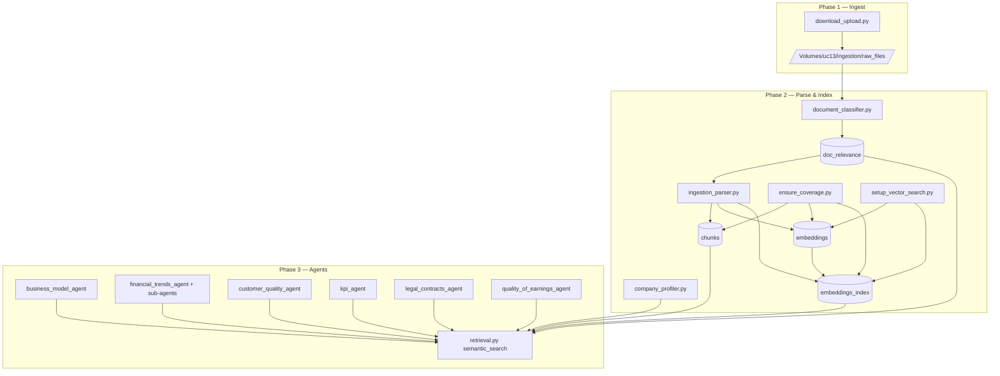

Section:      uc13-retrieval-map
Version:      1.0.0
Last updated: 2026-06-20
Scope:         All UC13 (Use Case 13) files in the repo, mapped to the retrieval layer

# UC13 file inventory — retrieval map

Compiled inventory of every UC13-related file in the Rallyday repo, with explicit mapping to the shared retrieval layer (`databricks/agents/shared/retrieval.py` → `semantic_search()`).

**Related:** [retrieval-layer-review.md](./retrieval-layer-review.md) (design critique), [architecture/rallyday/](./architecture/rallyday/) (cross-project reference).

---

## Retrieval at a glance

UC13 retrieval is a **two-hop batch pattern**: embed query → Vector Search index → hydrate from Delta → post-filter in Python.

| Layer | Artifact | Role |
|-------|----------|------|
| **Entry point** | `databricks/agents/shared/retrieval.py` | `semantic_search()` — sole production retrieval API |
| **Index** | `uc13.ingestion.embeddings_index` | Delta Sync over `uc13.ingestion.embeddings` |
| **Hydration** | `uc13.ingestion.chunks` ⋈ `uc13.classification.doc_relevance` | Full chunk text + workstream tags + priority tier |
| **Embedding model** | `databricks-bge-large-en` | Query and document vectors (1024-dim) |
| **Fallback** | Keyword `LIKE` on `chunk_text` | Fires on any vector-search exception |



---

## Complete UC13 file inventory

All paths relative to repo root. **Retrieval role** column uses:

| Code | Meaning |
|------|---------|
| **CORE** | Defines or wraps `semantic_search()` |
| **CONSUMER** | Calls retrieval at runtime |
| **UPSTREAM** | Writes data retrieval reads (chunks, embeddings, classification) |
| **INFRA** | Index/endpoint setup, workflow orchestration, tests |
| **SPEC** | Client/build specification (no runtime retrieval) |
| **DOCS** | Developer or architecture reference |
| **—** | No direct retrieval relationship |

### `databricks/agents/shared/`

| File | Phase | Retrieval role | Notes |
|------|-------|----------------|-------|
| `retrieval.py` | 2/3 | **CORE** | `semantic_search()` — embed, VS query, SQL hydrate, post-filters, keyword fallback |
| `agent_base.py` | 3 | **SUPPORT** | `_tool_call()` logs retrieval steps to reasoning trace; no search logic |
| `__init__.py` | — | — | Package marker |

### `databricks/agents/workstreams/` (Phase 3 agents)

| File | Output table | Retrieval role | Search calls |
|------|--------------|----------------|--------------|
| `business_model_agent.py` | `uc13.analysis.business_model` | **CONSUMER** | 9 tools via local `_semantic_search_with_fallback()` |
| `financial_trends_agent.py` | `uc13.analysis.financial_trends` | **CONSUMER** (orchestrator) | Delegates to 3 sub-agents; no direct `semantic_search` in orchestrator |
| `customer_quality_agent.py` | `uc13.analysis.customer_quality` | **CONSUMER** | 5 direct `semantic_search` calls |
| `kpi_agent.py` | `uc13.analysis.kpi` | **CONSUMER** | 5 direct `semantic_search` calls |
| `legal_contracts_agent.py` | `uc13.analysis.legal_contracts` | **CONSUMER** | 5 direct `semantic_search` calls |
| `quality_of_earnings_agent.py` | `uc13.analysis.quality_of_earnings` | **CONSUMER** | 5 direct `semantic_search` calls |
| `__init__.py` | — | — | Package marker |

### `databricks/agents/subagents/workstream/financial/` (FTA sub-agents)

| File | Retrieval role | Search calls |
|------|----------------|--------------|
| `context_utils.py` | **CORE** (wrapper) | `semantic_search_with_fallback()` — filename-filter retry; `build_focused_context()` post-retrieval sort/budget |
| `revenue_sub_agent.py` | **CONSUMER** | 5–6 `semantic_search_with_fallback` calls |
| `ebitda_sub_agent.py` | **CONSUMER** | 4 `semantic_search_with_fallback` calls |
| `opex_sub_agent.py` | **CONSUMER** | 3 `semantic_search_with_fallback` calls |
| `shared_prompts.py` | — | Prompt text only |
| `__init__.py` | **EXPORT** | Re-exports `semantic_search_with_fallback`, `build_focused_context` |

### `databricks/agents/ingestion/` (Phase 1 SharePoint)

| File | Retrieval role | Notes |
|------|----------------|-------|
| `tools/connector.py` | **UPSTREAM** (indirect) | SharePoint list/download; feeds raw files that become chunks |
| `tools/uploader.py` | **UPSTREAM** (indirect) | UC Volume upload helper |
| `__init__.py`, `tools/__init__.py` | — | Package markers |

### `databricks/jobs/scripts/` (batch jobs)

| File | Phase | Retrieval role | Notes |
|------|-------|----------------|-------|
| `setup_vector_search.py` | 0 | **INFRA** | Creates `uc13.ingestion.embeddings`, VS endpoint, `embeddings_index`; defines `columns_to_sync` |
| `download_upload.py` | 1 | **UPSTREAM** (indirect) | SharePoint → Volume → `uc13.ingestion.upload_log` |
| `document_classifier.py` | 2a | **UPSTREAM** | Writes `uc13.classification.doc_relevance` (workstream, priority_tier, should_parse) — joined at hydrate time |
| `ingestion_parser.py` | 2b | **UPSTREAM** | Writes `chunks` + `embeddings`; triggers `sync_index` after parse |
| `ensure_coverage.py` | 2c | **UPSTREAM** | APPEND-only gap fill for missing embeddings; syncs index |
| `company_profiler.py` | 2b | **CONSUMER** | 7 profiling dimensions via `semantic_search` + fallback |
| `md_to_word.py` | — | — | Report export utility |

### `databricks/jobs/notebooks/`

| File | Retrieval role | Notes |
|------|----------------|-------|
| `00_setup_vector_search.ipynb` | **INFRA** | Notebook wrapper for setup; includes `semantic_search` smoke tests |
| `01_document_classifier.ipynb` | **UPSTREAM** | Runs `document_classifier.py` |
| `02_ingestion_parser.ipynb` | **UPSTREAM** | Runs `ingestion_parser.py` |
| `03_company_profiler.ipynb` | **CONSUMER** | Runs profiler with `semantic_search` |
| `test_pipeline.ipynb` | **INFRA** | E2E test harness; retrieval smoke test + all Phase 3 agents |
| `example_sync.py` | — | Example helper |

### `databricks/jobs/sql/`

| File | Retrieval role | Notes |
|------|----------------|-------|
| `create_rules_table.sql` | — | Garden rules DDL (not UC13 retrieval) |
| `seed_rules.sql` | — | Garden rules seed data |

### `databricks/workflows/`

| File | Retrieval role | Notes |
|------|----------------|-------|
| `uc13_ingestion_pipeline.yml` | **INFRA** | DAB workflow: Phase 1 → 2 → 3 task DAG |
| `README.md` | **DOCS** | Secrets, parameters, workstream filter documentation |

### `databricks/` (root)

| File | Retrieval role | Notes |
|------|----------------|-------|
| `CLAUDE.md` | **DOCS** | UC13 developer context; retrieval params documented |
| `pyproject.toml` | — | Package `rallyday-uc13-databricks` |
| `requirements.txt`, `uv.lock` | — | Dependencies |
| `Guidelines/Austin_email_guidelines.txt` | **SPEC** | Client diligence spec |
| `Guidelines/PE_Diligence_Agent_Spec_v2.pdf` | **SPEC** | Build specification PDF |

### `.dev/` (documentation)

| File | Retrieval role | Notes |
|------|----------------|-------|
| `retrieval-layer-review.md` | **DOCS** | Adversarial design review of `semantic_search()` |
| `architecture/rallyday/*.md` | **DOCS** | Cross-cutting architecture (seams, contracts, failure taxonomy) |
| `uc13-retrieval-map.md` | **DOCS** | This file |

### Repo root

| File | Retrieval role | Notes |
|------|----------------|-------|
| `PROJECT_HISTORY.md` | **DOCS** | UC13 + Garden narrative and branch status |

---

## Delta tables & retrieval contract

Retrieval reads and joins these Unity Catalog objects (`catalog` default: `uc13`):

| Table / index | Written by | Read by retrieval | Fields used at search time |
|---------------|------------|-------------------|---------------------------|
| `uc13.ingestion.upload_log` | `download_upload.py` | — | Phase 1 priority signals → classifier |
| `uc13.classification.doc_relevance` | `document_classifier.py` | **JOIN** in `semantic_search` | `workstream`, `priority_tier`, `should_parse` (fallback only), `filename` |
| `uc13.ingestion.chunks` | `ingestion_parser.py`, `ensure_coverage.py` | **JOIN** in `semantic_search` | `chunk_id`, `chunk_text`, `file_name`, `section_header`, `page_start`, `source_type`, `company_name` |
| `uc13.ingestion.embeddings` | `ingestion_parser.py`, `ensure_coverage.py` | **Vector index source** | `embedding`, `chunk_id`, `workstream`, `priority_tier` (synced to index) |
| `uc13.ingestion.embeddings_index` | `setup_vector_search.py` | **VS query** | Returns `chunk_id`, `doc_id`, `file_name` only at query time |
| `uc13.classification.company_profile` | `company_profiler.py` | **Not via semantic_search** | SQL read by agents for overlay metadata |
| `uc13.analysis.*` | Phase 3 agents | **Downstream** | Agent outputs; some agents read peer tables (e.g. QoE reads FTA addbacks) |

**Index sync columns** (`setup_vector_search.py`): `chunk_id`, `doc_id`, `file_name`, `workstream`, `priority_tier`.  
**Not indexed but filtered post-query:** `company_name`, `source_type`, chunk length, filename substrings.

---

## Retrieval wrappers

Two files duplicate filename-filter fallback logic:

| Wrapper | Location | Behavior |
|---------|----------|----------|
| `semantic_search_with_fallback` | `subagents/workstream/financial/context_utils.py` | Retry without `file_name_filter` when `len(chunks) < min_results` |
| `_semantic_search_with_fallback` | `workstreams/business_model_agent.py` | Same pattern; also logs fallback to reasoning trace |

FTA sub-agents use `context_utils`; BMA uses its own copy. Both delegate to `retrieval.semantic_search`.

**Post-retrieval context assembly** (FTA only): `build_focused_context()` — CIM-first sort, per-chunk char limits by tier/source_type, dedupe, budget cap.

---

## Per-consumer retrieval inventory

### `company_profiler.py` (Phase 2b)

7 profiling dimensions in `_PROFILING_QUERIES`; each calls `semantic_search` with dimension-specific `file_name_filter` + `workstream_filter`, with filename-filter fallback.

| Dimension | Workstream filter | Filename hints |
|-----------|-------------------|----------------|
| `industry_overlay` | BUSINESS_MODEL | CIM, Business, Overview, Summary, Profile |
| `revenue_model` | BUSINESS_MODEL | same |
| `business_description` | BUSINESS_MODEL | same |
| `company_size_indicators` | FINANCIAL, BUSINESS_MODEL | CIM, Financial, P&L, Profit, EBITDA |
| `deal_type` | BUSINESS_MODEL | CIM, Business, Overview, Summary |
| `banked_vs_nonbanked` | BUSINESS_MODEL | CIM, Offering, OM |
| `vertical_subsector` | BUSINESS_MODEL | CIM, Business, Overview, Summary, Profile |

### `business_model_agent.py` — 9 retrieval tools

| Tool (approx.) | Workstream filter | top_k | Filename filter |
|----------------|-------------------|-------|-----------------|
| Company overview | BUSINESS_MODEL | 18 | CIM, Business, Overview, … |
| Management / ownership | BUSINESS_MODEL | 15 | CIM, Management, Org, … |
| Workforce / headcount | BUSINESS_MODEL, FINANCIAL | 15 | Payroll, HR, Headcount, … |
| Pricing / margins | BUSINESS_MODEL, FINANCIAL | 15 | CIM, Financial, Pricing, … |
| Clients / utilization | BUSINESS_MODEL, CUSTOMER | 15 | CIM, Customer, Revenue, … |
| GTM / sales motion | BUSINESS_MODEL, KPI_OPS | 12 | CIM, Sales, Marketing, … |
| Backlog / retention | BUSINESS_MODEL, KPI_OPS | 12 | CIM, Contract, Pipeline, … |
| Business changes / tech | BUSINESS_MODEL | 12 | CIM, Technology, ERP, … |
| CIM executive summary | BUSINESS_MODEL | 3 | CIM, Offering, OM, … |

All use `_semantic_search_with_fallback` (`min_results=3`, `min_chunk_length=150`).

### `financial_trends_agent.py` — via sub-agents

Orchestrator runs `RevenueSubAgent`, `EbitdaSubAgent`, `OpexSubAgent`. Each owns 3–6 `semantic_search_with_fallback` calls.

| Sub-agent | Queries (summary) | Notable filters |
|-----------|-------------------|-----------------|
| **Revenue** | Annual revenue/P&L; segment split; geography; customer concentration; QuickBooks totals | `source_type_priority=True` on concentration; broad P&L filename lists |
| **EBITDA** | P&L/EBITDA; margins/addbacks; DSO/working capital; addback schedule | `QUALITY_EARNINGS` on margin/addback queries |
| **OPEX** | Operating expenses; DPO/AP; projected OPEX | Forecast/Model filename hints on projections |

Shared defaults: `min_chunk_length=150`, `min_results=3`, context budget 15k–25k chars via `build_focused_context`.

### `customer_quality_agent.py` — 5 tools

| Tool | Query focus | Workstream filter | top_k |
|------|-------------|-------------------|-------|
| Customer concentration | top customers, revenue share | CUSTOMER | 12 |
| Retention metrics | NRR, GRR, churn | CUSTOMER, QUALITY_EARNINGS | 8 |
| Customer tenure | tenure, vintage | CUSTOMER, BUSINESS_MODEL | 6 |
| Payor mix | Medicare, Medicaid, commercial | CUSTOMER, FINANCIAL | 6 |
| Account size | ACV, revenue per customer | CUSTOMER, KPI_OPS | 6 |

### `kpi_agent.py` — 5 tools

| Tool | Query focus | Workstream filter | top_k |
|------|-------------|-------------------|-------|
| KPI dashboard | utilization, scorecard | KPI_OPS | 12 |
| Pipeline / backlog | weighted pipeline, bookings | KPI_OPS, FINANCIAL | 8 |
| Delivery model | bill rate, offshore/onshore | KPI_OPS, BUSINESS_MODEL | 6 |
| Healthcare ops | turnover, census, credentialing | KPI_OPS, FINANCIAL | 8 |
| Headcount / FTE | attrition, rev/FTE | KPI_OPS, FINANCIAL | 6 |

### `legal_contracts_agent.py` — 5 tools

| Tool | Query focus | Workstream | top_k |
|------|-------------|------------|-------|
| Material contracts | MSA, SOW, CoC | LEGAL | 12 |
| CoC & termination | change of control, termination | LEGAL | 10 |
| Restrictive covenants | non-compete, non-solicit | LEGAL | 6 |
| Litigation | disputes, claims | LEGAL | 8 |
| IP & data | IP assignment, data privacy | LEGAL | 6 |

First tool uses `file_name_filter`; others workstream-only.

### `quality_of_earnings_agent.py` — 5 tools

| Tool | Query focus | Workstream | top_k |
|------|-------------|------------|-------|
| QofE overview | addback schedule, due diligence | QUALITY_EARNINGS | 12 |
| EBITDA bridge | reported vs adjusted EBITDA | QUALITY_EARNINGS, FINANCIAL | 10 |
| Revenue recognition | deferred revenue, DSO spikes | QUALITY_EARNINGS, FINANCIAL | 8 |
| Owner comp | above-market salary, personal expenses | QUALITY_EARNINGS, FINANCIAL | 6 |
| Accounting policies | footnotes, restatements | QUALITY_EARNINGS, FINANCIAL | 6 |

Also reads `uc13.analysis.financial_trends.addback_schedule_json` via SQL (not retrieval).

---

## Upstream → retrieval data flow

| Step | Script | What retrieval depends on |
|------|--------|---------------------------|
| 1 | `download_upload.py` | Raw files on Volume; `upload_log` priority hints |
| 2 | `document_classifier.py` | `doc_relevance.workstream`, `priority_tier`, `should_parse` |
| 3 | `ingestion_parser.py` | `chunks` (text, source_type), `embeddings` (vectors + metadata), index sync |
| 3b | `ensure_coverage.py` | Fills embedding gaps so agents don't retrieve empty workstreams |
| 0 | `setup_vector_search.py` | Index must exist and be synced before any `semantic_search` |

**Blocking dependency:** `ingestion_parser.py` warns not to proceed to `semantic_search` until index sync completes (`_wait_for_index_sync`).

---

## `semantic_search()` parameter usage matrix

| Parameter | Default | Used by |
|-----------|---------|---------|
| `query` | (required) | All consumers |
| `spark` | (required) | All consumers |
| `top_k` | 10 | Per-tool override (3–18) |
| `company_name` | None | All production callers set it |
| `file_name_filter` | None | BMA, FTA sub-agents, CQA, KPI, Legal, QoE, profiler |
| `workstream_filter` | None | All consumers |
| `tier_filter` | None | Rarely used in agents |
| `min_chunk_length` | 100 | Agents typically use 150 |
| `index_name` | `uc13.ingestion.embeddings_index` | Default everywhere |
| `embedding_endpoint` | `databricks-bge-large-en` | Default everywhere |
| `source_type_priority` | False | Revenue sub-agent (concentration queries) |
| `source_type_filter` | None | Available; limited agent usage |

---

## Files that do NOT call retrieval

These are UC13 pipeline files with no `semantic_search` import:

- `download_upload.py`, `document_classifier.py`, `ingestion_parser.py`, `ensure_coverage.py`
- `setup_vector_search.py` (creates index; notebooks test retrieval separately)
- `agents/ingestion/tools/*`
- `workflows/uc13_ingestion_pipeline.yml`
- `md_to_word.py`, `jobs/sql/*`, `Guidelines/*`

Phase 3 agents that read **peer analysis tables** via SQL instead of retrieval:

- `financial_trends_agent.py` → `company_profile` (SQL)
- `quality_of_earnings_agent.py` → `financial_trends.addback_schedule_json` (SQL)
- `legal_contracts_agent.py` → `customer_quality.contract_trigger_list` (SQL) `[per pipeline YAML]`

---

## Call graph summary

```
semantic_search (retrieval.py)
├── company_profiler.py                    [7 calls, own fallback]
├── business_model_agent.py                [9 calls via _semantic_search_with_fallback]
├── customer_quality_agent.py              [5 calls, direct]
├── kpi_agent.py                           [5 calls, direct]
├── legal_contracts_agent.py               [5 calls, direct]
├── quality_of_earnings_agent.py           [5 calls, direct]
└── context_utils.semantic_search_with_fallback
    ├── revenue_sub_agent.py               [5–6 calls]
    ├── ebitda_sub_agent.py                [4 calls]
    └── opex_sub_agent.py                  [3 calls]

Test / smoke:
├── 00_setup_vector_search.ipynb
└── test_pipeline.ipynb
```

**Estimated retrieval calls per full pipeline run:** ~45–55 `semantic_search` invocations (before filename-filter retries double some calls).

---

## Workflow task order (retrieval prerequisites)

From `uc13_ingestion_pipeline.yml`:

1. `setup_vector_search` (one-time / idempotent)
2. `download_upload`
3. `document_classifier` → `doc_relevance`
4. `ingestion_parser` → `chunks` + `embeddings` + index sync
5. `company_profiler` → **first retrieval consumer**
6. Phase 3 agents (parallel after profiler): BMA, FTA, CQA, KPI, Legal, QoE

`ensure_coverage.py` is not a workflow task; run ad hoc from `test_pipeline.ipynb` Cell 8c/8d when workstream coverage gaps exist.

---

## Quick reference — key paths

| Concern | Path |
|---------|------|
| Retrieval API | `databricks/agents/shared/retrieval.py` |
| FTA retrieval wrapper | `databricks/agents/subagents/workstream/financial/context_utils.py` |
| Embeddings writer | `databricks/jobs/scripts/ingestion_parser.py` |
| Index setup | `databricks/jobs/scripts/setup_vector_search.py` |
| Classification (join key) | `databricks/jobs/scripts/document_classifier.py` |
| E2E test | `databricks/jobs/notebooks/test_pipeline.ipynb` |
| Design review | `.dev/retrieval-layer-review.md` |
