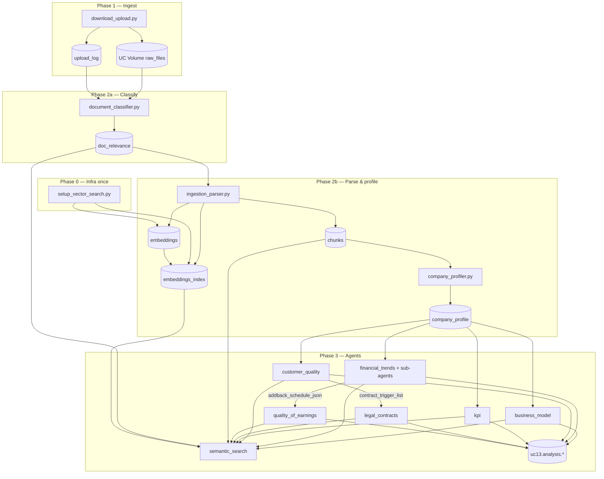

Section:      uc13-retrieval-reference
Version:      1.0.0
Last updated: 2026-06-20
Scope:         UC-13 (Use Case 13) product intent, pipeline architecture, and retrieval layer — distilled from Guidelines, backend-api docs, databricks developer context, architecture notes, and implementation code
Status:        living reference (read-only synthesis)

# UC-13 & retrieval — consolidated reference

Single authoritative distillation of **Use Case 13** (PE data-room diligence on Databricks) and everything **directly or adjacently** related to **document retrieval** (`semantic_search` and upstream indexing). Intended for engineers, architects, and product reviewers working on UC13 without re-reading every source file.

**Companion docs (deeper slices):**

| Doc | Focus |
|-----|-------|
| [uc13-retrieval-map.md](./uc13-retrieval-map.md) | Per-file inventory, call graph, parameter matrix |
| [retrieval-layer-review.md](./retrieval-layer-review.md) | Adversarial design review of `semantic_search()` |
| [architecture/rallyday/](./architecture/rallyday/) | Cross-repo seams, contracts, failure taxonomy |
| [PROJECT_HISTORY.md](../PROJECT_HISTORY.md) | Branch status, commit narrative |

---

## 1. Source provenance

| Source | Path | Status in workspace | Used for |
|--------|------|---------------------|----------|
| Client diligence brief | `databricks/Guidelines/Austin_email_guidelines.txt` | Present | Product goals, 9 diligence categories, citation expectations |
| Engineering/product spec v2 | `databricks/Guidelines/PE_Diligence_Agent_Spec_v2.pdf` | Present (binary) | Multi-agent architecture, priority tiers, threshold philosophy, agent roster |
| Databricks developer guide | `databricks/CLAUDE.md` | Present | Pipeline phases, Delta catalog, retrieval params, testing order |
| Workflow ops guide | `databricks/workflows/README.md` | Present | Secrets, deployment, dependency order |
| Workflow DAG | `databricks/workflows/uc13_ingestion_pipeline.yml` | Present | Task graph, Phase 3 agent dependencies |
| Retrieval implementation | `databricks/agents/shared/retrieval.py` | Present | Authoritative runtime behavior |
| Backend API architecture | `backend-api/docs/architecture.md` | Present | Garden track layering (adjacent) |
| Backend API REST docs | `backend-api/docs/api/*.md` | Present | Rules & companies APIs (no UC13 endpoints) |
| Local reference docs | `databricks/context_docs/` | **Not committed** — local-only per `CLAUDE.md` | Unknown content; not in repo |
| Architecture folder | `.dev/architecture/rallyday/*.md` | Present (untracked) | Integration seams, coupling, contracts |

---

## 2. Executive summary

### 2.1 What UC-13 is

UC-13 is a **Databricks-native private-equity diligence pipeline** for Rallyday Partners. It:

1. Ingests a target company’s **data room** (SharePoint → Unity Catalog Volume).
2. **Classifies** each file with workstream tags and priority tiers.
3. **Parses** approved files into semantic **chunks**, generates **BGE embeddings**, and syncs a **Vector Search** index.
4. Runs **workstream agents** that retrieve relevant chunks and extract structured diligence outputs to `uc13.analysis.*` Delta tables.

The client cares most about **analysis**, not automated download. Austin’s brief emphasizes first-pass associate behavior: orient to the business, test the story against data, surface red flags, generate diligence questions, and produce **source-linked** work product with confidence scoring.

### 2.2 What retrieval is in this system

Retrieval is **not** a standalone microservice. It is a single Python function — `semantic_search()` in `databricks/agents/shared/retrieval.py` — used by:

- **Phase 2b:** `company_profiler.py` (7 profiling dimensions)
- **Phase 3:** six workstream agents (+ three financial sub-agents)

Pattern: **embed query → Vector Search (`top_k × 3`) → SQL hydrate (chunks ⋈ doc_relevance) → Python post-filters → cap `top_k`**. On any failure, **keyword `LIKE` fallback** over chunk text.

### 2.3 Monorepo context (adjacent systems)

Rallyday is a **dual-track monorepo**:

| Track | Modules | Unity Catalog | Retrieval |
|-------|---------|---------------|-----------|
| **Garden app** | `frontend`, `backend-api`, `backend-ai` | `garden.rules`, `salesforce_silver.opportunity_silver` | None — rules/companies via SQL/Genie |
| **UC-13 pipeline** | `databricks/jobs`, `databricks/agents` | `uc13.*` | `semantic_search` over `uc13.ingestion.embeddings_index` |

**No HTTP API exposes UC13 analysis or retrieval today.** `backend-api` documents rules CRUD and read-only companies (`opportunity_silver`); surfacing `uc13.analysis.*` in Garden is an **open product question** (see §12).

---

## 3. Product requirements (client & spec)

### 3.1 Austin email — core intent

From `Austin_email_guidelines.txt`:

**Priorities**

- Data-room **download automation** is low priority; team prefers files on their drive.
- **High value:** flag new data-room additions, summarize them.
- **Highest value:** agent behaves like an **Associate** doing first-pass diligence.

**Capability questions (product bar)**

| Question | Retrieval / implementation relevance |
|----------|--------------------------------------|
| Cite exact source document, page, Excel tab/cell? | Agents emit `Citation` objects (`document`, `location`, `raw_text`); chunks carry `file_name`, `section_header`, `page_start`, `source_type` — cell-level refs depend on parser quality |
| Compare across documents / flag inconsistencies? | **Not a retrieval feature** — spec Phase 4 Cross-Analysis Agent (not built) |
| Structured outputs by diligence category? | Six Phase 3 agents → `uc13.analysis.*` tables |
| Customize by industry / business model? | `company_profiler` → industry overlay; overlay-specific KPI/BMA fields |
| Data request list for missing items? | `_data_room_gaps` in agents |
| Leverage prior deals in same industry? | Spec: Databricks memory layer — **not implemented** |

**Nine diligence categories (map to agents)**

| # | Category | Primary agent(s) | Workstream tags (typical) |
|---|----------|------------------|---------------------------|
| 1 | Business model overview | `business_model_agent` | `BUSINESS_MODEL` |
| 2 | Customer quality & concentration | `customer_quality_agent` | `CUSTOMER` |
| 3 | Financial trend analysis | `financial_trends_agent` (+ sub-agents) | `FINANCIAL`, `QUALITY_EARNINGS` |
| 4 | KPI & operating metrics | `kpi_agent` | `KPI_OPS` |
| 5 | Contract & legal risk | `legal_contracts_agent` | `LEGAL` |
| 6 | Quality of revenue & earnings | `quality_of_earnings_agent` | `QUALITY_EARNINGS` |
| 7 | Forecast & underwriting support | **Partial** — FTA `opex_sub_agent` projections; no dedicated Forecast Agent | `FORECAST`, `FINANCIAL` |
| 8 | Red flags & diligence questions | All agents (flags, gaps, questions) | — |
| 9 | Deal team workflow / output format | Partial — `md_to_word.py`; no Orchestrator | — |

### 3.2 PE Diligence Agent Spec v2.0 — architecture (PDF)

**Five-phase target architecture** (spec) vs **current implementation**:

| Spec phase | Spec agents | Implemented? | Notes |
|------------|-------------|--------------|-------|
| 1 · Ingestion | Ingestion Agent | **Partial** | `download_upload.py` + parser; no separate “ingestion agent” LLM wrapper |
| 2 · Dual classification | Document Classifier + Company Profiler | **Yes** | Sequential in workflow (not parallel as spec suggests) |
| 3 · Parallel workstreams | BMA, CQA, FTA, KPI, Legal, QoE, **Forecast** | **6 of 7** | No `forecast_agent.py`; forecast queries live in FTA sub-agents |
| 4 · Cross-analysis | Cross-Analysis Agent | **No** | Reconciliation, CIM vs data room, top-10 issues |
| 5 · Synthesis | Orchestrator Agent | **No** | Final memo, one-pager, risk grid |

**Cross-cutting (spec)**

- **Citation & provenance** — required on every fact; `agent_base.Citation` + `ToolResult.source_docs`; confidence high/medium/low.
- **Human-in-the-loop memory** — overrides in Databricks memory — **not implemented**.
- **Threshold philosophy** — flags only, never block deals; agents use `Flag` with Austin thresholds for tech_services / healthcare overlays.

**Document Priority Tier (spec §0.3)** — drives classifier + parser ordering:

| Priority | Document type | Retrieval impact |
|----------|---------------|------------------|
| 1 | CIM / OM | CIM-first sorting in `build_focused_context()`; filename filters across agents |
| 2 | QofE report | `QUALITY_EARNINGS` + `FINANCIAL` workstream filters |
| 3 | Financial model / forecast | Excel `table` chunks; `FORECAST` tag |
| 4 | KPI dashboard | `KPI_OPS` |
| 5 | Customer revenue workbook | `CUSTOMER` |
| 6 | Pipeline / backlog | `KPI_OPS`, `FINANCIAL` |
| 7 | Cap table | Parsed if present; limited dedicated retrieval |
| 8–10 | Top customer contracts | Legal agent; CQA generates `contract_trigger_list` for Legal |

Phase 1 posture (spec): **stated metrics as source of truth** — no complex cohort recomputation.

---

## 4. Pipeline architecture

### 4.1 Phase diagram



### 4.2 Workflow task order (`uc13_ingestion_pipeline.yml`)

| Task | Depends on | Retrieval prerequisite |
|------|------------|------------------------|
| `setup_vector_search` | — | Creates index |
| `download_upload` | setup | — |
| `document_classifier` | download | — |
| `ingestion_parser` | classifier | Writes embeddings; **blocks on index sync** |
| `company_profiler` | parser | **First `semantic_search` consumer** |
| `business_model_agent` | profiler | Chunks + index current |
| `financial_trends_agent` | profiler | Same |
| `customer_quality_agent` | profiler | Same |
| `kpi_agent` | profiler | Same |
| `legal_contracts_agent` | **customer_quality** | SQL read of `contract_trigger_list` + retrieval |
| `quality_of_earnings_agent` | **financial_trends** | SQL read of `addback_schedule_json` + retrieval |

`ensure_coverage.py` is **not** a workflow task — run ad hoc from `test_pipeline.ipynb` when workstream coverage gaps exist.

### 4.3 Unity Catalog — `uc13` Delta tables

| Table | Writer | Reader (retrieval-related) |
|-------|--------|----------------------------|
| `uc13.ingestion.upload_log` | `download_upload.py` | Classifier (Phase 1 priority signals) |
| `uc13.classification.doc_relevance` | `document_classifier.py` | Parser gate; **JOIN at hydrate** in `semantic_search` |
| `uc13.ingestion.chunks` | `ingestion_parser.py`, `ensure_coverage.py` | **JOIN at hydrate** |
| `uc13.ingestion.embeddings` | Same | Vector index source table |
| `uc13.ingestion.embeddings_index` | `setup_vector_search.py` | `query_index` in retrieval |
| `uc13.classification.company_profile` | `company_profiler.py` | Agents read via SQL (overlay), not via VS |
| `uc13.analysis.*` | Phase 3 agents | Downstream; peer SQL reads (FTA→QoE, CQA→Legal) |

**Volume path:** `/Volumes/uc13/ingestion/raw_files/{company_name}/`

### 4.4 Workstream taxonomy

Canonical tags (`document_classifier.py` → `_VALID_WORKSTREAMS`):

```
FINANCIAL | CUSTOMER | KPI_OPS | LEGAL | QUALITY_EARNINGS | FORECAST | BUSINESS_MODEL | BACKGROUND
```

Stored as `ARRAY<STRING>` on `doc_relevance` and copied to embeddings rows. **No single const module** — convention across pipeline; drift breaks `workstream_filter` (known coupling surface).

**Priority tiers:** `1` (highest) … `3` (useful); `null` only when `should_parse=false`. Rule: `should_parse=true` ⇒ tier must be 1–3.

### 4.5 Ingestion modes (never mix)

| Mode | Entry | Behavior | When |
|------|-------|----------|------|
| **Full rebuild** | `ingestion_parser.main()` | DELETE company rows → reparse all `should_parse=true` → APPEND | Parser logic changes |
| **Gap fill** | `ensure_coverage.ingest_missing()` | APPEND only | Missing workstream coverage after `get_coverage_report()` |

After parser changes, **re-run Cell 7** in `test_pipeline.ipynb` — existing chunks do not auto-update.

### 4.6 Chunk `source_type` (retrieval-relevant)

| Value | Origin | Retrieval behavior |
|-------|--------|-------------------|
| `text` | `ai_parse_document` prose | Default |
| `table` | HTML table → markdown | `source_type_priority=True` sorts before text in financial queries |
| `vision` | PyMuPDF + vision LLM (sparse financial pages) | Same as table for priority |

Adding a type requires updates to: `Chunk` dataclass, parser DDL, `ensure_coverage.py`, `retrieval.py` SELECT.

### 4.7 Index setup & sync

**`setup_vector_search.py`** creates:

- Schemas: `uc13.ingestion`, `uc13.classification`
- Volume: `uc13.ingestion.raw_files`
- Table: `uc13.ingestion.embeddings` (CDF enabled, 1024-dim `embedding`)
- Endpoint: `uc13-vector-search` (default)
- Index: `uc13.ingestion.embeddings_index` (Delta Sync, TRIGGERED pipeline)

**`columns_to_sync`:** `chunk_id`, `doc_id`, `file_name`, `workstream`, `priority_tier`

**Not indexed** (filtered only post-query or in SQL): `company_name`, `source_type`, `chunk_text`, similarity scores.

**`ingestion_parser._wait_for_index_sync`** — triggers `sync_index`, polls DLT pipeline until terminal + row counts match. **Do not run retrieval until sync completes.**

---

## 5. Retrieval layer — technical specification

### 5.1 API: `semantic_search()`

**Location:** `databricks/agents/shared/retrieval.py`

**Signature (defaults):**

```python
semantic_search(
    query: str,
    spark,
    top_k: int = 10,
    company_name: str | None = None,
    file_name_filter: list[str] | None = None,
    workstream_filter: list[str] | None = None,
    tier_filter: int | None = None,
    min_chunk_length: int = 100,
    index_name: str = "uc13.ingestion.embeddings_index",
    embedding_endpoint: str = "databricks-bge-large-en",
    source_type_priority: bool = False,
    source_type_filter: list[str] | None = None,
) -> list  # Spark Row objects
```

**Return row fields:** `chunk_id`, `file_name`, `chunk_text`, `section_header`, `page_start`, `source_type`, `workstream`, `priority_tier`

**No similarity scores returned.**

### 5.2 Algorithm (step-by-step)

1. **Embed** query via `mlflow.deployments` → `databricks-bge-large-en` (1024-dim).
2. **Vector query** `WorkspaceClient().vector_search_indexes.query_index()` with `num_results = top_k * 3`, columns `chunk_id`, `doc_id`, `file_name` only.
3. **Hydrate** via Spark SQL:
   - `uc13.ingestion.chunks c`
   - JOIN `uc13.classification.doc_relevance r` ON `c.file_name = r.filename AND c.company_name = r.company_name`
   - WHERE `chunk_id IN (...)` AND optional `company_name`
   - **ORDER BY `r.priority_tier ASC NULLS LAST`** — **discards vector similarity order**
4. **Post-filters (Python driver):** `min_chunk_length`, `file_name_filter` (substring, case-insensitive), `workstream_filter` (array intersection), `tier_filter`, `source_type_filter`, optional `source_type_priority` re-sort within tier.
5. **Cap** to `top_k`.
6. **On any exception** (including empty vector results): keyword fallback — first 5 query tokens, `LIKE` on `chunk_text`, `should_parse=true`, same JOIN, tier sort, limit `fetch_k`.

### 5.3 Wrappers & context assembly

| Symbol | Location | Behavior |
|--------|----------|----------|
| `semantic_search_with_fallback` | `subagents/workstream/financial/context_utils.py` | If `len(chunks) < min_results` and `file_name_filter` set → retry without filename filter (re-embeds + re-queries) |
| `_semantic_search_with_fallback` | `workstreams/business_model_agent.py` | Duplicate of above + logs fallback to reasoning trace |
| `build_focused_context` | `context_utils.py` | CIM-first sort, per-chunk char limits by tier/source_type, dedupe, budget cap (15k–25k typical) |

FTA sub-agents use `context_utils`; BMA has its own copy — **consolidation recommended** (see retrieval-layer-review).

### 5.4 Design characteristics (rigorous assessment)

| Property | Behavior | Implication |
|----------|----------|-------------|
| Ranking | Tier-biased, not similarity-ranked | Function name oversells; final `top_k` ≠ “most similar” |
| Filters | Python post-filter, not VS metadata filters | `3×` over-fetch band-aid; aggressive filters can starve results |
| Tenancy | `company_name` filtered in SQL only | Global VS query may fetch other companies’ IDs first |
| Fallback | Broad `except Exception` | Empty VS, outages, bugs all → keyword mode; **no `mode` in return** |
| SQL | String interpolation | Quote/special-char risk in filenames, company names |
| Architecture | Two-hop, `.collect()` per call | ~45–55 searches per full pipeline run; driver-bound |

See [retrieval-layer-review.md](./retrieval-layer-review.md) for refactor priorities.

### 5.5 Failure taxonomy (observed)

| Mode | Layer | Handling |
|------|-------|----------|
| Vector Search unavailable / empty | L5 Infrastructure | Keyword `LIKE` fallback (degraded) |
| Filename filter too aggressive | L0 Input / config | Wrapper retry without filter |
| Index stale after parse | L5 | `_wait_for_index_sync` warning; empty profiler/agent results |
| Join miss (`file_name` ≠ `filename`) | L0 | Chunk loses workstream/tier metadata |

---

## 6. Retrieval consumers — per-agent inventory

### 6.1 `company_profiler.py` — 7 dimensions

Each: `semantic_search` + filename-filter fallback (`top_k=5`).

| Dimension | Workstream filter | Filename hints |
|-----------|-------------------|----------------|
| `industry_overlay` | BUSINESS_MODEL | CIM, Business, Overview, Summary, Profile |
| `revenue_model` | BUSINESS_MODEL | same |
| `business_description` | BUSINESS_MODEL | same |
| `company_size_indicators` | FINANCIAL, BUSINESS_MODEL | CIM, Financial, P&L, Profit, EBITDA |
| `deal_type` | BUSINESS_MODEL | CIM, Business, Overview, Summary |
| `banked_vs_nonbanked` | BUSINESS_MODEL | CIM, Offering, OM |
| `vertical_subsector` | BUSINESS_MODEL | CIM, Business, Overview, Summary, Profile |

**Overlays detected:** `healthcare`, `tech_services`, `b2b_saas`, `industrial`, `consumer`

### 6.2 `business_model_agent.py` — 9 tools

All via `_semantic_search_with_fallback` (`min_results=3`, `min_chunk_length=150`, `top_k` 3–18).

Tools cover: company overview, management/ownership, workforce, pricing/margins, clients/utilization, GTM, backlog/retention, business changes/tech, CIM executive summary. Workstream filters: primarily `BUSINESS_MODEL`, often paired with `FINANCIAL`, `CUSTOMER`, `KPI_OPS`.

### 6.3 `financial_trends_agent.py` — sub-agents

Orchestrator delegates to `RevenueSubAgent`, `EbitdaSubAgent`, `OpexSubAgent` — each 3–6 `semantic_search_with_fallback` calls.

| Sub-agent | Focus | Notable retrieval params |
|-----------|-------|--------------------------|
| Revenue | P&L, segments, geography, concentration, QuickBooks | `source_type_priority=True` on concentration |
| EBITDA | P&L/EBITDA, margins/addbacks, DSO/WC | `QUALITY_EARNINGS` on margin/addback queries |
| OPEX | OpEx, DPO/AP, projected OPEX | Forecast/Model filename hints |

Context: `build_focused_context` with 15k–25k char budgets.

### 6.4 Other Phase 3 agents — 5 tools each

| Agent | Workstream filters (typical) | top_k range | Non-retrieval inputs |
|-------|------------------------------|-------------|----------------------|
| `customer_quality_agent` | CUSTOMER (+ FINANCIAL, QUALITY_EARNINGS, BUSINESS_MODEL, KPI_OPS per tool) | 6–12 | — |
| `kpi_agent` | KPI_OPS (+ FINANCIAL, BUSINESS_MODEL) | 6–12 | Overlay from `company_profile` |
| `legal_contracts_agent` | LEGAL | 6–12 | `contract_trigger_list` from CQA (SQL) |
| `quality_of_earnings_agent` | QUALITY_EARNINGS (+ FINANCIAL) | 6–12 | `addback_schedule_json` from FTA (SQL) |

### 6.5 Call graph summary

```
semantic_search (retrieval.py)
├── company_profiler.py           [7 calls, inline fallback]
├── business_model_agent.py       [9 calls, _semantic_search_with_fallback]
├── customer_quality_agent.py     [5 direct]
├── kpi_agent.py                  [5 direct]
├── legal_contracts_agent.py      [5 direct]
├── quality_of_earnings_agent.py  [5 direct]
└── context_utils.semantic_search_with_fallback
    ├── revenue_sub_agent.py      [5–6]
    ├── ebitda_sub_agent.py       [4]
    └── opex_sub_agent.py         [3]

Smoke tests: 00_setup_vector_search.ipynb, test_pipeline.ipynb
```

**Estimated invocations per full run:** ~45–55 (before filename-filter retries).

Full per-tool query strings: see [uc13-retrieval-map.md](./uc13-retrieval-map.md) § Per-consumer retrieval inventory.

---

## 7. Agent infrastructure (retrieval-adjacent)

### 7.1 `WorkstreamAgent` (`agent_base.py`)

- `_tool_call()` — logs every retrieval step to reasoning trace (`ToolResult`: `tool_name`, `input_summary`, `output_summary`, `data`, `confidence`, `source_docs`).
- `Citation` — `claim`, `document`, `location`, `confidence`, `raw_text` (≤30 words).
- `_data_room_gaps` — missing document signals (feeds spec §8 data request list).
- `_call_llm()` — default `max_tokens=12_000`; FTA uses 16_000 for large schemas.

### 7.2 Model endpoints (`databricks/CLAUDE.md`)

| Role | Endpoint | Widget |
|------|----------|--------|
| Embeddings | `databricks-bge-large-en` | `embedding_endpoint` |
| Extraction LLM | `databricks-claude-sonnet-4-6` | `extraction_endpoint` |
| Narrative LLM | `databricks-claude-sonnet-4-6` | `llm_endpoint` |
| Vision (optional) | `databricks-claude-haiku-4-5` | `vision_endpoint` |

**Token caps:** Haiku/Llama 70B floor at 8,192 output tokens; Sonnet 4.6 required for 10–16K extraction schemas.

Workflow YAML still defaults `llm_endpoint` to `databricks-meta-llama-3-3-70b-instruct` — **runtime notebooks override to Sonnet** per developer guide.

---

## 8. Backend API — adjacent documentation

UC13 does **not** appear in backend-api. Documented for **Garden track** context and future integration seams.

### 8.1 Architecture (`backend-api/docs/architecture.md`)

```
HTTP (Express routes) → Services → Repositories → Databricks SQL | memory store
```

- `DATA_STORE=memory|databricks`
- TTL cache on read-heavy paths (`API_CACHE_TTL_SECONDS`)
- Table naming: `{DATABRICKS_CATALOG}.{DATABRICKS_SCHEMA}.rules` vs fixed `salesforce_silver.opportunity_silver`

### 8.2 REST APIs (`backend-api/docs/api/`)

| API | Prefix | UC13 relation |
|-----|--------|---------------|
| Rules CRUD | `/api/rules` | Garden diligence **rules** — separate from UC13 agents |
| Companies read | `/api/companies` | Salesforce opportunities for **My Garden** — potential future link to UC13 company name |
| Config | `/api/config` | Reports cache settings |

**Companies API:** owner-scoped via interim email (`CompaniesService`); no auth yet.

**Rules API:** AI rules authored via `backend-ai` Genie, persisted with `rule_definition` JSON + extracted `python_source`.

### 8.3 Potential future seam (not built)

```
Garden UI → new REST endpoints → uc13.analysis.* (Databricks SQL)
                         ↘ optional: on-demand semantic_search (not exposed today)
```

Catalog split: `garden.*` vs `uc13.*` — confirm deployment convention before wiring.

---

## 9. Integration seams (retrieval-related)

From `integration-seams.md`:

| Seam | Protocol | Retrieval note |
|------|----------|----------------|
| SharePoint → UC Volume | MSAL + Graph | Upstream of chunks |
| UC13 → Vector Search | `query_index` + BGE embed | Primary retrieval path |
| UC13 → model serving | mlflow.deployments | Query embedding + agent LLM |
| UC13 → Delta `uc13.*` | Spark SQL | Hydration join, agent outputs |
| Frontend → backend-api | REST JSON | No retrieval |

---

## 10. Operational guide (condensed)

### 10.1 Secrets (`workflows/README.md`)

Scope `uc13`: `sp_tenant_id`, `sp_client_id`, `sp_client_secret`, `sp_site_url`, `sp_folder_path`

### 10.2 Test order (`test_pipeline.ipynb` / `CLAUDE.md`)

1. Cell 0 — `%pip install`
2. Cell 1 — widgets + `os.environ` sync
3. Cell 7 — `ingestion_parser.main()` after parser changes
4. Cell 8 — chunk stats, `source_type` distribution
5. Cell 8c/8d — coverage diagnostic / `ensure_coverage` if gaps
6. Cell 11+ — Phase 3 agents

### 10.3 Common failures

| Symptom | Cause | Fix |
|---------|-------|-----|
| Profiler nulls | Index not synced | Wait for sync; check VS UI |
| Empty agent retrieval | Workstream tag mismatch | Run 8c coverage; `ensure_coverage` |
| All BACKGROUND classification | LLM endpoint down | Check serving endpoint |
| Truncated JSON extraction | Token limit | Sonnet + explicit `max_tokens` |

---

## 11. Spec vs implementation gap matrix

| Spec requirement | Status | Retrieval impact |
|------------------|--------|------------------|
| Priority Tier processing order | Implemented in classifier + parser ORDER BY | Tier dominates final chunk ranking |
| Seven parallel Phase 3 agents | Six agents; Forecast folded into FTA | FORECAST tag exists; no dedicated agent |
| Cross-Analysis Agent | Not built | No automated cross-doc reconciliation |
| Orchestrator / final memo | Not built | — |
| Citation on every fact | Partial — agent dataclasses | Chunk metadata supports page/section; cell refs vary |
| Databricks memory / overrides | Not built | — |
| Human-in-the-loop | Not built | — |
| VS metadata filters at query time | Not built | Post-filter architecture |
| `company_name` in index | Not built | Multi-company index isolation gap |
| Garden UI surfacing | Not built | No API |

---

## 12. Open questions

**Product**

- Is tier-biased ranking intentional or accidental (`ORDER BY priority_tier`)?
- Should keyword fallback surface as degraded mode in agent traces?
- Is one shared `embeddings_index` multi-company in production?
- Will `uc13.analysis.*` surface in Garden UI — and via what API?

**Engineering**

- Consolidate `_semantic_search_with_fallback` duplicates?
- Add `company_name`, `source_type` to `columns_to_sync`?
- Single module for workstream tag constants?
- Commit or gitignore `.dev/architecture/`?

**Sources**

- What is in local `databricks/context_docs/`? Should it be documented or partially committed?

---

## 13. Key file index

| Concern | Path |
|---------|------|
| Retrieval API | `databricks/agents/shared/retrieval.py` |
| FTA retrieval wrapper + context | `databricks/agents/subagents/workstream/financial/context_utils.py` |
| Agent base / citations | `databricks/agents/shared/agent_base.py` |
| Embeddings writer | `databricks/jobs/scripts/ingestion_parser.py` |
| Index setup | `databricks/jobs/scripts/setup_vector_search.py` |
| Classification | `databricks/jobs/scripts/document_classifier.py` |
| Company profiler | `databricks/jobs/scripts/company_profiler.py` |
| Coverage gap fill | `databricks/jobs/scripts/ensure_coverage.py` |
| Workflow DAG | `databricks/workflows/uc13_ingestion_pipeline.yml` |
| E2E test | `databricks/jobs/notebooks/test_pipeline.ipynb` |
| Client brief | `databricks/Guidelines/Austin_email_guidelines.txt` |
| Build spec PDF | `databricks/Guidelines/PE_Diligence_Agent_Spec_v2.pdf` |
| Developer context | `databricks/CLAUDE.md` |
| File-level retrieval map | `.dev/uc13-retrieval-map.md` |
| Design critique | `.dev/retrieval-layer-review.md` |

---

## 14. Document history

| Version | Date | Change |
|---------|------|--------|
| 1.0.0 | 2026-06-20 | Initial consolidated distillation from Guidelines, PE spec v2 PDF, backend-api docs, databricks/CLAUDE.md, workflows, architecture folder, and implementation code |
