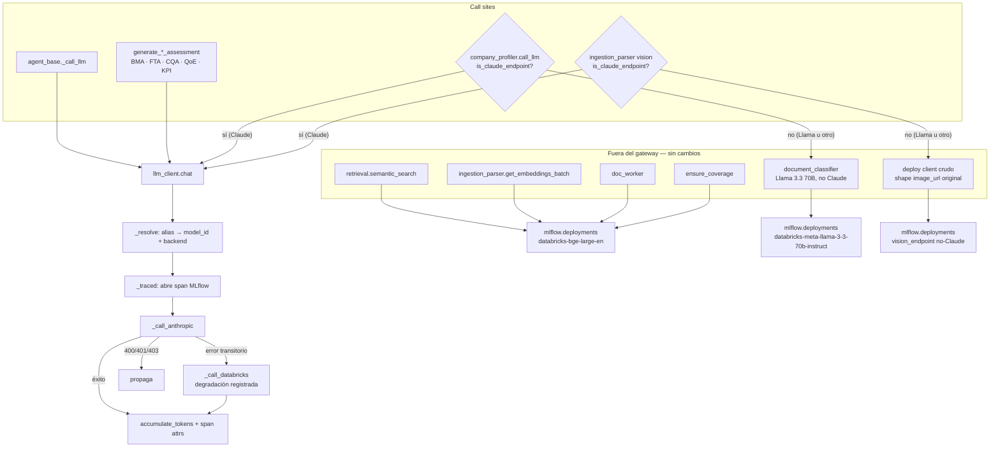

# Migración a Anthropic SDK — Diseño

**Spec**: `.specs/features/anthropic-sdk-migration/spec.md`
**Context**: `.specs/features/anthropic-sdk-migration/context.md`
**Status**: Draft
**Enfoque confirmado**: C — gateway con SDK directo, con External Model endpoint documentado como contingencia si ASDK-13 sale `BLOCKED`.

---

## Hallazgos de investigación (Knowledge Verification Chain)

Verificados antes de diseñar. Cada uno cambió una decisión.

| # | Hallazgo | Fuente | Impacto en el diseño |
|---|---|---|---|
| R-1 | `mlflow.anthropic.autolog()` existe y captura prompts, latencias, modelo, tokens y excepciones. Rango de `anthropic` probado: `0.55.0 ≤ v ≤ 0.107.1`. No registra streaming. | [MLflow — Tracing Anthropic](https://mlflow.org/docs/latest/genai/tracing/integrations/listing/anthropic) | La versión actual del SDK es 1.3.0, fuera del rango. Autolog pasa a ser enriquecimiento opcional con detección de versión; la instrumentación primaria es manual en el gateway. Enmienda a ASDK-10 aprobada por el usuario. |
| R-2 | El SDK `anthropic` 1.x corre sobre `httpx2` (no `httpx`) y requiere Python ≥ 3.10. Última versión: 1.3.0. | [PyPI — anthropic](https://pypi.org/pypi/anthropic/json) | El proyecto ya pide `>=3.11`, sin conflicto. Abrió el riesgo C-4 (`httpx2` como dependencia transitiva nueva), **cerrado el 2026-09-01 por T3**: importa limpio en serverless. |
| R-3 | Databricks Model Serving soporta **External Models** con provider `anthropic` nativo, la API key vía `{{secrets/scope/key}}`, y se consulta con el mismo `client.predict()` OpenAI-compatible. | [Databricks — External models in Model Serving](https://docs.databricks.com/aws/en/generative-ai/external-models/) | Habilita la ruta de contingencia B sin reescribir código: solo cambian los strings de endpoint. |
| R-4 | Mosaic AI Agent Evaluation y Agent Bricks operan sobre Model Serving endpoints; Agent Bricks "Custom LLM" está marcado **legacy** en la documentación actual. | [Databricks — Custom agent endpoints](https://developers.databricks.com/docs/agents/custom-agents), [Agent Bricks Custom LLM (legacy)](https://docs.databricks.com/aws/en/agents/agent-bricks/custom-llm) | Refuerza que ASDK-14 sea spike con veredicto citado y no promesa. Señal temprana: Agent Bricks probablemente exige un endpoint servido, no un cliente Anthropic in-process. |

**Lo que no pude determinar y no voy a inventar:** si Agent Bricks acepta como backend un endpoint external-model de Anthropic, o si exige un modelo alojado en Databricks. La documentación pública no lo resuelve. Es exactamente el objeto de ASDK-14 y debe cerrarse con una prueba ejecutada, no con lectura.

---

## Architecture Overview

Un único punto de entrada (`llm_client.chat`) absorbe las 8 llamadas de chat/visión que sí llaman a Claude (2 de ellas, `company_profiler` e `ingestion_parser` vision, condicionalmente — ver AD-002). Los call sites siguen pasando el mismo string de endpoint estilo Databricks que pasan hoy; la traducción a model ID de Anthropic ocurre dentro del gateway. Los embeddings no cruzan el gateway: siguen yendo directo al deploy client.

> **Corrección post-Design (T19, 2026-09-02):** el diagrama original incluía `document_classifier` como call site del gateway. Se descubrió durante T19 que su endpoint hardcodeado es `databricks-meta-llama-3-3-70b-instruct` (Llama, no Claude) — investigación insuficiente en esta fase de Design, que verificó el nombre de la variable `_CLASSIFIER_ENDPOINT` pero no su valor. Movido al subgrafo "fuera del gateway".
>
> **Corrección post-Design (T20, 2026-09-02):** `company_profiler` no es un call site incondicional del gateway. Su `llm_endpoint` es paramétrico: el job standalone de Phase 1-2 (`uc13_ingestion_pipeline.yml`) lo defaultea a Llama; `run_full_pipeline.py` (Phase 1-5) lo defaultea a Claude Sonnet. `call_llm()` consulta `llm_client.is_claude_endpoint(endpoint)` antes de decidir la ruta.
>
> **Corrección post-Design (T21, 2026-09-02):** mismo hallazgo (AD-002) en la extracción de visión de `ingestion_parser`. Su `vision_endpoint` también es paramétrico, y el propio código fuente nombra `databricks-meta-llama-3-2-11b-vision-instruct` como valor válido. El diagrama muestra ambas ramas condicionales.



### Contrato de traducción

| Alias que pasa el call site | Model ID de Anthropic | Backend de fallback |
|---|---|---|
| `databricks-claude-sonnet-4-6` | `claude-sonnet-4-6` | endpoint `databricks-claude-sonnet-4-6` |
| `databricks-claude-haiku-4-5` | `claude-haiku-4-5` | endpoint `databricks-claude-haiku-4-5` |

Tabla explícita, no derivación por string. Un alias ausente es `ValueError` (ASDK-03) — prefiero un fallo ruidoso al arranque que un model ID inventado que la API rechaza 200 llamadas después.

---

## Code Reuse Analysis

### Componentes existentes a aprovechar

| Componente | Ubicación | Cómo se usa |
|---|---|---|
| `accumulate_tokens()` / `get_token_breakdown()` / `print_token_summary()` | `agents/shared/agent_base.py:48-110` | Se reutilizan sin cambiar su firma. El gateway normaliza el `usage` de Anthropic a la forma `prompt_tokens`/`completion_tokens`/`total_tokens` antes de llamarlas. Solo `print_token_summary()` se extiende para reportar backend y degradaciones (ASDK-11). |
| `_ENDPOINT_PRICING` | `agents/shared/agent_base.py:35` | Se conservan las claves estilo Databricks; se actualizan los valores a tarifas first-party y se anota que aplican cuando el backend fue `anthropic`. |
| Patrón `get_param()` / `get_secret()` | `agents/workstreams/financial_trends_agent.py:71-104` (y 17 copias más) | El gateway replica el patrón, incluido `_get_dbutils()` y el scope `uc13` por defecto. **No refactorizo las 18 copias** — está fuera de alcance. |
| `_get_dbutils()` con fallback a `IPython.get_ipython().user_ns` | mismo archivo | Necesario para que el gateway lea secretos siendo un módulo importado, no una celda. |
| `mlflow.start_span()` | `agents/orchestration/pipeline.py:418, 548` | Los spans del gateway se anidan bajo los `agent::{key}` existentes. El patrón de `import mlflow` dentro de `try/except ImportError` ya establecido ahí se repite. |
| `_parse_json_response()` y `_recover_truncated_json()` | `agents/shared/agent_base.py:204-295` | **Intactos.** El gateway devuelve texto crudo, así que el recuperador de JSON truncado sigue operando igual. Esto es lo que hace que `stop_reason == "max_tokens"` deba devolver el texto parcial y no lanzar. |
| `SparkSession.builder.getOrCreate()` en hilos | `pipeline.py` `_run_agent()` | Precedente de cómo el código maneja recursos compartidos bajo `ThreadPoolExecutor`. El gateway sigue la misma filosofía: un cliente compartido, construido bajo lock. |

### Puntos de integración

| Sistema | Método de integración |
|---|---|
| Databricks Secret Scope `uc13` | Nueva clave `anthropic_api_key`. Prerequisito operativo, no tarea de código. |
| Job VDR `617196299594076` | Sin cambios de configuración. La nueva variable `LLM_BACKEND` se lee de env con default `anthropic`. |
| Los 4 YAMLs de workflow | Sin cambios. Los defaults de `llm_endpoint` / `extraction_endpoint` / `vision_endpoint` siguen siendo los strings `databricks-claude-*` (ASDK-09 AC5). |
| Databricks Git folder | La ruta de despliegue no cambia: push → `databricks repos update <id> --branch <b>`. |

---

## Components

### `llm_client` — el gateway

- **Propósito**: Ser el único camino por el que el pipeline habla con Claude, con dos backends intercambiables y degradación automática.
- **Ubicación**: `databricks/agents/shared/llm_client.py`
- **Interfaces**:
  - `chat(*, system_prompt: str | None, user_content: str | list[dict], endpoint: str, max_tokens: int, temperature: float = 0.0) -> tuple[str, dict]` — devuelve `(texto, usage)`. `user_content` acepta `str` para texto o una lista de bloques para visión.
  - `get_fallback_count() -> int` — número de degradaciones de la corrida (ASDK-06 AC6).
  - `reset_fallback_count() -> None` — llamado junto a `reset_token_counter()` al inicio de cada corrida.
  - `resolve_model(endpoint: str) -> str` — traducción alias → model ID; pública porque el smoke test la ejerce.
  - `is_claude_endpoint(endpoint: str) -> bool` — predicado público (**añadido en T20**). Para call sites con endpoint paramétrico que legítimamente puede resolver a un modelo no-Claude (`company_profiler.call_llm`, descubierto en T20) — deciden si llamar a `chat()` o al deploy client crudo, en vez de dejar que `resolve_model()` lance `ValueError` a mitad de una corrida.
- **Dependencias**: `anthropic>=1.3.0`, `mlflow` (opcional en tiempo de ejecución), `mlflow.deployments` (para la ruta de fallback).
- **Reutiliza**: `accumulate_tokens`, patrón `get_param`/`get_secret`, patrón `mlflow.start_span` de `pipeline.py`.

**Estructura interna** (funciones privadas, una responsabilidad cada una — el gateway no debe convertirse en un módulo que hace tres cosas):

| Función | Responsabilidad |
|---|---|
| `_active_backend()` | Lee `LLM_BACKEND`, valida contra `{"anthropic","databricks"}`, `ValueError` si no. |
| `_get_anthropic_client()` | Construcción perezosa bajo `threading.Lock`, una sola vez por proceso (ASDK-08 AC3). Resuelve la key. `timeout=600`, `max_retries=2`. |
| `_to_anthropic_content(user_content)` | Convierte bloques `image_url` con data-URI a `{"type":"image","source":{"type":"base64",...}}`. Solo se invoca en la ruta Anthropic (ASDK-09 AC2/AC3). |
| `_normalize_usage(anthropic_usage)` | `input_tokens`→`prompt_tokens`, `output_tokens`→`completion_tokens`, suma a `total_tokens` (ASDK-11 AC1). |
| `_call_anthropic(...)` | Una llamada `client.messages.create`. Traduce `stop_reason` según la tabla de errores. |
| `_call_databricks(...)` | La llamada `client.predict()` actual, extraída tal cual del código existente. |
| `_is_retryable(exc)` | Clasifica la excepción. Es la función que decide si hay degradación — se testea aislada. |
| `_route_and_maybe_fallback(...)` | Envuelve `_call_anthropic`/`_call_databricks` con la lógica de degradación de T10. Devuelve `(texto, usage, fallback_used)` — **`fallback_used` es el valor de retorno de esta llamada específica, no un diff sobre `_fallback_count`**. Implementado así (no como se bocetó al inicio de Design) porque `pipeline.py` corre agentes concurrentes vía `ThreadPoolExecutor`: un diff sobre el contador global atribuiría a esta llamada la degradación de otro hilo bajo una carrera. |
| `_maybe_enable_autolog()` | Detecta versión de `anthropic` y activa autolog solo si cae en el rango probado (ASDK-10 AC3/AC4). Confirmado en el gate de egress (2026-09-01): el entorno real corre `1.3.0`, fuera de rango — esta rama es la que se ejecuta en producción, no una hipótesis. |
| `_try_open_span()` | Abre el span de MLflow para una llamada de `chat()`, o devuelve `(None, None)` si falla cualquier paso (import, `start_span()`, `__enter__`). Nunca deja que un fallo de tracing bloquee la llamada al modelo. |
| `_safe_set_span_attributes(...)` | Fija los atributos del span (`llm.endpoint_alias`, `llm.backend`, `llm.fallback_used`, `llm.max_tokens`, tokens) sin dejar que un fallo de MLflow propague. La API key nunca aparece aquí. |

### `check_anthropic_egress` — el gate

- **Propósito**: Probar conectividad y credencial reales desde el job serverless antes de tocar producción.
- **Ubicación**: `databricks/jobs/scripts/check_anthropic_egress.py`
- **Interfaces**: `main() -> int` — imprime `ANTHROPIC_EGRESS_OK <model_id>` o `ANTHROPIC_EGRESS_BLOCKED <razón>` por cada model ID del mapeo; sale distinto de cero si alguno falla.
- **Dependencias**: `llm_client.resolve_model`, `anthropic`.
- **Reutiliza**: el patrón upload-then-submit de `.dev/scripts/t2_databricks_submit.py` para el envío.
- **Nota**: también reporta la versión instalada de `anthropic` y si `_maybe_enable_autolog()` la aceptó — así el gate resuelve empíricamente el riesgo R-1 en la misma corrida.

### Call sites — cambio mecánico

Los 11 sitios pasan de construir su propio deploy client a `from agents.shared.llm_client import chat`. El más invasivo es el de visión (`ingestion_parser.py:757`), único que pasa una lista de bloques; los otros diez pasan `str`.

---

## Data Models

### `usage` normalizado (la forma que ya consumen los contadores)

```python
{"prompt_tokens": int, "completion_tokens": int, "total_tokens": int}
```

### Atributos del span de MLflow (ASDK-10 AC1)

```python
{
    "llm.endpoint_alias": "databricks-claude-sonnet-4-6",
    "llm.model_id":       "claude-sonnet-4-6",
    "llm.backend":        "anthropic" | "databricks",
    "llm.fallback_used":  bool,
    "llm.max_tokens":     int,
    "llm.prompt_tokens":  int,
    "llm.completion_tokens": int,
}
```

La API key nunca aparece aquí (ASDK-08 AC4).

---

## Error Handling Strategy

| Escenario | Manejo | Impacto en el operador |
|---|---|---|
| `APIConnectionError`, `APITimeoutError` | Degrada a Databricks | La corrida sigue; `[llm_fallback]` en el log |
| `RateLimitError` (429) tras agotar los reintentos del SDK | Degrada a Databricks | Igual |
| `APIStatusError` con `status_code >= 500` | Degrada a Databricks | Igual |
| `BadRequestError` (400), `AuthenticationError` (401), `PermissionDeniedError` (403) | **Propaga.** No degrada | La corrida falla rápido. Deliberado: una key mal configurada no debe irse callada al serving durante 200 llamadas |
| `NotFoundError` (404) — model ID inválido | **Propaga** | Señala un mapeo roto; degradar lo escondería |
| Ambos backends fallan | Propaga la excepción de Databricks con la de Anthropic encadenada como `__cause__` | Log con las dos causas |
| `stop_reason == "max_tokens"` | Devuelve el texto parcial | Idéntico a hoy: `_recover_truncated_json()` lo salva y registra un `data_room_gap` |
| `stop_reason == "refusal"` | Lanza excepción nombrando `stop_details.category` | Mejor que devolver texto vacío que el parser leería como JSON corrupto |
| Respuesta sin bloque `text` | Devuelve `""` + advertencia | Replica lo que hoy produce un `content` vacío del serving |
| MLflow ausente o `start_span` lanza | La llamada al modelo se completa igual; advertencia | El tracing nunca tumba una corrida |
| `LLM_BACKEND` con valor inválido | `ValueError` al inicializar, nombrando los válidos | Falla al arranque, no a mitad de la fase 3 |
| `anthropic` no instalado con backend `anthropic` | `ImportError` con la instrucción de instalación | **No** degrada silenciosamente a Databricks |

---

## Risks & Concerns

| Concern | Ubicación | Impacto | Mitigación |
|---|---|---|---|
| **C-1 — El fallback reintroduce el cap de 8K de Haiku en silencio.** Una degradación en una llamada de extracción grande produce JSON truncado que `_recover_truncated_json()` "salva" parcialmente. El deliverable sale completo y plausible, con datos faltantes. | `agent_base.py:274` + gateway | Es la variante moderna de la trampa de "hollow success" ya documentada en `CLAUDE.md:334` | Contador de degradaciones expuesto en `print_token_summary()` (ASDK-06 AC6) + `[llm_fallback]` obligatorio en el log. Tarea de seguimiento: escribir el contador al registro VDR para que sea auditable post-hoc |
| **C-2 — `get_param`/`get_secret` está copiado 18 veces**, con el scope `uc13` hardcodeado en cada copia. | 18 archivos bajo `agents/` y `jobs/scripts/` | Cambiar el scope exige 18 ediciones; una omisión pasa desapercibida | El gateway replica el patrón en vez de refactorizarlo (fuera de alcance). Se registra como deuda; la nueva copia parametriza el scope vía `get_param("anthropic_secret_scope", default="uc13")` |
| **C-3 — El único gate real es una corrida VDR completa.** No hay suite de integración que ejerza el pipeline con un LLM stub. | Todo `agents/workstreams/` | Una regresión de forma de respuesta no se detecta hasta una corrida de horas | Los tests unitarios del gateway usan stubs de ambos clientes y cubren la matriz de errores. La paridad end-to-end (ASDK-12) sigue siendo manual y así se declara |
| ~~**C-4 — `anthropic` 1.x arrastra `httpx2`**~~ **CERRADO 2026-09-01** | `requirements.txt` | Era: posible conflicto con `httpx` de `mlflow[databricks]` o del SDK de Databricks | Materializado y descartado: T3 importó `anthropic 1.3.0` en el runtime serverless real y reportó la versión. Sin conflicto. Evidencia: `signoffs/ASDK-13-egress-gate.md` |
| **C-5 — Un Git folder alimenta ambos jobs VDR** y puede intercambiar código a mitad de corrida. | `CLAUDE.md:218` | Un `repos update` durante una corrida mezcla código viejo y nuevo | Restricción operativa preexistente. Rama `prod-known-good-fc47a29` sigue siendo el rollback. No desplegar durante una corrida activa |
| **C-6 — Los tests corren contra un Spark stub** que nunca ejecuta DDL real. | `CLAUDE.md:332` | Los tests no pueden probar nada del lado Delta | Sin impacto en esta feature: el gateway no toca Delta. Se registra para que nadie confunda "tests verdes" con "paridad verificada" |
| **C-7 — Autolog fuera de rango probado** (R-1). **CONFIRMADO 2026-09-01, no es hipotético.** | `requirements.txt` | El entorno real corre `1.3.0`, fuera de `0.55.0`–`0.107.1`: autolog quedará **inerte** en producción | Resuelto por diseño: instrumentación manual primaria, autolog condicionado a detección de versión. Consecuencia para T11: la rama que se ejecuta en este entorno es la de "fuera de rango", así que el tracing descansa **enteramente** en los spans manuales. Los tests de T11 deben cubrir igual la rama en-rango, porque un upgrade futuro de MLflow puede ampliar el rango soportado |

---

## Tech Decisions

| Decisión | Elección | Rationale |
|---|---|---|
| Frontera de la abstracción | Función `chat()`, no una clase cliente | Los 11 call sites son sin estado y de un solo turno. Una clase implicaría un ciclo de vida que nadie necesita |
| Alias en la firma pública | Los call sites siguen pasando `databricks-claude-*` | Deja intactos los 4 YAMLs, los widgets y los defaults de `get_param`; y hace trivial resolver el destino del fallback |
| Traducción alias → model ID | Tabla explícita | Un `str.replace("databricks-","")` convertiría un typo en un model ID plausible que falla lejos del origen |
| Clave de acumulación de tokens | El alias estilo Databricks | `_ENDPOINT_PRICING`, `get_token_breakdown()` y la columna de tokens del registro VDR ya dependen de esas claves |
| Instrumentación | Spans manuales primarios; autolog opcional | R-1: rango de versión, y autolog no cubre la ruta degradada. Enmienda aprobada |
| Errores no degradables | 400 / 401 / 403 / 404 propagan | Una credencial o un mapeo rotos deben fallar rápido, no esconderse tras el fallback |
| Contingencia si ASDK-13 falla | External Model endpoint (R-3) | Mismo `client.predict()`, key en secret scope, egress desde el control plane. No se implementa ahora; queda documentada abajo |
| Refactor de `get_param`/`get_secret` | No se hace | Fuera de alcance. Tocar 18 archivos multiplicaría el radio de impacto de una migración que ya toca 11 |

> **Decisión de nivel proyecto:** el enrutamiento de todo LLM de chat a través de `agents/shared/llm_client.py` es una convención que las features futuras deben seguir. Se registra como `AD-001` en `.specs/STATE.md`.

---

## Apéndice A — Ruta de contingencia B (External Model endpoint)

> **NO ACTIVADA.** ASDK-13 salió `OK` el 2026-09-01: hay egress desde serverless a `api.anthropic.com` (`signoffs/ASDK-13-egress-gate.md`). Este apéndice se conserva como diseño de respaldo, por si una política de red del workspace cambia más adelante y corta la ruta directa.

No se implementa en esta entrega. Se documenta para que un bloqueo futuro no deje al equipo sin salida.

Se crea un endpoint external-model por modelo, apuntando a la API de Anthropic con nuestra key:

```python
client.create_endpoint(
    name="anthropic-claude-sonnet-4-6",
    config={"served_entities": [{
        "external_model": {
            "name": "claude-sonnet-4-6",
            "provider": "anthropic",
            "task": "llm/v1/chat",
            "anthropic_config": {"anthropic_api_key": "{{secrets/uc13/anthropic_api_key}}"},
        }
    }]},
)
```

El gateway ya construido añade un tercer valor de `LLM_BACKEND` (`databricks_external`) que reusa `_call_databricks()` apuntando a estos endpoints nuevos. Cambia solo la tabla de mapeo.

**Lo que esta ruta NO da:** sigue sujeta al read timeout de serving (~120s) y a los caps de output del workspace, y `mlflow.anthropic.autolog()` no dispara — aunque los spans manuales del gateway sí, porque los abre el gateway y no el SDK. Es contingencia, no equivalencia.
