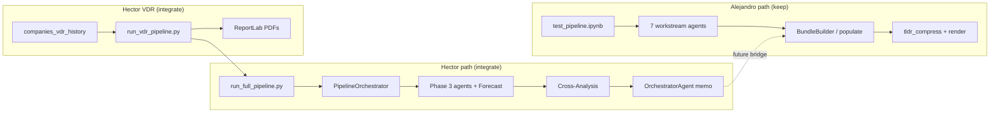

# Merge Scout — Hector `feature/ui-pipeline-integration` → Alejandro `dev`

> **Purpose:** Initial scouting brief for a merge/resolution agent (or human) integrating Hector's branch into Alejandro's pipeline-focused `dev` lineage.  
> **Not a merge execution** — no access to Hector's remote repo in this session; conclusions are from doc digest + Alejandro tree inspection.  
> **As of:** 2026-07-24  
> **Inputs:** `work_summary_ui_pipeline_integration.md`, `detailed_work_summary_ui_pipeline_integration.md`, `ALEJANDRO_GARAY_CONTRIBUTION_TIMELINE.md`, live `dev` tree.

---

## 1. Merge posture (recommended)

| Decision | Recommendation |
|----------|----------------|
| **Integration base** | **Alejandro `dev`** (`93f3462`, Jul 24) — eval harness, PHV hardening, legal rebuild, bundle orchestrator, 757 pytest, scored baselines |
| **Incoming branch** | Hector `feature/ui-pipeline-integration` (tip of chain from `develop` @ merge-base `0cb8791`, Jun 23) |
| **Direction** | Merge **Hector onto Alejandro** — preserve Alejandro invariants; port Hector net-new subsystems and agent depth |
| **Garden / UI (`develop` +72)** | **Out of scope for first pass** — Hector's own docs say zero `databricks/` overlap with those 72 commits; UI merge is a separate track |
| **Success criteria** | Full pytest green; FTA ≥16/18 & Legal ≥9/11 retained; Hector DAG + VDR runnable; no regression on `IndexSyncError` / catalog convention / `RouteResult` API |

---

## 2. Two lineages at a glance

### Alejandro (`dev`) — pipeline hardening & eval (Jun 23 – Jul 24)

| Metric | Value |
|--------|-------|
| Commits (Alejandro identities) | ~245 |
| Scope | `databricks/`, `eval/`, `tests/`, orchestrator bundle, PHV milestones |
| Orchestration model | **`databricks/agents/orchestrator/`** — `BundleBuilder`, `populate.py`, `tldr_compress.py`, Stage-6 synthesis, Rainmaker one-pagers |
| New packages | `eval/retrieval/` (harness, provenance, baselines, promotion gate) |
| Agents scored (Elder Care) | FTA 16/18 · Legal **9/11** · BMA 7/7 · CQA 3/6 · KPI 3/3 · QoE 5/6 · Profiler 7/7 |
| Production path | `test_pipeline.ipynb` + Volume `orchestrator_bundle.yaml` |
| Workflows | `uc13_ingestion_pipeline.yml` (ingestion-focused; PHV3 path hygiene) |

**Reference:** `ALEJANDRO_GARAY_CONTRIBUTION_TIMELINE.md`, `CHANGELOG.MD`, `my_runbook.md`

### Hector (`feature/ui-pipeline-integration`) — agents + DAG + VDR (Jun 28 – Jul 21)

| Metric | Value |
|--------|-------|
| Commits since merge-base | **36** |
| Files changed | **30** (14 added, 16 modified) |
| Lines | +10,985 / −2,410 |
| Orchestration model | **`agents/orchestration/`** — `PipelineOrchestrator` DAG (Phases 3–5), `OrchestratorAgent` diligence memo |
| New agents | **`forecast_agent.py`**, **`cross_analysis_agent.py`** |
| New pipelines | VDR (`run_vdr_pipeline.py`), job runners (`run_full_pipeline`, `run_ingestion_pipeline`, `run_diligence_pipeline`) |
| Agent hardening | QoE (+824 loc delta), CQA (+841), KPI (+1022) — guideline coverage, assessment generators, schemas |
| Workflows | `uc13_diligence_pipeline.yml`, `uc13_full_pipeline.yml`, `vdr_pipeline.yml` |
| UI hook | VDR triggered via `companies_vdr_history` table + PDF/DOCX deliverables |

**Reference:** `work_summary_ui_pipeline_integration.md`, `detailed_work_summary_ui_pipeline_integration.md`

---

## 3. Architectural fork — two orchestrators (critical)

This is the **highest-risk design collision**, not a simple file conflict.

| Dimension | Alejandro `orchestrator/` | Hector `orchestration/` |
|-----------|---------------------------|---------------------------|
| **Pattern** | Ingest agent Delta/YAML snapshots → deterministic `BundleBuilder` → optional Stage-6 LLM → Jinja render | Wave-scheduled DAG → run workstream agents → Cross-Analysis → memo assembly |
| **Output** | `orchestrator_bundle.yaml`, `full_report.md`, `tldr_one_pager.md` (compressed), DOCX via `md_to_word` | `final_diligence_memo.md` + `.docx`, manifest → `uc13.analysis.diligence_report` |
| **Parallelism** | FTA sub-agents (`ThreadPoolExecutor` + `contextvars` fix) | Phase-3 agent pool (`ThreadPoolExecutor` + Spark session injection) |
| **Eval integration** | Golden checklists, `record_e2e_linkage`, promotion gate | Run manifest + token/cost tracking (`agent_base` globals) |
| **Production status** | Validated 4/4 exec summaries, Rainmaker Rev3 | E2E tested per Hector commits; no Alejandro eval artifacts |

### Scout recommendation

**Do not pick one and delete the other in the first merge pass.**

1. **Keep Alejandro `orchestrator/`** as the stakeholder one-pager / bundle contract (eval harness + Rainmaker work depends on it).
2. **Land Hector `orchestration/` alongside** (rename namespace if needed to avoid import confusion — e.g. keep `orchestration/` vs `orchestrator/`).
3. **Bridge later** (explicit follow-on): map `diligence_report` / memo output into `orchestrator_bundle` ingest, or add a `BundleBuilder` stage that reads Hector manifest — product decision.



---

## 4. Conflict heatmap

Legend: 🔴 high · 🟡 medium · 🟢 low / add-only

| File / area | Heat | Alejandro state | Hector delta | Scout action |
|-------------|------|-----------------|--------------|--------------|
| `test_pipeline.ipynb` | 🔴 | Cells 1–19+, eval arms, orchestrator, halt-on-failure | +5,152 net JSON; QoE/CQA/KPI/VDR cells | **Manual cell merge** — inventory both cell maps before touching |
| `quality_of_earnings_agent.py` | 🔴 | ~800 lines; eval fixtures 5/6; f-string SQL in places | +824; Sonnet default, parameterized SQL, WC flags, `generate_qoe_assessment()` | **3-way merge** — keep Alejandro eval hooks; **port Hector SQL safety + QoE features** |
| `customer_quality_agent.py` | 🔴 | ~812 lines; checklist 3/6 | +841; guideline 2 full, `generate_customer_quality_assessment()` | Same as QoE |
| `kpi_agent.py` | 🔴 | ~841 lines; checklist 3/3 | +1022; enhanced schema | Merge; re-run KPI golden after |
| `legal_contracts_agent.py` | 🔴 | ~1913 lines; multi-pass M0–M3; **9/11** | +5 lines only per Hector inventory | **Keep Alejandro** — verify Hector's 5 lines aren't critical (likely trivial) |
| `financial_trends_agent.py` | 🟡 | ~1628 lines; provenance, basis_cross_check | +10 | Keep Alejandro; cherry-pick if Hector fixes are substantive |
| `business_model_agent.py` | 🟡 | ~2333 lines; BMA 7/7 | +17 | Keep Alejandro base; port small fixes |
| `ingestion_parser.py` | 🟡 | ~1424 lines; **`IndexSyncError`** fail-closed | +147 (VDR/token/chunk caps) | **Combine both** — do not drop index sync |
| `agent_base.py` | 🟡 | `_call_llm` max_tokens 12k default | Thread-safe `accumulate_tokens()` / global counter | **Merge** — tokens for VDR; ensure no clash with MLflow spans |
| `retrieval.py` | 🟡 | ~387 lines; `RouteResult`, provenance, merge-rank | +5 | **Keep Alejandro** |
| `shared/context_utils.py`, `fallback.py` | 🟢 | PHV4 unified fallback | — | Keep Alejandro (Hector doesn't list changes) |
| `ensure_coverage.py`, `document_classifier.py`, `company_profiler.py` | 🟡 | Alejandro touched indirectly | VDR-related edits | Merge; run coverage report cell |
| `connector.py` | 🟢 | — | QoE path fix | Port Hector fix |
| `databricks/CLAUDE.md` | 🟡 | Catalog convention, M-PHV1 gates, Excel merged cells | QoE/CQA docs, guidelines | **Merge sections** — both are valuable |
| `requirements.txt` | 🟢 | Base deps | +`pymupdf`; job yaml has `reportlab` | Add `pymupdf` + **`reportlab`** (Hector gap noted in his doc) |
| `eval/retrieval/*` | 🟢 | Entire package | None | **Keep Alejandro only** |
| `databricks/agents/orchestrator/*` | 🟢 | Entire package | None | **Keep Alejandro only** |
| `agents/orchestration/*` | 🟢 | **Missing** | **New** (pipeline.py, orchestrator_agent.py) | **Add from Hector** |
| `forecast_agent.py`, `cross_analysis_agent.py` | 🟢 | **Missing** | **New** | **Add from Hector** |
| `run_*_pipeline.py` (4 scripts) | 🟢 | **Missing** | **New** | **Add from Hector** |
| `workflows/*.yml` (3 new) | 🟡 | Only `uc13_ingestion_pipeline.yml` | 3 new job defs | **Add**; reconcile naming with existing workflow README |
| `Guidelines/Austin_guidelines_*.txt` | 🟢 | **Missing** | New | Add |
| `agents/shared/sql_utils.py` | 🟢 | **Missing** | New (19 lines) | Add |
| Delta tables | 🟡 | `analysis.legal`, agent tables per Alejandro | +`forecast`, `cross_analysis`, `diligence_report`; VDR history columns | **DDL merge** — document in CLAUDE.md; run `apply_ops_ddl` pattern if ops tables affected |

---

## 5. Keep from Alejandro (non-negotiable invariants)

Treat regressions here as **merge failures**:

| Invariant | Why |
|-----------|-----|
| `IndexSyncError` / fail-closed index sync | PHV1 — stale VS index caused silent retrieval bugs |
| `get_param("catalog", default="uc13")` + `tests/test_catalog_convention.py` | PHV3 — production vs eval split |
| `semantic_search()` → `RouteResult` + `eval/retrieval/` harness | M-RE1–RE3; baseline `baseline_1aeb0ace584a` |
| `fallback.py` unified path (FTA, BMA, Legal, harness) | PHV4 |
| Legal agent multi-pass architecture + restrictive merge fix | Legal **9/11** |
| `orchestrator/` bundle schema + `BundleBuilder` + Rainmaker templates | 4/4 exec summaries, Rev3 ACCEPT |
| Golden checklists + `evaluate_promotion` | Eval harness M0–M4 |
| Root `conftest.py` pyspark stubs + `pytest.ini` pythonpath fix | 757 tests on Windows/CI |
| `open_agent_run` / provenance / `record_e2e_linkage` | M-RE2 observability |

---

## 6. Integrate from Hector (high value)

### 6.1 Net-new (likely clean adds)

| Asset | Lines (approx) | Notes |
|-------|----------------|-------|
| `agents/orchestration/pipeline.py` | 565 | DAG scheduler, retries, hard/soft deps |
| `agents/orchestration/orchestrator_agent.py` | 656 | Phase-5 memo — **different from** Alejandro `orchestrator/` |
| `agents/workstreams/forecast_agent.py` | 1,300 | New Phase-3 agent |
| `agents/workstreams/cross_analysis_agent.py` | 836 | Phase-4 reconciliation |
| `jobs/scripts/run_vdr_pipeline.py` | 630 | VDR wrapper + PDF/DOCX |
| `jobs/scripts/run_full_pipeline.py` | 228 | Phase 1–5 entry |
| `jobs/scripts/run_ingestion_pipeline.py` | 297 | Phase 1–2 entry |
| `jobs/scripts/run_diligence_pipeline.py` | 78 | Phase 3–5 entry |
| `workflows/uc13_full_pipeline.yml` | 185 | Two-task job |
| `workflows/uc13_diligence_pipeline.yml` | 75 | Diligence-only job |
| `workflows/vdr_pipeline.yml` | 86 | VDR job |
| `agents/shared/sql_utils.py` | 19 | Shared SQL helpers |

### 6.2 Agent enhancements to port (via merge, not blind overwrite)

| Enhancement | Source commits (Hector) | Alejandro gap |
|-------------|-------------------------|---------------|
| QoE: parameterized `company_name` SQL | `b341dac` | **Alejandro still has f-string SQL** in QoE — security/correctness fix |
| QoE: Sonnet 4.6 + explicit `max_tokens` | `75dfdeb` | Align with catalog-wide Sonnet default |
| QoE: WC passthrough, NWC peg, new flag types | `0e280fe`, `8d6753b` | Feature gap vs checklist 5/6 |
| QoE/CQA: `generate_*_assessment()` + notebook Word cells | `ead7e13`, `104a1c2` | Parallel to FTA report pattern Alejandro never added |
| CQA: guideline 2 full coverage + Task 5b | `f201a30` | May explain CQA 3/6 vs Hector's deeper agent |
| KPI: enhanced schema / execution | `841ceee`, `f527c42` | Reconcile with KPI 3/3 checklist |
| Token budget reduction (memo 20pp) | `f1ec976` | **Conflict risk** with Alejandro higher `max_tokens` on legal/FTA — tune per agent after merge |
| `agent_base`: thread-safe token accumulator | `422508b` | Needed for VDR cost tracking |
| Spark `ThreadPoolExecutor` session injection | `fc6d3cf`, `24e7f27`, `70e5579` | May apply to FTA pool too — compare implementations |
| ReportLab PDF + `_rl_append` | `f1ec976`, `59a243c` | New capability for VDR |
| VDR: `companies_vdr_history` token/cost columns | `422508b`, `fdca51f` | UI integration surface |

### 6.3 Dependencies to add on merge

```text
pymupdf>=1.24.0      # Hector added to requirements.txt
reportlab>=4.0.0     # Hector: in vdr_pipeline.yml only — ADD to requirements.txt
```

---

## 7. Reconciliation playbook (for merge agent)

Suggested **ordered phases** when Hector's tree is available locally:

### Phase A — Preflight (no code yet)

```bash
git fetch <hector-remote> feature/ui-pipeline-integration
git checkout dev
git merge-base dev <hector-remote>/feature/ui-pipeline-integration
git diff --stat dev...<hector-remote>/feature/ui-pipeline-integration
pytest tests/ eval/retrieval/tests/ -q   # baseline must pass on dev
```

- [ ] Record merge-base SHA and whether it matches Hector's `0cb8791` claim
- [ ] Build union file list; tag each file with §4 heatmap action
- [ ] Export both `test_pipeline.ipynb` cell indexes (nbformat) for diff

### Phase B — Add-only landing (low conflict)

1. Copy Hector new files: `orchestration/`, `forecast_agent`, `cross_analysis_agent`, `run_*_pipeline.py`, workflows, `sql_utils`, Guidelines
2. Add `reportlab` + `pymupdf` to `requirements.txt`
3. Run import/smoke: `python -c "import ..."` for new modules
4. **Do not wire DAG into notebook yet**

### Phase C — Shared infrastructure merge

1. `ingestion_parser.py` — union `IndexSyncError` (Alejandro) + VDR/chunk changes (Hector)
2. `agent_base.py` — merge token counter without breaking `_call_llm` / recovery paths
3. `ensure_coverage.py`, `document_classifier.py`, `company_profiler.py`, `connector.py`
4. `CLAUDE.md` — append Hector sections; keep catalog convention block

### Phase D — Agent merges (highest risk)

Per agent: **Alejandro `run()` signature and catalog threading win**; port Hector business logic.

| Agent | Strategy |
|-------|----------|
| QoE | Alejandro base + Hector SQL parameterization + new flags + assessment generator |
| CQA | Alejandro base + Hector guideline-2 fields + assessment generator |
| KPI | Alejandro base + Hector schema enhancements |
| Legal | **Alejandro only** unless diff shows non-trivial Hector changes |
| FTA / BMA | Alejandro base; cherry-pick Hector if diff is non-empty beyond ±10 lines |

After each agent: run agent-specific pytest + golden checklist if exists.

### Phase E — Notebook merge

- Merge `test_pipeline.ipynb` **cell-by-cell**, not as single JSON conflict
- Preserve Alejandro: Cell 1 catalog/widgets, Cell 7 halt docs, Cells 18–19 orchestrator, eval cells
- Add Hector: Cells 14b–14d (CQA), 17b–17c (QoE), DAG test cells if any
- Re-run structural tests: `tests/test_uc13_ingestion_pipeline.py`, `tests/test_notebook_defaults.py`

### Phase F — Orchestrator coexistence

- Keep both packages; add README in `databricks/agents/` explaining **orchestrator vs orchestration**
- Optional thin CLI: document when to use `run_diligence_pipeline.py` vs notebook `BundleBuilder` path
- **Defer** automatic bridging until product signs off

### Phase G — Validation gate

| Check | Target |
|-------|--------|
| `pytest tests/ eval/retrieval/tests/ -q` | ≥757 passed |
| `tests/test_catalog_convention.py` | All pass |
| FTA Cell 12 golden | ≥16/18 |
| Legal Cell 16 golden | ≥9/11 |
| QoE / CQA / KPI | Re-score; compare to pre-merge baselines |
| `run_full_pipeline.py` dry run or smoke on Elder Care | Manifest SUCCESS |
| VDR pipeline | One `companies_vdr_history` row → done + PDF paths |

---

## 8. What Hector's docs say about conflict risk

Hector analyzed against **`develop` @ merge-base `0cb8791`**, not Alejandro `dev`:

- Claims **zero file overlap** with 72 parallel `develop` commits in `databricks/` (those 11 files are `jobs/sql/` Garden signals — unrelated).
- **Does not account** for Alejandro's ~245 commits on a different lineage that heavily modified the same 16 files Hector touched.

**Scout correction:** Expect **substantial `databricks/` conflicts** with Alejandro `dev`, especially QoE/CQA/KPI/legal/notebook/ingestion_parser. Hector's "no conflict" statement applies to Garden UI work on `develop`, **not** to merging into Alejandro's pipeline branch.

---

## 9. Branch / remote topology (clarify before merge)

| Name | Owner doc | Likely content |
|------|-----------|----------------|
| `develop` | Hector | Garden app + auth + KPI dashboards (+72 commits since Jun 23) |
| `dev` | Alejandro | UC13 pipeline hardening (current integration target) |
| `feature/databricks-financial-bussines-agents` | Hector (May–Jun) | Original agent/ingestion work Alejandro extended |
| `feature/ui-pipeline-integration` | Hector (Jun–Jul) | DAG + VDR + agent enhancements |

**Merge agent should confirm:** Is Hector's branch based on `develop` or on the older financial-agents branch? Merge-base SHA vs Alejandro `dev` ancestry drives conflict count.

---

## 10. Open questions (human decisions)

| # | Question | Default if no answer |
|---|----------|----------------------|
| 1 | **Primary stakeholder deliverable** — Rainmaker one-pager (Alejandro) or diligence memo (Hector)? | Ship both; one-pager stays default for PE review |
| 2 | **Forecast + Cross-Analysis** — required for MVP or optional Phase-3 add-ons? | Land code; don't block merge on scoring |
| 3 | **VDR pipeline** — activate in prod or keep behind flag? | Merge code + yaml; no auto-schedule until UI ready |
| 4 | **Token cap policy** — Hector 3k vs Alejandro 12k defaults | Per-agent: keep Alejandro for FTA/Legal extraction; consider Hector caps for memo assembly only |
| 5 | **Catalog for VDR** — `rallyday_partners_llc.default` vs `uc13` / `uc13_ale` | Document split; don't unify without UC admin review |
| 6 | **Garden UI (`develop`)** — merge into `dev` now or later? | **Later** — separate PR after pipeline merge stable |

---

## 11. Document bundle for merge agent context

Load these into the agent's branch workspace:

| Doc | Role |
|-----|------|
| `MERGE_SCOUT_hector_ui_pipeline_integration.md` | **This file** — strategy & heatmap |
| `ALEJANDRO_GARAY_CONTRIBUTION_TIMELINE.md` | Alejandro lineage & invariants |
| `work_summary_ui_pipeline_integration.md` | Hector executive summary |
| `detailed_work_summary_ui_pipeline_integration.md` | Hector commits, DAG diagrams, deps |
| `my_runbook.md` | Alejandro validation gates & baselines |
| `CHANGELOG.MD` | Alejandro landed milestones |
| `legal-restrictive-covenant-brief-2026-07-16.md` | Legal merge semantics (don't regress) |
| `harness-baseline-2026-07-15.md` | Retrieval baseline debug |
| `eval/retrieval/README.md` | Harness ops |
| `databricks/CLAUDE.md` | Pipeline operator guide |

---

## 12. Scout summary (TL;DR)

1. **Merge Hector → Alejandro `dev`** — Alejandro owns eval, safety, legal architecture, and stakeholder one-pagers; Hector owns **end-to-end DAG**, **two new agents**, and **VDR/UI delivery**.
2. **Two orchestrators coexist** — rename/document; bridge is a follow-on, not day-one.
3. **Hottest conflicts:** `test_pipeline.ipynb`, QoE, CQA, KPI — not Garden UI.
4. **Quick wins from Hector:** forecast/cross-analysis agents, job runners, VDR PDF pipeline, QoE SQL parameterization.
5. **Do not regress:** `IndexSyncError`, `RouteResult`, legal 9/11, harness baseline, 757 tests.
6. Hector's "no databricks conflict" claim is vs **`develop` UI work** — **not** vs Alejandro `dev`.

---

*Scout generated 2026-07-24. Re-run `git diff --stat` against actual Hector remote before executing Phase A.*
