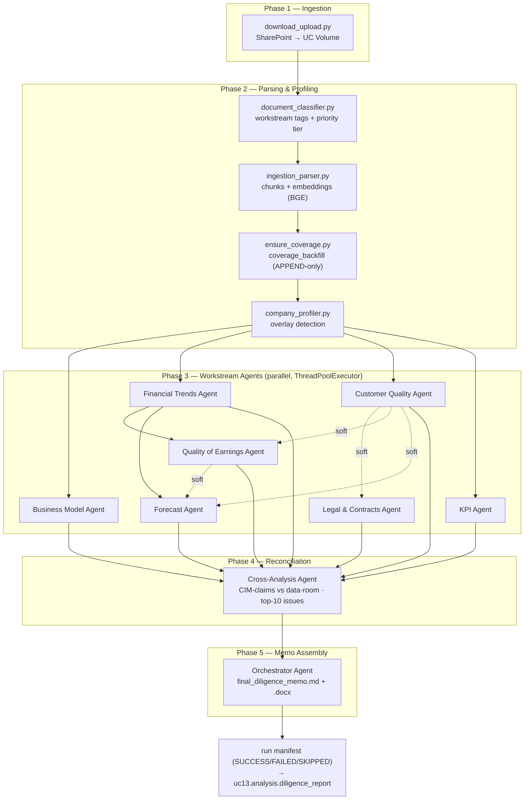
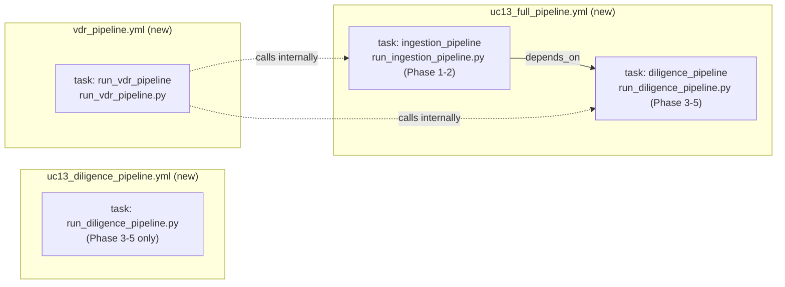
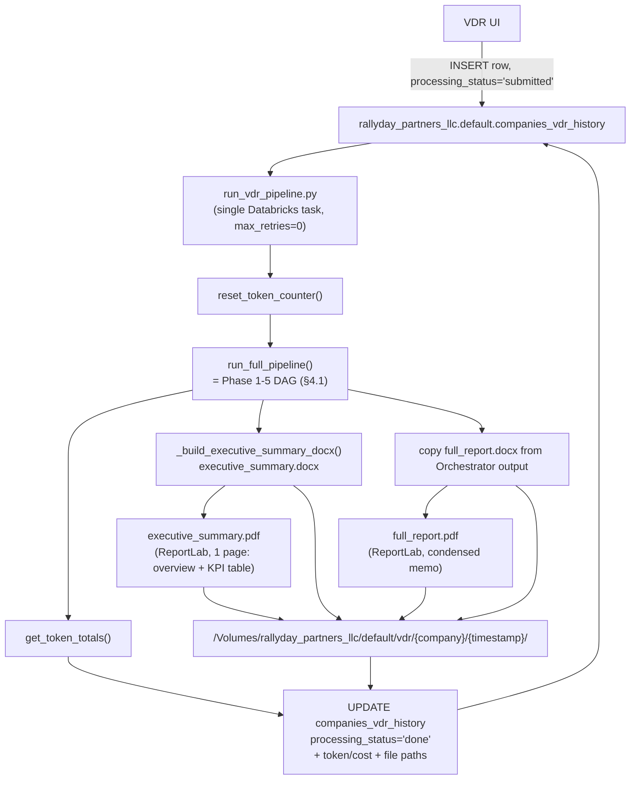

# Work Summary — `feature/ui-pipeline-integration` (since June 20, 2026) — Detailed

> Companion document to [`work_summary_ui_pipeline_integration.md`](./work_summary_ui_pipeline_integration.md). That file has the executive summary; this one has the commit-by-commit detail, the frameworks/library inventory, and pipeline diagrams.
> Branch chain: `develop` → `feature/databricks-new-agents-qoef` → `feature/databricks-orchestrator-dag` → `feature/ui-pipeline-integration`
> Author: Hector Corro
> Period covered: 2026-06-28 → 2026-07-21 (36 commits)
> Last updated: 2026-07-24

---

## Methodology (same as the executive summary)

Diffed against the **merge-base** with `develop`, not `develop`'s current tip, because `develop` has advanced 72 unrelated commits since the branches split:

```bash
git merge-base develop feature/ui-pipeline-integration
# → 0cb8791c2fce9e22098b4b1cf4e3add01b58a59d  ("Fixing auth issues", 2026-06-23)
```

---

## 1. Frameworks & technologies used

Nothing in this branch changes the *core* stack — it's built entirely on the framework already established on `develop` (see `databricks/CLAUDE.md`) — but it substantially extends *how* that stack is used:

| Framework / API | Status | Where it shows up in this branch |
|---|---|---|
| **MLflow 3 — Agent Bricks (`ResponsesAgent`)** | Existing, extended | All 3 new/extended Phase 3 agents (Forecast, Cross-Analysis, plus QoFE/CQA/KPI enhancements) follow the same `WorkstreamAgent(ResponsesAgent)` base. `mlflow.start_span()` is now also used *inside* `PipelineOrchestrator` and `OrchestratorAgent` to keep per-thread tracing intact under concurrency. |
| **`concurrent.futures.ThreadPoolExecutor`** | **New usage** | Core of `agents/orchestration/pipeline.py` — runs independent Phase 3 agents concurrently ("wave scheduler"), with a `SparkSession.builder.getOrCreate()` call injected per worker thread (Spark's thread-local session is `None` inside a `ThreadPoolExecutor` worker). |
| **`threading.Lock`** | **New usage** | Backs the new global token counter in `agent_base.py` (`accumulate_tokens()` / `reset_token_counter()` / `get_token_totals()`), which is written to concurrently by parallel agent threads. |
| **Databricks Workflows / Asset Bundles (job YAML)** | Existing pattern, 3 new job definitions | `uc13_diligence_pipeline.yml`, `uc13_full_pipeline.yml`, `vdr_pipeline.yml` — all declared with `spark_python_task` + per-environment `dependencies:` lists (Databricks' job-level equivalent of a requirements file). |
| **`python-docx`** | Existing, extended | New `_build_executive_summary_docx()` builder (styled 1-page Word doc: overview + KPI table) and a raw `.docx` write path in `run_vdr_pipeline.py`. Note added in code: UC Volumes (FUSE) don't support the random-access writes `python-docx` needs internally — the fix writes to a local temp file first, then copies to the Volume. |
| **ReportLab** | **New** | Real PDF rendering for the VDR deliverables (`full_report.pdf`, `executive_summary.pdf`) — replaces placeholder text files. Custom `_rl_append()` helper added to catch per-line XML parse errors so one malformed markdown line can't abort a whole PDF. |
| **PyMuPDF (`fitz`)** | Pre-existing usage, **newly declared** | Was already imported in `ingestion_parser.py` (vision-page rendering) before this branch, but had no corresponding entry in `requirements.txt` until this branch added `pymupdf>=1.24.0`. |
| **Unity Catalog Delta tables** | Existing pattern | New tables: `uc13.analysis.forecast`, `uc13.analysis.cross_analysis`, `uc13.analysis.diligence_report` (Orchestrator manifest); extended write shape on `rallyday_partners_llc.default.companies_vdr_history` (token/cost + docx/pdf path columns). |

---

## 2. Dependency / library changes

### `databricks/requirements.txt` diff (merge-base → tip)

```diff
 typing_extensions>=4.6.0
 mlflow[databricks]>=3.1
 pydantic>=2.0.0
+
+# PDF parsing (ingestion_parser.py vision pages)
+pymupdf>=1.24.0
```

Only **one** line was added to the shared notebook/local requirements file: `pymupdf>=1.24.0`. As noted above, this is a *documentation fix* more than a new dependency — the import already existed; it just wasn't pinned anywhere.

### Databricks job environment dependencies (`vdr_pipeline.yml`, new file)

```yaml
dependencies:
  - msal>=1.28.0
  - requests>=2.31.0
  - python-docx>=1.1.0
  - openpyxl>=3.1.0
  - typing_extensions>=4.6.0
  - mlflow[databricks]>=3.1
  - pydantic>=2.0.0
  - pymupdf>=1.24.0
  - reportlab>=4.0.0          # ← new library, VDR PDF generation
```

### Gap identified

**`reportlab>=4.0.0` is declared in `vdr_pipeline.yml`'s job environment, but is absent from `databricks/requirements.txt`.** Anyone running `run_vdr_pipeline.py` (or the underlying PDF-generation helpers) from the shared notebook environment rather than the dedicated VDR job cluster will hit an `ImportError` on `reportlab`. Recommend adding `reportlab>=4.0.0` to `requirements.txt` for consistency with the `pymupdf` fix already applied in this branch.

### Token-budget tuning (not a dependency change, but a cross-cutting config change worth flagging)

Commit `f1ec976` reduced `max_tokens` and per-section bullet/sentence caps across five agents in the same pass, specifically to shrink the final memo from ~40 pages to ~20:

| Agent | Before | After |
|---|---|---|
| CQA / KPI | `max_tokens=6000`, 3 bullets/section | `max_tokens=3000`, 2 bullets/section |
| Quality of Earnings | `max_tokens=6000`, ≤4 sentences/section | `max_tokens=3000`, ≤2 sentences/section |
| Forecast | `max_tokens=6000`, 3–5 paragraphs | `max_tokens=3000`, 2–3 paragraphs |
| Business Model | already 3000 tokens, 4 bullets/section | 3000 tokens, 2 bullets/section |

---

## 3. Detailed commit log

Grouped by workstream, in chronological order. "Files" = number of files touched in that commit.

### Quality of Earnings (QoFE) — Jun 28

| Commit | Date | Files | Description |
|---|---|---|---|
| `75dfdeb` | Jun 28 17:43 | 1 | `fix(qofe)`: default to Sonnet 4.6, explicit `max_tokens` to stop silent addback truncation |
| `b341dac` | Jun 28 18:06 | 2 | `fix(qofe)`: parameterize `company_name` in SQL — prevents breakage/injection on quoted names |
| `0e280fe` | Jun 28 18:33 | 1 | `feat(qofe)`: working-capital passthrough, period-end maneuver flags, NWC peg scope item |
| `8d6753b` | Jun 28 18:44 | 1 | `feat(qofe)`: add `unusual_credits_rebates_refunds` and `ar_aging_writeoffs` flag types (guideline 6) |
| `ead7e13` | Jun 28 19:53 | 1 | `feat(qofe)`: add `generate_qoe_assessment()` markdown report, mirroring the FTA pattern |
| `3a9065e` | Jun 28 20:09 | 1 | `feat(qofe)`: notebook Cell 17b (markdown assessment) + Cell 17c (Word export) |
| `9c72e59` | Jun 28 21:32 | 1 | Fix connector path |
| `97d2515` | Jun 28 21:46 | 1 | New table schema for the QoFE agent |

### Customer Quality (CQA) / KPI — Jun 29–30

| Commit | Date | Files | Description |
|---|---|---|---|
| `6672d95` | Jun 28 18:03 | 2 | Updated `CLAUDE.md` + added `Austin_guidelines_bussines_type.txt` |
| `f201a30` | Jun 29 10:47 | 2 | `feat(cqa+qofe)`: full guideline 2 coverage (cohort, health, contracts, revenue mix, renewals, GM/customer) + Task 5b profitability outlier detection in QoE |
| `104a1c2` | Jun 29 11:08 | 2 | `feat(cqa)`: `generate_customer_quality_assessment()` + notebook cells 14b/14c/14d |
| `1de80b5` | Jun 29 11:32 | 1 | Fix table schemas for CQA |
| `794978b` | Jun 29 11:38 | 1 | Fix module-method bug in CQA |
| `841ceee` | Jun 30 19:35 | 2 | Enhanced KPI agent |
| `f527c42` | Jun 30 19:48 | 2 | New schema for KPI agent execution |

### Orchestration layer — Phase 3-5 DAG — Jul 7–10

| Commit | Date | Files | Description |
|---|---|---|---|
| `b38b3e6` | Jul 7 11:50 | **9** | `feat`: add orchestrator, DAG and workstream agents — introduces `orchestrator_agent.py`, `pipeline.py`, `forecast_agent.py`, `cross_analysis_agent.py`, `run_diligence_pipeline.py`, `uc13_diligence_pipeline.yml` |
| `56dfb62` | Jul 7 15:08 | 6 | Run e2e full testing pipeline and Databricks job — adds `run_ingestion_pipeline.py`, `run_full_pipeline.py`, `uc13_full_pipeline.yml` |
| `fc6d3cf` | Jul 7 16:42 | 2 | Fix Spark session in orchestrator |
| `24e7f27` | Jul 7 16:56 | 1 | Fix Spark session in orchestrator — inject current session into worker thread |
| `70e5579` | Jul 7 17:38 | **9** | Add thread handler into all agents |
| `99efaab` | Jul 7 18:00 | 1 | Fix: time-format bug in orchestrator agent |
| `9419fe3` | Jul 8 01:02 | 4 | Default DAG execution to Tier 1 + Tier 2 documents |
| `25a8390` | Jul 9 12:10 | 3 | Fix report schema/format + table index for multiple reports |
| `cdb7e7f` | Jul 9 14:40 | 6 | Mark forecast report (`frpt`) flag as done in report-flags logic |
| `7b2af45` | Jul 10 09:43 | 1 | Add missing requirements for the Databricks job runtime |
| `9165604` | Jul 10 18:50 | 1 | `fix`: `__file__` not defined in Databricks job context |

### Virtual Data Room (VDR) pipeline — Jul 14–21

| Commit | Date | Files | Description |
|---|---|---|---|
| `1eb40e6` | Jul 14 15:10 | 4 | VDR final workflow update — adds `run_vdr_pipeline.py`, `vdr_pipeline.yml` |
| `6bb61d9` | Jul 14 15:42 | 1 | VDR final job YAML update |
| `f1ec976` | Jul 14 17:08 | **7** | `feat(vdr)`: real PDF output via ReportLab + condensed report sections; `max_tokens`/bullet-count reductions across 5 agents (see §2) |
| `422508b` | Jul 14 19:23 | **7** | `feat(tokens)`: thread-safe global token counter in `agent_base.py`, wired into every `_call_llm()` and into `companies_vdr_history` |
| `59a243c` | Jul 14 19:59 | 1 | `fix(pdf)`: italic-regex bug producing malformed XML in ReportLab paragraphs — word-boundary look-arounds + per-line fallback via `_rl_append()` |
| `94d2294` | Jul 16 14:07 | 4 | New token-count storage path to a dedicated Volume; strip invalid colons from file names |
| `c530a5f` | Jul 16 15:05 | 1 | Add DOCX write method to the VDR pipeline |
| `bf340f1` | Jul 16 20:07 | 1 | Fix file-duplication bug |
| `88cea11` | Jul 16 22:38 | 1 | Fix bugs for max chunk size / capped sizes |
| `fdca51f` | Jul 21 15:05 | **11** | Add endpoint-execution cost estimation to the VDR pipeline |

**Commit message quality note:** early commits (Jun 28 – Jul 10) follow Conventional Commits (`feat(qofe): ...`, `fix(qofe): ...`) with `Co-authored-by: Cursor` trailers. From `f1ec976` onward, commits switch to detailed multi-paragraph bodies with `Co-Authored-By: Claude Sonnet 4.6` trailers and explicit rationale/before-after sections — useful context if these commits are later squashed for a PR description.

---

## 4. Pipeline / workflow diagrams

### 4.1 End-to-end diligence pipeline (Phase 1 → 5)

This is the DAG introduced by `agents/orchestration/pipeline.py` (`PipelineOrchestrator`) and wired into `run_full_pipeline.py` / `uc13_full_pipeline.yml`. Solid arrows are **hard dependencies** (failure skips the downstream agent); dotted arrows are **soft dependencies** (failure runs the downstream agent in a degraded mode, using a fallback data source).



### 4.2 New Databricks jobs introduced in this branch



### 4.3 VDR (Virtual Data Room) wrapper flow



---

## 5. Open items / things to verify before merging

1. **`reportlab>=4.0.0` missing from `requirements.txt`** (see §2) — add it so the notebook/local dev environment matches the VDR job environment.
2. **72 commits on `develop`** since the merge-base — but scoped entirely outside this branch's work. See §2.1 below for the breakdown; no conflicts expected in `databricks/`.
3. Commit `70e5579` ("thread handler into all agents") touches 9 files in one commit and `fdca51f` (cost estimation) touches 11 — both are good candidates to inspect closely in review since they're the widest-blast-radius commits in the branch.

### 2.1 `develop` divergence — scoped outside `databricks/`

| Folder | Files changed on `develop` since merge-base |
|---|---|
| `frontend/` | 210 |
| `backend-api/` | 163 |
| `backend-ai/` | 14 |
| `databricks/` | 11 (all under `jobs/sql/` — garden signals / sourcing criteria / user config, unrelated feature) |
| root config files | 6 |

**Zero file-level overlap** between the 30 files this branch touched (§ "Full file inventory" in the executive summary) and the 11 `databricks/` files `develop` touched. This branch's entire footprint is `databricks/` — the diligence-pipeline agents, orchestration layer, and VDR pipeline — and none of it was modified in parallel on `develop`.
