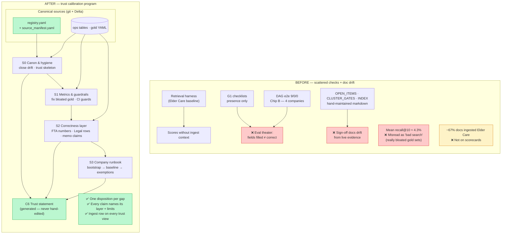
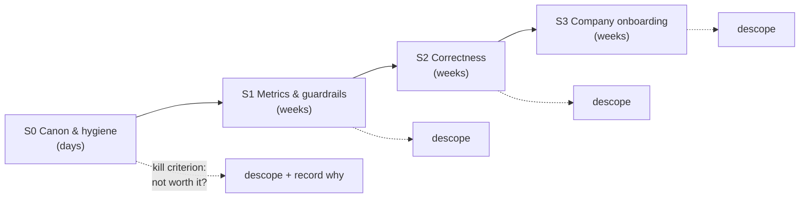

# UC-13 Eval Suite Consolidation — Team Sync Briefing

**Status:** Spec v0.2.2 · Phase 2 engineering review (cycle 4) · **S0 not started** — design complete, implementation next  
**Spec:** `.dev/specs/eval-consolidation-program/spec.md`  
**Program rationale:** `.dev/architecture/uc-13-ale/eval-consolidation-program-rationale.md`  
**Companion briefs:** `ingestion_parser_brief_draft.md` (corpus pipeline) · `retrieval_harness_obs_brief_draft.md` (retrieval measurement)

---

## The 30-second version

Today we can show that **search ran**, **agents finished**, and **report fields are filled in** — but we cannot show that the **answers are correct**, and our **sign-off documents drift** out of date. This program turns eval from scattered markdown trackers into a **single source of truth** (`registry.yaml`), a **generated trust statement** (what we can claim per company and per layer), and a **small correctness-check layer** on top of field-presence checks. Work is staged in four steps (S0→S3) with explicit stop/go gates so we do not over-build.

**Plain English:** We are building an honest scorecard for the pipeline — not a bigger dashboard, and not “fix the agents.” We fix how we **measure, record, and explain** trust.

---

## Glossary (read this first if eval jargon is new)

| Term | Plain English |
|------|----------------|
| **Eval** | Automated checks that tell us whether the pipeline is working |
| **Harness** | Offline test that asks “did search return the right document chunks?” (see retrieval brief) |
| **G1 golden checklist** | Automated check that asks “are the expected JSON fields **non-empty**?” — **not** “are the values correct?” |
| **DAG e2e** | Full end-to-end run: all 9 agents in one job; success = `9 SUCCESS / 0 FAILED` |
| **Gold labels** | Human/curated list of “these chunk IDs are the right answers” for each search question |
| **Baseline / control pin** | Frozen reference run we compare new runs against (like a benchmark snapshot) |
| **Eval theater** | Green scores that look good but do not prove correctness (e.g. fields populated with wrong numbers) |
| **Trust statement** | Generated document: per company, per layer — **attested** / **partial** / **not attested** / **known gap** |
| **Registry (`registry.yaml`)** | Machine-readable list of every open eval item with exactly one disposition (do now / defer / reject / accept) |
| **Presence vs correctness** | Presence = “something is in the box.” Correctness = “what’s in the box is right and backed by sources.” |
| **Ingest completeness** | How much of the company’s document set is actually parsed and searchable — a confound on every score |

---

## What this is

UC-13 already has **two working eval layers** (retrieval harness + G1 checklists) and **four-company e2e proof** (Chip B). This program is the **third track**: consolidate gaps, stop doc drift, and add the missing **“is it right?”** layer — without redesigning retrieval or rewriting agents.

### The four questions a complete suite should answer

| Question | Plain English | Status today | This program |
|----------|---------------|--------------|--------------|
| Did search find the right chunks? | Retrieval quality | **Yes — Elder Care only** (`baseline_544eb3f2a0e2`, 57 questions) | **Keep as-is** (retrieval brief owns depth) |
| Did agents fill in the template? | Output shape / presence | **Yes — 7 agents; Elder Care has pass/fail floors** | **Label as presence-only everywhere** |
| Did the full pipeline run? | No crashes, all agents ran | **Yes — 4 companies, 9/0/0 each** | **Use as evidence, not as quality proof** |
| **Is the output correct?** | Numbers, legal rows, narrative | **No** | **S2 builds a narrow layer** |
| **What can we tell stakeholders?** | Explainability | **Ad hoc scorecards** | **Generated trust statement** |
| **What work is still open?** | Program hygiene | **OPEN_ITEMS.md drifts** | **S0 `registry.yaml`** |

### What this program is **not**

- **Not** a retrieval redesign — inherits harness, baselines, and `compare()` pins intact  
- **Not** agent quality iteration (CQA depth, Legal dedupe, KPI overlay) — those stay in the backlog; we **measure** variance, we do not **fix** agents  
- **Not** a product UI or stakeholder portal — output is generated markdown/YAML the operator interprets  
- **Not** full automation in CI at launch — cluster eval runs stay operator-triggered until we decide otherwise

---

## Architecture: before vs after

**Green** = new or materially changed. **Red** = main pain points today.

### Stage pipeline (what gets built, in order)

Each stage has an **exit gate**: if cost outweighs trust value, we **stop that stage** and record why in the registry — we do not silently continue.

---

## Why we had to do this

| Failure | What happened (plain English) | Root cause |
|--------|-------------------------------|------------|
| **Eval theater** | A stakeholder could spot a wrong number before we do | G1 only checks “field not empty,” not “field correct” |
| **Misleading retrieval average** | “4.3% recall” sounds like search is broken | 8 test questions still use **bloated gold** (~2,800 “correct” chunks each) — math caps recall near **0.35%** no matter how good search is |
| **Doc drift** | Gate files and trackers say PASS while evidence moved on | Markdown maintained by hand; no single machine-readable program state |
| **Half-finished promotion** | Only BMA fully “promoted” after post-fix e2e; 6 agents still half-open | No consolidated closeout program |
| **Hidden ingest gap** | Agent scores swing with missing documents | Elder Care **~67%** of approved docs are actually chunked today (was ~52% in Aug analysis — ingestion refactor improving this) |
| **Multi-company honesty** | Clearsulting Legal **0/11** looks like agent failure | Company has **zero legal documents** in the VDR — score is “gap-correct,” not broken agent |
| **No correctness layer** | Exec summary checked for word count, not truth | Layer 4 never built |
| **OPEN_ITEMS as source of truth** | Twelve+ stale doc instances tracked in §9 analysis | Wrong tool for program state |

**Why not “just fix the agents”?** Fixing outputs without fixing measurement repeats the same failure mode: green checks that do not prove trust.

---

## How it works (mental model)

### What already exists (predecessor work — do not reopen)

Built by the retrieval harness program and Chip A/B (see `retrieval_harness_obs_brief_draft.md`):

- Elder Care retrieval control pin: **`baseline_544eb3f2a0e2`** (57 search questions, Jul 2026)  
- Chip A: gold precision upgrade (51,987 → 23,721 positive chunk IDs)  
- Chip B: all four SharePoint companies **DAG 9/0/0**  
- G1 floors on Elder Care; other companies scored **informational only** (no pass/fail bars yet)  
- Delta provenance, `evaluate_promotion`, ablation proof that merge-rank matters  

### What this program adds

1. **`registry.yaml`** — every gap from the Aug 2026 state-of-affairs analysis gets **exactly one** disposition: staged / deferred (with trigger) / rejected / accepted  
2. **Trust statement** — regenerated view: per company × layer, what we attest and what we do not  
3. **S2 correctness ladder** — cheapest checks first:  
   - **Mechanical:** FTA numbers vs cited chunks; Legal table rows vs source docs  
   - **LLM judge:** narrative claims mechanics cannot verify (small, bounded)  
   - **Human spot-check:** backstop with a written rubric  
   - **Rule:** every surface lands on a rung — never silently skipped  
4. **S3 onboarding runbook** — new company = follow steps (bootstrap gold → note exemptions → run baseline → trust rows), not a new research project  
5. **Ingest row on every trust view** — SQL chunk-count probe now; swaps to `doc_status` when ingestion parser lands (no redesign)

### Two-layer eval stays intentional

| Layer | Question | Owner |
|-------|----------|-------|
| Retrieval harness | Right chunks? | Retrieval program |
| G1 checklists | Fields populated? | This program **labels presence-only** |
| S2 content layer | Is it **right** on high-risk surfaces? | **This program builds** |

A perfect G1 score on wrong chunks is still eval theater — both layers matter.

---

## Evidence & numbers (context for slides)

*Warehouse snapshot queried 2026-08-05 unless noted.*

### Retrieval harness (Elder Care — inherited baseline)

| Metric | Value | How to read it |
|--------|-------|----------------|
| Control pin | `baseline_544eb3f2a0e2` | Do not compare to pre–Jul 30 baselines (registry/gold changed) |
| Intents | 57 | Search questions in the test suite |
| `fallback_rate` | **0%** | Search did not silently degrade to a backup path (O-11 concern addressed on this run) |
| `empty_rate` | **~13%** | Some questions returned zero chunks — still worth watching |
| Mean `recall@10` | **~4.3%** | **Do not use as a product KPI until S1** — dominated by 8 bloated gold sets |

**Metric literacy (for PM / sponsor):**  
Recall@10 means “of the chunks we labeled as correct answers, how many appear in the top 10 search results?” When the label set has **thousands** of chunks marked correct, the score is mathematically tiny even if search is fine. S1 rebootstrap fixes that for 8 KPI/profiler questions.

### G1 agent checklists (Elder Care — presence only)

| Agent | Score | Note |
|-------|-------|------|
| BMA | 7/7 PASS | |
| CQA | 4/6 PASS | |
| KPI | 3/3 PASS | |
| QoE | 5/6 PASS | |
| FTA | 16.5/18 PASS | |
| Legal | **7/11** | Accepted floor ≥7 — LLM variance at dedupe, not retrieval |
| Profiler | 7/7 PASS | |

**Reminder:** These scores mean “template filled,” not “content verified.”

### Multi-company (Chip B — informational)

| Company | DAG | FTA | Legal | Caveat |
|---------|-----|-----|-------|--------|
| Elder Care | 9/0/0 | 16.5/18 | 7/11 | Reference tenant |
| Clearsulting | 9/0/0 | 17/18 | **0/11** | **0 legal docs in VDR** — not agent failure |
| GKF | 9/0/0 | 13.5/18 | 5/11 | Thin financial corpus |
| SPG | 9/0/0 | 8.5/18 | 1/11 | Thin financial corpus |

No retrieval harness baselines exist yet for non–Elder Care companies — S3 addresses that via runbook, not “copy Elder Care rubrics everywhere.”

### Ingest completeness (confound on every claim)

| Metric | Value |
|--------|-------|
| Elder Care `should_parse` docs with chunks | **318 / 475 (~67%)** |
| Prior analysis (Aug 2026) | ~52% — ingestion parser rollout is closing the gap |

**Plain English:** Agent and search scores are measured against a **partial document set** until ingest catches up. The trust statement will show this on every view so we do not over-claim.

### Trust statement mock (v0 skeleton — illustrative)

*Generated artifact — not hand-edited. Example shape after S0:*

| Company | Layer | Attestation | Plain meaning |
|---------|-------|-------------|---------------|
| Elder Care | ingest_completeness | partial | ~67% of approved docs searchable |
| Elder Care | retrieval | attested | Harness baseline pinned; see retrieval brief |
| Elder Care | agent_fields | partial | G1 passes on presence; Legal below old floor but accepted |
| Elder Care | content_correctness | not_attested | S2 not built yet |
| Elder Care | e2e | attested | DAG 9/0/0 run `827597669988464` |

---

## What we're building — stage by stage

### S0 — Canon & hygiene *(first chip after greenlight; ~days)*

**Goal:** Stop the drift; establish honest program state.

| Work item | Plain English |
|-----------|---------------|
| Create `registry.yaml` | Import all open gaps from state-of-affairs + OPEN_ITEMS — one row each |
| `source_manifest.yaml` | Frozen checklist that import captured everything (no silent partial imports) |
| Stale-doc sync | Update or archive gate files / handoffs that disagree with evidence |
| O-11 re-score | Confirm baseline still shows `fallback_rate=0` on cluster |
| Re-promote 6 agents | Close half-open `evaluate_promotion` on Elder Care |
| FTA 3× `bootstrap_failed` fix | Three financial-statement search tests had empty gold |
| Trust statement v0 | Skeleton with **ingest completeness row** |

**Exit gate:** Every closed item has evidence linked; registry complete; trust skeleton generated.

### S1 — Metric & guardrail hardening *(~weeks)*

**Goal:** Make retrieval metrics **interpretable** and lock in CI guards.

- Rebootstrap **8 bloated KPI/profiler intents** from `filename_closure` → `citation_backfill` where citations exist  
- New harness baseline after gold change (required by contract — not optional)  
- pytest guards: scorer semantics, gold non-empty, gate files match tests  
- Canonical FTA rubric in `eval/FTA/`; company slug registry; e2e↔harness linkage for golden five agents  

**Exit gate:** Mean recall is explainable without “metric design” caveat; CI catches gold/scorer drift.

### S2 — Narrow content / correctness layer *(~weeks)*

**Goal:** Answer **“is it right?”** on three high-embarrassment surfaces — or say **`not attested`** with reason.

| Surface | First check | Fallback |
|---------|-------------|----------|
| FTA numeric fields | Compare numbers to cited chunks | LLM judge → human rubric |
| Legal register rows | Compare rows to source docs | Same ladder |
| Exec summary / memo claims | Human spot-check protocol | LLM judge for narrative |

**Exit gate:** Each surface has an attestation beyond presence — or explicit `not_attested`.

**Pre-plans before build:** Verify FTA citation quality and LLM-judge endpoint on a small calibration run.

### S3 — Company onboarding runbook *(~weeks)*

**Goal:** Onboard a new company by **following steps**, not inventing a new eval design.

- Parameterize gold bootstrap (`--company`, `--catalog`, `--output`)  
- Intent **exemptions** when VDR lacks a workstream (e.g. no legal docs)  
- Two-backend ingest preflight (SQL probe today → `doc_status` later)  
- **Clearsulting pilot** — thin-data canonical case  
- Per-company harness baseline promotion policy  

**Exit gate:** Operator can onboard a company from the runbook without design work.

**Precondition:** Explicit decision to overturn M4 “defer multi-company gold unless FTA fails badly” — recorded in registry.

---

## Talking points for your sync

### 1. “What problem does this solve?”

> We can prove the pipeline ran and forms are filled — not that answers are correct, and not that our sign-off docs match reality. This program gives us a **single honest scorecard**: what we trust per layer, what we do not, and why — with ingest completeness visible on every claim.

### 2. “How is this different from the retrieval harness work?”

> Retrieval measures **search**. This program wraps **program state** (what’s open/closed), **explainability** (trust statement), and **correctness** (S2) — without reopening harness contracts. Read the retrieval brief for recall@10; read this brief for “should we trust the memo?”

### 3. “Why staged? Why not build everything at once?”

> Full scope is acknowledged, but **each stage must earn the next** at a gate review. If S2 judge work is not worth the cost, we descope with rationale recorded — not gold-plate quietly.

### 4. “Why correctness (S2) before multi-company baselines (S3)?

> Per-company baselines are useless if we still cannot say whether FTA numbers or legal rows are **right**. S2 makes later baselines meaningful.

### 5. “What didn’t change?”

> Harness code, baseline pins, merge-rank production path, G1 semantics (still presence-only — we just **label** that clearly), Chip A/B evidence, cross-hash compare ban.

### 6. “Where are we now?”

> Spec and program rationale are written; **Phase 2 engineering review** (cycle 4) is tightening import completeness and S2 contracts. **No `registry.yaml` in repo yet** — S0 is the first implementation chip after dual greenlight.

### 7. “What can I tell stakeholders after S0?” (sponsor / PM)

> “Here is a generated trust view: search is baselined on Elder Care, agent fields are presence-checked with known gaps named, ingest is ~67% complete, and we have **not** yet attested narrative correctness — by design, with dates and evidence links.”

### 8. “Why isn’t engineering fully signed off yet?”

> Phase 2 review found edge cases in **first-run import completeness** (fixed in spec: source manifest + validator) and **judge run lifecycle** (design-seeded for S2). These are buildability hardening, not scope changes. Cycle 4 is the current review.

---

## One analogy

**Before:** A binder of checklists that say “every box on the form is filled in,” while half the pages are outdated photocopies and nobody verified the numbers against source documents.  

**After:** A **living scorecard** generated from the system of record — each row says what we tested, how we tested it, what we are **not** claiming, and how complete the underlying document set is.

---

## What's left

### Immediate (post–Phase 2 greenlight)

1. **S0 chip** — registry import, hygiene, trust skeleton, half-open promotions  
2. **Phase 2 close** — cycle 4 review on hardened import + S2 contracts  

### Program backlog

| Stage | Delivers |
|-------|----------|
| S1 | Interpretable retrieval metrics + CI guards + new baseline |
| S2 | Correctness attestations on FTA / Legal / exec summary |
| S3 | Multi-company runbook + Clearsulting pilot baseline |

### Dependencies on sibling programs

| Sibling | Link |
|---------|------|
| **Ingestion parser** | `doc_status` → richer ingest row on trust statement (S3 preflight backend swap) |
| **Retrieval harness** | Baseline pins, gold YAML, ops tables — consumed, not redesigned |
| **Ingest rollout** | As corpus completeness rises (~52% → ~67% → target), reinterpret agent/harness scores |

### Explicitly not this program

- Agent quality fixes (CQA depth, Legal dedupe hardening)  
- Garden UI / prod auth / Genie product track  
- Full CI automation of cluster harness (deferred — manual gates work at current volume)  
- Langfuse as judge home (deferred — default Delta ops)  
- Synthetic / adversarial eval sets (optimization sprint)

---

## Related docs

| Doc | Path |
|-----|------|
| Normative spec | `.dev/specs/eval-consolidation-program/spec.md` |
| Program rationale | `.dev/architecture/uc-13-ale/eval-consolidation-program-rationale.md` |
| State-of-affairs (program input) | `.dev/eval_state_of_affairs_2026-08-03.md` |
| Retrieval harness brief | `retrieval_harness_obs_brief_draft.md` |
| Ingestion parser brief | `ingestion_parser_brief_draft.md` |
| RE² README (runbooks) | `eval/retrieval/README.md` |
| G1 scorer | `.dev/g1_score_all_agents.py` |
| Chip A audit | `.dev/audits/2026-07-30-chip-a-g6-gold-bootstrap.md` |
| Chip B ratification | `.dev/decision-logs/chip-b-operator-ratification-2026-08-03.md` |
| Predecessor retrieval rationale | `.dev/architecture/rallyday/uc13-retrieval-eval-program-rationale.md` |
