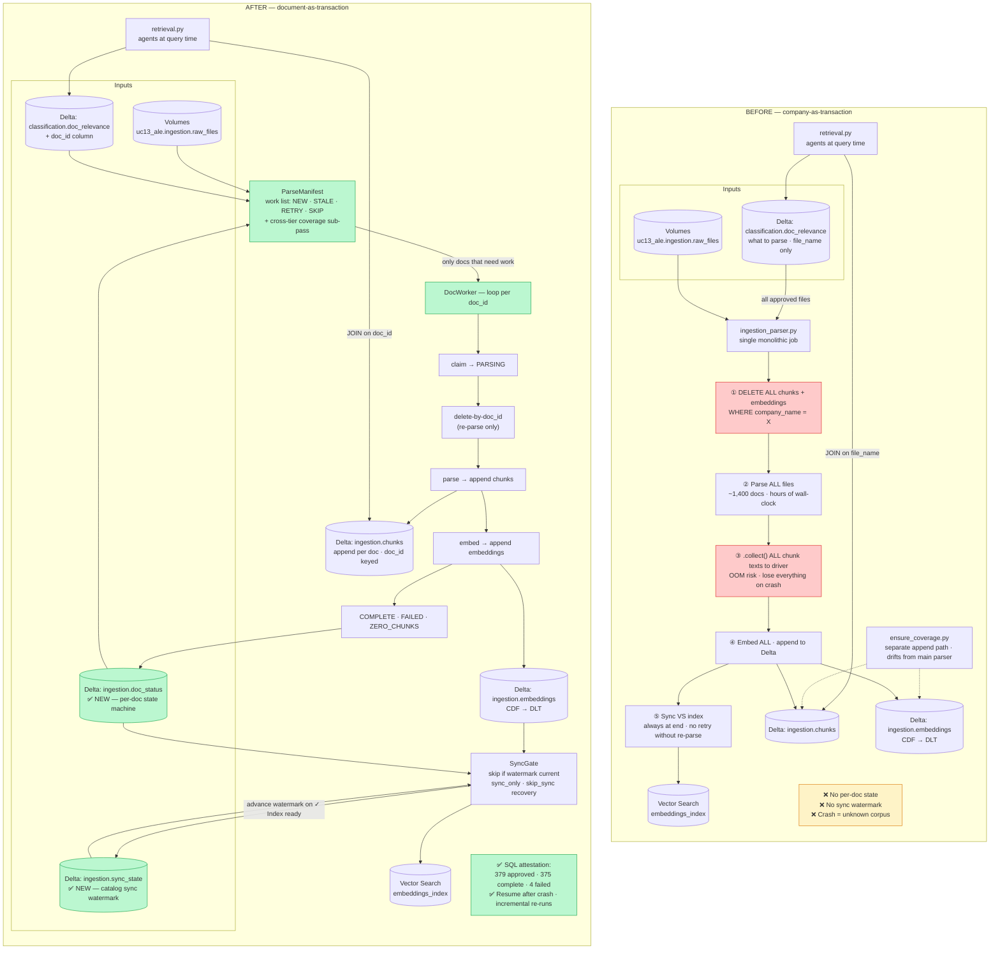
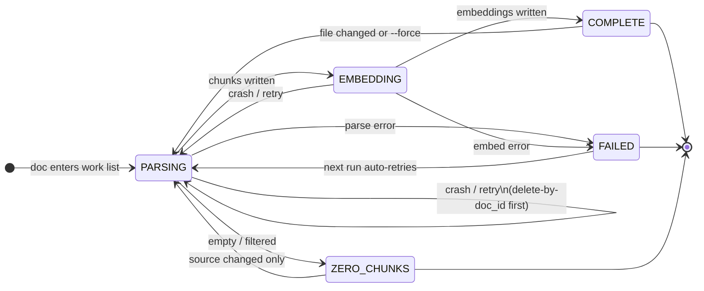

# UC-13 Ingestion Parser Refactor — Team Sync Briefing

**Status:** M0–M3 landed · M4 validation & rollout in progress (pilots + exit-gate checks)  
**Spec:** `.dev/specs/uc13-ingestion-parser-refactor/spec.md` (v0.5.0)  
**Charter:** `.dev/specs/uc13-ingestion-parser-refactor/uc13_ingestion_parser_milestone_charter.md`

---

## The 30-second version

We refactored the document ingestion pipeline from **"wipe the whole company and start over"** to **"process one document at a time, remember what happened, and only redo what changed."** That makes ingestion **resumable after crashes**, **cheap to re-run**, and **auditable** — you can SQL-query corpus health instead of guessing after a 3-hour cluster death.

---

## What this is

**UC-13 Phase 2b** is the parser that turns raw VDR files (PDFs, Excel, Word, etc.) into **chunks + embeddings** that agents search at query time.

The refactor replaces the old **company-as-transaction** model:

```
DELETE all chunks → parse all files → embed everything → sync index
```

…with a **document-as-transaction** model:

```
For each doc: check status → skip if done → else parse → embed → mark COMPLETE
```

A new `doc_status` table is the source of truth: *"379 approved, 375 complete, 4 failed with reason X"* instead of *"cluster died, unknown state."*

---

## Architecture: before vs after (Delta + flow)

One run, one company. **Green** = new or materially changed in the refactor. **Red** = main pain points in the old model.



### Delta tables at a glance

| Table | Before | After | Role |
|-------|--------|-------|------|
| `classification.doc_relevance` | ✅ | ✅ (+ `doc_id`) | Classifier: *what* should be parsed |
| `ingestion.chunks` | ✅ | ✅ (unchanged schema) | Corpus text; delete-by-`doc_id` on re-parse |
| `ingestion.embeddings` | ✅ | ✅ (unchanged schema) | Corpus vectors; DLT feeds VS index |
| `ingestion.doc_status` | ❌ | ✅ **new** | Parser: *what happened* per document |
| `ingestion.sync_state` | ❌ | ✅ **new** | Last confirmed index sync (catalog watermark) |
| Vector Search `embeddings_index` | ✅ | ✅ (same contract) | Serving layer; fail-closed sync preserved |

### Per-doc state machine (after only)



---

## Why we had to do this (what was failing)

Production pain traced to one structural problem: **the unit of work was too large**.

| Failure | What happened | Root cause |
|--------|----------------|------------|
| **Serverless preemption** (F1) | 3-hour runs died; hours of work lost | Whole company processed as one atomic job |
| **Driver OOM** (F2) | Run died *after* parsing, during embed | `.collect()` on all company chunk texts at once |
| **Sync timeout** (F3) | 250k+ row sync failed; forced full re-parse | No way to retry sync without redoing parse |
| **Unknown state after crash** | Operators couldn't tell partial vs. valid corpus | No durable per-doc state |
| **Silent per-file failures** (F6, F9) | Bad files vanished; approved-but-missing files ignored | `return []` with no record |
| **Join orphans** (F10, R-08) | ~47.6% of Elder Care retrieval joins failed silently | `file_name`-only join key collides across folders |
| **Silent job success** (F12) | Databricks marked job green on fatal sync failure | No `sys.exit(1)` on fatal paths |
| **Coverage gaps** | Workstreams with zero retrievable docs | Tier filter + separate `ensure_coverage.py` path drifted |

**Bounded hardening** (smaller batches, better flushing) would fix OOM symptoms but **not** crash-equals-lost-work or silent partial state. The fix had to be structural.

---

## How it works now (the fix)

See **Architecture: before vs after** above for the full Delta + flow picture. In short:

**Core principles:**

1. **Document is the unit of work** — parse, embed, delete, retry all scoped to one `doc_id`
2. **State is durable** — status written before/after each stage; crash leaves an interpretable row
3. **Resume is default** — re-runs only touch NEW / changed / failed docs; `--force` for full rebuild
4. **Fail visibly** — FAILED and ZERO_CHUNKS rows have reasons; fatal paths exit non-zero
5. **Stable identity** — `doc_id` = hash of canonical volume path (fixes join collisions)

**Incremental skip logic:** COMPLETE + unchanged mtime/size + matching `parser_version` → SKIP.

**Crash recovery:** Kill mid-doc → row stuck in PARSING/EMBEDDING → next run = RETRY → delete-by-`doc_id` → redo. You lose at most one in-flight document.

---

## What we built — milestone by milestone

### M0 — State & Manifest Foundations

**Built:** `doc_status` table, `sync_state` table (DDL), `StatusStore`, shared `make_doc_id()` constructor, `ParseManifest` (work list with NEW/STALE/RETRY/SKIP + cross-tier coverage sub-pass).

**Checkpoint:** Manifest dry-run — compute the work list with zero corpus writes.

### M1 — Per-Doc Loop

**Built:** `DocWorker` (claim → delete-by-doc_id → parse → chunks → embed → COMPLETE/FAILED/ZERO_CHUNKS), rewired `main()` and all entry points (notebook, workflow runner, VDR pipeline).

**Checkpoint:** Incremental run processes only changed docs; kill-and-resume is idempotent.

**Key win:** Eliminates driver OOM — embed happens per doc, not whole-company `.collect()`.

### M2 — Sync Watermark & Coverage Fold-in

**Built:** Watermark-driven `SyncGate` (`sync_state.last_successful_sync`), `skip_sync` / `sync_only` recovery modes, `sys.exit(1)` on fatal paths, folded `ensure_coverage.py` into the manifest (removed duplicate append path).

**Checkpoint:** No-change run skips sync; `--skip-sync` then plain run still syncs (nothing stranded); catalog-wide watermark (not per-company — dormant companies don't get stuck).

### M3 — doc_id Join Slice

**Built:** `doc_relevance.doc_id` column (classifier write + backfill), `retrieval.py` JOINs migrated from `file_name` → `doc_id`, orphan-rate measurement script.

**Checkpoint:** Orphan rate materially lower than ~47.6% Elder Care baseline.

### M4 — Validation & Rollout *(current)*

**Built (code):** Full pytest suite (per-extension parsing, chunk caps, status transitions, `make_doc_id` contract tests), attestation tooling (`measure_attestation.py`), sync-contract tests still green.

**In progress (operator):** Pilots and exit-gate validation:

- `--force=company` rollout per company on classic cluster (Elder Care last — 1,386-file VDR)
- Per-company attestation: *"N approved, M complete, K failed"*
- Post-rollout orphan re-measure (G4)
- Vision-share attestation on CIM-heavy corpora (~70% vision chunks)

**Program gates at M4 exit:** G1 (sync tests), G2 (`make_doc_id` tests), G3 (M-PHV1 stdout/exit contract), G4 (orphan rate), G5 (attestation query).

---

## Talking points for your sync

### 1. "What problem does this solve?"

> Ingestion was fragile at production scale. A serverless kill or OOM meant hours lost and unknown corpus state. Re-runs were expensive (re-parse everything). Failures were invisible. Retrieval was silently dropping ~half of joined chunks on Elder Care. We made ingestion **incremental, resumable, and auditable** — the smallest structural change that eliminates the whole failure class.

### 2. "Why not just patch the old code?"

> Symptoms (OOM, timeouts) came from treating 1,400 files as one transaction. Patches fix symptoms; they don't fix *crash = lost work* or *"is the corpus valid?"* The status table turns operability into a SQL query.

### 3. "What's the operator experience change?"

> **Default:** point at a company → only new/changed/failed docs process → cheap routine re-runs.  
> **Full rebuild:** explicit `--force=company` (one-time rollout, then incremental forever).  
> **Recovery:** `sync_only` retries index sync without re-parsing; `doc_status` shows exactly what failed and why.

### 4. "What didn't change?"

> Parse/chunk/embed mechanics, table schemas for `chunks`/`embeddings`, vision extraction, M-PHV1 fail-closed sync contract (`✓ Index ready` / exit 1 on failure). This is a refactor, not a new pipeline.

### 5. "What's the rollout plan?"

> One `--force=company` rebuild per company on a classic cluster (avoids serverless preemption on vision-heavy full rebuilds). That populates `doc_status`, closes the Elder Care 182-file coverage gap, and validates at scale. After that, steady state is incremental.

### 6. "Where are we now?"

> M0–M3 are landed (state layer, per-doc loop, sync watermark, join fix). M4 code (tests + attestation tooling) is in place; we're running **pilots and exit-gate checks** before calling the program complete — attestation queries, orphan re-measure, and per-company force rebuilds.

---

## One analogy

**Before:** Rebuilding a house by demolishing the whole structure every time a room needs work.  
**After:** Each room has a work order on a whiteboard — *not started / in progress / done / blocked*. You only redo the rooms that need it. If the crew gets sent home mid-room, you know which room was in progress and resume there.

---

## What's left

1. **M4 exit gate** — pytest green, rollout pilots complete, attestation per company
2. **Operator rollout** — `--force=company` on classic cluster (Elder Care last)
3. **G4/G5 evidence** — orphan rate before/after recorded; PHV-shaped attestation output
4. **Program close** — architecture docs, audit handoffs, failure taxonomy promotion

---

## Related docs

| Doc | Path |
|-----|------|
| Normative spec | `.dev/specs/uc13-ingestion-parser-refactor/spec.md` |
| Milestone charter | `.dev/specs/uc13-ingestion-parser-refactor/uc13_ingestion_parser_milestone_charter.md` |
| Program rationale | `.dev/architecture/uc-13-ale/uc-13-ale-program-rationale.md` |
| M4 plan (current) | `.dev/planning/uc13-ingestion-parser/M4/plan.md` |
| CIM corpus stats (vision share) | `CIM_STATS_from_agent.md` |
