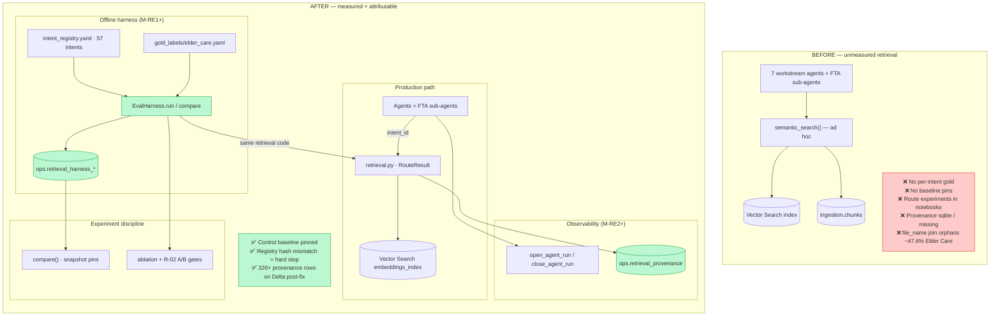

# UC-13 Retrieval, Harness & Observability — Team Sync Briefing

**Status:** M-RE1–M-RE3 landed · M-PHV1–PHV4 landed · eval-harness-all-agents M0–M4 complete · Chip A/B baselines promoted · ingestion `doc_id` join (M3) in flight  
**Primary company:** Elder Care / `uc13_ale` (eval catalog)  
**Companion briefs:** `ingestion_parser_brief_draft.md` (corpus pipeline) · `eval_consolidation_brief_draft.md` (trust calibration & program consolidation)

---

## The 30-second version

We turned agent retrieval from **“call search and hope”** into a **measured, attributable system**: every retrieval question has labeled gold data, an offline harness scores recall against a **pinned control baseline**, live agent runs write **provenance to Delta**, and experiments (A/B, ablations) are **snapshot-locked** so you cannot accidentally compare incompatible registry versions. Elder Care is the reference tenant; the same machinery runs multi-company e2e

---

## What this is

**Production retrieval** (`databricks/agents/shared/retrieval.py`) is what all diligence agents use at query time: Vector Search + merge-rank (similarity × document priority tier) + post-filters. It returns a structured `RouteResult` (chunks + mode + scores), not a raw list.

**RE²** (`eval/retrieval/`) is the **retrieval measurement program** (M-RE1):

- **Intent registry** — 57 labeled retrieval questions across agents (`intent_registry.yaml`)
- **Gold labels** — which chunks should be retrieved for each intent (`gold_labels/elder_care.yaml`)
- **Harness** — runs the same retrieval code as production, scores recall@10 / precision@10 / MRR, compares vs baseline
- **Ops store** — Delta tables in `uc13_ale.ops` record every harness run, result, delta, and live provenance row

**Observability** (M-RE2+) wires production into that store:

- `open_agent_run` / `close_agent_run` around agent `main()` entry points
- Every `semantic_search` with an open run emits rows to `ops.retrieval_provenance` (which chunks were shown, scores, intent)

**Two-layer eval**:

| Layer | What it measures | Example pass signal |
|-------|------------------|---------------------|
| **Retrieval harness** | Did we fetch the right chunks? | `gate_pass=true` on enhancement vs `baseline_544eb3f2a0e2` |
| **Agent golden checklists (G1)** | Are output fields populated / rubric items met? | FTA 16/18 — **presence, not correctness** (eval doc owns depth) |

`evaluate_promotion` links an e2e pipeline run to harness attribution when agent checklist scores regress.

---

## Architecture: before vs after

**Green** = new or materially changed. **Red** = main pain points in the old model.



### Canonical artifacts at a glance

| Artifact | Where | Role |
|----------|-------|------|
| `intent_registry.yaml` | Git | Every retrieval question agents ask — 57 intents |
| `gold_labels/elder_care.yaml` | Git | Expected positive chunk IDs per intent |
| `ops.retrieval_harness_runs` | Delta | Run manifest (baseline / enhancement / ablation / pipeline) |
| `ops.retrieval_harness_results` | Delta | Per-intent metrics |
| `ops.retrieval_harness_deltas` | Delta | Compare output vs `baseline_ref_run_id` |
| `ops.retrieval_harness_latest_baseline` | Delta view | Current control pin per company + catalog |
| `ops.retrieval_provenance` | Delta | Live retrieval attribution during agent runs |
| `fixtures/elder_care_slice.json` | Git | Frozen 5-intent CI slice (pytest mocks VS only) |

**Catalog split:** `uc13_ale` = eval/dev (harness, gold, ops, notebook defaults). `uc13` = production script defaults. They are not interchangeable.

---

## Why we had to do this

| Failure | What happened | Root cause |
|--------|----------------|------------|
| **Unmeasured routing** | Merge-rank vs sim-only felt better but had no gate | No harness or gold |
| **Eval theater** | “DAG 9/0/0” celebrated while retrieval could be wrong | Conflated “didn’t crash” with “found right chunks” |
| **Registry drift** | Compared baselines after intent YAML changed | No `registry_hash` pin → misleading recall drift |
| **Gold bloat** | Some intents had ~3,800 “positive” chunks | `filename_closure` fallback — recall@10 ceiling ~0.35% |
| **Silent wrong store** | FTA crashed in parallel DAG | Thread pool fell back to sqlite provenance |
| **Stale search index** | Harness `gate_pass: false`; COI returned lease PDFs | Index not synced before baseline; looked like code regression |
| **Classifier vs registry mismatch** | `legal.insurance` failed after “healthy” index | COI tagged `BACKGROUND`; intent filtered `LEGAL` only |
| **Join orphans (R-08)** | ~47.6% Elder Care hydrate joins failed silently | `file_name`-only key — **sibling ingestion M3 `doc_id` fix** |
| **R-02 A/B declined** | VS metadata filters looked promising | PG5 bar fail: `legal.litigation` −5.88pp; aggregate recall 4.23%→4.16% |

Bounded patches (tweak `top_k`, flush batches) do not fix **“was this retrieval change safe?”** The harness + snapshot pins make that a queryable answer.

---

## How it works now (operator mental model)

1. **Same code in prod and harness** — `EvalHarness` dispatches production `semantic_search` / `dispatch_retrieval`; no shadow retrieval implementation.
2. **Snapshot pins** — `compare()` requires matching `gold_snapshot`, `registry_hash`, and `ingestion_snapshot`. Cross-registry compare raises `RegistryHashMismatchError` (intentional).
3. **Baseline authority** — `retrieval_harness_latest_baseline` view holds the control run. Elder Care pin: **`baseline_544eb3f2a0e2`** (57-intent era, Jul 2026).
4. **Run types** — `baseline` (establish control) · `enhancement` (candidate change) · `ablation` (merge-rank arms) · `pipeline` (live agent DAG manifest).
5. **Provenance on Delta** — `RE2_STORE_BACKEND=delta`; parallel DAG workers pass `spark=` so provenance never silently lands in sqlite.
6. **Gate-eligible scoping** — Intents with `bootstrap_failed` gold are excluded from promotion gates but still attributed (audit trail).

**Typical baseline workflow (Elder Care):**

```bash
# Once per catalog: apply ops DDL
python eval/retrieval/scripts/apply_ops_ddl.py --catalog uc13_ale

# Cluster baseline (after index sync + join preflight)
python -m eval.retrieval.harness_cli run \
  --store-backend delta \
  --run-type baseline \
  --company-name "Elder Care" \
  --catalog uc13_ale
```

Full runbook: `eval/retrieval/README.md`.

---

## What we built — program timeline

### M-RE1 — Foundation (Jul 2026)

Built the eval package: `RouteResult`, `EvalStore` (sqlite + Delta), ops DDL, `IntentRegistryExtractor` → registry YAML, `GoldLabelBootstrap`, `EvalHarness`, `harness_cli`, CI fixture slice.

**Checkpoint:** Local pytest + cluster baseline runbook documented.

### M-RE2 — Observability + FTA context

`open_agent_run` / `close_agent_run`, pipeline `run_type` on manifests, provenance hook on `semantic_search` with `intent_id`, FTA sub-agents pass explicit intent on every retrieval call.

**Checkpoint:** FTA pipeline runs emit Delta provenance; context allocation chars recorded for OPEX intents.

### M-RE3 — Core hardening

Production merge-rank default; **ablation matrix** (four ranking arms vs baseline); VS filter pushdown spike (workstream + tier filters PASS on cluster); post-hardening control **`baseline_299063e87806`**.

**Ablation headline (Jul 6 attestation):**

| Arm | vs baseline | `gate_pass` | Interpretation |
|-----|-------------|-------------|----------------|
| `merge_rank_on` (production path) | identical | **true** | Control validates production |
| `merge_rank_off` | large drops | false | e.g. `fta.revenue.q5_quickbooks_pl` recall@10 **46% → 7.7%** |
| `sim_only` | regresses | false | Sim-only loses tier signal |
| `tier_only` | regresses | false | Tier-only loses similarity |

**Checkpoint:** Item 28 ablation gates PASS — merge-rank is earning its keep, not cosmetic.

### M-PHV1–PHV4 — Pipeline hardening (light touch)

These programs **unblocked reliable measurement**, not retrieval redesign:

| Program | Retrieval-relevant outcome |
|---------|---------------------------|
| **M-PHV1** | Index sync **fail-closed** (`✓ Index ready` / `✗ Sync failed — halting`) — stale index was root cause of Jul 15 false harness failure |
| **M-PHV2** | PHV scorecards from ops SQL; **R-02 manual A/B** procedure documented in README |
| **M-PHV3** | Workflow YAML + catalog threading (`uc13` prod vs `uc13_ale` eval); compliance tests |
| **M-PHV4** | Harness/prod fallback unification; **R-02 A/B executed and declined** (see experiments below) |

### uc13-eval-harness-all-agents M0–M4 (Jul 2026)

`evaluate_promotion` / `promotion_gate.py` — agent checklist regression gate. `record_e2e_linkage` connects pipeline `run_id` to harness world. First golden-checklist **baseline bootstraps** per agent on Elder Care (BMA 7/7, CQA 3/6, KPI 3/3, QoE 5/6, Profiler 7/7). Architecture docs under `.dev/architecture/uc13-eval-harness-all-agents/`.

**Program complete** at M4 — terminal observability closeout for the all-agents harness layer.

### Sqlite → Delta provenance (Jul 27–28)

Fixed silent sqlite fallback in `ThreadPoolExecutor` DAG workers (`open_agent_run(spark=)`). Post-fix Elder Care e2e: **326 provenance rows on Delta**, zero sqlite; parallel DAG **9 SUCCESS / 0 FAILED / 0 SKIPPED**.

### Chip A — G6 gold bootstrap (Jul 30)

Registry expansion **49 → 57 intents** (Hector merge: CQA+4, KPI+4). Full-registry rebootstrap reworked gold — precision upgrade, not hand-edits:

| Metric | Pre-T2 gold | Post-T2 gold |
|--------|-------------|--------------|
| Total positive chunk IDs | 51,987 | 23,721 (−54%) |
| Intents with changed positives | — | 41 / 49 pre-existing |
| `filename_closure` → `citation_backfill` | — | 16 intents |

Promoted new control **`baseline_544eb3f2a0e2`** · 57 intents · `ingestion_snapshot=uc13_ale:35104:2026-07-30` · pytest **765 passed** (gold bootstrap scope).

**Do not compare recall@10** to `baseline_1aeb0ace584a` or earlier — registry + gold both changed (by design).

### Chip B — Multi-company validation (Jul 30)

All four SharePoint companies ran post-fix parallel DAG e2e — each **9/0/0**, `HECTOR_MERGE_E2E_SUMMARY ok=true`. G1 golden-checklist scores recorded for Clearsulting, GKF, SPG (informational — no golden floors yet). **`evaluate_promotion` skipped** for non–Elder Care (no ops-store baseline pins).

**Multi-tenant eval path exists** for agent e2e + G1 scoring; **retrieval harness control baselines** remain Elder Care–only today.

---

## Experiments & attestations (scorecard highlights)

### Elder Care harness baseline lineage

| Control baseline | Era | Intents | Supersedes | Cross-compare? |
|------------------|-----|---------|------------|----------------|
| `baseline_299063e87806` | M-RE3 post-hardening | 49 | earlier | No — registry era |
| `baseline_1aeb0ace584a` | Jul 15 insurance fix | 49 | `299063…` | No — registry hash changed |
| **`baseline_544eb3f2a0e2`** | **Chip A Jul 30** | **57** | `1aeb0ace…` | **Current pin** |

Attestations: `harness-baseline-2026-07-15.md`, `harness-baseline-2026-07-30.md`.

### Jul 15 baseline war story (good “why process matters” slide)

First re-run after M-PHV4 **failed** `gate_pass` — not a code regression:

1. **Stale Vector Search index** — Delta had embeddings; index served wrong docs (COI sim ~0.25 vs ~0.45). Fix: sync-only wait, not full re-parse.
2. **`legal.insurance` registry mismatch** — classifier tags COI as `BACKGROUND`; intent filtered `LEGAL` only. Fix: add `BACKGROUND` to workstream filter.

Lesson for the team: **always sync index + run join preflight before trusting harness numbers.**

### R-02 A/B — VS metadata filters (Jul 15)

Manual two-run A/B vs `baseline_299063e87806`:

- Run A `enhancement_b079befc8b38` / Run B `enhancement_3c397f54d016`
- **PG5 numeric bar: FAIL** — max per-intent drop **5.88pp** on `legal.litigation`; aggregate recall@10 **4.23% → 4.16%**
- **Decision: not activated** — `vs_metadata_filters` default stays `False`

Attestation: `.dev/attestations/m-phv4-r02-vs-metadata-filters-ab-elder-care-2026-07-15.md`.

### Downstream agent scores (Elder Care — context only)

G1 checklists measure **output layer** (see eval doc for correctness). Post-merge reference:

| Agent | Elder Care G1 | Notes |
|-------|---------------|-------|
| FTA | 16/18 | Tied M-RE3 baseline |
| Legal | 7/11 | R-2 LLM variance — accepted ≥7 floor |
| BMA | 7/7 | After truncation fix |
| CQA | 4/6 | |
| KPI | 3/3 | |
| QoE | 5/6 | |
| Profiler | 7/7 | |

Chip B informational (no golden floors): Clearsulting FTA 17/18 Legal 0/11 (no legal corpus); GKF FTA 13.5/18; SPG FTA 8.5/18 — thin VDR coverage, not DAG failures.

Evidence: `post_merge_regressions.md`, `.dev/scorecards/INDEX.md`.

---

## Coupling to ingestion parser (brief cross-link)

Retrieval quality depends on corpus integrity. The sibling **ingestion parser refactor** (see `ingestion_parser_brief_draft.md`) addresses:

- **`doc_id` join** (M3) — fixes ~47.6% Elder Care orphan rate on `file_name` collisions
- **`doc_status` attestation** — corpus completeness context for eval claims (Elder Care ~52% ingested confound)
- **Sync watermark** — index freshness before harness baselines (shared M-PHV1 contract)

Clearsulting pilot (Aug 2026): **G4 orphan rate 0.000%** post-rollout; attestation 22/22 COMPLETE.

---

## Talking points for your sync

### 1. “What problem does this solve?”

> Agents only work if retrieval finds the right chunks. Before RE² we could prove agents ran and fields were populated — not that search was correct. We built the retrieval layer of eval: gold labels, harness metrics, Delta provenance, and experiment gates so routing changes are evidence-backed.

### 2. “Why not just golden checklists?”

> G1 answers “did we fill the template?” Harness answers “did we retrieve the evidence?” A perfect checklist on wrong chunks is eval theater. Both layers are intentional; this brief is the retrieval layer.

### 3. “What’s the operator workflow?”

> Apply ops DDL once → confirm index synced → run harness baseline → pin control in ops view → run enhancements/ablations with `compare()` → on agent e2e, `record_e2e_linkage` ties pipeline run to checklist score. README is the runbook.

### 4. “What experiments did we run?”

> Merge-rank ablation matrix (production path wins). R-02 VS metadata filters A/B (declined on evidence). Registry expansion + gold rebootstrap (accepted precision upgrade). All documented with attestations — not notebook-only.

### 5. “Multi-company?”

> Agent DAG e2e validated on all four companies (9/0/0 each). Harness **control baselines** and gold labels are Elder Care–first; extending pins to Clearsulting/GKF/SPG is explicit next work (eval consolidation S3 runbook track).

### 6. “Where are we now?”

> Retrieval measurement stack is **landed and program-complete** (M-RE1–3, eval-harness-all-agents M4). Elder Care control: **`baseline_544eb3f2a0e2`** (57 intents). Eval consolidation program (trust statement, content/correctness layer) is the sibling track in Phase 2 spec review — not duplicated here.

---

## One analogy

**Before:** Changing search ranking without analytics — you only learn from user complaints.  
**After:** Every retrieval question has a labeled exam, CI runs a frozen sample, production logs which chunks were shown, and shipping a ranking change requires a signed compare against a pinned control — like A/B testing with a locked test suite.

---

## What’s left

1. **Multi-company harness baselines** — Chip B proved e2e path; ops baseline pins still Elder Care–only
2. **Post-`doc_id` re-measure** — orphan rate + optional harness re-baseline if hydrate sets shift materially (ingestion M3/M4)
3. **KPI/profiler citation rebootstrap** — 8 intents still bloated at ~2,800 positives (eval consolidation owns disposition)
4. **Eval consolidation S0+** — canonical `registry.yaml`, trust statement skeleton, stale-doc hygiene (separate program)
5. **Cluster harness in CI** — deferred until operating-model / job-update mechanics settled

**Explicitly not this track:** agent quality fixes (CQA depth, Legal dedupe), Langfuse as judge home (Delta default), full eval-suite content/correctness layer (eval doc).

---

## Related docs

| Doc | Path |
|-----|------|
| RE² README (runbooks, A/B, ablation) | `eval/retrieval/README.md` |
| Predecessor spec | `.dev/specs/retrieval/uc13-retrieval-eval-enhancement-spec.md` |
| Program rationale | `.dev/architecture/rallyday/uc13-retrieval-eval-program-rationale.md` |
| Eval-harness architecture | `.dev/architecture/uc13-eval-harness-all-agents/` |
| Baseline attestations | `harness-baseline-2026-07-15.md`, `harness-baseline-2026-07-30.md` |
| Post-merge regression map | `post_merge_regressions.md` |
| Scorecard index | `.dev/scorecards/INDEX.md` |
| R-02 A/B attestation | `.dev/attestations/m-phv4-r02-vs-metadata-filters-ab-elder-care-2026-07-15.md` |
| Chip A audit | `.dev/audits/2026-07-30-chip-a-g6-gold-bootstrap.md` |
| Ingestion parser (sibling) | `ingestion_parser_brief_draft.md` |
| Eval consolidation (sibling) | `eval_consolidation_brief_draft.md` · `.dev/specs/eval-consolidation-program/spec.md` |
| Pipeline implementation context | `databricks/CLAUDE.md` |
